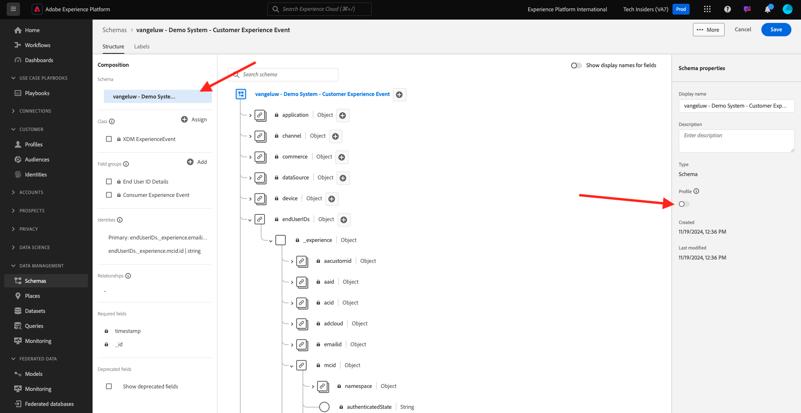
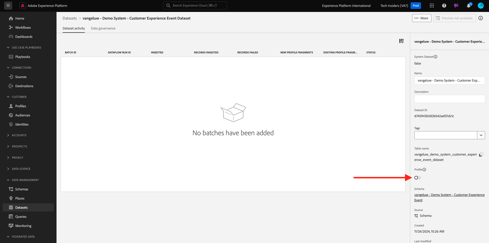

# 2.2.1 Customer AI — 資料準備（擷取）

為了讓智慧型服務從行銷事件資料中探索見解，資料必須在語義上豐富並維護標準結構。 Intelligent Services可運用Adobe的Experience Data Model (XDM)結構描述來達成此目標。
具體而言，Intelligent Services中使用的所有資料集都必須符合**消費者體驗事件** XDM結構描述。

## 2.2.1.1建立結構描述

在本練習中，您將建立包含&#x200B;**Customer AI** Intelligent Service所需&#x200B;**消費者體驗事件mixin**&#x200B;的結構描述。

前往此URL登入Adobe Experience Platform： [https://experience.adobe.com/platform](https://experience.adobe.com/platform)。

登入後，您會登入Adobe Experience Platform的首頁。

繼續之前，您必須選取&#x200B;**沙箱**。 要選取的沙箱名為``--module10sandbox--``。 您可以按一下熒幕上方藍線中的文字&#x200B;**[!UICONTROL Production Prod]**&#x200B;來執行此操作。 選取適當的沙箱後，您會看到畫面變更，現在您已進入專屬沙箱。

從左側功能表，按一下&#x200B;**結構描述**&#x200B;並移至&#x200B;**瀏覽**。 按一下&#x200B;**建立結構描述**。

在快顯視窗中選取&#x200B;**XDM ExperienceEvent**。

您將會看到此訊息。

搜尋並選取下列&#x200B;**Mixin**&#x200B;以新增至此結構描述：

- 消費者體驗事件

  

- 一般使用者 ID 詳細資料

  

按一下&#x200B;**新增欄位群組**。

您將會看到此訊息。 選取Mixin **一般使用者ID詳細資料**。

導覽至&#x200B;**endUserIDs欄位。_experience.emailid.id**。

在欄位&#x200B;**endUserIDs的右側功能表中。_experience.emailid.id**，向下捲動並核取&#x200B;**身分**&#x200B;的核取方塊，核取&#x200B;**主要身分**&#x200B;的核取方塊，並選取&#x200B;**電子郵件**&#x200B;的&#x200B;**身分名稱空間**。

導覽至&#x200B;**endUserIDs欄位。_experience.mcid.id**。 核取&#x200B;**身分**&#x200B;的核取方塊，並選取&#x200B;**ECID**&#x200B;的&#x200B;**身分名稱空間**。 按一下&#x200B;**套用**。

現在為您的結構描述命名。

當作結構描述的名稱，您將使用此：

- `--demoProfileLdap-- - Demo System - Customer Experience Event`

例如，對於ldap **vangeluw**，這應該是結構描述的名稱：

- **vangeluw — 示範系統 — 客戶體驗活動**

您應該會看到類似這樣的內容。 按一下「**+新增**」按鈕以新增新的&#x200B;**Mixin**。

選取結構描述的名稱。 您現在應該按一下&#x200B;**設定檔**&#x200B;切換按鈕，為&#x200B;**設定檔**&#x200B;啟用結構描述。

您將會看到此訊息。 按一下&#x200B;**啟用**。

您現在應該擁有此專案。 按一下[儲存]儲存結構描述。****

## 2.2.1.2建立資料集

從左側功能表，按一下&#x200B;**資料集**&#x200B;並移至&#x200B;**瀏覽**。 按一下&#x200B;**建立資料集**。

按一下&#x200B;**從結構描述建立資料集**。

在下一個畫面中，選取您在上一個練習中建立的資料集，名稱為&#x200B;**[!UICONTROL ldap — 示範系統 — 客戶體驗事件]**。 按一下&#x200B;**下一步**。

作為資料集的名稱，請使用`--demoProfileLdap-- - Demo System - Customer Experience Event Dataset`。 按一下&#x200B;**完成**。

您的資料集現已建立。 啟用&#x200B;**設定檔**&#x200B;切換。

按一下&#x200B;**啟用**。

您現在應該擁有：

您現在已準備好開始內嵌消費者體驗事件資料，並開始使用Customer AI服務。

## 2.2.1.3下載體驗事件測試資料

設定&#x200B;**結構描述**&#x200B;和&#x200B;**資料集**&#x200B;後，您就可以內嵌體驗事件資料了。 由於Customer AI需要跨&#x200B;**2個季至少**&#x200B;的資料，因此您將需要擷取外部準備的資料。

為體驗事件準備的資料必須符合[消費者體驗事件XDM Mixin](https://github.com/adobe/xdm/blob/797cf4930d5a80799a095256302675b1362c9a15/docs/reference/context/experienceevent-consumer.schema.md)的要求和結構描述。

請從以下位置下載包含範例資料的檔案： [https://dashboard.adobedemo.com/data](https://dashboard.adobedemo.com/data)。 按一下&#x200B;**下載**&#x200B;按鈕。

或者，如果您無法存取上述連結，也可以從此位置下載檔案： [https://aepmodule10.s3-us-west-2.amazonaws.com/retail-v1-dec2020-xl.json.zip](https://aepmodule10.s3-us-west-2.amazonaws.com/retail-v1-dec2020-xl.json.zip)。

您現在已下載名為&#x200B;**retail-v1-dec2020-xl.json.zip**&#x200B;的檔案。 將檔案放在電腦的案頭上並解壓縮，之後您會看到名為&#x200B;**retail-v1.json**&#x200B;的檔案。 在下一個練習中，您將需要此檔案。

## 2.2.1.4擷取體驗事件測試資料

在Adobe Experience Platform中，前往&#x200B;**資料集**&#x200B;並開啟您的資料集，名稱為&#x200B;**[!UICONTROL ldap — 示範系統 — 客戶體驗事件資料集]**。

在您的資料集中，按一下&#x200B;**選擇檔案**&#x200B;以新增資料。

在快顯視窗中，選取檔案&#x200B;**retail-v1.json**，然後按一下&#x200B;**開啟**。

您會看到資料正在匯入，且新批次已建立為&#x200B;**正在載入**&#x200B;狀態。 在上傳檔案之前，請勿巡覽到此頁面之外。

上傳檔案後，您會看到批次狀態從&#x200B;**載入**&#x200B;變更為&#x200B;**處理**。

擷取及處理資料可能需要10至20分鐘。

一旦資料擷取成功，批次狀態將變更為&#x200B;**成功**。

下一步： [2.2.2 Customer AI — 建立新執行個體（設定）](./ex2.md)

[返回模組2.2](./intelligent-services.md)

[返回所有模組](./../../../overview.md)
