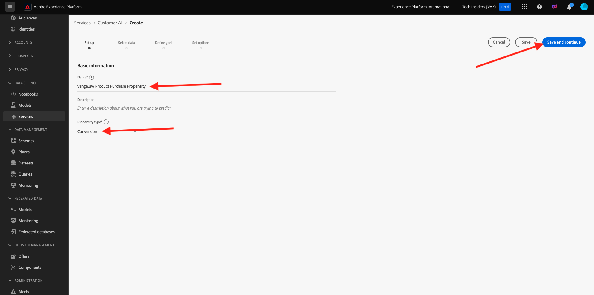

# 2.2.2 Customer AI — 建立新執行個體（設定）

Customer AI的運作方式是藉由分析現有的消費者體驗事件資料來預測流失或轉換傾向分數。 建立新的Customer AI執行個體，讓行銷人員可定義目標和測量。

## 2.2.2.1設定新的Customer AI執行個體

在Adobe Experience Platform中，按一下左側功能表中的&#x200B;**服務**。 **服務**&#x200B;瀏覽器會出現，並顯示您可使用的所有服務。 在Customer AI的卡片中，按一下&#x200B;**開啟**。

按一下&#x200B;**建立執行個體**。

您將會看到此訊息。

輸入Customer AI執行處理的必要明細：

- 名稱：使用`--aepUserLdap-- Product Purchase Propensity`
- 說明：使用： **預測客戶購買產品的可能性**
- 傾向性型別：選取&#x200B;**轉換**

按一下&#x200B;**下一步**。

您將會看到此訊息。 選取您在上一個練習中建立的資料集，名為`--demoProfileLdap - Demo System - Customer Experience Event Dataset`。 按一下&#x200B;**下一步**。

選取&#x200B;**將發生**，並將欄位&#x200B;**commerce.purchases.value**&#x200B;定義為目標變數。

按一下&#x200B;**下一步**。

接著，將排程設定為每週執行&#x200B;**次**，並將時間設定為儘可能接近目前時間。 確定已啟用設定檔&#x200B;**的**&#x200B;啟用分數切換功能。

按一下&#x200B;**完成**。

然後您會看到此快顯視窗。 按一下&#x200B;**「確定」**。

設定執行個體後，您可以在Customer AI執行個體清單中檢視它，也可按一下Customer AI執行個體列以預覽設定和執行詳細資訊的摘要。 如果發現錯誤，摘要面板也會顯示錯誤詳細資料。

>[!NOTE]
>
>只要您的Customer AI執行個體的狀態為&#x200B;**等待訓練**&#x200B;或&#x200B;**錯誤**，您就可以修改任何定義或屬性

下一步： [2.2.3 Customer AI — 評分儀表板和細分（預測並採取行動）](./ex3.md)

[返回模組2.2](./intelligent-services.md)

[返回所有模組](./../../../overview.md)
