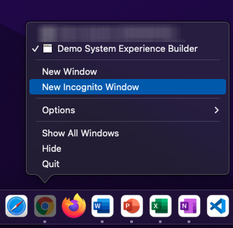
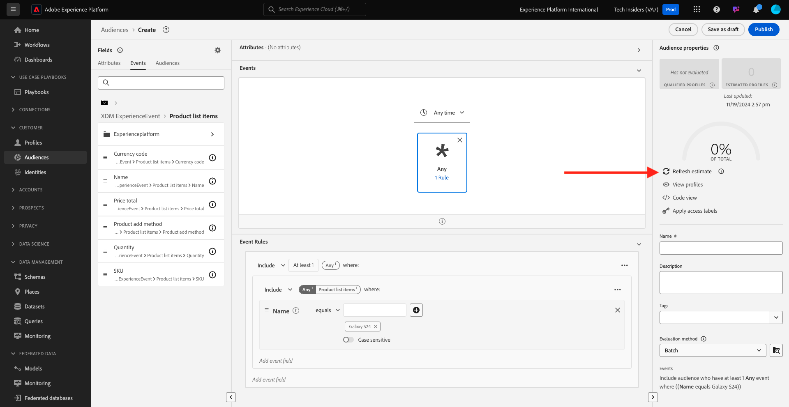

# 2.3.1建立區段

在本練習中，您將使用Adobe Experience Platform的區段產生器來建立區段。

## 2.3.1.1內容

在當今世界，回應客戶行為必須是即時的。 即時回應客戶行為的其中一種方式是使用區段，但須符合即時區段的資格。 在本練習中，您需要建立區段，考量我們一直在使用的網站上的實際活動。

## 2.3.1.2識別您要回應的行為

移至[https://builder.adobedemo.com/projects](https://builder.adobedemo.com/projects)。 使用Adobe ID登入後，您會看到此訊息。 按一下您的網站專案以開啟。

您現在可以依照以下流程存取網站。 按一下&#x200B;**整合**。

在&#x200B;**整合**&#x200B;頁面上，您必須選取在練習0.1中建立的資料收集屬性。

然後您會看到示範網站已開啟。 選取URL並將其複製到剪貼簿。

開啟新的無痕瀏覽器視窗。

貼上您在上一步中複製的示範網站URL。 接著，系統會要求您使用Adobe ID登入。

選取您的帳戶型別並完成登入程式。

接著，您會在無痕瀏覽器視窗中看到您的網站已載入。 對於每個示範，您都需要使用全新的無痕瀏覽器視窗來載入您的示範網站URL。

在此範例中，您想要回應檢視特定產品的特定客戶。
從**Luma**&#x200B;首頁，前往&#x200B;**Men**，然後按一下產品&#x200B;**PROTEUS FITNESS JACKSHIRT**。

所以當有人造訪&#x200B;**PROTEUS FITNESS JACKSHIRT**&#x200B;的產品頁面時，您想要能夠採取行動。 要採取行動，首先要定義區段。

## 2.3.1.3建立區段

移至[Adobe Experience Platform](https://experience.adobe.com/platform)。 登入後，您會登入Adobe Experience Platform的首頁。

繼續之前，您必須選取&#x200B;**沙箱**。 要選取的沙箱名為``--aepSandboxName--``。 您可以按一下熒幕上方藍線中的文字&#x200B;**[!UICONTROL Production Prod]**&#x200B;來執行此操作。 選取適當的[!UICONTROL 沙箱]後，您將會看到畫面變更，現在您已在專屬的[!UICONTROL 沙箱]中。

在左側的功能表中，前往&#x200B;**區段**，然後前往&#x200B;**瀏覽**，您可以在其中檢視所有現有區段的概觀。 按一下&#x200B;**建立區段**&#x200B;按鈕以開始建立新區段。

如上所述，您必須從所有檢視過產品&#x200B;**PROTEUS FITNESS JACKSHIRT**&#x200B;的客戶建立區段。

若要建置此區段，您必須新增事件。 按一下&#x200B;**區段**&#x200B;功能表列中的&#x200B;**事件**&#x200B;圖示，即可找到所有事件。

接下來，您將會看到頂層&#x200B;**XDM ExperienceEvent**&#x200B;節點。

若要尋找已造訪&#x200B;**PROTEUS FITNESS JACKSHIRT**&#x200B;產品的客戶，請按一下&#x200B;**XDM ExperienceEvent**。

向下捲動至&#x200B;**產品清單專案**，然後按一下它。

選取「**名稱**」，然後從左側「**產品清單專案**」功能表將「**名稱**」物件拖放至區段產生器畫布中的「**事件**」區段。

比較引數應為&#x200B;**等於**，並在輸入欄位中輸入`PROTEUS FITNESS JACKSHIRT`。

您的&#x200B;**事件規則**&#x200B;現在看起來應該像這樣。 每次將元素新增至區段產生器時，都可以按一下&#x200B;**重新整理預估值**&#x200B;按鈕，以取得區段中母體的新預估值。

最後，為區段命名並儲存。

作為命名慣例，請使用：

- `--aepUserLdap-- - Interest in PROTEUS FITNESS JACKSHIRT`

您的區段名稱應如下所示：
`vangeluw - Interest in PROTEUS FITNESS JACKSHIRT`

接著，按一下&#x200B;**儲存並關閉**&#x200B;按鈕以儲存您的區段。

您現在將返回區段概觀頁面。

下一步： [2.3.2檢閱如何使用目的地](./ex2.md)設定DV360目的地

[返回模組2.3](./real-time-cdp-build-a-segment-take-action.md)

[返回所有模組](../../../overview.md)
