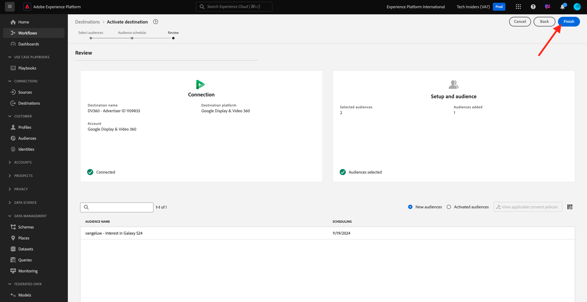

# 2.3.3採取行動：將您的區段傳送至DV360

移至[Adobe Experience Platform](https://experience.adobe.com/platform)。 登入後，您會登入Adobe Experience Platform的首頁。

繼續之前，您必須選取&#x200B;**沙箱**。 要選取的沙箱名為``--aepSandboxName--``。 您可以按一下熒幕上方藍線中的文字&#x200B;**[!UICONTROL Production Prod]**&#x200B;來執行此操作。 選取適當的[!UICONTROL 沙箱]後，您將會看到畫面變更，現在您已在專屬的[!UICONTROL 沙箱]中。

在左側功能表中，前往&#x200B;**目的地**，然後前往&#x200B;**目錄**。 然後您會看到&#x200B;**目的地目錄**。

在&#x200B;**目的地**&#x200B;中，按一下&#x200B;**Google Display &amp; Video 360**&#x200B;卡片上的&#x200B;**啟用區段**。

選取您的目的地，然後按一下&#x200B;**下一步**。

在可用區段清單中，選取您在上一個練習中建立的區段。 按一下&#x200B;**下一步**。

在&#x200B;**區段排程**&#x200B;頁面上，按一下&#x200B;**下一步**。

最後，在&#x200B;**檢閱**&#x200B;頁面上按一下&#x200B;**完成**。

您的區段現在已連結至Google DV360。 客戶每次符合此區段的資格時，都會傳送訊號至Google DV360，將該客戶納入Google DV360端的受眾。

下一步： [2.3.4採取動作：將您的區段傳送至S3-destination](./ex4.md)

[返回模組2.3](./real-time-cdp-build-a-segment-take-action.md)

[返回所有模組](../../../overview.md)
