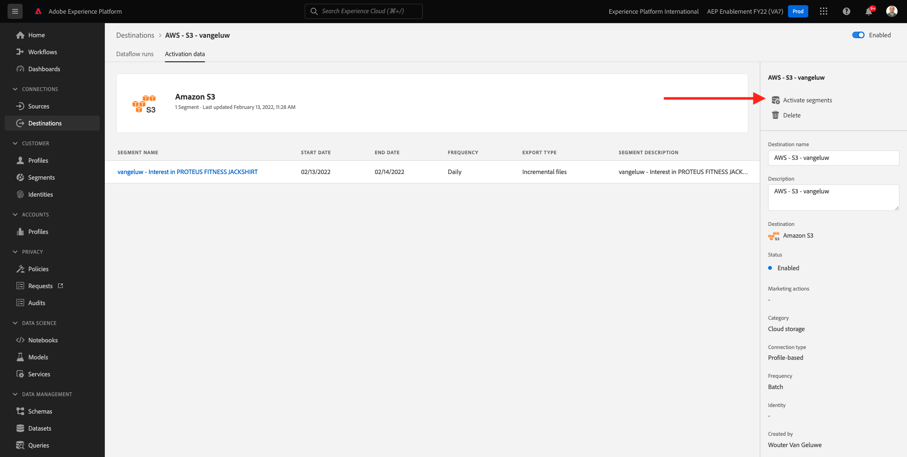

# 2.3.4採取動作：將區段傳送至S3-destination

Adobe Experience Platform也能將受眾分享至電子郵件行銷目的地，例如Salesforce Marketing Cloud、Oracle Eloqua、Oracle Responsys和Adobe Campaign。

您可以使用FTP或SFTP作為每個電子郵件行銷目的地的專用目的地的一部分，或者您可以使用AWS S3在Adobe Experience Platform和這些電子郵件行銷目的地之間交換客戶清單。

在此單元中，您將利用AWS S3儲存貯體來設定這類目的地。

## 2.3.4.1建立您的S3貯體

移至[https://console.aws.amazon.com](https://console.aws.amazon.com)，並使用您先前建立的Amazon帳戶登入。

登入後，系統會將您重新導向至&#x200B;**AWS管理主控台**。

在&#x200B;**尋找服務**&#x200B;功能表中，搜尋&#x200B;**s3**。 按一下第一個搜尋結果： **S3 — 雲端中的可擴充儲存空間**。

然後您會看到&#x200B;**Amazon S3**&#x200B;首頁。 按一下&#x200B;**建立貯體**。

在&#x200B;**建立Bucket**&#x200B;畫面中，您需要設定兩個專案：

- 名稱：使用名稱`aepmodulertcdp--demoProfileLdap--`。 例如，在本練習中，儲存貯體名稱為&#x200B;**aepmodulertcdpvangeluw**
- 地區：使用地區&#x200B;**EU (Frankfurt) eu-central-1**

保留所有其他預設設定。 向下捲動並按一下&#x200B;**建立貯體**。

接著，您會看到儲存貯體已建立，且系統會將您重新導向至Amazon S3首頁。

## 2.3.4.2設定存取S3儲存貯體的許可權

下一步是設定您S3貯體的存取權。

若要這麼做，請前往[https://console.aws.amazon.com/iam/home](https://console.aws.amazon.com/iam/home)。

AWS資源的存取權由Amazon Identity and Access Management (IAM)控制。

您現在會看到此頁面。

在左側功能表中，按一下&#x200B;**使用者**。 然後您會看到&#x200B;**使用者**&#x200B;畫面。 按一下&#x200B;**新增使用者**。

接下來，設定您的使用者：

- 使用者名稱：使用`s3_--demoProfileLdap--_rtcdp`作為名稱，因此在此範例中，名稱為`s3_vangeluw_rtcdp`。
- AWS存取型別：選取&#x200B;**存取金鑰 — 程式化存取**。

按一下&#x200B;**下一步：許可權**。

然後您會看到此許可權畫面。 按一下&#x200B;**直接附加現有原則**。

輸入搜尋字詞&#x200B;**s3**&#x200B;以檢視所有相關的S3原則。 選取原則&#x200B;**AmazonS3FullAccess**。 按一下&#x200B;**下一步：標籤**。

在&#x200B;**標籤**&#x200B;畫面上，不需要設定任何專案。 按一下&#x200B;**下一步：檢閱**。

檢閱您的設定。 按一下&#x200B;**建立使用者**。

您的使用者現在已建立，而且您會看到存取S3環境的認證。 這是您唯一一次看到您的認證，請寫下這些認證。

按一下&#x200B;**顯示**&#x200B;檢視您的秘密存取金鑰：

>[!IMPORTANT]
>
>將您的認證儲存在電腦的文字檔中。
>
> - 存取金鑰ID： ...
> - 秘密存取金鑰： ...
>
> 一旦您按一下&#x200B;**關閉**，您將再也看不到您的認證！

按一下 **關閉**。

您現在已成功建立AWS S3貯體，並已建立具有存取此貯體許可權的使用者。

## 2.3.4.3在Adobe Experience Platform中設定目的地

移至[Adobe Experience Platform](https://experience.adobe.com/platform)。 登入後，您會登入Adobe Experience Platform的首頁。

繼續之前，您必須選取&#x200B;**沙箱**。 要選取的沙箱名為``--aepSandboxId--``。 您可以按一下熒幕上方藍線中的文字&#x200B;**[!UICONTROL Production Prod]**&#x200B;來執行此操作。 選取適當的[!UICONTROL 沙箱]後，您將會看到畫面變更，現在您已在專屬的[!UICONTROL 沙箱]中。

在左側功能表中，前往&#x200B;**目的地**，然後前往&#x200B;**目錄**。 然後您會看到&#x200B;**目的地目錄**。

按一下&#x200B;**雲端儲存空間**，然後按一下&#x200B;**Amazon S3**&#x200B;卡片上的&#x200B;**設定**&#x200B;按鈕（或&#x200B;**啟用區段**，視您的環境而定）。

視您的環境而定，您可能需要按一下「**+設定新目的地」**&#x200B;以開始建立您的目的地。

選取&#x200B;**新帳戶**&#x200B;作為帳戶型別。 請使用上個步驟中提供給您的S3認證：

| 存取金鑰ID | 秘密存取金鑰 |
|:-----------------------:| :-----------------------:|
| 秋明..... | Cm5Ln..... |

按一下&#x200B;**連線到目的地**。

之後，您會看到此目的地目前已連線的視覺化確認。

您必須提供名稱和資料夾，讓Adobe Experience Platform可以連線至S3儲存貯體。

根據命名慣例，請使用下列專案：

| 存取金鑰ID | 秘密存取金鑰 |
|:-----------------------:| :-----------------------:|
| 名稱 | `AWS - S3 - --demoProfileLdap--` |
| 說明 | `AWS - S3 - --demoProfileLdap--` |
| 貯體名稱 | `aepmodulertcdp--demoProfileLdap--` |
| 資料夾路徑 | / |

按一下&#x200B;**下一步**。

您現在可以選擇將資料控管原則附加至新目的地。 按一下&#x200B;**下一步**。

在區段清單中，搜尋您在練習1中建立的區段並加以選取。 按一下&#x200B;**下一步**。

您將會看到此訊息。 如有需要，您可以按一下&#x200B;**鉛筆**&#x200B;圖示來編輯排程。 **建立排程**。

定義您選擇的排程。 選取&#x200B;**匯出增量檔案**，並將頻率設定為每&#x200B;**3小時**&#x200B;的&#x200B;**每小時**。 按一下&#x200B;**建立**。

您就會擁有此專案。 按一下&#x200B;**下一步**。

您現在可以選取要匯出至AWS S3的屬性。 按一下&#x200B;**新增欄位**&#x200B;並確保欄位`--aepTenantId--.identification.core.ecid`已新增並標籤為&#x200B;**重複資料刪除索引鍵**。

您可視需要新增其他欄位。

新增所有欄位後，請按[下一步] ****。

檢閱您的設定。 按一下&#x200B;**完成**&#x200B;以完成您的設定。

接著，您會回到「Destination Activation」畫面，看到區段已新增至此目的地。

如果您想要新增更多區段匯出，可以按一下&#x200B;**啟用區段**&#x200B;以重新啟動程式並新增更多區段。

下一步： [2.3.5採取動作：將您的區段傳送至Adobe Target](./ex5.md)

[返回模組2.3](./real-time-cdp-build-a-segment-take-action.md)

[返回所有模組](../../../overview.md)
