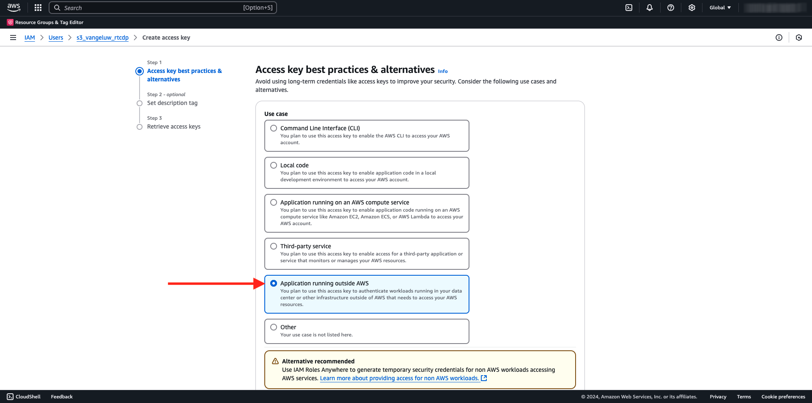

# 2.3.4採取動作：將對象傳送至S3-destination

Adobe Experience Platform也能將受眾分享至電子郵件行銷目的地，例如Salesforce Marketing Cloud、Oracle Eloqua、Oracle Responsys和Adobe Campaign。

您可以使用FTP或SFTP作為每個電子郵件行銷目的地的專用目的地的一部分，或者您可以使用AWS S3在Adobe Experience Platform和這些電子郵件行銷目的地之間交換客戶清單。

在此單元中，您將利用AWS S3儲存貯體來設定這類目的地。

## 建立您的S3貯體

移至[https://console.aws.amazon.com](https://console.aws.amazon.com)並登入。

>[!NOTE]
>
>如果您還沒有AWS帳戶，請使用您的個人電子郵件地址建立新的AWS帳戶。

登入後，系統會將您重新導向至&#x200B;**AWS管理主控台**。

在搜尋列中搜尋&#x200B;**s3**。 按一下第一個搜尋結果： **S3 — 雲端中的可擴充儲存空間**。

然後您會看到&#x200B;**Amazon S3**&#x200B;首頁。 按一下&#x200B;**建立貯體**。

在「**建立貯體**」畫面中，使用名稱`aepmodulertcdp--aepUserLdap--`

保留所有其他預設設定。 向下捲動並按一下&#x200B;**建立貯體**。

接著，您會看到儲存貯體已建立，且系統會將您重新導向至Amazon S3首頁。

## 設定存取S3貯體的許可權

下一步是設定您S3貯體的存取權。

若要這麼做，請前往[https://console.aws.amazon.com/iam/home](https://console.aws.amazon.com/iam/home)。

AWS資源的存取權由Amazon Identity and Access Management (IAM)控制。

您現在會看到此頁面。

在左側功能表中，按一下&#x200B;**使用者**。 然後您會看到&#x200B;**使用者**&#x200B;畫面。 按一下&#x200B;**建立使用者**。

接下來，設定您的使用者：

- 使用者名稱：使用`s3_--aepUserLdap--_rtcdp`

按一下&#x200B;**下一步**。

然後您會看到此許可權畫面。 按一下&#x200B;**直接附加原則**。

輸入搜尋字詞&#x200B;**s3**&#x200B;以檢視所有相關的S3原則。 選取原則&#x200B;**AmazonS3FullAccess**。 向下捲動並按一下&#x200B;**下一步**。

檢閱您的設定。 按一下&#x200B;**建立使用者**。

您將會看到此訊息。 按一下&#x200B;**檢視使用者**。

按一下&#x200B;**安全性認證**，然後按一下&#x200B;**建立存取金鑰**。

選取&#x200B;**在AWS**&#x200B;外部執行的應用程式。 向下捲動並按一下&#x200B;**下一步**。

按一下&#x200B;**建立存取金鑰**

您將會看到此訊息。 按一下&#x200B;**顯示**&#x200B;檢視您的秘密存取金鑰：

現在顯示您的&#x200B;**秘密存取金鑰**。

>[!IMPORTANT]
>
>將您的認證儲存在電腦的文字檔中。
>
> - 存取金鑰ID： ...
> - 秘密存取金鑰： ...
>
> 按一下&#x200B;**完成**，您將再也看不到您的認證！

按一下&#x200B;**「完成」**。

您現在已成功建立AWS S3貯體，並已建立具有存取此貯體許可權的使用者。

## 在Adobe Experience Platform中設定目的地

移至[Adobe Experience Platform](https://experience.adobe.com/platform)。 登入後，您會登入Adobe Experience Platform的首頁。

繼續之前，您必須選取&#x200B;**沙箱**。 要選取的沙箱名為``--aepSandboxName--``。 選取適當的[!UICONTROL 沙箱]後，您將會看到畫面變更，現在您已在專屬的[!UICONTROL 沙箱]中。

在左側功能表中，前往&#x200B;**目的地**，然後前往&#x200B;**目錄**。 然後您會看到&#x200B;**目的地目錄**。

按一下&#x200B;**雲端儲存空間**，然後按一下&#x200B;**Amazon S3**&#x200B;卡片上的&#x200B;**設定**&#x200B;按鈕（或&#x200B;**啟用對象**，視您的環境而定）。

選取&#x200B;**存取金鑰**&#x200B;作為帳戶型別。 請使用上個步驟中提供給您的S3認證：

| 存取金鑰ID | 秘密存取金鑰 |
|:-----------------------:| :-----------------------:|
| 秋明..... | 7Icm..... |

按一下&#x200B;**連線到目的地**。

之後，您會看到此目的地目前已連線的視覺化確認。

您必須提供S3儲存貯體詳細資料，讓Adobe Experience Platform可以連線至S3儲存貯體。

根據命名慣例，請使用下列專案：

| 存取金鑰ID | 秘密存取金鑰 |
|:-----------------------:| :-----------------------:|
| 名稱 | `AWS - S3 - --aepUserLdap--` |
| 說明 | `AWS - S3 - --aepUserLdap--` |
| 貯體名稱 | `aepmodulertcdp--aepUserLdap--` |
| 資料夾路徑 | /now |

選取&#x200B;**對象**。

對於&#x200B;**檔案型別**，請選取&#x200B;**CSV**，並保留預設設定不變。

向下捲動。 對於&#x200B;**壓縮格式**，請選取&#x200B;**無**。 按一下&#x200B;**下一步**。

您現在可以選擇將資料控管原則附加至新目的地。 按一下&#x200B;**下一步**。

在對象清單中，搜尋您在上一個練習中建立的對象`--aepUserLdap-- - Interest in Galaxy S24`並加以選取。 按一下&#x200B;**下一步**。

您將會看到此訊息。 如有需要，您可以按一下&#x200B;**鉛筆**&#x200B;圖示來編輯排程和檔案名稱。 按一下&#x200B;**下一步**。

您現在可以選取設定檔屬性，以匯出至AWS S3。 按一下&#x200B;**新增欄位**&#x200B;並確保欄位`--aepTenantId--.identification.core.ecid`已新增並標籤為&#x200B;**重複資料刪除索引鍵**。

您可以視需要新增任意數量的其他設定檔屬性。

新增所有欄位後，請按[下一步] **&#x200B;**。

檢閱您的設定。 按一下&#x200B;**完成**&#x200B;以完成您的設定。

接著，您會回到「Destination Activation」畫面，然後看到您的對象已新增至此目的地。

如果您想要新增更多對象匯出，可以按一下&#x200B;**啟用對象**&#x200B;以重新啟動程式並新增更多對象。

下一步： [2.3.5採取動作：將您的對象傳送到Adobe Target](./ex5.md)

[返回模組2.3](./real-time-cdp-build-a-segment-take-action.md)

[返回所有模組](../../../overview.md)
