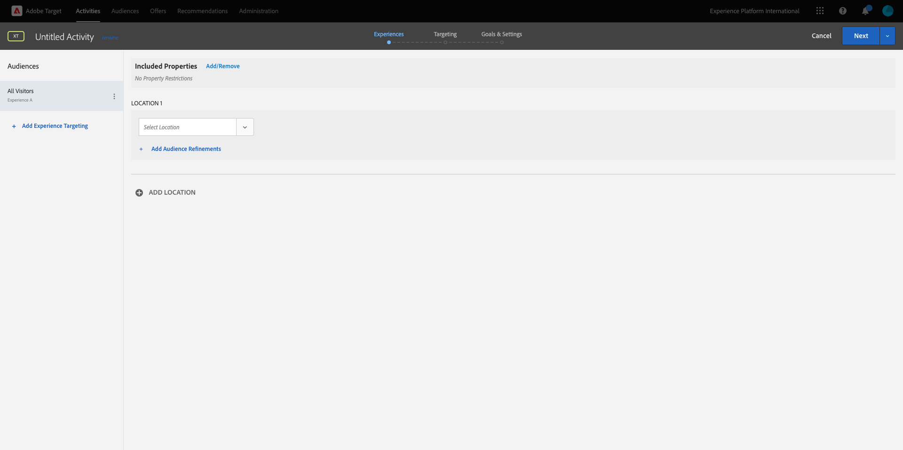
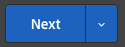

# 2.3.5採取行動：將您的區段傳送至Adobe Target

移至[Adobe Experience Platform](https://experience.adobe.com/platform)。 登入後，您會登入Adobe Experience Platform的首頁。


繼續之前，您必須選取&#x200B;**沙箱**。 要選取的沙箱名為``--aepSandboxName--``。 您可以按一下熒幕上方藍線中的文字&#x200B;**[!UICONTROL Production Prod]**&#x200B;來執行此操作。 選取適當的[!UICONTROL 沙箱]後，您將會看到畫面變更，現在您已在專屬的[!UICONTROL 沙箱]中。


## 2.3.5.1驗證您的資料流

Real-Time CDP中的Adobe Target目的地已連線至資料流，該資料流用於將資料擷取至Adobe邊緣網路。 如果您想要設定Adobe Target目的地，必須先確認資料流是否已啟用Adobe Target。 您的資料串流已在[練習0.2建立您的資料串流](./../../../modules/gettingstarted/gettingstarted/ex2.md)中設定，名稱為`--aepUserLdap-- - Demo System Datastream`。

移至[https://experience.adobe.com/#/data-collection/](https://experience.adobe.com/#/data-collection/)，然後按一下&#x200B;**資料串流**&#x200B;或&#x200B;**資料串流(Beta)**。


在熒幕的右上角，選取您的沙箱名稱，應為`--aepSandboxName--`。


在資料串流中，搜尋名為`--aepUserLdap-- - Demo System Datastream`的資料串流。 按一下您的資料流以開啟。


您將會看到這個專案，按一下&#x200B;**Adobe Experience Platform**&#x200B;旁的&#x200B;**...**，然後按一下&#x200B;**編輯**。


勾選&#x200B;**Edge分段**&#x200B;和&#x200B;**Personalization目的地**&#x200B;的核取方塊。 按一下&#x200B;**儲存**。


接著，按一下&#x200B;**+新增服務**。


選取服務&#x200B;**Adobe Target**。 按一下&#x200B;**儲存**。


您的資料流現在已針對Adobe Target完成設定。


## 2.3.5.2設定您的Adobe Target目的地

Adobe Target可作為Real-Time CDP的目的地。 若要設定您的Adobe Target整合，請前往&#x200B;**目的地**，前往&#x200B;**目錄**。


在&#x200B;**類別**&#x200B;功能表中按一下&#x200B;**Personalization**。 然後您會看到&#x200B;**Adobe Target**&#x200B;目的地卡。 按一下「**啟用區段**」（或&#x200B;**設定**，視您的環境而定）。


視您的環境而定，您可能需要按一下「**+設定新目的地」**&#x200B;以開始建立您的目的地。


您將會看到此訊息。


在&#x200B;**設定新目的地**&#x200B;畫面中，您必須設定兩件事：

- 名稱：使用名稱`--aepUserLdap-- - Adobe Target (Web)`，看起來應該像這樣： **vangeluw - Adobe Target （網頁）**。
- 資料串流識別碼：您必須選取您在[練習0.2建立資料串流](./../../../modules/gettingstarted/gettingstarted/ex2.md)中設定的資料串流。 您的資料串流的名稱應該是： `--aepUserLdap-- - Demo System Datastream`。

按一下&#x200B;**下一步**。


在下一個畫面中，您可以選擇選取治理原則。 不需要選取一個，在此情況下不需要選取一個，因此請按一下[建立]。****


您的目的地現在已建立，並會顯示在清單中。 選取您的目的地，然後按一下[下一步] ****&#x200B;開始傳送區段至您的目的地。


在可用區段的清單中，選取您在[練習6.1中建立的區段。建立名為`--aepUserLdap-- - Interest in PROTEUS FITNESS JACKSHIRT`的區段](./ex1.md)。 然後，按一下&#x200B;**下一步**。


在下一頁，按一下&#x200B;**下一步**。


按一下&#x200B;**完成**。


您的區段現在已對Adobe Target啟用。


>[!IMPORTANT]
>
>當您剛剛在Real-Time CDP中建立Adobe Target目的地時，目的地可能需要長達一小時的時間才會上線。 由於後端設定的緣故，此為一次性等待時間。 完成初始1小時的等待時間和後端設定後，傳送至Adobe Target目的地的新增邊緣區段將可供即時鎖定目標。

## 2.3.5.3設定您的Adobe Target表單式活動

現在您的Real-Time CDP區段已設定為傳送至Adobe Target，您可以在Adobe Target中設定體驗鎖定目標活動。 在本練習中，您將設定表單式活動。

移至[https://experiencecloud.adobe.com/](https://experiencecloud.adobe.com/)，前往Adobe Experience Cloud首頁。 按一下&#x200B;**目標**&#x200B;以開啟。


在&#x200B;**Adobe Target**&#x200B;首頁上，您會看到所有現有的活動。


按一下&#x200B;**+建立活動**&#x200B;以建立新活動。


選取&#x200B;**體驗鎖定目標**。


選取&#x200B;**表單**&#x200B;並選取&#x200B;**無屬性限制**。 按一下&#x200B;**下一步**。


您現在位於表單式活動撰寫器中。



針對欄位&#x200B;**位置1**，選取&#x200B;**target-global-mbox**。


預設對象目前是&#x200B;**所有訪客**。 按一下&#x200B;**所有訪客**&#x200B;旁的&#x200B;**3點**，然後按一下&#x200B;**變更對象**。


您現在可以看到可用受眾清單，而您先前建立並傳送至Adobe Target的Adobe Experience Platform區段現在已加入此清單。 選取您先前在Adobe Experience Platform中建立的區段。 按一下&#x200B;**指派對象**。


您的Adobe Experience Platform區段現在已成為此體驗鎖定目標活動的一部分。


現在來變更網站首頁上的主圖影像。 按一下以開啟&#x200B;**預設內容**&#x200B;旁的下拉式清單，然後按一下&#x200B;**建立HTML選件**。


貼上下列程式碼。 然後，按一下&#x200B;**下一步**。

```javascript
<script>document.querySelector("#home > div > div > div > div > div.banner_img.d-none.d-lg-block > img").src="https://parsefiles.back4app.com/hgJBdVOS2eff03JCn6qXXOxT5jJFzialLAHJixD9/ff92fdc3885972c0090ad5419e0ef4d4_Luma - Product - Proteus - Hero Banner.png"; document.querySelector(".banner_text > *").remove()</script>
```


接著，您就會看到所選對象新影像的新體驗。


按一下左上角的活動標題以重新命名。


對於名稱，請使用：

- `--aepUserLdap-- - RTCDP - XT (Form)`


按一下&#x200B;**下一步**。



在&#x200B;**目標與設定** — 頁面上，移至&#x200B;**目標量度**。


將主要目標設為&#x200B;**參與** - **網站逗留時間**。


按一下&#x200B;**儲存並關閉**。


您現在位於&#x200B;**活動概覽**&#x200B;頁面。 您仍需要啟用活動。


按一下欄位&#x200B;**非使用中**&#x200B;並選取&#x200B;**啟動**。


之後，您將會收到視覺化確認，確認您的活動現在處於上線狀態。


您的活動現在已上線，並可在示範網站上測試。

>[!IMPORTANT]
>
>當您剛剛在Real-Time CDP中建立Adobe Target目的地時，目的地可能需要長達一小時的時間才會上線。 由於後端設定的緣故，此為一次性等待時間。 完成初始1小時的等待時間和後端設定後，傳送至Adobe Target目的地的新增邊緣區段將可供即時鎖定目標。

如果您現在返回示範網站，並造訪PROTEUS FITNESS JACKSHIRT的產品頁面，您會立即符合您建立的區段資格，且會即時在首頁上顯示Adobe Target活動。


下一步： [2.3.6外部對象](./ex6.md)

[返回模組2.3](./real-time-cdp-build-a-segment-take-action.md)

[返回所有模組](../../../overview.md)
