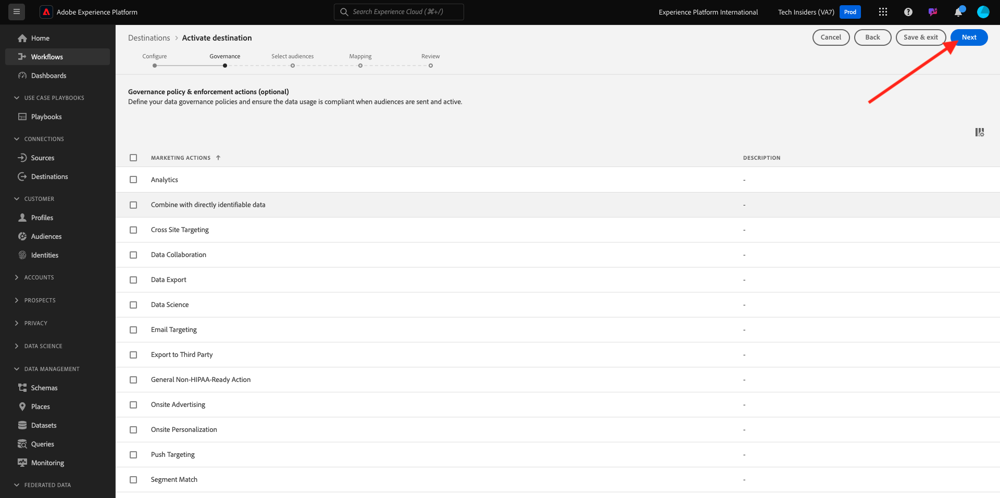
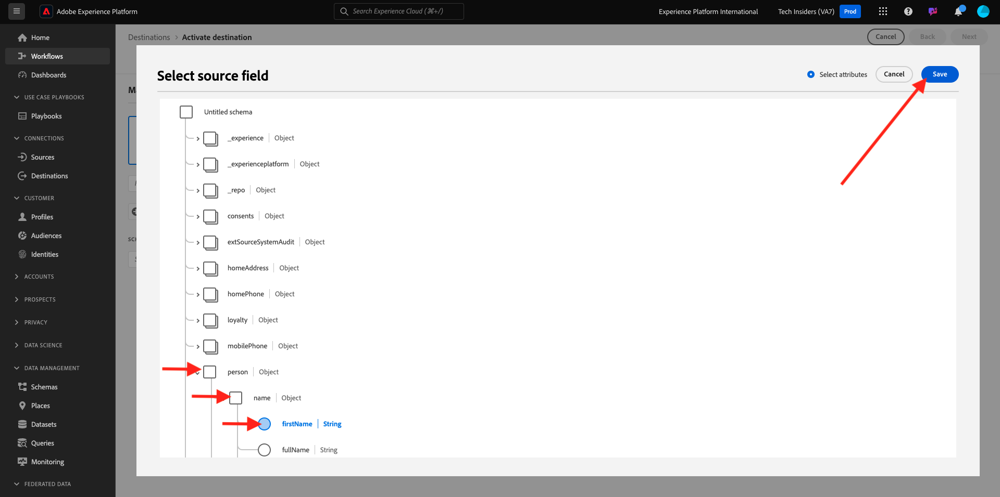
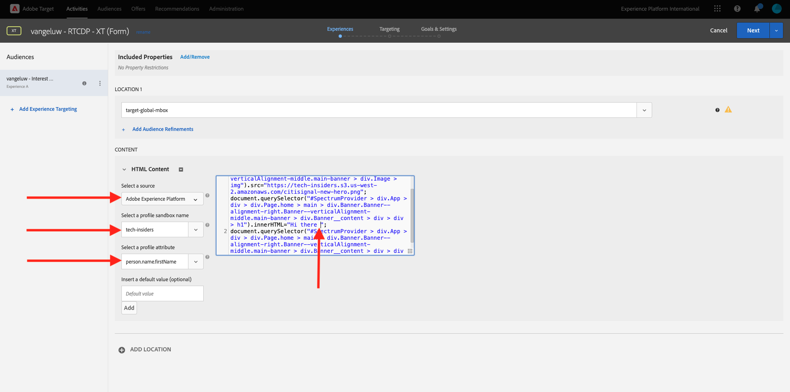

# 2.3.5採取動作：將對象傳送至Adobe Target

移至[Adobe Experience Platform](https://experience.adobe.com/platform)。 登入後，您會登入Adobe Experience Platform的首頁。


繼續之前，您必須選取&#x200B;**沙箱**。 要選取的沙箱名為``--aepSandboxName--``。 選取適當的[!UICONTROL 沙箱]後，您將會看到畫面變更，現在您已在專屬的[!UICONTROL 沙箱]中。


## 驗證您的資料流

Real-Time CDP中的Adobe Target目的地已連線至資料流，該資料流用於將資料擷取至Adobe邊緣網路。 如果您想要設定Adobe Target目的地，必須先確認資料流是否已啟用Adobe Target。 您的資料串流已在[練習0.2建立您的資料串流](./../../../modules/gettingstarted/gettingstarted/ex2.md)中設定，名稱為`--aepUserLdap-- - Demo System Datastream`。

在左側功能表中，向下捲動並按一下&#x200B;**資料串流**。 在資料串流中，搜尋名為`--aepUserLdap-- - Demo System Datastream`的資料串流。 按一下您的資料流以開啟。


您將會看到這個專案，按一下&#x200B;**Adobe Experience Platform**&#x200B;旁的&#x200B;**...**，然後按一下&#x200B;**編輯**。


勾選&#x200B;**Edge分段**&#x200B;和&#x200B;**Personalization目的地**&#x200B;的核取方塊。 按一下&#x200B;**儲存**。


接著，按一下&#x200B;**+新增服務**。


選取服務&#x200B;**Adobe Target**。 按一下&#x200B;**儲存**。


您的資料流現在已針對Adobe Target完成設定。


## 設定您的Adobe Target目的地

Adobe Target可作為Real-Time CDP的目的地。 若要設定您的Adobe Target整合，請前往&#x200B;**目的地**，前往&#x200B;**目錄**。

在&#x200B;**類別**&#x200B;功能表中按一下&#x200B;**Personalization**。 然後您會看到&#x200B;**(v2) Adobe Target**&#x200B;目的地卡。


按一下&#x200B;**連線到目的地**。


您將會看到此訊息。 您需要依照以下准則建立自己的Adobe Target目的地：

- 名稱：使用名稱`--aepUserLdap-- - Adobe Target v2  (Web)`。
- 資料串流識別碼：您必須選取您在[練習0.2建立資料串流](./../../../modules/gettingstarted/gettingstarted/ex2.md)中設定的資料串流。 您的資料串流的名稱應該是： `--aepUserLdap-- - Demo System Datastream`。
- Workspace：這與Adobe Target工作區有關。 如果沒有您需要使用的特定工作區，請選取&#x200B;**預設Workspace**。

按一下&#x200B;**下一步**。


您現在可以選擇選取資料治理政策。 按一下&#x200B;**下一步**。



在可用對象清單中，選取您在上一個練習[建立對象](./ex1.md) （名稱為`--aepUserLdap-- - Interest in Galaxy S24`）中建立的對象。 然後，按一下&#x200B;**下一步**。


在&#x200B;**對應**&#x200B;畫面上，您可以對應設定檔屬性以在Adobe Target中使用。 這可協助您在網站上新增一層額外的個人化內容。 按一下&#x200B;**新增欄位**。


針對新欄位，選取欄位&#x200B;**person.name.firstName**。 按一下&#x200B;**儲存**。



您就會擁有此專案。 按一下&#x200B;**下一步**。


按一下&#x200B;**完成**。


您的對象現在已對Adobe Target啟用。


>[!IMPORTANT]
>
>當您剛剛在Real-Time CDP中建立Adobe Target目的地時，目的地可能需要長達一小時的時間才會上線。 由於後端設定的緣故，此為一次性等待時間。 完成初始1小時的等待時間和後端設定後，傳送至Adobe Target目的地的新增受眾將可即時鎖定目標。

## 設定您的Adobe Target表單式活動

現在您的Real-Time CDP對象已設定為傳送至Adobe Target，您可以在Adobe Target中設定體驗鎖定目標活動。 在本練習中，您將設定表單式活動。

移至[https://experiencecloud.adobe.com/](https://experiencecloud.adobe.com/)，前往Adobe Experience Cloud首頁。 按一下&#x200B;**目標**&#x200B;以開啟。


在&#x200B;**Adobe Target**&#x200B;首頁上，您會看到所有現有的活動。 按一下&#x200B;**建立活動**，然後按一下&#x200B;**體驗鎖定目標**。


選取&#x200B;**網頁**、**表單**&#x200B;和&#x200B;**無屬性限制**。 按一下&#x200B;**建立**。


您現在位於表單式活動撰寫器中。


針對欄位&#x200B;**位置1**，選取&#x200B;**target-global-mbox**。


預設對象目前是&#x200B;**所有訪客**。 按一下&#x200B;**所有訪客**&#x200B;旁的&#x200B;**3點**，然後按一下&#x200B;**變更對象**。


您現在會看到可用受眾清單，而您先前建立並傳送至Adobe Target的Adobe Experience Platform受眾現在已加入此清單。 選取您先前在Adobe Experience Platform中建立的對象。 按一下&#x200B;**指派對象**。


您的Adobe Experience Platform對象現在屬於此體驗鎖定目標活動的一部分。


現在來變更網站首頁上的主圖影像。 按一下以開啟&#x200B;**預設內容**&#x200B;旁的下拉式清單，然後按一下&#x200B;**建立HTML選件**。


貼上下列程式碼。

```javascript
<script>document.querySelector("#SpectrumProvider > div.App > div > div.Page.home > main > div.Banner.Banner--alignment-right.Banner--verticalAlignment-middle.main-banner > div.Image > img").src="https://tech-insiders.s3.us-west-2.amazonaws.com/citisignal-new-hero.png"; document.querySelector("#SpectrumProvider > div.App > div > div.Page.home > main > div.Banner.Banner--alignment-right.Banner--verticalAlignment-middle.main-banner > div.Banner__content > div > div > h1").innerHTML="Hi there ";
document.querySelector("#SpectrumProvider > div.App > div > div.Page.home > main > div.Banner.Banner--alignment-right.Banner--verticalAlignment-middle.main-banner > div.Banner__content > div > div > div > div > p").innerHTML="What about 10% off of your next Galaxy S24 smartphone?";
</script>
```


接下來，您需要從Adobe Experience Platform的設定檔屬性新增個人化權杖。 請記住，當您啟用Adobe Target的對象時，您也選取要與Adobe Target共用的欄位&#x200B;**person.name.firstName**。 若要擷取欄位，請選取來源&#x200B;**Adobe Experience Platform**，選取您的沙箱（應該是`--aepSandboxName--`），然後選取屬性&#x200B;**person.name.firstName**。



按一下&#x200B;**新增**&#x200B;按鈕之前，請務必移至您看到`... > h1").innerHTML="Hi there ";`的行並將游標放在`there`字後面的方括弧內，如下所示：

`... > h1").innerHTML="Hi there ";`

接著，按一下&#x200B;**新增**&#x200B;按鈕，接著應新增權杖，如此將更新程式碼：

`... > h1").innerHTML="Hi there ${aep.person.name.firstName}";`

按一下&#x200B;**下一步**。


接著，您將看到所選對象的新影像使用體驗概觀。 按一下&#x200B;**下一步**。


按一下左上角的活動標題以重新命名，如下所示： `--aepUserLdap-- - RTCDP - XT (Form)`


在&#x200B;**目標與設定** — 頁面上，移至&#x200B;**目標量度**。 將主要目標設為&#x200B;**參與** - **網站逗留時間**。 按一下&#x200B;**儲存並關閉**。


您現在位於&#x200B;**活動概覽**&#x200B;頁面。 您仍需要啟用活動。 按一下欄位&#x200B;**非使用中**&#x200B;並選取&#x200B;**啟動**。


之後，您將會收到視覺化確認，確認您的活動現在處於上線狀態。


您的活動現在已上線，並可在示範網站上測試。

>[!IMPORTANT]
>
>當您剛剛在Real-Time CDP中建立Adobe Target目的地時，目的地可能需要長達一小時的時間才會上線。 由於後端設定的緣故，此為一次性等待時間。 完成初始1小時的等待時間和後端設定後，傳送至Adobe Target目的地的新增邊緣對象將可即時鎖定目標。

如果您現在返回示範網站並造訪Galaxy S24的產品頁面，您就會符合您建立的對象資格，且您會看到Adobe Target活動即時顯示在首頁上。


下一步： [2.3.6外部對象](./ex6.md)

[返回模組2.3](./real-time-cdp-build-a-segment-take-action.md)

[返回所有模組](../../../overview.md)
