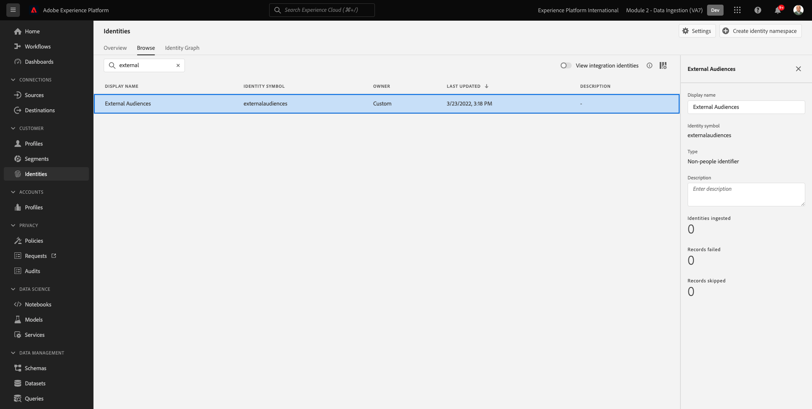
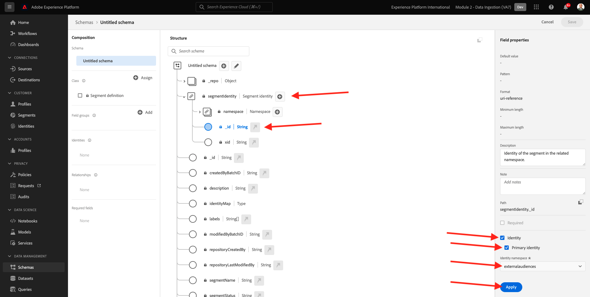
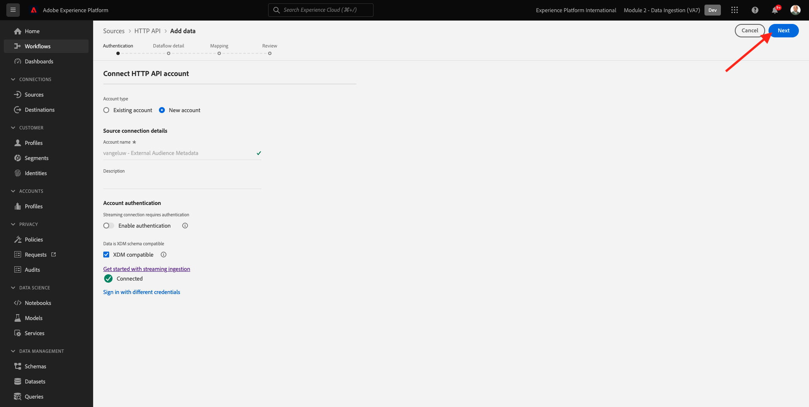
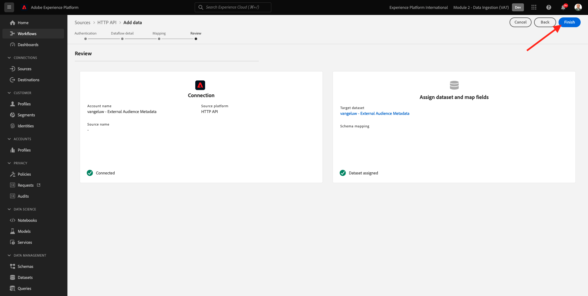
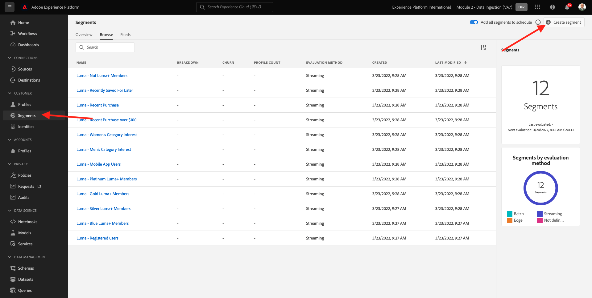

# 2.3.6外部對象

在許多情況下，您的公司可能會想要使用其他應用程式的現有對象，以擴充Adobe Experience Platform中的客戶設定檔。
這些外部受眾可能已根據資料科學模型或使用外部資料平台來定義。

Adobe Experience Platform的外部受眾功能可讓您專注在外部受眾的擷取及其啟用，而不需要在Adobe Experience Platform中重新詳細定義對應的受眾定義。

整個程式分為三個主要步驟：

- 匯入外部對象中繼資料：此步驟旨在將外部對象中繼資料（例如對象名稱）擷取至Adobe Experience Platform。
- 將外部對象成員指派給客戶設定檔：此步驟旨在使用外部對象成員資格屬性擴充客戶設定檔。
- 在Adobe Experience Platform中建立對象：此步驟旨在根據外部對象成員資格建立可操作的對象。

## 中繼資料

移至[Adobe Experience Platform](https://experience.adobe.com/platform)。 登入後，您會登入Adobe Experience Platform的首頁。


>[!IMPORTANT]
>
>用於此練習的沙箱是``--aepSandboxName--``！

繼續之前，您必須選取&#x200B;**沙箱**。 要選取的沙箱名為``--aepSandboxName--``。 選取適當的[!UICONTROL 沙箱]後，您將會看到畫面變更，現在您已在專屬的[!UICONTROL 沙箱]中。


雖然受眾資料會定義個人檔案成為受眾一部分的條件，但受眾中繼資料則是有關受眾的資訊，例如名稱、說明和受眾的狀態。 由於外部受眾中繼資料將會儲存在Adobe Experience Platform中，因此您需要使用身分名稱空間來將中繼資料擷取到Adobe Experience Platform。

## 2.3.6.1.1外部對象的身分名稱空間

已建立身分名稱空間以用於&#x200B;**外部對象**。
若要檢視已建立的身分，請移至**身分**，然後搜尋&#x200B;**外部**。 按一下「外部對象」專案。

請注意：

- 身分符號&#x200B;**externalaudiences**&#x200B;將在後續步驟中使用，以參考外部受眾身分。
- **非人員識別碼**&#x200B;型別用於此身分名稱空間，因為此名稱空間並非用來識別客戶設定檔，而是用來識別對象。



## 2.3.6.1.2建立外部對象中繼資料結構

外部對象中繼資料是以&#x200B;**對象定義結構描述**&#x200B;為基礎。 您可以在[XDM Github存放庫](https://github.com/adobe/xdm/blob/master/docs/reference/classes/segmentdefinition.schema.md)中找到更多詳細資料。

在左側選單中，前往結構描述。 按一下&#x200B;**+建立結構描述**，然後按一下&#x200B;**瀏覽**。


若要指派類別，請搜尋&#x200B;**對象定義**。 選取&#x200B;**對象定義**&#x200B;類別並按一下&#x200B;**指派類別**。


您將會看到此訊息。 按一下&#x200B;**取消**。


您將會看到此訊息。 選取欄位&#x200B;**_id**。 在右方功能表中，向下捲動並啟用&#x200B;**身分**&#x200B;和&#x200B;**主要身分**&#x200B;核取方塊。 選取&#x200B;**外部對象**&#x200B;身分名稱空間。 按一下&#x200B;**套用**。



接著，選取結構描述名稱&#x200B;**未命名結構描述**。 將名稱變更為`--aepUserLdap-- - External Audiences Metadata`。


啟用&#x200B;**設定檔**&#x200B;切換並確認。 最後，按一下&#x200B;**儲存**。


## 2.3.6.1.3建立外部對象中繼資料資料集

在&#x200B;**結構描述**&#x200B;中，移至&#x200B;**瀏覽**。 搜尋並按一下您在上一步建立的`--aepUserLdap-- - External Audiences Metadata`結構描述。 接著，按一下&#x200B;**從結構描述建立資料集**。


在&#x200B;**Name**&#x200B;欄位中輸入`--aepUserLdap-- - External Audience Metadata`。 按一下&#x200B;**建立資料集**。


您將會看到此訊息。 別忘了啟用&#x200B;**設定檔**&#x200B;切換按鈕！


## 2.3.6.1.4建立HTTP API Source連線

接下來，您需要設定HTTP API Source Connector ，將中繼資料擷取至資料集。

移至&#x200B;**來源**。 在搜尋欄位中，輸入&#x200B;**HTTP**。 按一下&#x200B;**新增資料**。


輸入下列資訊：

- **帳戶型別**：選取&#x200B;**新帳戶**
- **帳戶名稱**：輸入`--aepUserLdap-- - External Audience Metadata`
- 核取核取方塊&#x200B;**XDM相容方塊**

接著，按一下&#x200B;**連線到來源**。


您將會看到此訊息。 按一下&#x200B;**下一步**。



選取&#x200B;**現有的資料集**，然後在下拉式功能表中搜尋並選取資料集`--aepUserLdap-- - External Audience Metadata`。

驗證&#x200B;**資料流詳細資料**，然後按一下[下一步] **。**


您將會看到此訊息。

精靈的&#x200B;**對應**&#x200B;步驟是空的，因為您會將XDM相容的承載擷取到HTTP API Source Connector，所以不需要對應。 按一下&#x200B;**下一步**。


在&#x200B;**檢閱**&#x200B;步驟中，您可以選擇檢閱連線和對應詳細資料。 按一下&#x200B;**完成**。



您將會看到此訊息。


## 2.3.6.1.5擷取外部對象中繼資料

在您的Source Connector概觀標籤上，按一下&#x200B;**...**，然後按一下&#x200B;**複製結構描述承載**。


在電腦上開啟文字編輯器應用程式，然後貼上您剛才複製的裝載，如下所示。 接下來，您需要更新此承載中的&#x200B;**xdmEntity**&#x200B;物件。


物件&#x200B;**xdmEntity**&#x200B;必須取代為下列程式碼。 複製下列程式碼，然後取代文字編輯器中的&#x200B;**xdmEntity**&#x200B;物件，將其貼到文字檔案中。

```
"xdmEntity": {
    "_id": "--aepUserLdap---extaudience-01",
    "description": "--aepUserLdap---extaudience-01 description",
    "segmentIdentity": {
      "_id": "--aepUserLdap---extaudience-01",
      "namespace": {
        "code": "externalaudiences"
      }
    },
    "segmentName": "--aepUserLdap---extaudience-01 name",
    "segmentStatus": "ACTIVE",
    "version": "1.0"
  }
```

您應該會看到以下內容：


接著，開啟新的&#x200B;**終端機**&#x200B;視窗。 複製文字編輯器中的所有文字，並將其貼到終端機視窗中。


接著，按&#x200B;**Enter**。

然後，您會在「終端機」視窗中看到資料擷取的確認：


重新整理HTTP API Source聯結器畫面，您現在可以看到正在處理資料：


## 2.3.6.1.6驗證外部對象中繼資料擷取

處理完成後，您可以使用查詢服務檢查資料集中的資料可用性。

在右方功能表中，前往&#x200B;**資料集**&#x200B;並選取您先前建立的`--aepUserLdap-- - External Audience Metadata`資料集。


在右選單中，移至[查詢]並按一下[建立查詢]。****。


輸入下列程式碼，然後按下&#x200B;**SHIFT + ENTER**：

```
select * from --aepUserLdap--_external_audience_metadata
```

在查詢結果中，您會看到您擷取的外部對象中繼資料。


## 對象會籍

有了可用的外部對象中繼資料，您現在可以擷取特定客戶設定檔的對象成員資格。

您現在需要準備設定檔資料集，以擴充對象成員架構。 您可以在[XDM Github存放庫](https://github.com/adobe/xdm/blob/master/docs/reference/datatypes/segmentmembership.schema.md)中找到更多詳細資料。

### 建立外部對象成員資格結構

在右方功能表中，移至&#x200B;**結構描述**。 按一下&#x200B;**建立結構描述**，然後按一下&#x200B;**XDM個別設定檔**。


在&#x200B;**新增欄位群組**&#x200B;快顯視窗中，搜尋&#x200B;**設定檔核心**。 選取&#x200B;**設定檔核心v2**&#x200B;欄位群組。


接下來，在&#x200B;**新增欄位群組**&#x200B;快顯視窗中，搜尋&#x200B;**區段會籍**。 選取&#x200B;**區段成員資格詳細資料**&#x200B;欄位群組。 接著，按一下&#x200B;**新增欄位群組**。


您將會看到此訊息。 瀏覽至欄位`--aepTenantId--.identification.core`。 按一下&#x200B;**crmId**&#x200B;欄位。 在右方功能表中，向下捲動並勾選&#x200B;**身分**&#x200B;和&#x200B;**主要身分**&#x200B;核取方塊。 為&#x200B;**身分識別名稱空間**&#x200B;選取&#x200B;**示範系統 — CRMID**。

按一下&#x200B;**套用**。


接著，選取結構描述名稱&#x200B;**未命名結構描述**。 在顯示名稱欄位中，輸入`--aepUserLdap-- - External Audiences Membership`。


接下來，啟用&#x200B;**設定檔**&#x200B;切換並確認。 按一下&#x200B;**儲存**。


### 建立外部對象成員資格資料集

在&#x200B;**結構描述**&#x200B;中，移至&#x200B;**瀏覽**。 搜尋並按一下您在上一步建立的`--aepUserLdap-- - External Audiences Membership`結構描述。 接著，按一下&#x200B;**從結構描述建立資料集**。


在&#x200B;**Name**&#x200B;欄位中輸入`--aepUserLdap-- - External Audiences Membership`。 按一下&#x200B;**建立資料集**。


您將會看到此訊息。 別忘了啟用&#x200B;**設定檔**&#x200B;切換按鈕！


### 建立HTTP API Source連線


接下來，您需要設定HTTP API Source Connector ，將中繼資料擷取至資料集。

移至&#x200B;**來源**。 在搜尋欄位中，輸入&#x200B;**HTTP**。 按一下&#x200B;**新增資料**。


輸入下列資訊：

- **帳戶型別**：選取&#x200B;**新帳戶**
- **帳戶名稱**：輸入`--aepUserLdap-- - External Audience Membership`
- 核取核取方塊&#x200B;**XDM相容方塊**

接著，按一下&#x200B;**連線到來源**。


您將會看到此訊息。 按一下&#x200B;**下一步**。


選取&#x200B;**現有的資料集**，然後在下拉式功能表中搜尋並選取資料集`--aepUserLdap-- - External Audiences Membership`。

驗證&#x200B;**資料流詳細資料**，然後按一下[下一步] **。**


您將會看到此訊息。

精靈的&#x200B;**對應**&#x200B;步驟是空的，因為您會將XDM相容的承載擷取到HTTP API Source Connector，所以不需要對應。 按一下&#x200B;**下一步**。


在&#x200B;**檢閱**&#x200B;步驟中，您可以選擇檢閱連線和對應詳細資料。 按一下&#x200B;**完成**。


您將會看到此訊息。


### 擷取外部對象成員資格資料

在您的Source Connector概觀標籤上，按一下&#x200B;**...**，然後按一下&#x200B;**複製結構描述承載**。


在電腦上開啟文字編輯器應用程式，然後貼上您剛才複製的裝載，如下所示。 接下來，您需要更新此承載中的&#x200B;**xdmEntity**&#x200B;物件。


物件&#x200B;**xdmEntity**&#x200B;必須取代為下列程式碼。 複製下列程式碼，然後取代文字編輯器中的&#x200B;**xdmEntity**&#x200B;物件，將其貼到文字檔案中。

```
  "xdmEntity": {
    "_id": "--aepUserLdap---profile-test-01",
    "_experienceplatform": {
      "identification": {
        "core": {
          "crmId": "--aepUserLdap---profile-test-01"
        }
      }
    },
    "personID": "--aepUserLdap---profile-test-01",
    "segmentMembership": {
      "externalaudiences": {
        "--aepUserLdap---extaudience-01": {
          "status": "realized",
          "lastQualificationTime": "2022-03-05T00:00:00Z"
        }
      }
    }
  }
```

您應該會看到以下內容：


接著，開啟新的&#x200B;**終端機**&#x200B;視窗。 複製文字編輯器中的所有文字，並將其貼到終端機視窗中。


接著，按&#x200B;**Enter**。

然後，您會在「終端機」視窗中看到資料擷取的確認：


重新整理HTTP API Source聯結器畫面，幾分鐘後，您就會看到資料正在處理中：


### 驗證外部對象成員資格擷取

處理完成後，您可以使用查詢服務檢查資料集中的資料可用性。

在右方功能表中，前往&#x200B;**資料集**&#x200B;並選取您先前建立的`--aepUserLdap-- - External Audiences Membership `資料集。


在右選單中，移至[查詢]並按一下[建立查詢]。****。


輸入下列程式碼，然後按下&#x200B;**SHIFT + ENTER**：

```
select * from --aepUserLdap--_external_audiences_membership
```

在查詢結果中，您會看到您擷取的外部對象中繼資料。


## 建立區段

現在您已準備好對外部對象採取行動。
在Adobe Experience Platform中，採取動作的途徑包括建立區段、填入個別受眾並將這些受眾分享至目的地。
您現在會使用剛建立的外部受眾來建立區段。

在左側功能表中，前往&#x200B;**區段**&#x200B;並按一下&#x200B;**建立區段**。



移至&#x200B;**對象**。 您將會看到此訊息。 按一下&#x200B;**外部對象**。


選取您先前建立的外部對象，其名稱為`--aepUserLdap---extaudience-01`。 將對象拖放到畫布上。


提供區段名稱，使用`--aepUserLdap-- - extaudience-01`。 按一下&#x200B;**儲存並關閉**。


您將會看到此訊息。 您也會注意到您擷取區段會籍的設定檔現在顯示在&#x200B;**範例設定檔**&#x200B;的清單中。


您的區段現已準備就緒，可傳送至目的地進行啟用。

## 視覺化您的客戶設定檔

您現在也可以將客戶設定檔中的區段資格視覺化。 移至&#x200B;**設定檔**，使用身分識別名稱空間&#x200B;**Demo System - CRMID**&#x200B;並提供身分識別`--aepUserLdap---profile-test-01` （您做為練習6.6.2.4的一部分使用），然後按一下&#x200B;**檢視**。 接著，按一下&#x200B;**設定檔識別碼**&#x200B;以開啟設定檔。


移至&#x200B;**區段會籍**，您將在其中看到外部對象。


下一步： [2.3.7目的地SDK](./ex7.md)

[返回模組2.3](./real-time-cdp-build-a-segment-take-action.md)

[返回所有模組](../../../overview.md)
