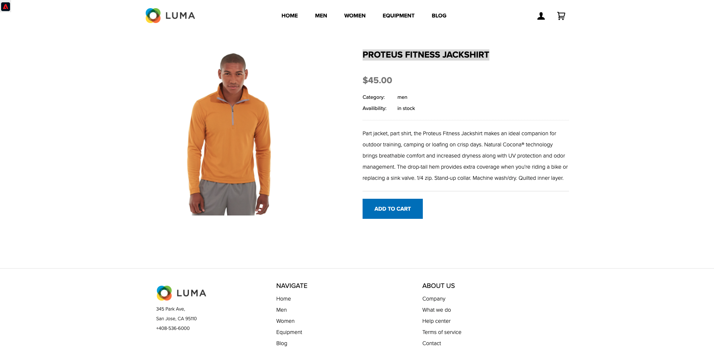

# 2.3.7目的地SDK

## 設定您的Adobe I/O專案

在本練習中，您將再次使用Adobe I/O來查詢Adobe Experience Platform的API。如果您尚未設定Adobe I/O專案，請回到模組2.1](../module2.1/ex3.md)中的[練習3，並遵循其中的指示。

## Adobe I/O的Postman驗證

在本練習中，您將再次使用Postman來查詢Adobe Experience Platform的API。如果您尚未設定Postman應用程式，請回到單元2.1](../module2.1/ex3.md)中的[練習3，並遵循其中的指示。

## 定義端點與格式

在本練習中，您將需要端點來設定，以便在區段符合資格時，資格事件可串流至該端點。 在本練習中，您將使用[https://webhook.site/](https://webhook.site/)的範例端點。 移至[https://webhook.site/](https://webhook.site/)，您會看到類似此內容。 按一下&#x200B;**複製到剪貼簿**&#x200B;以複製url。 您需要在下一個練習中指定此URL。 此範例中的URL是`https://webhook.site/e0eb530c-15b4-4a29-8b50-e40877d5490a`。


至於格式，我們將使用標準範本，將區段資格或取消資格連同客戶識別碼等中繼資料串流。 您可以自訂範本以符合特定端點的期望，但在本練習中，我們將重複使用標準範本，這將導致類似以下的裝載將串流到端點。

```json
{
  "profiles": [
    {
      "identities": [
        {
          "type": "ecid",
          "id": "64626768309422151580190219823409897678"
        }
      ],
      "AdobeExperiencePlatformSegments": {
        "add": [
          "f58c723c-f1e5-40dd-8c79-7bb4ab47f041"
        ],
        "remove": []
      }
    }
  ]
}
```

## 建立伺服器和範本設定

在Adobe Experience Platform中建立您自己的目的地的第一個步驟是建立伺服器和範本設定。

若要這麼做，請移至&#x200B;**目的地編寫API**、**目的地伺服器和範本**，然後按一下以開啟要求&#x200B;**POST — 建立目的地伺服器組態**。 您將會看到此訊息。 在&#x200B;**Headers**&#x200B;底下，您需要手動更新機碼&#x200B;**x-sandbox-name**&#x200B;的值，並將其設定為`--aepSandboxName--`。 選取值&#x200B;**{{SANDBOX_NAME}}**。


以`--aepSandboxName--`取代。


接著，移至&#x200B;**內文**。 選取預留位置&#x200B;**{{body}}**。


您現在需要用下列程式碼取代預留位置&#x200B;**{{body}}**：

```json
{
    "name": "Custom HTTP Destination",
    "destinationServerType": "URL_BASED",
    "urlBasedDestination": {
        "url": {
            "templatingStrategy": "PEBBLE_V1",
            "value": "yourURL"
        }
    },
    "httpTemplate": {
        "httpMethod": "POST",
        "requestBody": {
            "templatingStrategy": "PEBBLE_V1",
            "value": "{\n    \"profiles\": [\n    \n        {\n            \"identities\": [\n            \n            \n                \n                {\n                    \"type\": \"{{ namespace }}\",\n                    \"id\": \"{{ identity.id }}\"\n                },\n                ,\n            \n            ],\n            \"AdobeExperiencePlatformSegments\": {\n                \"add\": [\n                \n                    \"{{ segment.key }}\",\n                \n                ],\n                \"remove\": [\n                {#- Alternative syntax for filtering segments by status: -#}\n                \n                    \"{{ segment.key }}\",\n                \n                ]\n            }\n        },\n    \n    ]\n}"
        },
        "contentType": "application/json"
    }
}
```

貼上上述程式碼後，您必須手動更新欄位&#x200B;**urlBasedDestination.url.value**，而且您必須將其設定為您在上一步中建立的webhook的URL，在此範例中為`https://webhook.site/e0eb530c-15b4-4a29-8b50-e40877d5490a`。


更新欄位&#x200B;**urlBasedDestiantion.url.value**&#x200B;後，它應該如下所示。 按一下&#x200B;**傳送**。


按一下&#x200B;**傳送**&#x200B;之後，將會建立您的伺服器範本，而在回應中，您會看到名為&#x200B;**instanceId**&#x200B;的欄位。 記下它，因為您會在下一個步驟中需要它。 在此範例中，**instanceId**為
`eb0f436f-dcf5-4993-a82d-0fcc09a6b36c`。


## 建立您的目的地設定

在Postman中的&#x200B;**目的地編寫API**&#x200B;底下，移至&#x200B;**目的地組態**&#x200B;並按一下以開啟要求&#x200B;**POST — 建立目的地組態**。 您將會看到此訊息。 在&#x200B;**Headers**&#x200B;底下，您需要手動更新機碼&#x200B;**x-sandbox-name**&#x200B;的值，並將其設定為`--aepSandboxName--`。 選取值&#x200B;**{{SANDBOX_NAME}}**。


以`--aepSandboxName--`取代。


接著，移至&#x200B;**內文**。 選取預留位置&#x200B;**{{body}}**。


您現在需要用下列程式碼取代預留位置&#x200B;**{{body}}**：

```json
{
    "name": "--aepUserLdap-- - Webhook",
    "description": "Exports segment qualifications and identities to a custom webhook via Destination SDK.",
    "status": "TEST",
    "customerAuthenticationConfigurations": [
        {
            "authType": "BEARER"
        }
    ],
    "customerDataFields": [
        {
            "name": "endpointsInstance",
            "type": "string",
            "title": "Select Endpoint",
            "description": "We could manage several instances across the globe for REST endpoints that our customers are provisioned for. Select your endpoint in the dropdown list.",
            "isRequired": true,
            "enum": [
                "US",
                "EU",
                "APAC",
                "NZ"
            ]
        }
    ],
    "uiAttributes": {
        "documentationLink": "https://experienceleague.adobe.com/docs/experience-platform/destinations/home.html?lang=en",
        "category": "streaming",
        "connectionType": "Server-to-server",
        "frequency": "Streaming"
    },
    "identityNamespaces": {
        "ecid": {
            "acceptsAttributes": true,
            "acceptsCustomNamespaces": false
        }
    },
    "segmentMappingConfig": {
        "mapExperiencePlatformSegmentName": true,
        "mapExperiencePlatformSegmentId": true,
        "mapUserInput": false
    },
    "aggregation": {
        "aggregationType": "BEST_EFFORT",
        "bestEffortAggregation": {
            "maxUsersPerRequest": "1000",
            "splitUserById": false
        }
    },
    "schemaConfig": {
        "profileRequired": false,
        "segmentRequired": true,
        "identityRequired": true
    },
    "destinationDelivery": [
        {
            "authenticationRule": "NONE",
            "destinationServerId": "yourTemplateInstanceID"
        }
    ]
}
```


貼上上述程式碼後，您必須手動更新&#x200B;**destinationDelivery欄位。 destinationServerId**，而且您必須將它設定為您在上一步中建立的目的地伺服器範本的&#x200B;**instanceId**，在此範例中為`eb0f436f-dcf5-4993-a82d-0fcc09a6b36c`。 接著，按一下&#x200B;**傳送**。


您會看到此回應。


您的目的地現在已建立在Adobe Experience Platform中。 讓我們到那裡檢查一下。

移至[Adobe Experience Platform](https://experience.adobe.com/platform)。 登入後，您會登入Adobe Experience Platform的首頁。


繼續之前，您必須選取&#x200B;**沙箱**。 要選取的沙箱名為``--aepSandboxName--``。 您可以按一下熒幕上方藍線中的文字&#x200B;**[!UICONTROL Production Prod]**&#x200B;來執行此操作。 選取適當的[!UICONTROL 沙箱]後，您將會看到畫面變更，現在您已在專屬的[!UICONTROL 沙箱]中。


在左側功能表中，移至&#x200B;**目的地**，按一下&#x200B;**目錄**，然後向下捲動至類別&#x200B;**串流**。 您現在會看到目的地可供使用。


## 將您的區段連結至目的地

在&#x200B;**目的地** > **目錄**&#x200B;中，按一下目的地上的&#x200B;**設定**，開始將區段新增至您的新目的地。


輸入虛擬持有人權杖，例如&#x200B;**1234**。 按一下&#x200B;**連線到目的地**。


您將會看到此訊息。 作為目的地的名稱，請使用`--aepUserLdap-- - Webhook`。 選取選取的端點，在此範例中為&#x200B;**EU**。 按一下&#x200B;**下一步**。


您可以選擇選取資料治理原則。 按一下&#x200B;**下一步**。


選取您先前建立的區段，名為`--aepUserLdap-- - Interest in PROTEUS FITNESS JACKSHIRT`。 按一下&#x200B;**下一步**。


您將會看到此訊息。 確定將&#x200B;**SOURCE欄位** `--aepTenantId--.identification.core.ecid`對應到欄位`Identity: ecid`。 按一下&#x200B;**下一步**。


按一下&#x200B;**完成**。


您的目的地現已上線，新的區段資格將立即串流至您的自訂webhook。


## 測試區段啟用

移至[https://builder.adobedemo.com/projects](https://builder.adobedemo.com/projects)。 使用Adobe ID登入後，您會看到此訊息。 按一下您的網站專案以開啟。


您現在可以依照以下流程存取網站。 按一下&#x200B;**整合**。


在&#x200B;**整合**&#x200B;頁面上，您必須選取在練習0.1中建立的資料收集屬性。


然後您會看到示範網站已開啟。 選取URL並將其複製到剪貼簿。


開啟新的無痕瀏覽器視窗。


貼上您在上一步中複製的示範網站URL。 接著，系統會要求您使用Adobe ID登入。


選取您的帳戶型別並完成登入程式。


接著，您會在無痕瀏覽器視窗中看到您的網站已載入。 對於每個示範，您都需要使用全新的無痕瀏覽器視窗來載入您的示範網站URL。


從&#x200B;**Luma**&#x200B;首頁，前往&#x200B;**Men**，然後按一下產品&#x200B;**PROTEUS FITNESS JACKSHIRT**。


您現在已造訪&#x200B;**PROTEUS FITNESS JACKSHIRT**&#x200B;的產品頁面，這表示您現在符合在此練習中先前建立的區段資格。



當您開啟設定檔檢視器並移至&#x200B;**區段**&#x200B;時，您將看到該區段符合資格。


現在返回您在[https://webhook.site/](https://webhook.site/)上開啟的webhook，您應該會看到新的傳入要求，這些要求來自Adobe Experience Platform且包含區段資格事件。


下一步： [摘要與優點](./summary.md)

[返回模組2.3](./real-time-cdp-build-a-segment-take-action.md)

[返回所有模組](../../../overview.md)
