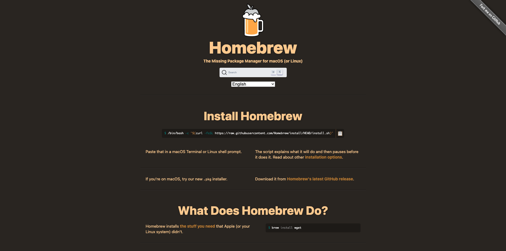

# 2.4.0設定環境

## 2.4.0.1建立Azure訂閱

>[!NOTE]
>
>如果您已有Azure訂閱，可以略過此步驟。 在這種情況下，請繼續練習13.0.2。

移至[https://portal.azure.com](https://portal.azure.com)並使用您的Azure帳戶登入。 如果您沒有電子郵件地址，請使用個人電子郵件地址來建立您的Azure帳戶。


成功登入後，您會看到下列畫面：


按一下左側功能表並選取&#x200B;**所有資源**，如果您尚未訂閱，將會顯示Azure訂閱畫面。 在這種情況下，請選取&#x200B;**開始使用Azure免費試用**。


填寫Azure訂閱表單，提供您的行動電話和信用卡以進行啟用（您將有30天的免費套餐，除非您升級，否則不會向您收費）：


訂閱程式完成後，您就可以開始了：


## 2.4.0.2安裝Visual Code Studio

您將使用Microsoft Visual Code Studio來管理您的Azure專案。 您可以透過[此連結](https://code.visualstudio.com/download)下載。 請遵循同一網站上特定作業系統的安裝指示。

## 2.4.0.3安裝Visual Code擴充功能

從[https://marketplace.visualstudio.com/items?itemName=ms-azuretools.vscode-azurefunctions](https://marketplace.visualstudio.com/items?itemName=ms-azuretools.vscode-azurefunctions)安裝適用於Visual Studio Code的Azure函式。 按一下安裝按鈕：


安裝Azure帳戶並從[https://marketplace.visualstudio.com/items?itemName=ms-vscode.azure-account](https://marketplace.visualstudio.com/items?itemName=ms-vscode.azure-account)登入Visual Studio Code。 按一下安裝按鈕：


## 2.4.0.4安裝節點.js

>[!NOTE]
>
>如果您已安裝node.js，則可以略過此步驟。 在這種情況下，請繼續練習13.0.5。

### macOS

確定先安裝[Homebrew](https://brew.sh/)。 請依照指示[這裡](https://brew.sh/)。



安裝Homebrew後，請執行此命令：

```javascript
brew install node
```

### Windows

直接從[nodejs.org](https://nodejs.org/en/)網站下載[Windows Installer](https://nodejs.org/en/#home-downloadhead)。

## 2.4.0.5驗證node.js版本

此模組需要安裝node.js版本12。 其他任何版本的node.js都可能導致練習13.5發生問題。

在繼續之前，請立即驗證您的node.js版本。

執行此命令以驗證您的node.js版本：

```javascript
node -v
```

如果您的版本低於或高於12，則需要升級或降級。

### 在macOS上升級/降級node.js版本

確定您已安裝封裝&#x200B;**n**。

若要安裝封裝&#x200B;**n**，請執行此命令：

```javascript
sudo npm install -g n
```

如果您版本低於或高於版本12，請執行此命令以升級或降級：

```javascript
sudo n 12.6.0
```

### 在Windows上升級/降級node.js版本

從「Windows >控制檯>新增或移除程式」解除安裝node.js。

正在從[nodejs.org](https://nodejs.org/en/)網站安裝所需版本。

## 2.4.0.6安裝NPM套件：要求

您必須在node.js安裝程式中安裝封裝&#x200B;**要求**。

若要安裝封裝&#x200B;**要求**，請執行此命令：

```javascript
npm install request
```


下一步： [2.4.1設定您的Microsoft Azure EventHub環境](./ex1.md)

[返回模組2.4](./segment-activation-microsoft-azure-eventhub.md)

[返回所有模組](./../../../overview.md)
