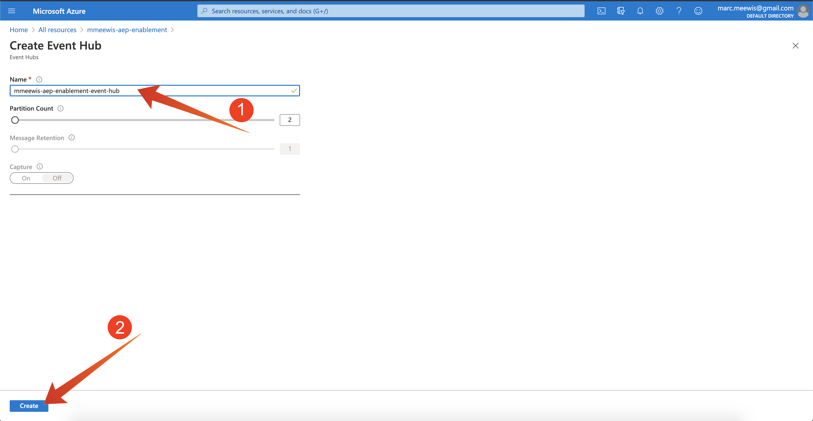
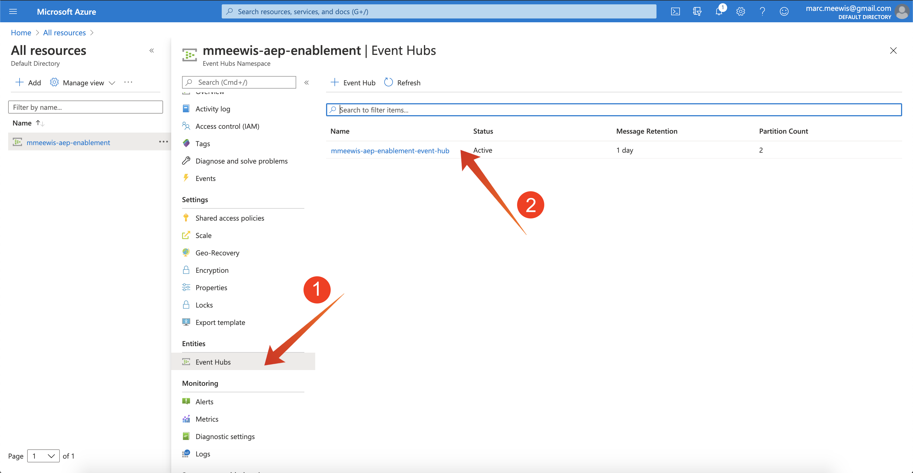

# 2.4.1設定您的Microsoft Azure EventHub環境

Azure事件中樞是一種高度可擴充的發佈 — 訂閱服務，每秒可以擷取數百萬個事件，並將它們串流到多個應用程式中。 如此一來，您就可以處理和分析連線裝置和應用程式所產生的大量資料。

## 2.4.1.1什麼是Azure事件中樞？

Azure事件中樞是巨量資料串流平台和事件擷取服務。 其每秒可接收及處理數百萬個事件。 傳送到事件中樞的資料可以使用任何即時分析提供者或批次/儲存配接卡進行轉換和儲存。

事件中樞代表事件管道的&#x200B;**前門**，在解決方案架構中通常稱為事件擷取器。 事件擷取器是位於事件發佈者(例如Adobe Experience Platform RTCDP)和事件消費者之間的元件或服務，以將事件資料流的產生與這些事件的消費分離。 事件中樞提供具有時間保留緩衝的統一串流平台，將事件製作者與事件消費者分離。

## 2.4.1.2建立事件中樞名稱空間

移至[https://portal.azure.com/#home](https://portal.azure.com/#home)並選取&#x200B;**建立資源**。

在資源畫面中，在搜尋列中輸入&#x200B;**事件**，並從下拉式清單中選取&#x200B;**事件中樞**：

按一下&#x200B;**建立**：

如果這是您第一次在Azure中建立資源，則需要建立新的&#x200B;**資源群組**。 如果您已經有資源群組，您可以選取它（或建立新資源群組）。

選取&#x200B;**建立新的**，將您的群組命名為`--aepUserLdap---aep-enablement`。

完成欄位測試，如下所示：

- 名稱空間：定義您的名稱空間，必須是唯一的，請使用以下模式`--aepUserLdap---aep-enablement`
- 位置： **西歐**&#x200B;參考阿姆斯特丹的Azure資料中心
- 訂價層： **基本**
- 輸送量單位： **1**

按一下&#x200B;**檢閱+建立**。

按一下&#x200B;**建立**。

資源群組的部署可能需要1-2分鐘，部署成功後，您將會看到下列畫面：

## 2.4.1.3在Azure中設定您的事件中樞

移至[https://portal.azure.com/#home](https://portal.azure.com/#home)並選取&#x200B;**所有資源**。

從資源清單中，選取您的`--aepUserLdap---aep-enablement`名稱空間：

在`--aepUserLdap---aep-enablement`詳細資訊畫面中，選取&#x200B;**事件中樞**：

按一下&#x200B;**+事件中樞**。

使用`--aepUserLdap---aep-enablement-event-hub`作為名稱，然後按一下&#x200B;**建立**。

按一下事件中樞名稱空間中的&#x200B;**事件中樞**。 您現在應該會看到&#x200B;**事件中心**&#x200B;已列出。 如果是這種情況，您可以繼續進行下一個練習。

## 2.4.1.4設定您的Azure儲存體帳戶

若要在稍後的練習中偵錯Azure事件中樞功能，您必須提供Azure儲存體帳戶，作為Visual Studio Code專案設定的一部分。 您現在將建立該Azure儲存體帳戶。

移至[https://portal.azure.com/#home](https://portal.azure.com/#home)並選取&#x200B;**建立資源**。

在搜尋中輸入&#x200B;**儲存體**，並從清單中選取&#x200B;**儲存體帳戶**。

選取「**建立**」。

指定您的&#x200B;**資源群組** （在本練習開始時建立），使用`--aepUserLdap--aepstorage`作為儲存體帳戶名稱，並選取&#x200B;**本機備援儲存體(LRS)**，然後按一下&#x200B;**檢閱+建立**。

按一下&#x200B;**建立**。

您的儲存帳戶建立將需要幾秒鐘的時間：

完成後，您的畫面將會顯示&#x200B;**前往資源**&#x200B;按鈕。

按一下&#x200B;**Microsoft Azure**。

您的存放裝置帳戶現在會顯示在&#x200B;**最近使用的資源**&#x200B;下。

下一步： [2.4.2在Adobe Experience Platform中設定Azure事件中心目的地](./ex2.md)

[返回模組2.4](./segment-activation-microsoft-azure-eventhub.md)

[返回所有模組](./../../../overview.md)
