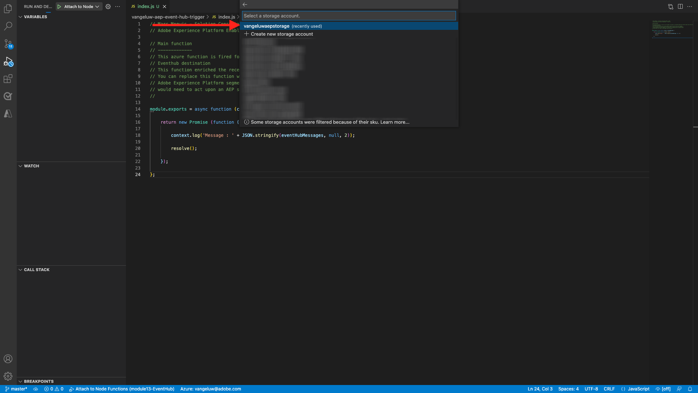

# 2.4.5建立您的Microsoft Azure專案

## 2.4.5.1熟悉Azure事件中樞功能

Azure Functions可讓您執行小段程式碼（稱為&#x200B;**函式**），而不需擔心應用程式基礎結構。 藉由Azure Functions，雲端基礎結構可提供您維持應用程式大規模執行所需的所有最新伺服器。

函式是由特定型別的事件&#x200B;**觸發**。 支援的觸發器包括回應資料變更、回應訊息（例如事件中樞）、依排程執行或作為HTTP請求的結果。

Azure Functions是一種無伺服器運算服務，可讓您執行事件觸發的程式碼，而不需明確布建或管理基礎結構。

Azure事件中樞會整合Azure Functions以提供無伺服器架構。

## 2.4.5.2開啟Visual Studio Code並登入Azure

Visual Studio Code可讓您輕鬆……

- 定義並將Azure函式繫結到事件中樞
- 本機測試
- 部署至Azure
- 遠端記錄函式執行

### 開啟Visual Studio Code

若要開啟Visual Studio Code，請在作業系統的搜尋中輸入&#x200B;**visual** （在OSX上搜尋Spotlight，在視窗的工作列搜尋）。 如果找不到，則需要重複[練習0 — 先決條件](./ex0.md)中概述的步驟。


### 登入Azure

當您使用您用來在[練習0 — 先決條件](./ex0.md)中註冊的Azure帳戶登入時，Visual Studio Code可讓您尋找並繫結所有事件中樞資源。

按一下Visual Studio Code中的&#x200B;**Azure**&#x200B;圖示。 如果您沒有該選項，安裝必要的擴充功能可能會發生問題。

接著選取&#x200B;**登入Azure**：


系統會將您重新導向至瀏覽器以登入。 請記得選取您用來註冊的Azure帳戶。


當您在瀏覽器中看到下列畫面時，表示您已使用Visual Code Studio登入：


返回Visual Code Studio （您將會看到Azure訂閱的名稱，例如&#x200B;**Azure訂閱1**）：


## 2.4.5.3建立Azure專案

當您將游標停留在&#x200B;**Azure訂閱1**&#x200B;上方時，區段上方會出現一個功能表，請選取&#x200B;**建立新專案……**：


選取您選擇的本機資料夾以儲存專案，然後按一下&#x200B;**選取**：


您現在將輸入專案建立精靈。 選取&#x200B;**Javascript**&#x200B;作為專案的語言：


選取&#x200B;**Azure事件中心觸發程式**&#x200B;作為專案的第一個函式範本：


輸入函式的名稱，使用下列格式`--demoProfileLdap---aep-event-hub-trigger`，然後按Enter鍵：


選取&#x200B;**建立新的本機應用程式設定**：


選取事件中樞名稱空間，您應該會看到您在&#x200B;**練習2**&#x200B;中定義的事件中樞。 在此範例中，事件中樞名稱空間是&#x200B;**vangeluw-aep-enablement**：


選取您的事件中心，您應該會看到您在&#x200B;**練習2**&#x200B;中定義的事件中心。 在我看來，是&#x200B;**vangeluw-aep-enablement-event-hub**：


選取&#x200B;**RootManageSharedAccessKey**&#x200B;作為事件中心原則：


輸入以使用&#x200B;**$Default**：


選取&#x200B;**新增至工作區**，瞭解如何開啟您的專案：


建立專案後，按一下&#x200B;**index.js**&#x200B;在編輯器中開啟檔案：


Adobe Experience Platform傳送至事件中心的裝載將包含區段ID：

```json
[{
"segmentMembership": {
"ups": {
"ca114007-4122-4ef6-a730-4d98e56dce45": {
"lastQualificationTime": "2020-08-31T10:59:43Z",
"status": "realized"
},
"be2df7e3-a6e3-4eb4-ab12-943a4be90837": {
"lastQualificationTime": "2020-08-31T10:59:56Z",
"status": "realized"
},
"39f0feef-a8f2-48c6-8ebe-3293bc49aaef": {
"lastQualificationTime": "2020-08-31T10:59:56Z",
"status": "realized"
}
}
},
"identityMap": {
"ecid": [{
"id": "08130494355355215032117568021714632048"
}]
}
}]
```

將Visual Studio Code的index.js中的程式碼取代為下列程式碼。 每次Real-time CDP將區段資格傳送至事件中心目的地時，都會執行此程式碼。 在我們的範例中，程式碼只是顯示和增強已接收的裝載。 但您可以想像任何型別的功能，以即時處理區段資格。

```javascript
// Marc Meewis - Solution Consultant Adobe - 2020
// Adobe Experience Platform Enablement - Module 13

// Main function
// -------------
// This azure function is fired for each segment activated to the Adobe Exeperience Platform Real-time CDP Azure 
// Eventhub destination
// This function enriched the received segment payload with the name fo the segment. 
// You can replace this function with any logic that is require to process and deliver
// Adobe Experience Platform segments in real-time to any application or platform that 
// would need to act upon an AEP segment qualiification.
// 

module.exports = async function (context, eventHubMessages) {

    return new Promise (function (resolve, reject) {

        context.log('Message : ' + JSON.stringify(eventHubMessages, null, 2));

        resolve();

    });    

};
```

結果應如下所示：


## 2.4.5.4執行Azure專案

現在該執行您的專案了。 目前階段，我們不會將專案部署到Azure。 我們將在偵錯模式中在本機執行。 選取「執行」圖示，按一下綠色箭頭。


第一次以偵錯模式執行專案時，您必須附加Azure儲存體帳戶，請按一下[選取儲存體帳戶]。****


從儲存體帳戶清單中，選取您建立為[13.1.4的一部分，以設定您的Azure儲存體帳戶](./ex1.md)。 您的儲存體帳戶名稱為`--demoProfileLdap--aepstorage`，例如： **mmeewisaepstorage**。



您的專案現在已啟動且執行中，並列出事件中心中的事件。 在下個練習中，您將會在Luma示範網站上示範符合這些區段資格的行為。 因此，您將在事件中心觸發函式的終端機中收到區段資格裝載：


## 2.4.5.5停止Azure專案

若要停止您的專案，請選取&#x200B;**終端機**&#x200B;標籤，在終端機視窗中按一下，然後在OSX上按&#x200B;**CMD-C**，或在Windows上按&#x200B;**CTRL-C**：


下一步： [2.4.6端對端案例](./ex6.md)

[返回模組2.4](./segment-activation-microsoft-azure-eventhub.md)

[返回所有模組](./../../../overview.md)
