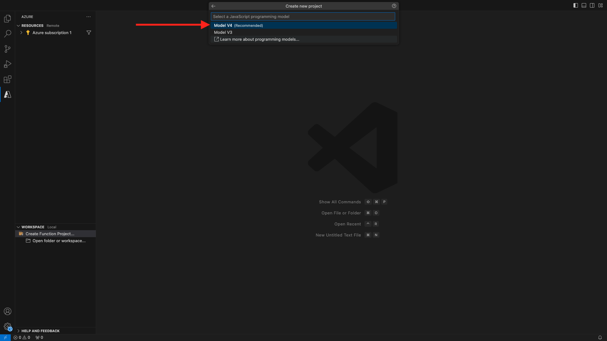
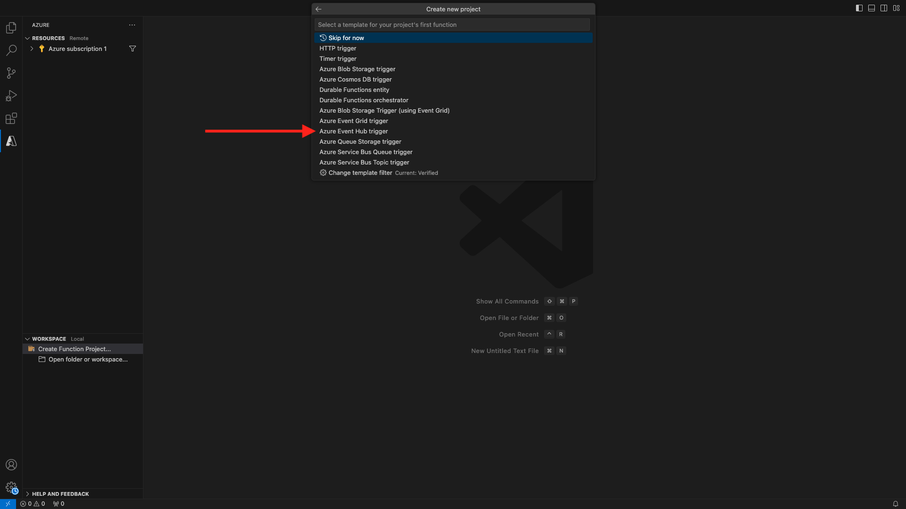

# 2.4.6建立您的Microsoft Azure專案

## 熟悉Azure事件中心功能

Azure Functions可讓您執行小段程式碼（稱為&#x200B;**函式**），而不需擔心應用程式基礎結構。 藉由Azure Functions，雲端基礎結構可提供您維持應用程式大規模執行所需的所有最新伺服器。

函式是由特定型別的事件&#x200B;**觸發**。 支援的觸發器包括回應資料變更、回應訊息（例如事件中樞）、依排程執行或作為HTTP請求的結果。

Azure Functions是一種無伺服器運算服務，可讓您執行事件觸發的程式碼，而不需明確布建或管理基礎結構。

Azure事件中樞會整合Azure Functions以提供無伺服器架構。

## 開啟Visual Studio Code並登入Azure

Visual Studio Code可讓您輕鬆……

- 定義並將Azure函式繫結到事件中樞
- 本機測試
- 部署至Azure
- 遠端記錄函式執行

### 開啟Visual Studio Code

### 登入Azure

當您使用您在上一個練習中用來註冊的Azure帳戶登入時，Visual Studio Code可讓您尋找並繫結所有事件中樞資源。

開啟Visual Studio Code並按一下&#x200B;**Azure**&#x200B;圖示。

接著選取&#x200B;**登入Azure**：


系統會將您重新導向至瀏覽器以登入。 請記得選取您用來註冊的Azure帳戶。

當您在瀏覽器中看到下列畫面時，表示您已使用Visual Code Studio登入：


返回Visual Code Studio （您將會看到Azure訂閱的名稱，例如&#x200B;**Azure訂閱1**）：


## 建立Azure專案

按一下&#x200B;**建立函式專案……**：


選取您選擇的本機資料夾以儲存專案，然後按一下&#x200B;**選取**：


您現在將輸入專案建立精靈。 按一下&#x200B;**Javascript**&#x200B;作為專案的語言：


然後選取&#x200B;**模型v4**。



選取&#x200B;**Azure事件中心觸發程式**&#x200B;作為專案的第一個函式範本：



輸入函式的名稱，使用下列格式`--aepUserLdap---aep-event-hub-trigger`，然後按Enter鍵：


選取&#x200B;**建立新的本機應用程式設定**：


按一下以選取您先前建立的名為`--aepUserLdap---aep-enablement`的事件中心名稱空間。


接著，按一下以選取您先前建立的事件中樞，其名稱為`--aepUserLdap---aep-enablement-event-hub`。


按一下以選取&#x200B;**RootManageSharedAccessKey**&#x200B;作為您的事件中心原則：


選取&#x200B;**新增至工作區**，瞭解如何開啟您的專案：


您可能會收到類似以下的訊息。 在這種情況下，請按一下&#x200B;**是，我信任作者**。


建立專案後，按一下&#x200B;**index.js**&#x200B;在編輯器中開啟檔案：


Adobe Experience Platform傳送至事件中心的裝載將包含對象ID：

```json
[{
"segmentMembership": {
"ups": {
"ca114007-4122-4ef6-a730-4d98e56dce45": {
"lastQualificationTime": "2020-08-31T10:59:43Z",
"status": "realized"
},
"be2df7e3-a6e3-4eb4-ab12-943a4be90837": {
"lastQualificationTime": "2020-08-31T10:59:56Z",
"status": "realized"
},
"39f0feef-a8f2-48c6-8ebe-3293bc49aaef": {
"lastQualificationTime": "2020-08-31T10:59:56Z",
"status": "realized"
}
}
},
"identityMap": {
"ecid": [{
"id": "08130494355355215032117568021714632048"
}]
}
}]
```

將Visual Studio Code的index.js中的程式碼取代為下列程式碼。 每次Real-time CDP將對象資格傳送至事件中心目的地時，都會執行此程式碼。 在我們的範例中，程式碼只是顯示和增強已接收的裝載。 但您可以想像任何型別的功能，以即時處理對象資格。

```javascript
// Marc Meewis - Solution Consultant Adobe - 2020
// Adobe Experience Platform Enablement - Module 2.4

// Main function
// -------------
// This azure function is fired for each audience activated to the Adobe Exeperience Platform Real-time CDP Azure 
// Eventhub destination
// This function enriched the received audience payload with the name of the audience. 
// You can replace this function with any logic that is require to process and deliver
// Adobe Experience Platform audiences in real-time to any application or platform that 
// would need to act upon an AEP audience qualification.
// 

module.exports = async function (context, eventHubMessages) {

    return new Promise (function (resolve, reject) {

        context.log('Message : ' + JSON.stringify(eventHubMessages, null, 2));

        resolve();

    });    

};
```

結果應如下所示：


## 執行Azure專案

現在該執行您的專案了。 目前階段，我們不會將專案部署到Azure。 我們將在偵錯模式中在本機執行。 選取「執行」圖示，按一下綠色箭頭。


第一次以偵錯模式執行專案時，您必須附加Azure儲存體帳戶，按一下[選取儲存體帳戶] **，然後選取您先前建立的儲存體帳戶，名為`--aepUserLdap--aepstorage`。**

您的專案現在已啟動且執行中，並列出事件中心中的事件。 在下個練習中，您將會在CitiSignal示範網站上示範行為，以符合您的受眾資格。 因此，您將在事件中心觸發函式的終端機中收到對象資格裝載。


## 停止Azure專案

若要停止您的專案，請移至VSC中的lenu **CALL STACK**，按一下執行中專案上的箭頭，然後按一下&#x200B;**停止**。


下一步： [2.4.7端對端案例](./ex7.md)

[返回模組2.4](./segment-activation-microsoft-azure-eventhub.md)

[返回所有模組](./../../../overview.md)
