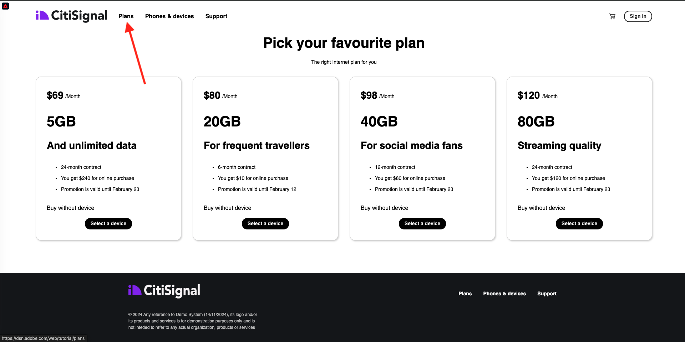

# 2.4.7端對端案例

## 啟動Azure事件中樞觸發程式

若要顯示Adobe Experience Platform Real-time CDP根據對象資格傳送至Azure事件中樞的裝載，我們需要啟動簡單的Azure事件中樞觸發功能。 此函式將簡單地將裝載「傾印」到Visual Studio Code中的主控台。 但請記住，此函式可透過任何方式，擴充至使用專用API和通訊協定與各種環境進行介面。

### 啟動Visual Studio Code並啟動專案

請確定已開啟並執行Visual Studio Code專案

若要在Visual Studio Code中啟動/停止/重新啟動Azure函式，請參閱上一個練習。

您的Visual Studio Code的&#x200B;**終端機**&#x200B;應該提及類似以下的專案：

```code
[2024-11-20T20:07:12.316Z] Debugger listening on ws://127.0.0.1:9229/86c8e251-8e2f-4c65-a063-cda77edbf2ca
[2024-11-20T20:07:12.318Z] For help, see: https://nodejs.org/en/docs/inspector
[2024-11-20T20:07:12.343Z] Worker process started and initialized.
[2024-11-20T20:07:12.359Z] Debugger attached.

Functions:

        vangeluw-aep-event-hub-trigger: eventHubTrigger

For detailed output, run func with --verbose flag.
[2024-11-20T20:07:18.150Z] Host lock lease acquired by instance ID '000000000000000000000000000C19D8'.
```

## 載入您的Citi Signal網站

移至[https://dsn.adobe.com](https://dsn.adobe.com)。 使用Adobe ID登入後，您會看到此訊息。 按一下您的網站專案上的3個點&#x200B;**...**，然後按一下&#x200B;**執行**&#x200B;以開啟它。


然後您會看到示範網站已開啟。 選取URL並將其複製到剪貼簿。


開啟新的無痕瀏覽器視窗。


貼上您在上一步中複製的示範網站URL。 接著，系統會要求您使用Adobe ID登入。


選取您的帳戶型別並完成登入程式。


接著，您會在無痕瀏覽器視窗中看到您的網站已載入。 每次練習都需要使用全新的無痕瀏覽器視窗，才能載入您的示範網站URL。


## 符合對象資格

導覽至&#x200B;**計畫**&#x200B;頁面。 此動作將讓您符合`--aepUserLdap-- - Interest in Plans`對象的資格。



若要確認，請開啟「設定檔檢視器」面板。 您現在應該是`--aepUserLdap-- - Interest in Plans`的成員。 如果您的對象成員資格尚未在「設定檔檢視器」面板中更新，請按一下重新載入按鈕。


切換回Visual Studio Code並檢視您的&#x200B;**終端機**&#x200B;標籤，您應該會看到您特定&#x200B;**ECID**&#x200B;的對象清單。 一旦您符合`--aepUserLdap-- - Interest in Plans`對象的資格，此啟用裝載就會立即傳送至您的事件中樞。


當您進一步瞭解對象承載時，可以看到`--aepUserLdap-- - Interest in Plans`處於&#x200B;**已實現**&#x200B;狀態。

```json
{
  "identityMap": {
    "ecid": [
      {
        "id": "36281682065771928820739672071812090802"
      }
    ]
  },
  "segmentMembership": {
    "ups": {
      "94db5aed-b90e-478d-9637-9b0fad5bba11": {
        "createdAt": 1732129904025,
        "lastQualificationTime": "2024-11-21T07:33:52Z",
        "mappingCreatedAt": 1732130611000,
        "mappingUpdatedAt": 1732130611000,
        "name": "vangeluw - Interest in Plans",
        "status": "realized",
        "updatedAt": 1732129904025
      }
    }
  }
}
```

**已實現**&#x200B;的對象狀態表示您的設定檔是對象的一部分，而&#x200B;**已退出**&#x200B;狀態表示我們的設定檔已從對象中移除。

下一步： [摘要與優點](./summary.md)

[返回模組2.4](./segment-activation-microsoft-azure-eventhub.md)

[返回所有模組](./../../../overview.md)
