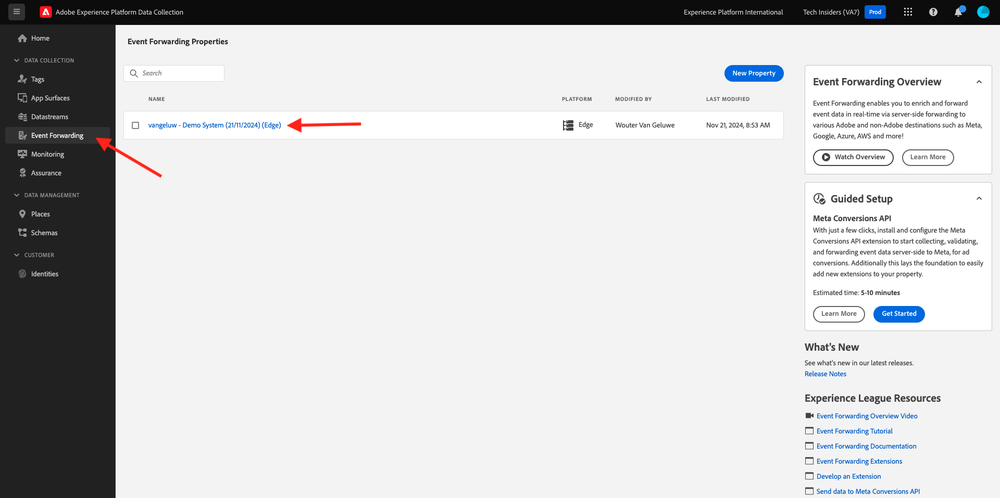
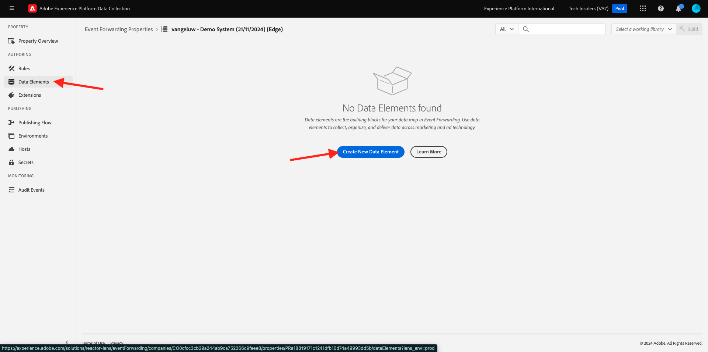
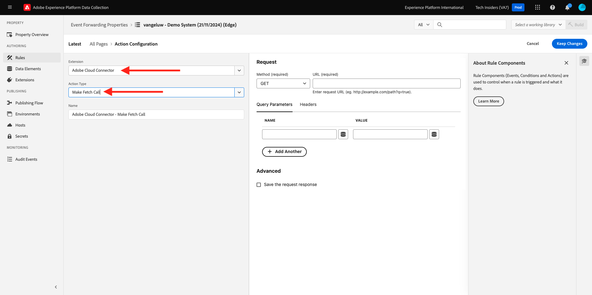
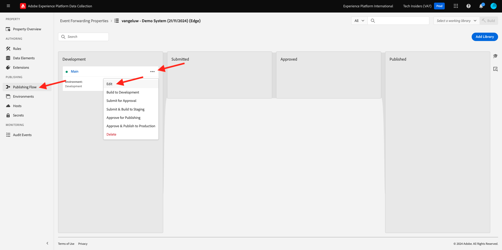

# 2.5.3建立和設定自訂webhook

## 建立您的自訂webhook

移至[https://pipedream.com/requestbin](https://pipedream.com/requestbin)。 您已在[練習2.3.7 Destinations SDK](./../../../modules/rtcdp-b2c/module2.3/ex7.md)中使用此應用程式

如果您尚未使用該服務，請建立帳戶，然後建立工作區。 建立工作區後，您會看到類似以下畫面。

按一下&#x200B;**複製**&#x200B;以複製URL。 您需要在下一個練習中指定此URL。 此範例中的URL是`https://eodts05snjmjz67.m.pipedream.net`。

此網站現在已為您建立此webhook，您將能夠在您的&#x200B;**[!DNL Event Forwarding property]**&#x200B;中設定此webhook，以開始測試事件的轉送。

## 更新您的事件轉送屬性：建立資料元素

移至[https://experience.adobe.com/#/data-collection/](https://experience.adobe.com/#/data-collection/)並移至&#x200B;**事件轉送**。 搜尋您的「事件轉送」屬性，然後按一下以開啟。

在左側功能表中，移至&#x200B;**資料元素**。 按一下&#x200B;**「建立新資料元素」**。

然後，您會看到要設定的新資料元素。

進行下列選取：

- 以&#x200B;**Name**&#x200B;的身分，輸入&#x200B;**XDM事件**。
- 選取&#x200B;**核心**&#x200B;作為&#x200B;**延伸模組**。
- 作為&#x200B;**資料元素型別**，請選取&#x200B;**路徑**。
- 作為&#x200B;**路徑**，請選取&#x200B;**從XDM (arc.event.xdm)**&#x200B;讀取資料。 選取此路徑後，您將會從網站或行動應用程式傳送至Adobe Edge的事件裝載中篩選掉&#x200B;**XDM**&#x200B;區段。

您現在已擁有此專案。 按一下&#x200B;**儲存**。

>[!NOTE]
>
>在上述路徑中，參考為&#x200B;**arc**。 **arc**&#x200B;代表Adobe資源內容，**arc**&#x200B;永遠代表伺服器端內容中可用的最高物件。 可以使用Adobe Experience Platform資料收集伺服器功能將擴充與轉換新增至該&#x200B;**arc**&#x200B;物件。
>
>在上述路徑中，參考了&#x200B;**事件**。 **event**&#x200B;代表不重複事件，Adobe Experience Platform Data Collection Server一律會個別評估每個事件。 有時您可能會在Web SDK Client Side傳送的裝載中看到&#x200B;**事件**&#x200B;的參考，但在Adobe Experience Platform Data Collection Server中，每個事件都會個別評估。

## 更新您的Adobe Experience Platform資料收集伺服器屬性：建立規則

在左側功能表中，移至&#x200B;**規則**。 按一下&#x200B;**「建立新規則」**。

然後，您會看到要設定的新規則。 輸入&#x200B;**名稱**： **所有頁面**。 在本練習中，您不需要設定條件。 相反地，您將設定動作。 按一下&#x200B;**動作**&#x200B;下的&#x200B;**+新增**&#x200B;按鈕。

您將會看到此訊息。 進行下列選取：

- 選取&#x200B;**擴充功能**： **Adobe雲端聯結器**。
- 選取&#x200B;**動作型別**： **進行擷取呼叫**。

應該會提供此&#x200B;**名稱**： **Adobe雲端聯結器 — 進行擷取呼叫**。 您現在應該會看到：

接著，設定下列專案：

- 將要求方法從GET變更為&#x200B;**POST**
- 輸入您在前一個步驟中建立的自訂webhook URL，如下所示： `https://eodts05snjmjz67.m.pipedream.net`

您現在應該擁有此專案。 接著，移至&#x200B;**內文**。

您將會看到此訊息。 按一下資料元素圖示，如下所示。

在快顯視窗中，選取您在上一步中建立的資料元素&#x200B;**XDM事件**。 按一下&#x200B;**選取**。

您將會看到此訊息。 按一下&#x200B;**保留變更**。

您將會看到此訊息。 按一下&#x200B;**儲存**。

您現在已在「事件轉送」屬性中設定第一個規則。 移至&#x200B;**發佈流程**以發佈您的變更。
按一下指示的**編輯**，開啟您的開發程式庫&#x200B;**主要**。

按一下&#x200B;**新增所有變更的資源**&#x200B;按鈕，之後您會看到您的規則和資料元素出現在此程式庫中。 接著，按一下&#x200B;**儲存並建置以供開發**。 正在部署您的變更。

幾分鐘後，您會看到部署已完成並準備好進行測試。

## 測試您的設定

移至[https://dsn.adobe.com](https://dsn.adobe.com)。 使用Adobe ID登入後，您會看到此訊息。 按一下您的網站專案上的3個點&#x200B;**...**，然後按一下&#x200B;**執行**&#x200B;以開啟它。

然後您會看到示範網站已開啟。 選取URL並將其複製到剪貼簿。

開啟新的無痕瀏覽器視窗。

貼上您在上一步中複製的示範網站URL。 接著，系統會要求您使用Adobe ID登入。

選取您的帳戶型別並完成登入程式。

接著，您會在無痕瀏覽器視窗中看到您的網站已載入。 每次練習都需要使用全新的無痕瀏覽器視窗，才能載入您的示範網站URL。

當您開啟瀏覽器開發人員檢視時，可以如下所示檢查網路要求。 使用篩選器&#x200B;**互動**&#x200B;時，您會看到Adobe Experience Platform資料收集使用者端傳送給Adobe Edge的網路要求。

如果您選取原始裝載，請移至[https://jsonformatter.org/json-pretty-print](https://jsonformatter.org/json-pretty-print)並貼上裝載。 按一下&#x200B;**縮小/美化**。 然後您會看到JSON裝載、**事件**&#x200B;物件和&#x200B;**xdm**&#x200B;物件。 在先前其中一個步驟中，當您定義資料元素時，您使用了參考&#x200B;**arc.event.xdm**，這會使您剖析出此承載的&#x200B;**xdm**&#x200B;物件。

將檢視切換為您在前面的其中一個步驟中使用的自訂webhook [https://pipedream.com/requestbin](https://pipedream.com/requestbin)。 您現在應該有與此類似的檢視，網路要求會顯示在左側功能表中。 您看到的&#x200B;**xdm**&#x200B;裝載已篩選出上方顯示的網路要求。

向下捲動承載中的位元以尋找頁面名稱，在此例中是&#x200B;**home**。

如果您現在瀏覽整個網站，您將看到此自訂webhook即時提供其他網路請求。

您現在已將Web SDK/XDM裝載的伺服器端事件轉送設定為外部自訂webhook。 在接下來的練習中，您將設定類似的方法，並將相同的資料傳送至Google Cloud Platform和AWS。

下一步： [2.5.4將事件轉送到GCP Pub/Sub](./ex4.md)

[返回模組2.5](./aep-data-collection-ssf.md)

[返回所有模組](./../../../overview.md)
