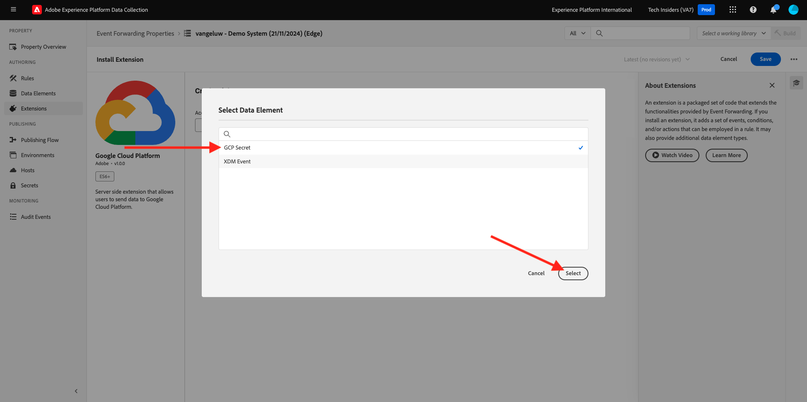
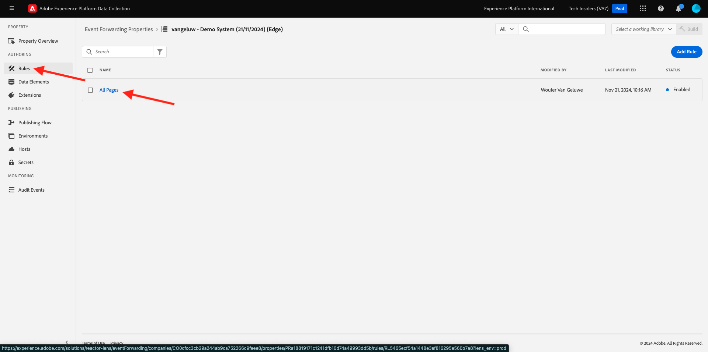
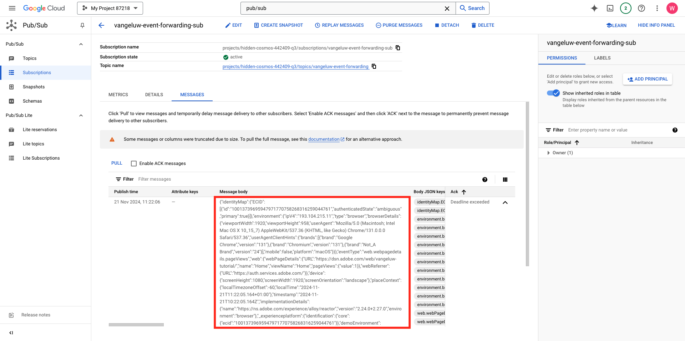

# 2.5.4將事件轉送至GCP Pub/Sub

>[!NOTE]
>
>此練習需要存取Google Cloud Platform環境。 如果您還沒有GCP的存取權，請使用您的個人電子郵件地址建立新帳戶。

## 建立您的Google Cloud Pub/Sub主題

移至[https://console.cloud.google.com/](https://console.cloud.google.com/)。 在搜尋列中輸入`pub/sub`。 按一下搜尋結果&#x200B;**Pub/Sub — 全域即時訊息**。

您將會看到此訊息。 按一下&#x200B;**建立主題**。

您將會看到此訊息。 對於您的主題識別碼，請使用`--aepUserLdap---event-forwarding`。 按一下&#x200B;**建立**。

您的主題現已建立。 按一下主題的&#x200B;**訂閱識別碼**。

您將會看到此訊息。 將&#x200B;**主題名稱**&#x200B;複製到剪貼簿並儲存，因為您會在下一個練習中需要它。

現在請移至Adobe Experience Platform Data Collection Event Forwarding ，更新您的Event Forwarding屬性，開始將事件轉送至Pub/Sub。

## 更新您的事件轉送屬性：密碼

事件轉送屬性中的&#x200B;**密碼**&#x200B;用於儲存認證，以針對外部API進行驗證。在此範例中，您需要設定用來儲存Google Cloud Platform OAuth權杖的密碼，當使用Pub/Sub將資料串流到GCP時，將使用該權杖進行驗證。

移至[https://experience.adobe.com/#/data-collection/](https://experience.adobe.com/#/data-collection/)並移至&#x200B;**秘密**。 按一下&#x200B;**建立新密碼**。

您將會看到此訊息。 請遵循下列指示：

- 名稱：使用`--aepUserLdap---gcp-secret`
- 目標環境：選取&#x200B;**開發**
- 型別： **Google OAuth 2**
- 核取&#x200B;**Pub/Sub**&#x200B;的核取方塊

按一下&#x200B;**建立密碼**。

按一下&#x200B;**建立密碼**&#x200B;後，您會看到快顯視窗，可設定事件轉送屬性的密碼與Google之間的驗證。 按一下&#x200B;**使用Google**&#x200B;建立並授權密碼`--aepUserLdap---gcp-secret`。

按一下以選取您的Google帳戶。

按一下&#x200B;**繼續**。

>[!NOTE]
>
>您的快顯訊息可能會有所不同。 請授權/允許請求的存取以繼續練習。

成功驗證後，您將會看到此訊息。

您的秘密現在已成功設定，並可用於資料元素。

## 更新您的事件轉送屬性：資料元素

若要在「事件轉送」屬性中使用您的密碼，您必須建立資料元素，以儲存密碼的值。

移至[https://experience.adobe.com/#/data-collection/](https://experience.adobe.com/#/data-collection/)並移至&#x200B;**事件轉送**。 搜尋您的「事件轉送」屬性，然後按一下以開啟。

在左側功能表中，移至&#x200B;**資料元素**。 按一下&#x200B;**新增資料元素**。

設定您的資料元素，如下所示：

- 名稱： **GCP密碼**
- 副檔名： **核心**
- 資料元素型別： **密碼**
- 開發密碼：選取您建立的密碼，名為`--aepUserLdap---gcp-secret`

按一下&#x200B;**儲存**

## 更新您的事件轉送屬性：擴充功能

設定好「機密」和「資料元素」後，您現在可以在「事件轉送」屬性中設定Google Cloud Platform的擴充功能。

前往[https://experience.adobe.com/#/data-collection/](https://experience.adobe.com/#/data-collection/)，前往&#x200B;**事件轉送**，並開啟您的事件轉送屬性。

接下來，移至&#x200B;**擴充功能**，移至&#x200B;**目錄**。 按一下&#x200B;**Google Cloud Platform**&#x200B;擴充功能，然後按一下&#x200B;**安裝**。

您將會看到此訊息。 按一下資料元素圖示。

選取您在上一個練習中建立的資料元素，其名稱為&#x200B;**GCP密碼**。 按一下&#x200B;**選取**。

您將會看到此訊息。 按一下&#x200B;**儲存**。

## 更新您的事件轉送屬性：更新規則

現在您的Google Cloud Platform擴充功能已設定完畢，您可以定義規則，以開始將事件資料轉送至您的Pub/Sub主題。 若要這麼做，您必須更新您在前一個練習中建立的&#x200B;**所有頁面**&#x200B;規則。

在左側功能表中，移至&#x200B;**規則**。 在上一個練習中，您已建立規則&#x200B;**所有頁面**。 按一下該規則以開啟。

到時您會看到這個。 按一下「**動作**」下的「**+**」圖示以新增動作。

您將會看到此訊息。 進行下列選取：

- 選取&#x200B;**擴充功能**： **Google Cloud Platform**。
- 選取&#x200B;**動作型別**： **將資料傳送至Cloud Pub/Sub**。

這應該會提供您&#x200B;**名稱**： **Google Cloud Platform — 傳送資料至Cloud Pub/Sub**。 您現在應該會看到：

您現在需要設定您先前建立的Pub/Sub主題。

您可以在這裡找到&#x200B;**主題名稱**，複製它。

在規則設定中貼上&#x200B;**主題名稱**。 接著，按一下&#x200B;**資料（必要）**&#x200B;欄位旁的「資料元素」圖示。

選取&#x200B;**XDM事件**&#x200B;並按一下&#x200B;**選取**。

您將會看到此訊息。 按一下&#x200B;**保留變更**。

按一下&#x200B;**儲存**。

您將會看到此訊息。

## Publish您的變更

您的設定現已完成。 移至&#x200B;**發佈流程**&#x200B;以發佈您的變更。 按一下指示的&#x200B;**編輯**，開啟您的開發程式庫&#x200B;**主要**。

按一下&#x200B;**新增所有變更的資源**&#x200B;按鈕，之後您會看到您的規則和資料元素出現在此程式庫中。 接著，按一下&#x200B;**儲存並建置以供開發**。 正在部署您的變更。

幾分鐘後，您會看到部署已完成並準備好進行測試。

## 測試您的設定

移至[https://dsn.adobe.com](https://dsn.adobe.com)。 使用Adobe ID登入後，您會看到此訊息。 按一下您的網站專案上的3個點&#x200B;**...**，然後按一下&#x200B;**執行**&#x200B;以開啟它。

然後您會看到示範網站已開啟。 選取URL並將其複製到剪貼簿。

開啟新的無痕瀏覽器視窗。

貼上您在上一步中複製的示範網站URL。 接著，系統會要求您使用Adobe ID登入。

選取您的帳戶型別並完成登入程式。

接著，您會在無痕瀏覽器視窗中看到您的網站已載入。 每次練習都需要使用全新的無痕瀏覽器視窗，才能載入您的示範網站URL。

將檢視切換至您的Google Cloud Pub/Sub並移至&#x200B;**訊息**。 按一下&#x200B;**提取**，幾秒鐘後，您會在清單中看到一些訊息。 按一下訊息將其內容視覺化。

您現在可以在Google Pub/Sub中檢視事件的XDM裝載。 您現在已成功將Adobe Experience Platform資料收集收集的資料即時傳送至Google雲端公用/訂閱端點。 從該位置，該資料可供任何Google雲端平台應用程式使用，例如用於儲存和報表或機器學習使用案例的BigQuery。

下一步： [2.5.5將事件轉送至AWS Kinesis和AWS S3](./ex5.md)

[返回模組2.5](./aep-data-collection-ssf.md)

[返回所有模組](./../../../overview.md)
