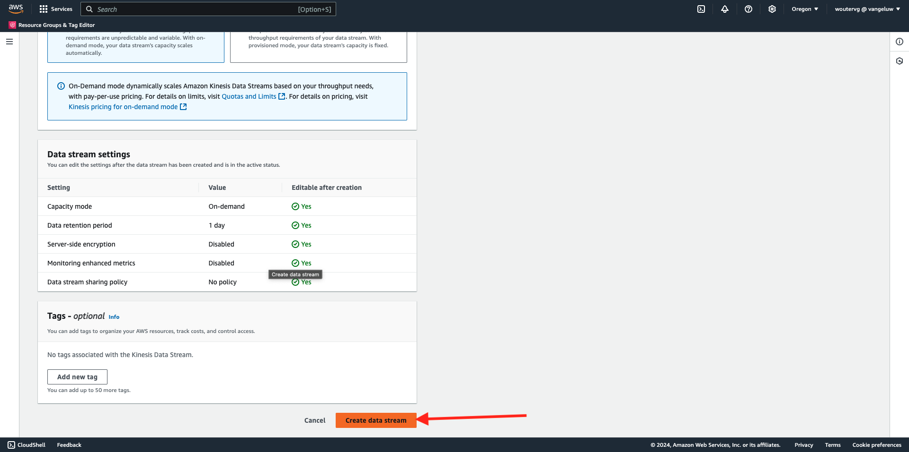
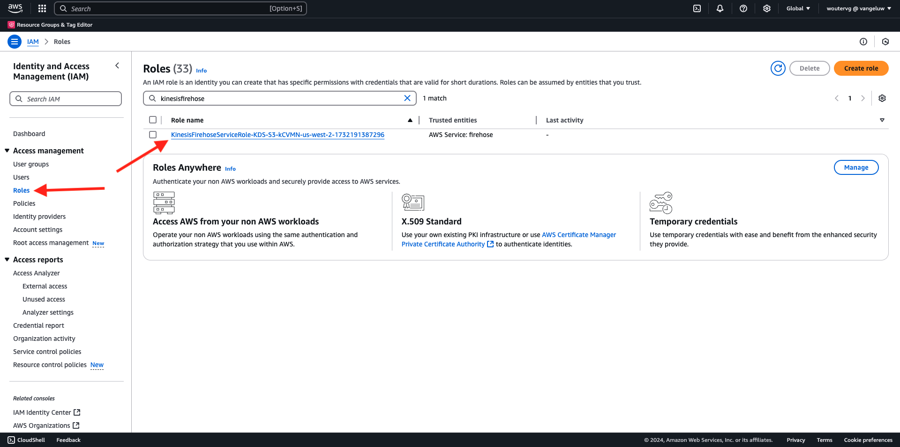
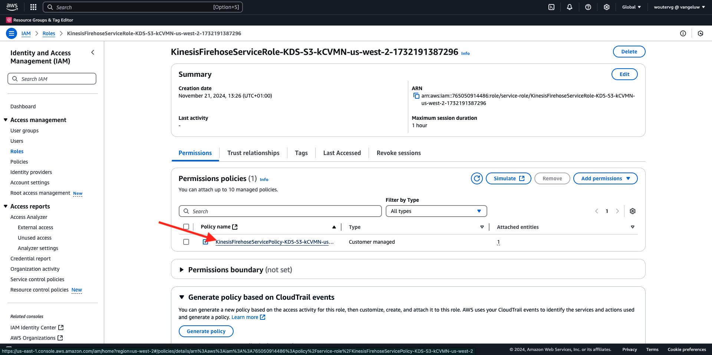

# 2.5.5前往AWS生態系統推進事件

>[!IMPORTANT]
>
>您可以選擇是否完成本練習，使用AWS Kinesis時需支付相關費用。 雖然AWS提供免費套餐帳戶，可讓您免費測試及設定許多服務，但AWS Kinesis不屬於該免費套餐帳戶。 因此，為了實作和測試此練習，使用AWS Kinesis需要支付相關費用。

## 很高興知道

Adobe Experience Platform支援以各種Amazon服務作為目的地。
Kinesis和S3都是[設定檔匯出目的地](https://experienceleague.adobe.com/docs/experience-platform/destinations/destination-types.html?lang=en)，可當作Adobe Experience PlatformReal-Time CDP的一部分使用。
您可以輕鬆地將高價值區段事件和相關設定檔屬性饋送至您選擇的系統。

在此附註中，您將瞭解如何設定自己的Amazon Kinesis串流，以將來自Adobe Experience Platform Edge生態系統的事件資料串流到雲端儲存空間目的地，例如Amazon S3。 如果您想要從Web和行動屬性收集體驗事件，並將它們推送至您的資料集，以便進行分析和作業報告，這個用法很有用。 資料層級通常會在每日匯入大量檔案時，以批次方式擷取資料，不會公開公開http端點（可搭配事件轉送使用）。

支援上述使用案例表示串流資料在寫入檔案之前需要緩衝或放置在佇列中。 必須注意不要開啟檔案以供多個處理序的寫入存取。 將這項工作委派給專屬系統，是理想的擴充方式，同時可確保提供高水準的服務，Kinesis可藉此解決問題。

Amazon Kinesis Data Streams著重於擷取及儲存資料串流。 Kinesis Data Firehose著重於將資料串流傳送至特定目的地，例如S3貯體。

在本練習中，您將……

- 執行Kinesis資料串流的基本設定
- 建立Firehose傳遞串流並使用S3貯體作為目的地
- 將Amazon API閘道設定為Rest API端點，以接收您的事件資料
- 將原始事件資料從Adobe的Edge轉送至您的Kinesis資料流

## 2.5.5.1設定您的AWS S3貯體

移至[https://console.aws.amazon.com](https://console.aws.amazon.com)，並使用您先前建立的Amazon帳戶登入。


登入後，系統會將您重新導向至&#x200B;**AWS管理主控台**。


在&#x200B;**尋找服務**&#x200B;功能表中，搜尋&#x200B;**s3**。 按一下第一個搜尋結果： **S3 — 雲端中的可擴充儲存空間**。


然後您會看到&#x200B;**Amazon S3**&#x200B;首頁。 按一下&#x200B;**建立貯體**。


在&#x200B;**建立Bucket**&#x200B;畫面中，您需要設定兩個專案：

- 名稱：使用名稱`eventforwarding---demoProfileLdap--`。 例如，在本練習中，儲存貯體名稱為&#x200B;**aepmodulertcdpvangeluw**
- 地區：使用地區&#x200B;**EU (Frankfurt) eu-central-1**


保留所有其他預設設定。 向下捲動並按一下&#x200B;**建立貯體**。


接著，您會看到儲存貯體已建立，且系統會將您重新導向至Amazon S3首頁。


## 2.5.5.2設定您的AWS Kinesis資料串流

在&#x200B;**尋找服務**&#x200B;功能表中，搜尋&#x200B;**kinesis**。 按一下第一個搜尋結果： **Kinesis — 使用即時串流資料**。


選取&#x200B;**Kinesis資料串流**。 按一下&#x200B;**建立資料流**。


對於&#x200B;**資料流名稱**，請使用`--demoProfileLdap---datastream`。


不需要變更任何其他設定。 向下捲動並按一下&#x200B;**建立資料流**。



您將會看到此訊息。 一旦您的資料流成功建立，您就可以繼續進行下一個練習。


## 2.5.5.3設定AWS Firehose傳遞資料流

在&#x200B;**尋找服務**&#x200B;功能表中，搜尋&#x200B;**kinesis**。 按一下&#x200B;**Kinesis Data Firehose**。


按一下&#x200B;**建立傳遞資料流**。


針對&#x200B;**Source**，選取&#x200B;**Amazon Kinesis資料串流**。 針對&#x200B;**目的地**，選取&#x200B;**Amazon S3**。 按一下&#x200B;**瀏覽**&#x200B;以選取您的資料流。


選取您的資料流。 按一下&#x200B;**選擇**。


您將會看到此訊息。 記住&#x200B;**傳遞資料流名稱**，因為您稍後會需要它。


向下捲動，直到您看到&#x200B;**目的地設定**&#x200B;為止。 按一下&#x200B;**瀏覽**&#x200B;以選取您的S3儲存貯體。


選取您的S3儲存貯體，然後按一下&#x200B;**選擇**。


您將會看到類似這樣的內容。 更新下列設定：

- 動態分割：設定為&#x200B;**已啟用**
- 多重記錄解聚：設定為&#x200B;**已停用**
- 新的行分隔符號：設定為&#x200B;**已啟用**
- JSON的內嵌剖析：設定為&#x200B;**已啟用**


向下捲動一點，您會看到這個畫面。 更新下列設定：

- 動態分割槽索引鍵
   - 索引鍵名稱： **dynamicPartitioningKey**
   - JQ運算式： **.dynamicPartitioningKey**
- S3儲存貯體前置詞：新增下列程式碼：

```bash
!{partitionKeyFromQuery:dynamicPartitioningKey}/!{timestamp:yyyy}/!{timestamp:MM}/!{timestamp:dd}/!{timestamp:HH}/}
```

- S3儲存貯體錯誤輸出首碼：設為&#x200B;**錯誤**


最後，再向下捲動一點，然後按一下&#x200B;**建立傳遞資料流**


幾分鐘後，將建立您的傳遞資料流，並&#x200B;**啟用**。


## 2.5.5.4設定您的AWS IAM角色

在&#x200B;**尋找服務**&#x200B;功能表中，搜尋&#x200B;**iam**。 按一下&#x200B;**API閘道**。


按一下&#x200B;**角色**。



搜尋您的&#x200B;**KinesisFirehose**&#x200B;角色。 按一下以開啟。


按一下您的許可權原則名稱以開啟。



在開啟的新畫面中，按一下&#x200B;**編輯原則**。


在&#x200B;**Kinesis** - **動作**&#x200B;底下，確定&#x200B;**PutRecord**&#x200B;的&#x200B;**寫入**&#x200B;許可權已啟用。 按一下&#x200B;**檢閱原則**。


按一下&#x200B;**儲存變更**。


然後您就會回到這裡。 按一下&#x200B;**角色**。


搜尋您的&#x200B;**KinesisFirehose**&#x200B;角色。 按一下以開啟。


移至&#x200B;**信任關係**&#x200B;並按一下&#x200B;**編輯信任原則**。


貼上此程式碼以取代現有的程式碼，以覆寫目前的信任原則：

```json
{
	"Version": "2012-10-17",
	"Statement": [
		{
			"Effect": "Allow",
			"Principal": {
				"Service": [
                    "firehose.amazonaws.com",
                    "kinesis.amazonaws.com",
                    "apigateway.amazonaws.com"
                ]
			},
			"Action": "sts:AssumeRole"
		}
	]
}
```

按一下&#x200B;**更新原則**


您將會看到此訊息。 在下一步中，您需要為此角色指定&#x200B;**ARN**。


## 2.5.5.5設定AWS API閘道

Amazon API Gateway是一項AWS服務，可建立、發佈、維護、監控及保護REST、HTTP和WebSocket API，規模不限。 API開發人員可建立可存取AWS或其他網站服務的API，以及儲存在AWS Cloud中的資料。

您現在會透過HTTPS端點，將Kinesis資料串流公開至網際網路，該端點可供Adobe服務（例如事件轉送）直接使用。

在&#x200B;**尋找服務**&#x200B;功能表中，搜尋&#x200B;**api閘道**。 按一下&#x200B;**API閘道**。


您將會看到類似這樣的內容。 按一下&#x200B;**建立API**。


在&#x200B;**REST API**&#x200B;卡片上按一下&#x200B;**建置**。


您將會看到此訊息。 填寫如下的設定：

- 選擇通訊協定：選取&#x200B;**REST**
- 建立新API：選取&#x200B;**新API**
- 設定：
   - API名稱：使用`--demoProfileLdap---eventforwarding`
   - 端點型別：選取&#x200B;**區域**

按一下&#x200B;**建立API**。


您將會看到此訊息。 按一下&#x200B;**動作**，然後按一下&#x200B;**建立資源**。


您將會看到此訊息。 將&#x200B;**資源名稱**&#x200B;設定為&#x200B;**資料流**。 按一下&#x200B;**建立資源**。


您將會看到此訊息。 按一下&#x200B;**動作**，然後按一下&#x200B;**建立方法**。


在下拉式清單中，選取&#x200B;**POST**&#x200B;並按一下&#x200B;**v**&#x200B;按鈕。


您將會看到此訊息。 填寫如下的設定：

- 整合型別： **AWS服務**
- AWS地區：選取您的Kinesis資料串流所使用的地區，此案例中為： **us-west-2**
- AWS服務：選取&#x200B;**Kinesis**
- AWS子網域：留空
- HTTP方法：選取&#x200B;**POST**
- 動作型別：選取&#x200B;**使用動作名稱**
- 動作：輸入&#x200B;**PutRecord**
- 執行角色：依照先前練習的指示，貼上Kinesis Data Firehose所使用的執行角色的&#x200B;**ARN**
- 內容處理：選取&#x200B;**通過**
- 使用預設逾時：啟用核取方塊

按一下&#x200B;**儲存**。


您將會看到此訊息。 按一下&#x200B;**整合要求**。


按一下&#x200B;**HTTP標頭**。


向下捲動一點並按一下&#x200B;**新增標題**。


將&#x200B;**Name**&#x200B;設定為&#x200B;**Content-Type**，將&#x200B;**Mapped from**&#x200B;對應至`'application/x-amz-json-1.1'`。 按一下&#x200B;**v**&#x200B;圖示以儲存變更。


您將會看到此訊息。 對於&#x200B;**要求內文傳遞**，請選取&#x200B;**當沒有已定義的範本（建議）**。 接著，按一下&#x200B;**新增對應範本**。


在&#x200B;**Content-Type**&#x200B;下，輸入&#x200B;**application/json**。 按一下&#x200B;**v**&#x200B;圖示以儲存變更。


向下捲動以尋找程式碼編輯器視窗。 將下列程式碼貼入其中：

```json
{
  "StreamName": "$input.path('StreamName')",
  "Data": "$util.base64Encode($input.json('$.Data'))",
  "PartitionKey": "$input.path('$.PartitionKey')"
}
```

按一下&#x200B;**儲存**。


接著，向上捲動並按一下&#x200B;**&lt; — 方法執行**&#x200B;以返回。


按一下&#x200B;**測試**。


向下捲動，並將此程式碼貼到&#x200B;**要求內文**&#x200B;下。 按一下&#x200B;**測試**。

```json
{
  "Data": {
    "message": "Hello World",
    "dynamicPartitioningKey": "v2"
  },
  "PartitionKey": "1",
  "StreamName": "--demoProfileLdap---datastream"
}
```


然後您會看到類似的結果：


您將會看到此訊息。 按一下&#x200B;**動作**，然後按一下&#x200B;**部署API**。


針對&#x200B;**部署階段**，請選取&#x200B;**新增階段**。 作為&#x200B;**階段名稱**，請輸入&#x200B;**prod**。 按一下&#x200B;**部署**。


您將會看到此訊息。 按一下&#x200B;**儲存變更**。 參考資訊：影像中的URL是用來將資料傳送至的URL (在此範例中： https://vv1i5vwg2k.execute-api.us-west-2.amazonaws.com/prod)。


您可以使用以下cURL要求來測試您的設定，您只需要將以下URL取代為您的即可，在此範例中為`https://vv1i5vwg2k.execute-api.us-west-2.amazonaws.com/prod`，並在URL結尾新增`/stream`。

```json
curl --location --request POST 'https://vv1i5vwg2k.execute-api.us-west-2.amazonaws.com/prod/stream' \
--header 'Content-Type: application/json' \
--data-raw '{
    "Data": {
        "userid": "--demoProfileLdap--@adobe.com",
        "firstName":"--demoProfileLdap--",
        "offerName":"10% off on outdoor gears",
        "offerCode": "10OFF-SPRING",
        "dynamicPartitioningKey": "campaign"
    },
    "PartitionKey": "1",
    "StreamName": "--demoProfileLdap---datastream"
}'
```

將以上更新的程式碼貼到「終端機」視窗中，然後按Enter鍵。 然後您會看到此回應，類似於上述測試時看到的回應。


## 2.5.5.6更新您的事件轉送屬性

您現在可以透過AWS API Gateway啟用您的AWS Kinesis資料串流，這樣您就可以將原始體驗事件傳送到AWS生態系統。 使用Real-Time CDP連線和事件轉送，您現在可以輕鬆啟用事件轉送至您新建立的AWS API閘道端點。

### 2.5.5.6.1更新您的事件轉送屬性：建立資料元素

移至[https://experience.adobe.com/#/data-collection/](https://experience.adobe.com/#/data-collection/)並移至&#x200B;**事件轉送**。 搜尋您的「事件轉送」屬性，然後按一下以開啟。


在左側功能表中，移至&#x200B;**資料元素**。 按一下&#x200B;**新增資料元素**。


然後，您會看到要設定的新資料元素。


進行下列選取：

- 作為&#x200B;**Name**，請輸入&#x200B;**awsDataObject**。
- 選取&#x200B;**核心**&#x200B;作為&#x200B;**延伸模組**。
- 以&#x200B;**資料元素型別**，請選取&#x200B;**自訂程式碼**。

您現在已擁有此專案。 按一下&#x200B;**&lt;/>開啟編輯器**。


在編輯器中，將下列程式碼貼到第3行。 按一下&#x200B;**儲存**。

```javascript
const newObj = {...arc.event.xdm, dynamicPartitioningKey: "event_forwarding"}
return JSON.stringify(newObj);
```


>[!NOTE]
>
>在上述路徑中，參考為&#x200B;**arc**。 **arc**&#x200B;代表Adobe資源內容，**arc**&#x200B;永遠代表伺服器端內容中可用的最高物件。 可以使用Adobe Experience Platform資料收集伺服器功能將擴充與轉換新增至該&#x200B;**arc**&#x200B;物件。
>
>在上述路徑中，參考了&#x200B;**事件**。 **event**&#x200B;代表不重複事件，Adobe Experience Platform Data Collection Server一律會個別評估每個事件。 有時您可能會在Web SDK Client Side傳送的裝載中看到&#x200B;**事件**&#x200B;的參考，但在Adobe Experience Platform資料收集事件轉送中，每個事件都會個別評估。

然後您就會回到這裡。 按一下&#x200B;**儲存**&#x200B;或&#x200B;**儲存至資料庫**。


### 2.5.5.6.2更新您的Adobe Experience Platform資料收集伺服器屬性：更新您的規則

在左側功能表中，移至&#x200B;**規則**。 按一下以開啟您在前一個練習中所建立的規則&#x200B;**所有頁面**。


您將會看到此訊息。 按一下&#x200B;**+**&#x200B;圖示以新增動作。


您將會看到此訊息。 進行下列選取：

- 選取&#x200B;**擴充功能**： **Adobe雲端聯結器**。
- 選取&#x200B;**動作型別**： **進行擷取呼叫**。

應該會提供此&#x200B;**名稱**： **Adobe雲端聯結器 — 進行擷取呼叫**。 您現在應該會看到：


接著，設定下列專案：

- 將要求方法從GET變更為&#x200B;**POST**
- 輸入您在前一個步驟中建立的AWS API閘道端點的URL，如下所示： `https://vv1i5vwg2k.execute-api.us-west-2.amazonaws.com/prod/stream`

您現在應該擁有此專案。 接著，移至&#x200B;**標頭**。


在標題底下，新增索引鍵為&#x200B;**Content-Type**&#x200B;且值為&#x200B;**application/json**&#x200B;的新標題。 接著，移至&#x200B;**內文**。


您將會看到此訊息。 將下列程式碼貼到欄位&#x200B;**內文（原始）**&#x200B;中。 按一下&#x200B;**保留變更**。

```json
{
    "Data":{{awsDataObject}},
    "PartitionKey": "1",
    "StreamName": "--demoProfileLdap---datastream"
}
```


然後您會看到回到這裡。 按一下&#x200B;**儲存**&#x200B;或&#x200B;**儲存至資料庫**。


您現在已在「事件轉送」屬性中設定第一個規則。 移至&#x200B;**發佈流程**以發佈您的變更。
按一下**主要**&#x200B;開啟您的開發程式庫。


按一下&#x200B;**新增所有變更的資源**&#x200B;按鈕，之後您會看到此程式庫中出現了規則和資料元素的變更。 接著，按一下&#x200B;**儲存並建置以供開發**。 正在部署您的變更。


幾分鐘後，您會看到部署已完成並準備好進行測試。


## 2.5.5.7測試您的設定

移至[https://builder.adobedemo.com/projects](https://builder.adobedemo.com/projects)。 使用Adobe ID登入後，您會看到此訊息。 按一下您的網站專案以開啟。


您現在可以依照以下流程存取網站。 按一下&#x200B;**整合**。


在&#x200B;**整合**&#x200B;頁面上，您必須選取在練習0.1中建立的資料收集屬性。


然後您會看到示範網站已開啟。 選取URL並將其複製到剪貼簿。


開啟新的無痕瀏覽器視窗。


貼上您在上一步中複製的示範網站URL。 接著，系統會要求您使用Adobe ID登入。


選取您的帳戶型別並完成登入程式。


接著，您會在無痕瀏覽器視窗中看到您的網站已載入。 對於每個示範，您都需要使用全新的無痕瀏覽器視窗來載入您的示範網站URL。


當您開啟瀏覽器開發人員檢視時，可以如下所示檢查網路要求。 使用篩選器&#x200B;**互動**&#x200B;時，您會看到Adobe Experience Platform資料收集使用者端傳送給Adobe Edge的網路要求。


如果您選取原始裝載，請移至[https://jsonformatter.org/json-pretty-print](https://jsonformatter.org/json-pretty-print)並貼上裝載。 按一下&#x200B;**美化**。 然後您會看到JSON裝載、**事件**&#x200B;物件和&#x200B;**xdm**&#x200B;物件。 在先前其中一個步驟中，當您定義資料元素時，您使用了參考&#x200B;**arc.event.xdm**，這會使您剖析出此承載的&#x200B;**xdm**&#x200B;物件。


將檢視切換至&#x200B;**AWS**。 開啟您的資料串流並進入&#x200B;**監視**&#x200B;標籤，您現在會看到傳入的流量。


當您開啟傳遞串流並進入&#x200B;**監視**&#x200B;標籤時，您也會看到傳入的流量。


最後，檢視S3儲存貯體時，您現在會發現其中已因資料擷取而建立檔案。


當您下載這類檔案並使用文字編輯器開啟時，您會看到它包含來自轉送事件的XDM裝載。


下一步： [摘要與優點](./summary.md)

[返回模組2.5](./aep-data-collection-ssf.md)

[返回所有模組](./../../../overview.md)
