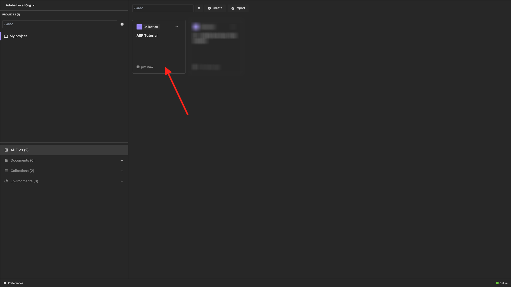

# PostBuster

>[!IMPORTANT]
>
>以下指示僅適用於Adobe員工。

>[!IMPORTANT]
>
>依照下列指示，您將擁有這些練習中將會使用的所有必要API集合：
>
>- [2.1.3將您自己的即時客戶設定檔視覺化 — API](./modules/rtcdp-b2c/module2.1/ex3.md)
>- [2.3.6目的地SDK](./modules/rtcdp-b2c/module2.3/ex6.md)
>- [3.3.6使用API測試您的決定](./modules/ajo-b2c/module3.3/ex6.md)
>- [5.1.8查詢服務API](./modules/datadistiller/module5.1/ex8.md)

## 安裝PostBuster

移至[https://adobe.service-now.com/esc?id=adb_esc_kb_article&sysparm_article=KB0020542](https://adobe.service-now.com/esc?id=adb_esc_kb_article&sysparm_article=KB0020542)。

按一下以下載&#x200B;**PostBuster**&#x200B;的最新版本。


下載作業系統的正確版本。


下載完成並安裝後，請開啟PostBuster。 您應該會看到此訊息。 按一下&#x200B;**匯入**。


下載[postbuster.json.zip](./assets/postman/postbuster.json.zip)並在您的案頭上解壓縮。


按一下&#x200B;**選擇檔案**。


選取檔案&#x200B;**aep_tutorial.json**。 按一下&#x200B;**「開啟」**。


您應該會看到此訊息。 按一下&#x200B;**掃描**。


按一下&#x200B;**匯入**。


您應該會看到此訊息。 按一下以開啟匯入的集合。



現在您可以看到您的集合。 您仍需要設定環境以保留一些環境變數。


按一下「**基本環境**」，然後按一下「**編輯**」圖示。


您應該會看到此訊息。


複製下列環境預留位置，並將其貼到&#x200B;**基本環境**&#x200B;中。

```json
{
	"CLIENT_SECRET": "",
	"API_KEY": "",
	"ACCESS_TOKEN": "",
	"SCOPES": [
		"openid",
		"AdobeID",
		"read_organizations",
		"additional_info.projectedProductContext",
		"session",
		"ff_apis",
		"firefly_api"
	],
	"TECHNICAL_ACCOUNT_ID": "",
	"IMS": "ims-na1.adobelogin.com",
	"IMS_ORG": "",
	"access_token": "",
	"IMS_TOKEN": "",
	"QS_QUERY_ID": "",
	"SANDBOX_NAME": ""
}
```

然後您應該擁有此專案。


建立AdobeIO專案後，您的環境應如下所示。 您現在不需要執行此動作，我們將在稍後階段解決此問題。


>[!NOTE]
>
>{width="50px" align="left"}
>
>如果您有任何問題，想要分享對未來內容有建議的一般意見回饋，請傳送電子郵件至&#x200B;**techinsiders@adobe.com**，直接連絡技術業內人士。

[返回所有模組](./overview.md)
