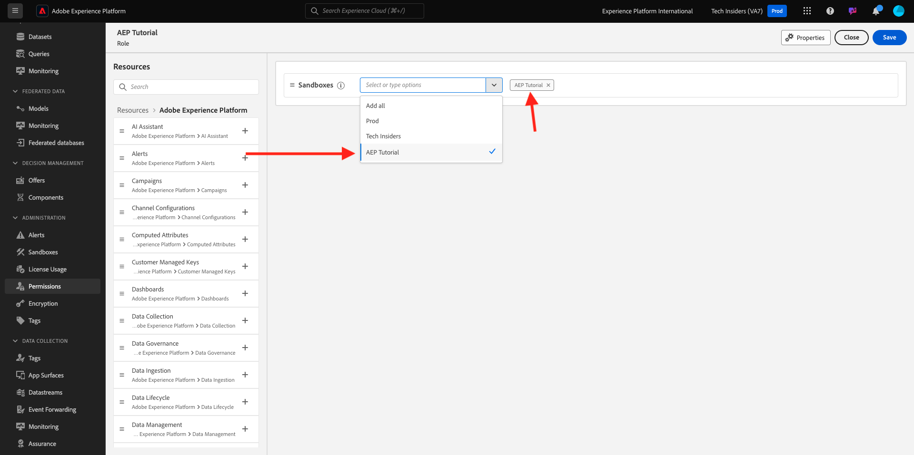

# 設定您的Adobe Experience Platform執行個體

>[!IMPORTANT]
>
>此頁面僅供系統管理員角色使用。 您需要特定執行個體的系統管理員存取許可權，才能遵循以下步驟。 如果您不是Adobe Experience Cloud組織中的系統管理員，請在繼續執行以下任何步驟之前，聯絡您的系統管理員並尋求其核准和協助。

## 概觀

若要以實作方式學習上述所有教學課程，您需要在IMS組織中布建下列Adobe Experience Cloud應用程式：

- AdobeReal-time CDP
- Adobe Experience Platform 資料彙集
- Adobe Journey Optimizer
- Customer Journey Analytics
- 資料蒸餾器
- 聯合客群構成

如果您的IMS組織未布建特定應用程式服務，則您將無法親自進行該特定練習。

## 建立沙箱

若要在自己的Adobe Experience Platform執行個體中完成教學課程，建議您先設定新的開發沙箱。 若要建立新沙箱，請移至[https://experience.adobe.com/platform](https://experience.adobe.com/platform)，移至[沙箱]，然後移至&#x200B;**瀏覽**。 按一下&#x200B;**建立沙箱**。

建立您的沙箱，如下所示：

- 型別： **開發**
- 名稱： **aep-tutorial**
- 標題： **Adobe Experience Platform教學課程**

按一下&#x200B;**建立**。

現在將建立您的沙箱。 幾分鐘後，您將會看到此內容。

## 設定許可權

移至&#x200B;**許可權**，然後移至&#x200B;**角色**。

按一下以開啟將由將完成本教學課程的學習者使用的特定&#x200B;**角色**。 按一下&#x200B;**建立角色**。

提供角色名稱，例如&#x200B;**Adobe Experience Platform教學課程**，按一下&#x200B;**確認**。

在&#x200B;**沙箱**&#x200B;下拉式功能表中，選取您剛才建立的沙箱，並確定要移除任何其他沙箱（也請移除&#x200B;**Prod**）。

新增各種資源並設定許可權。 請確定不要為&#x200B;**沙箱管理**&#x200B;新增任何許可權。

依照指示新增更多資源並設定許可權。

依照指示新增更多資源並設定許可權。 按一下&#x200B;**「儲存」**。然後，按一下&#x200B;**關閉**。

## 設定Adobe I/O

前往
[https://developer.adobe.com/console/integrations](https://developer.adobe.com/console/integrations)。 確定您處於正確的執行個體。 按一下&#x200B;**建立新專案**。

按一下&#x200B;**新增至專案**，然後按一下&#x200B;**API**。

按一下&#x200B;**Adobe Experience Platform**，然後啟用&#x200B;**Experience PlatformAPI**。 按一下&#x200B;**下一步**。

對於&#x200B;**認證名稱**，請使用&#x200B;**DSN AEP教學課程**。 按一下&#x200B;**下一步**。

選取其中一個可用的產品設定檔。 此產品設定檔不會決定此Adobe I/O專案的許可權，這將在下一個步驟中完成。 按一下&#x200B;**儲存設定的API**。

按一下&#x200B;**新增至專案**，然後再次按一下&#x200B;**API**。

按一下&#x200B;**Adobe Experience Platform**，然後啟用&#x200B;**Experience Platform LaunchAPI**。 按一下&#x200B;**下一步**。

按一下&#x200B;**下一步**。

選取可讓您建立和管理資料收集屬性的產品設定檔。 按一下&#x200B;**儲存設定的API**。

您將會看到此訊息。 按一下目前的&#x200B;**專案XXX**&#x200B;名稱。

按一下&#x200B;**編輯專案**。

輸入新的&#x200B;**專案標題**，例如&#x200B;**DSN Adobe Experience Platform教學課程**。 按一下&#x200B;**儲存**。

您的Adobe I/O專案現已準備就緒。

## 將Adobe I/O專案連結至角色

移至&#x200B;**許可權**、**角色**，然後按一下您先前建立的新角色。

移至&#x200B;**API認證**。 按一下&#x200B;**+新增API認證**。

接著，您會看到在上一步中建立的Adobe I/O認證。 選取並按一下&#x200B;**儲存**。

您的Adobe I/O專案現在已設定為具有存取Adobe Experience Platform API的必要許可權。

>[!IMPORTANT]
>
>您必須至少等待10分鐘，才能繼續示範系統下一步中的後續步驟。

## 在示範系統中設定您的環境下一步

移至[https://dsn.adobe.com/tools/org-admin](https://dsn.adobe.com/tools/org-admin)。 按一下&#x200B;**+新增組織**。

填寫必填欄位：

- IMS 組織 ID
- 名稱
- 租使用者ID （不包含任何&#x200B;**底線**）
- 區域

您的系統管理員應該能夠幫助您處理這些欄位的值。

按一下&#x200B;**儲存**。

您的環境現在將成為清單的一部分。 在清單中找到該專案，然後按一下&#x200B;**連結**&#x200B;圖示。

您現在需要輸入您建立作為Adobe I/O專案憑證一部分的值。 您可以在這裡找到&#x200B;**使用者端識別碼**、**使用者端密碼**&#x200B;和&#x200B;**領域**：

**技術帳戶ID**：

請複製並貼上這些檔案，按一下&#x200B;**儲存**。

您的DSN環境現在已正確設定。

## 設定您對DSN環境的存取權

移至[https://dsn.adobe.com/tools/environment-admin](https://dsn.adobe.com/tools/environment-admin)。 選取您剛建立的IMS組織、選取您的使用者，然後按一下「**沙箱**」下的「**+指派**」。

輸入您在上面的第一個步驟中定義的&#x200B;**沙箱名稱**。 它應如下所示：

- 名稱： **aep-tutorial**

按一下「**確認**」。

您的沙箱現在可供您選取的使用者使用。

## DSN快速設定

移至[https://dsn.adobe.com/quick-setup](https://dsn.adobe.com/quick-setup)。 開啟「**環境**」下拉式功能表，然後選取您的IMS組織/沙箱。

針對&#x200B;**組態**，選取&#x200B;**全域v2.0**。

向下捲動至&#x200B;**Industry - Telco**&#x200B;並選取&#x200B;**Citi Signal - Advanced**。

向上捲動並按一下&#x200B;**開始**。

輸入&#x200B;**標題**&#x200B;並按一下&#x200B;**開始**。

>[!NOTE]
>
>如果未在沙箱中建立預設合併原則，您可能會收到錯誤。 若是如此，請稍候片刻，讓合併原則自動建立，或手動前往Adobe Experience Platform，前往設定檔>合併原則，並建立新的預設合併原則。

然後，您將會看到進行中的安裝進度，這可能需要幾分鐘的時間。

一切順利完成後，您的Adobe Experience Platform執行個體即已成功設定，可供學習者參加教學課程。

>[!NOTE]
>
>教學課程不使用「資料匯入」步驟，因此如果該步驟失敗，請不要擔心，請繼續。

移至[https://experience.adobe.com/platform](https://experience.adobe.com/platform)，移至&#x200B;**資料集**。 您現在應該會看到類似的資料集清單，這些資料集都是由「DSN快速設定」建立的。

>[!NOTE]
>
>感謝您花時間學習Adobe Experience Platform及其應用程式的所有知識。 如果您有任何問題，想要分享對未來內容有建議的一般意見回饋，請傳送電子郵件至&#x200B;**techinsiders@adobe.com**，直接連絡技術業內人士。

{width="50px" align="left"}

>[!NOTE]
>
>如果您有任何問題，想要分享對未來內容有建議的一般意見回饋，請傳送電子郵件至&#x200B;**techinsiders@adobe.com**，直接連絡技術業內人士。

[返回所有模組](./overview.md)
