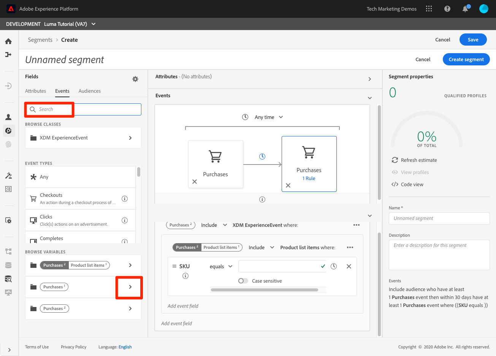

# 建立區段

<!-- 30 min-->
在本課程中，我們將根據先前課程中擷取的設定檔資料來建立一些區段。

擁有「即時客戶設定檔」後，您就可以建立具有類似特徵且可能對行銷策略有類似反應的個人區段。 這些區段的組成要素是您先前建立的XDM欄位。

**資料架構師** 需要在本教學課程之外建立區段，並支援其同事執行此工作。

開始練習之前，請觀看此短片，以深入了解如何建立區段：
>[!VIDEO](https://video.tv.adobe.com/v/27254?quality=12&learn=on)

## 需要權限

在 [設定權限](configure-permissions.md) 課程中，您設定了完成本課程所需的所有訪問控制，具體來說：

* 權限項目 **[!UICONTROL 設定檔管理]** > **[!UICONTROL 管理區段]**, **[!UICONTROL 檢視區段]**，和 **[!UICONTROL 匯出受眾區段]**
* 權限項目 **[!UICONTROL 設定檔管理]** > **[!UICONTROL 檢視設定檔]**，和 **[!UICONTROL 管理設定檔]**
* 權限項目 **[!UICONTROL 沙箱]** > `Luma Tutorial`
* 使用者角色存取 `Luma Tutorial Platform` 產品設定檔
* 開發人員角色存取 `Luma Tutorial Platform` 產品設定檔（適用於API）

## 建立基本區段

讓我們為具有金級或白金級狀態的忠誠計畫客戶建立簡單區段

1. 在Platform使用者介面中，前往 **[!UICONTROL 區段]** 在左側導覽列中
1. 選取 **[!UICONTROL 建立區段]** 按鈕
1. 結構產生器左側有三個標籤，分別顯示「屬性」（記錄資料）、「事件」（時間系列資料）和「對象」
1. 選取齒輪圖示，以注意區段產生器預設為只顯示含有資料的欄位，並可讓您變更合併原則
1. 在「屬性」索引標籤中，導覽至 **XDM個別設定檔>忠誠度** 資料夾（您也可以搜尋「忠誠度」）
1. 拖放， `Tier` 從「屬性欄位」功能表前往「區段產生器」畫布
1. 選擇 `Tier` 等於 `Gold` 或 `Platinum`
1. 選擇 **[!UICONTROL 重新整理估計值]** 若要查看有多少個設定檔符合區段資格
1. 作為 **[!UICONTROL 名稱]**，輸入 `Luma customers with level Gold or Above`
1. 選擇 **[!UICONTROL 儲存]**
   

<!--## Build a sequential segment-->

## 建立動態區段

在此練習中，我們將為在30天內購買了相同產品兩次的客戶建立區段。 動態區段可讓您使用欄位作為變數來縮放分段。

1. 前往 **[!UICONTROL 區段]** 在左側導覽列中
1. 選取 **[!UICONTROL 建立區段]** 按鈕
1. 選取 **[!UICONTROL 事件]** 標籤
1. 將清單篩選為 `purchases`
1. 拖曳 **[!UICONTROL 購買]** 事件類型至畫布 _兩次_
1. 在兩個 **[!UICONTROL 購買]** 事件，然後選擇「30天內」
1. 確認此時的區段定義為 **「包含至少有1個購買事件的對象，然後在30天內至少有1個購買事件」**

   
1. 現在將事件篩選變更為 `sku`
1. 將「SKU」欄位拖曳至第二個購買事件
   
1. 現在清除事件篩選器
1. 您應會在 **[!UICONTROL 瀏覽變數]** 區段中，有兩個購買事件的資料夾。 按一下以探索 **[!UICONTROL 購買1]**\
   
1. 深入研究 **[!UICONTROL 產品清單項目]** 資料夾，選取 **[!UICONTROL SKU]** 欄位，並將其拖曳至 **[!UICONTROL 等於]** 操作數。 當您將滑鼠游標暫留在區域上時，將其拖曳至「新增以比較運算元」區段
1. 為區段命名 `Bought same product within 30 days`
1. 確認您的對象定義為 **「包括在30天內至少有1個購買事件，且至少有1個購買事件（SKU等於購買1 SKU）的對象」**
1. 選取 **[!UICONTROL 儲存]** 按鈕

   

## 建立多實體區段

請記住，我們是如何建立 `Luma Offline Purchase Events Schema` 和 `Luma Product Catalog Schema` 以前的課？ 我們這麼做是為了使用多實體細分，以便在架構中使用關係。

透過進階的多實體分段功能，您可以使用多個XDM類別來建立區段，以擴充您的結構。 因此，區段產生器可以存取其他欄位，就像這些欄位是設定檔資料存放區的原生欄位一樣

您將透過套用您在 `Luma Product Catalog Schema` 和 `Luma Offline Purchase Events Schema`.

1. 前往 **[!UICONTROL 區段]** 在左側導覽列中
1. 選取 **[!UICONTROL 建立區段]** 按鈕
1. 選取 **[!UICONTROL 事件]** 標籤
1. 將清單篩選為 `purchases`
1. 拖曳 **[!UICONTROL 購買]** 事件類型至畫布
1. 選取事件上方的時鐘下拉式清單，然後選擇 **[!UICONTROL 最近30天]**
1. 篩選 **[!UICONTROL 事件]** 清單 `category` 然後拖動 **[!UICONTROL 產品類別]** 欄位至 **[!UICONTROL 購買]**
1. 將運算子變更為 **[!UICONTROL 開頭為]** 輸入 `men` 框中
1. 作為 **[!UICONTROL 名稱]**，輸入 `Purchased a Men's product in the last 30 days`
1. 確認對象定義 `(Include audience who have at least 1 Purchases event where ((Product Category starts with men)) ) and occurs in last 30 day(s)`
1. 選取 **[!UICONTROL 儲存]** 按鈕

   

## 批次和串流細分

按一下 **[!UICONTROL 區段]** 在左側導覽中，讓我們花點時間檢閱我們的三個區段：

* 我們的兩個區段是批次區段，其中一個是串流區段。
* Platform會盡可能預設為串流區段，只要客戶符合條件，即可為區段授與資格。 當區段定義太複雜，無法串流時，會自動轉換為批次。 在這種情況下，兩個段預設為批，因為採購事件的回顧期間大於七天。 如需串流限制的完整且最新清單，請參閱 [檔案](https://experienceleague.adobe.com/docs/experience-platform/segmentation/ui/streaming-segmentation.html).
* 批處理作業按每日計畫運行，可以關閉。

## 其他資源

* [區段服務檔案](https://experienceleague.adobe.com/docs/experience-platform/segmentation/home.html)
* [區段服務API參考](https://www.adobe.io/experience-platform-apis/references/segmentation/)

分段功能有更多，尤其是透過啟用區段。 這些主題將在其他教學課程中討論。

你通過了所有的練習！ 請繼續 [結論](conclusion.md).
