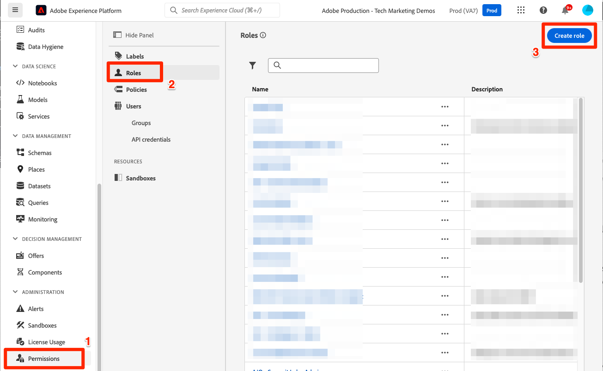

# 設定許可權

<!--30min-->

在本課程中，您將使用下列專案設定Adobe Experience Platform使用者許可權： [!DNL Adobe's Admin Console] 和 [!UICONTROL 許可權] Platform介面的畫面。

存取控制是Experience Platform中的一項重要隱私權功能，我們建議將許可權限制在人員執行其工作職能所需的最低許可權。 請參閱 [存取控制檔案](https://experienceleague.adobe.com/docs/experience-platform/access-control/home.html?lang=zh-Hant) 以取得詳細資訊。

資料架構師和資料工程師是Adobe Experience Platform的進階使用者，您需要許多許可權才能完成本教學課程，並在日後的工作中使用。 資料架構師可能會參與管理 *其他Platform使用者* 其公司，例如行銷人員、分析師和資料科學家。 完成本課程後，請思考如何使用這些功能來管理公司的其他使用者。

**資料架構師** 通常在本教學課程之外設定其他使用者的許可權。

>[!IMPORTANT]
>
>Adobe Experience Cloud產品的系統管理員必須完成本課程中的部分步驟，這在區段標題中會有說明。 如果您不是系統管理員，請洽詢貴公司的系統管理員，要求他們完成這些工作。 此外，他們還需要在 [設定開發人員控制檯和Postman](set-up-developer-console-and-postman.md) 課程。

## 關於Admin Console

此 [!DNL Admin Console] 是用於管理所有Adobe Experience Cloud產品之使用者存取許可權的介面。 若要存取Platform，必須將使用者或新增到Admin Console中，然後在Adobe Experience Platform的「許可權」畫面中管理其所有精細的許可權專案。

以下是Platform現有角色的快速摘要：

* **使用者** 產品設定檔的許可權，可依據產品設定檔中指派的許可權，完成Platform使用者介面中的工作。
* **開發人員** 可在Adobe Developer主控台中建立API認證和專案，以便開始使用Experience PlatformAPI
* **產品管理員** 可在Adobe Admin Console中新增使用者和開發人員至Adobe Experience Platform產品，並在Platform介面的「許可權」畫面中管理精細的使用者存取。
* **系統管理員** 可以新增產品管理員，並管理所有Adobe Experience Cloud產品的基本任何許可權。

## 將使用者和開發人員新增至 `AEP-Default-All-Users` 產品設定檔（需要系統管理員或產品管理員）

在本練習中，您或系統管理員或產品管理員會將您新增為Adobe Admin Console Adobe Experience Platform產品中的使用者和開發人員。

>[!NOTE]
>
>如果您是協助同事學習本教學課程的系統管理員，請考慮將您的同事新增為 *產品管理員* 適用於Adobe Experience Platform。 作為產品管理員，他們將來能夠自行完成這些步驟並管理其他Experience Platform使用者。

若要將教學課程參與者新增為 [!UICONTROL 使用者] 和 [!UICONTROL 開發人員]：

1. 登入 [Adobe Admin Console](https://adminconsole.adobe.com)
1. 選取 **[!UICONTROL 產品]** 在頂端導覽列上
1. 選取 **Adobe Experience Platform**
   
1. 您的Experience Platform執行個體中可能已經有多個設定檔。 選取 `AEP-Default-All-Users` 設定檔
   

1. 前往 **[!UICONTROL 使用者]** 標籤
1. 選取 **[!UICONTROL 新增使用者]** 按鈕
   
1. 完成工作流程，將教學課程參與者作為使用者新增至產品設定檔

1. 前往 **[!UICONTROL 開發人員]** 標籤
1. 選取 **[!UICONTROL 新增開發人員]** 按鈕
   
1. 完成工作流程，將教學課程參與者作為開發人員新增至產品設定檔

## 在Adobe Experience Platform中新增角色（需要系統管理員或產品管理員）

在Platform介面的「許可權」畫面中管理Experience Platform的精細許可權。 只有系統和產品管理員才可存取此畫面，因此如果您沒有管理員許可權，便需要具備該許可權的人員協助。

許可權在角色中進行管理。 為教學課程建立角色：

1. 登入 [Adobe Experience Platform](https://platform.adobe.com)
1. 選取 **[!UICONTROL 許可權]** 在左側導覽列中，將帶您前往 [!UICONTROL 角色] 畫面
1. 選取 **[!UICONTROL 建立角色]**

   
1. 為角色命名 `Luma Tutorial Platform` （如果您公司的多個人員正在參加本教學課程，請將教學課程參與者的名稱新增至教學課程結尾）並選取 **[!UICONTROL 確認]**

   

1. 使用以下專案為下列資源新增所有許可權專案：  **[!UICONTROL +]** 和 **[!UICONTROL 全部新增]**：

   1. 資料模型製作
   1. 資料管理
   1. 設定檔管理
   1. Identity Management
   1. 沙箱管理
   1. 查詢服務
   1. 資料彙集
   1. 資料治理
   1. 儀表板
   1. 警報

      

1. 在「資料擷取」下方，新增「管理來源」和「檢視來源」許可權專案。

1. 新增所有許可權專案後，請務必選取儲存按鈕
   

您將會在之後對此角色進行一些小的更新 [建立沙箱](create-a-sandbox.md) 和 [設定開發人員控制檯和Postman](set-up-developer-console-and-postman.md) 課程。

## 建立資料收集產品設定檔（需要系統管理員或產品管理員）

在本練習中，您或您公司的系統管理員將會為Data Collection (先前稱為Adobe Experience Platform Launch)建立產品設定檔，並將您新增為產品設定檔管理員。

>[!NOTE]
>
>如果您是協助同事完成本教學課程的系統管理員，請考慮將他們新增為 *產品管理員* （資料彙集）。 身為產品管理員，他們日後能自行完成這些步驟，並管理其他的Data Collection使用者。

若要建立產品設定檔：

1. 在 [!DNL Adobe Admin Console] 前往Adobe Experience Platform資料收集產品
1. 新增名為的新設定檔 `Luma Tutorial Data Collection` （如果您公司的多個人員正在參加本教學課程，請將教學課程參與者的名稱新增至教學課程結尾）
1. 關閉 **[!UICONTROL 屬性]** > **[!UICONTROL 自動包含]** 設定
1. 此時不要指派任何屬性或許可權
1. 將教學課程參與者新增為此設定檔的管理員

完成這些步驟後，您應該會看到 `Luma Tutorial Data Collection` 設定檔已設定為一位管理員。

## 設定資料收集產品設定檔

您現在已成為 `Luma Tutorial Data Collection` 產品設定檔您可以設定完成本教學課程所需的許可權和角色。

### 新增許可權

現在您要將個別許可權專案新增至設定檔：

1. 在 [Adobe Admin Console](https://adminconsole.adobe.com)，前往 **[!UICONTROL 產品]** > **[!UICONTROL 資料彙集]**
1. 開啟 `Luma Tutorial Data Collection` 設定檔
1. 前往 **[!UICONTROL 許可權]** 標籤
1. 開啟 **[!UICONTROL 平台]**
1. 請確定已選取所有可用的平台（根據您的授權，您可能會看到不同的選項）
1. **[!UICONTROL 儲存]** 任何變更
   
1. 開啟 **[!UICONTROL 屬性]**
1. 確定 **[!UICONTROL 自動包含]** 切換功能為Off，因此您無權存取任何屬性（我們稍後會新增）
1. **[!UICONTROL 儲存]** 任何變更
   
1. 開啟 **[!UICONTROL 屬性權利]**
1. 選取 **[!UICONTROL 全部新增]** 以新增所有屬性許可權
1. **[!UICONTROL 儲存]**
   
1. 開啟 **[!UICONTROL 公司權利]**
1. 新增 **[!UICONTROL 管理屬性]**
1. 選取 **[!UICONTROL 儲存]**
   

### 將您新增為使用者

現在將自己新增為資料收集設定檔的使用者：

1. 前往 **[!UICONTROL 使用者]** 標籤
1. 選取 **[!UICONTROL 新增使用者]** 按鈕
   
1. 完成工作流程，將自己新增為產品設定檔的使用者

您不需要將自己新增為資料收集的開發人員。

現在您幾乎擁有完成本教學課程所需的所有許可權！ 您只會再對內部進行兩次調整 [!DNL Adobe Admin Console]，包括您之後的一個 [建立沙箱](create-a-sandbox.md)！
