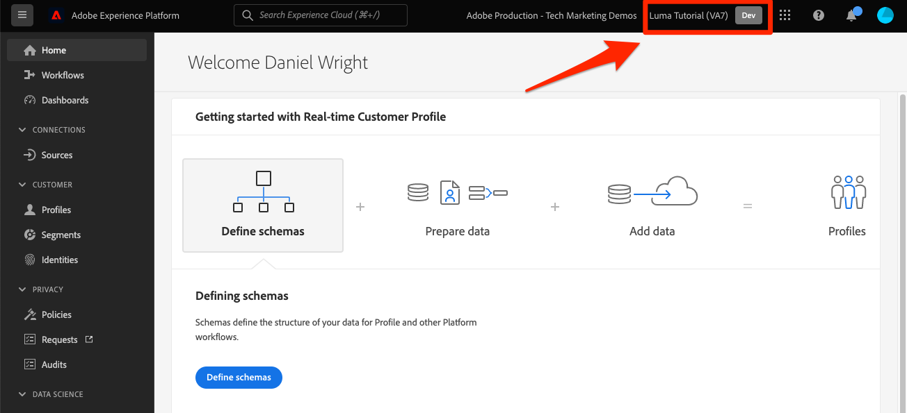

# 建立沙箱

<!--25min-->

在本課程中，您將建立一個開發環境沙箱，並用於教學課程的其餘部分。

沙箱提供隔離的環境，您可以在其中試用功能而無須將資源和資料與您的生產環境混用在一起。 如需詳細資訊，請參閱[沙箱檔案](https://experienceleague.adobe.com/docs/experience-platform/sandbox/home.html?lang=zh-Hant)。

**資料架構師**&#x200B;和&#x200B;**資料工程師**&#x200B;需要在本教學課程之外建立沙箱。

在開始練習之前，請觀看此短片，以進一步瞭解沙箱：
>[!VIDEO](https://video.tv.adobe.com/v/29838/?learn=on&enablevpops)

## 需要的許可權

在[設定許可權](configure-permissions.md)課程中，您已設定完成本課程所需的所有存取控制。

<!--
* Permission items **[!UICONTROL Sandbox Administration]** > **[!UICONTROL View Sandboxes]** and **[!UICONTROL Manage Sandboxes]**
* Permission item **[!UICONTROL Sandboxes]** > **[!UICONTROL Prod]**
* User-role access to the `Luma Tutorial Platform` product profile
* Admin-level access to the `Luma Tutorial Platform` product profile
-->

## 建立沙箱

讓我們建立沙箱：

1. 登入[Adobe Experience Platform](https://experience.adobe.com/platform)介面
1. 前往左側導覽中的&#x200B;**[!UICONTROL 沙箱]**
1. 選取右上方的&#x200B;**[!UICONTROL 建立沙箱]**
   

1. 選取&#x200B;**[!UICONTROL 開發]**&#x200B;作為&#x200B;**[!UICONTROL 型別]**
1. 為您的沙箱命名`luma-tutorial` （考慮將您的名稱新增到結尾）
1. 標題您的教學課程`Luma Tutorial` （考慮將您的名稱新增到結尾）
1. 選取&#x200B;**[!UICONTROL 建立]**&#x200B;按鈕
   
   >[!NOTE]
   >
   >雖然您可以使用任何任意值作為沙箱名稱和標題，但建議您遵循建議的值，因為在本教學課程中，我們將會參考這些標籤。 如果您的組織有多人完成本教學課程，請考慮在沙箱標題和名稱的結尾新增您的名稱，例如luma-tutorial-ignatiusjreilly。

建立沙箱大約需要30秒，期間會顯示&quot;[!UICONTROL 正在建立]&quot;狀態。 沙箱完全建立後，會顯示為&quot;[!UICONTROL 作用中]&quot;：

等到您的沙箱變成&quot;[!UICONTROL 作用中]&quot;再繼續下一個練習。

## 將新沙箱新增到角色

沙箱一旦作用中，您就必須將其納入您的角色中才能使用。 若要將其新增至您的角色（需要系統管理員或產品管理員許可權）：

1. 移至[!UICONTROL 許可權]畫面
1. 開啟`Luma Tutorial Platform`角色
1. 選擇性地從角色中&#x200B;_移除_ `Prod`沙箱
1. 新增`Luma Tutorial`沙箱
1. 選取&#x200B;**[!UICONTROL 儲存]**
1. 在[!UICONTROL 沙箱]列，選取&#x200B;**[!UICONTROL 編輯]**

   

1. 重新載入（或按住Shift鍵重新載入）頁面，您現在應該在`Luma Tutorial`沙箱中，或是顯示在沙箱下拉式清單中
1. 如果您尚未在`Luma Tutorial`沙箱中，請切換至該沙箱

   

太好了，您已建立沙箱，並準備[設定Developer Console和Postman](set-up-developer-console-and-postman.md)！
