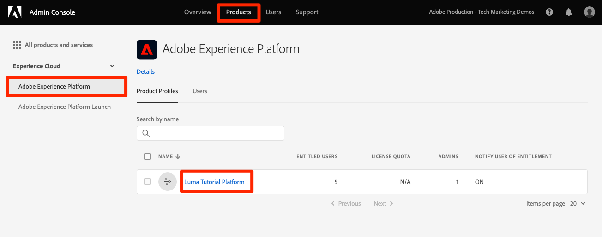

# 建立沙箱

<!--25min-->

在本課程中，您將建立一個開發環境沙箱，供您在教學課程的其餘部分使用。

沙箱提供獨立環境，您可在其中試用功能，而不需將資源和資料與生產環境混合。 如需詳細資訊，請參閱 [沙箱檔案](https://experienceleague.adobe.com/docs/experience-platform/sandbox/home.html?lang=zh-Hant).

**資料架構師** 和 **資料工程師** 需要在本教學課程之外建立沙箱。

開始練習之前，請觀看此短片，以進一步了解沙箱：
>[!VIDEO](https://video.tv.adobe.com/v/29838/?quality=12&learn=on)

## 需要權限

在 [設定權限](configure-permissions.md) 課程中，您設定了完成本課程所需的所有訪問控制。

<!--
* Permission items **[!UICONTROL Sandbox Administration]** > **[!UICONTROL View Sandboxes]** and **[!UICONTROL Manage Sandboxes]**
* Permission item **[!UICONTROL Sandboxes]** > **[!UICONTROL Prod]**
* User-role access to the `Luma Tutorial Platform` product profile
* Admin-level access to the `Luma Tutorial Platform` product profile
-->

## 建立沙箱

讓我們建立沙箱：

1. 登入 [Adobe Experience Platform](https://experience.adobe.com/platform) 介面
1. 前往 **[!UICONTROL 沙箱]** 在左側導覽列中
1. 選擇 **[!UICONTROL 建立沙箱]** 在右上角
   

1. 選擇 **[!UICONTROL 開發]** 作為 **[!UICONTROL 類型]**
1. 為您的沙箱命名 `luma-tutorial` （請考慮將您的名稱新增至結尾）
1. 為教學課程加上標題 `Luma Tutorial` （請考慮將您的名稱新增至結尾）
1. 選取 **[!UICONTROL 建立]** 按鈕
   
   >[!NOTE]
   >
   >雖然您可以對沙箱名稱和標題使用任何任意值，但建議您遵照建議的值，因為我們將在整個教學課程中參考這些標籤。 如果貴組織有多人完成本教學課程，請考慮在沙箱標題和名稱的結尾新增您的名稱，例如luma-tutorial-ignatiusjreilly。

建立沙箱大約需要30秒，此時間會是「[!UICONTROL 建立]「 」狀態隨即顯示。 沙箱完全建立後，會顯示為「[!UICONTROL 作用中]&quot;:

等候您的沙箱為「[!UICONTROL 作用中]」，然後繼續下一次練習。

## 將新沙箱新增至產品設定檔

沙箱生效後，您必須將其納入產品設定檔中才能使用。 若要將其新增至您的產品設定檔：

1. 在個別的瀏覽器標籤中，登入 [Admin Console](https://adminconsole.adobe.com)
1. 前往 **[!UICONTROL 產品>Adobe Experience Platform]**
1. 開啟 `Luma Tutorial Platform` 設定檔

   

1. 前往 **[!UICONTROL 權限]** 標籤

1. 在 [!UICONTROL 沙箱] 行，選擇 **[!UICONTROL 編輯]**

   

1. _移除_ the **[!UICONTROL 生產]** 先前指派給設定檔的沙箱
1. 選取 **[!UICONTROL +]** 圖示以新增 `Luma Tutorial` 沙箱至右側欄
1. 選擇 **[!UICONTROL 儲存]** 儲存更新的權限

   

1. 返回瀏覽器標籤並Experience Platform
1. 重新載入（或按住Shift重新載入）頁面，而您現在應位於 `Luma Tutorial` 沙箱或沙箱應顯示在沙箱下拉式清單中
1. 切換至 `Luma Tutorial` 沙箱（如果尚未加入）

   

很好，您已建立沙箱，並準備好 [設定開發人員主控台和Postman](set-up-developer-console-and-postman.md)!
