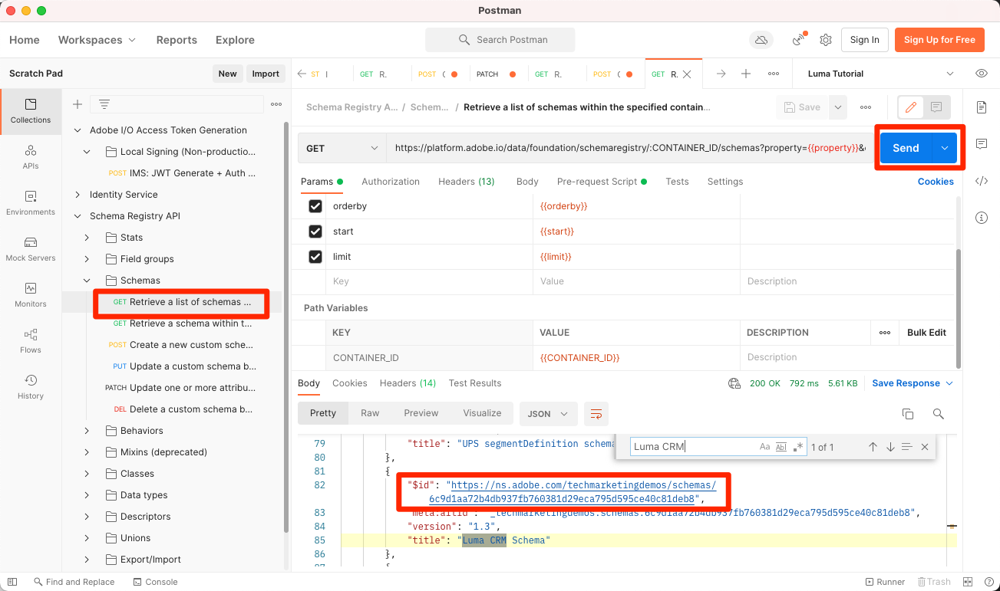
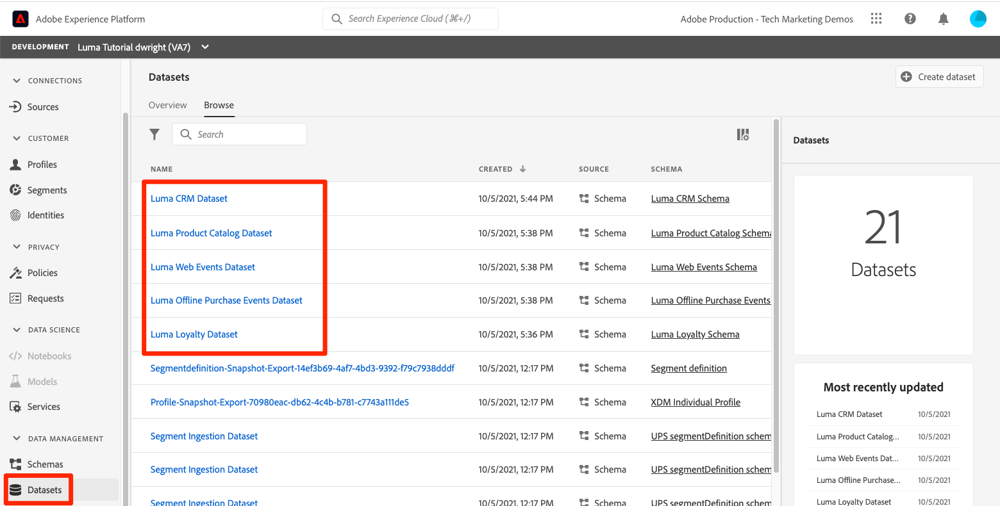

# 建立資料集

<!--15min-->

在本課程中，您將建立資料集來接收資料。 您一定會很高興知道這是本教學課程中最短的課程！

所有成功內嵌至Adobe Experience Platform的資料都會以資料集的形式保留在資料湖中。 資料集是資料集合的儲存和管理結構，通常是包含方案 (欄) 和欄位 (列) 的表格。 資料集也包含中繼資料，可說明其儲存資料的各個層面。 

**資料架構師** 需要在本教學課程之外建立資料集。

在開始練習之前，請觀看這段短片，以進一步瞭解資料集：
>[!VIDEO](https://video.tv.adobe.com/v/27269?quality=12&learn=on)

## 需要的許可權

在 [設定許可權](configure-permissions.md) 課程，您可以設定完成本課程所需的所有存取控制項。

<!--
* Permission items **[!UICONTROL Data Management]** > **[!UICONTROL View Datasets]** and **[!UICONTROL Manage Datasets]**
* Permission item **[!UICONTROL Sandboxes]** > `Luma Tutorial`
* User-role access to the `Luma Tutorial Platform` product profile
* Developer-role access to the `Luma Tutorial Platform` product profile (for API)
-->

## 在UI中建立資料集

在本練習中，我們將在UI中建立資料集。 讓我們從忠誠度資料開始：

1. 前往 **[!UICONTROL 資料集]** 在Platform使用者介面的左側導覽器中
1. 選取 **[!UICONTROL 建立資料集]** 按鈕
   

1. 在下一個畫面中，選取 **從結構描述建立資料集**
1. 在下一個畫面中，選取 `Luma Loyalty Schema` 然後選取 **[!UICONTROL 下一個]** 按鈕
   

1. 為資料集命名 `Luma Loyalty Dataset` 並選取 **[!UICONTROL 完成]** 按鈕
   
1. 資料集儲存後，您將會看到類似以下的畫面：
   

完成了！我告訴過您這會很快完成。 使用相同的步驟建立這些其他資料集：

1. `Luma Offline Purchase Events Dataset` 您的 `Luma Offline Purchase Events Schema`
1. `Luma Web Events Dataset` 您的 `Luma Web Events Schema`
1. `Luma Product Catalog Dataset` 您的 `Luma Product Catalog Schema`


## 使用API建立資料集

現在建立 `Luma CRM Dataset` 使用API。

>[!NOTE]
>
>如果您要略過API練習並建立 `Luma CRM Dataset` 在使用者介面中進行。 將其命名 `Luma CRM Dataset` 並使用 `Luma CRM Schema`.

### 取得要在資料集中使用的結構描述ID

首先，我們需要取得 `$id` 的 `Luma CRM Schema`：

1. 開啟 [!DNL Postman]
1. 如果您沒有存取權杖，請開啟請求 **[!DNL OAuth: Request Access Token]** 並選取 **傳送** 以請求新的存取Token，就像在 [!DNL Postman] 課程。
1. 開啟請求 **[!DNL Schema Registry API > Schemas > Retrieve a list of schemas within the specified container.]**
1. 選取 **傳送** 按鈕
1. 您應該會收到200回應
1. 檢視回應 `Luma CRM Schema` 專案並複製 `$id` 值
   

### 建立資料集

現在您可以建立資料集：

1. 下載 [目錄服務API.postman_collection.json](https://raw.githubusercontent.com/adobe/experience-platform-postman-samples/master/apis/experience-platform/Catalog%20Service%20API.postman_collection.json) 至您的 `Luma Tutorial Assets` 資料夾。
1. 將集合匯入 [!DNL Postman]
1. 選取請求 **[!DNL Catalog Service API > Datasets > Create a new dataset.]**
1. 將下列內容貼上為 **內文** 請求的， ***將id值取代為您自己的值***：

   ```json
   {
       "name": "Luma CRM Dataset",
   
       "schemaRef": {
           "id": "REPLACE_WITH_YOUR_OWN_ID",
           "contentType": "application/vnd.adobe.xed-full+json;version=1"
       },
       "fileDescription": {
           "persisted": true,
           "containerFormat": "parquet",
           "format": "parquet"
       }
   }
   ```

1. 選取 **傳送** 按鈕
1. 您應會收到包含新資料集ID的「201已建立」回應！
   

>[!TIP]
>
> 提出此請求的常見問題與可能的修正：
>
> * `400: There was a problem retrieving xdm schema`。請確定您已使用自己的ID取代上述範例中的ID `Luma CRM Schema`
> * 無驗證權杖：執行 **OAuth：要求存取權杖** 產生新權杖的請求
> * `401: Not Authorized to PUT/POST/PATCH/DELETE for this path : /global/schemas/`：更新 **CONTAINER_ID** 環境變數來源 `global` 至 `tenant`
> * `403: PALM Access Denied. POST access is denied for this resource from access control`：在Admin Console中驗證您的使用者許可權


您可以返回 **[!UICONTROL 資料集]** 在Platform使用者介面中，您可以確認已成功建立所有五個資料集！



## 其他資源

* [資料集檔案](https://experienceleague.adobe.com/docs/experience-platform/catalog/datasets/overview.html?lang=zh-Hant)
* [資料集API （目錄服務的一部分）參考](https://www.adobe.io/experience-platform-apis/references/catalog/#tag/Datasets)

既然我們所有的結構描述、身分和資料集都準備就緒，我們可以 [為即時客戶設定檔啟用它們](enable-profiles.md).
