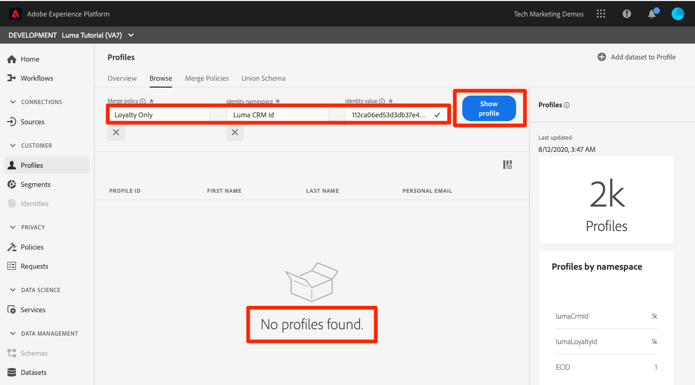

# 建立合併原則

<!--20 min-->

在本課程中，您將建立合併原則，以排定多個資料來源合併至設定檔的優先順序。

Adobe Experience Platform可讓您將來自多個來源的資料彙集在一起，並結合這些資料，以檢視每個個別客戶的完整檢視。 彙總此資料時，合併原則會決定資料的優先順序，以及會合併哪些資料來建立該統一檢視。

在本課程中，我們將堅持使用使用者介面，但也會有用於建立合併原則的API選項。

**資料架構師** 將需要在本教學課程之外建立合併原則。

在開始練習之前，請觀看此短片，進一步瞭解合併原則：
>[!VIDEO](https://video.tv.adobe.com/v/330433?quality=12&learn=on)

## 需要的許可權

在 [設定許可權](configure-permissions.md) 課程，您可以設定完成本課程所需的所有存取控制項。

<!--* Permission items **[!UICONTROL Profile Management]** > **[!UICONTROL View Merge Policies]** and **[!UICONTROL Manage Merge Policies]**
* Permission item **[!UICONTROL Profile Management]** > **[!UICONTROL View Profiles]** and **[!UICONTROL Manage Profiles]**
* Permission item **[!UICONTROL Sandboxes]** > `Luma Tutorial`
* User-role access to the `Luma Tutorial Platform` product profile
-->

## 關於合併原則和聯合結構描述

您可能會記得，在批次擷取的課程中，我們上傳了兩個記錄，包含相同客戶的稍微不同的資訊。 在 [!DNL Loyalty] 資料，客戶的名字是 `Daniel` 他住在 `New York City`，但在CRM資料中，客戶的名字是 `Danny` 他住在 `Portland`. 客戶資料會隨著時間而改變。 也許他從 `Portland` 至 `New York City`. 其他專案也會變更，例如電話號碼和電子郵件地址。 當兩個資料來源為同一個使用者提供不同資訊時，合併原則可協助您決定如何處理這些型別的衝突。

那麼，為什麼會 `Danny` 以名字勝出？ 讓我們來看一下：

1. 在平台使用者介面中，選取「 」 **[!UICONTROL 設定檔]** 在左側導覽列中
1. 前往 **[!UICONTROL 合併原則]** 標籤
1. 預設的合併原則會依時間戳記排序。 由於您是在忠誠度資料後上傳CRM資料， `Danny` 勝出為設定檔中的名字：

為設定檔啟用多個結構描述時， [!UICONTROL 聯合結構描述] 會自動為所有已啟用設定檔的記錄結構描述建立，以共用基底類別。 您可以檢視 [!UICONTROL 聯合結構描述] 前往 **[!UICONTROL 聯合結構描述]** 標籤。

請注意，ExperienceEvent類別沒有聯合結構描述。 雖然ExperienceEvent資料仍以時間序列為基礎，但仍會出現在設定檔中，但每個事件都包含時間戳記和ID，因此衝突並不會造成問題。

如果您不喜歡該預設合併原則，該怎麼辦？ 如果Luma決定在發生衝突時，他們的CRM系統應該為真相來源，該怎麼辦？ 為此，我們將建立合併原則。

## 在UI中建立合併原則

1. 在「合併原則」畫面上，選取 **[!UICONTROL 建立合併原則]** 右上角的按鈕
1. 作為 **[!UICONTROL 名稱]**，輸入 `Loyalty Prioritized`
1. 作為 **[!UICONTROL 結構描述]**，選取 **[!UICONTROL XDM設定檔]** (請注意，您的自訂類別（由於是記錄資料）也可用於合併原則)
1. 對象 **[!UICONTROL Id彙整]**，選取 **[!UICONTROL 私人圖表]**
1. 對象 **[!UICONTROL 屬性合併]**，選取 **[!UICONTROL 資料集優先順序]**
1. 拖放 `Luma Loyalty Dataset` 和 `Luma CRM Dataset` 至 **[!UICONTROL 資料集]** 面板。
1. 確定 `Luma Loyalty Dataset` 在上方拖放，使其位於頂端 `Luma CRM Dataset`
1. 選取 **[!UICONTROL 儲存]** 按鈕
   <!--do i need to explain Private Graph? Is that GA?-->
   

## 驗證合併原則

讓我們看看合併原則是否如預期般運作：

1. 前往 **[!UICONTROL 瀏覽]** 標籤
1. 變更 **[!UICONTROL 合併原則]** 至您的新增 `Loyalty Prioritized` 原則
1. 作為 **[!UICONTROL 身分名稱空間]**，使用您的 `Luma CRM Id`
1. 作為 **[!UICONTROL 身分值]** use `112ca06ed53d3db37e4cea49cc45b71e`
1. 選取 **[!UICONTROL 顯示設定檔]** 按鈕
1. `Daniel` 回來了！

## 使用有限的資料集建立合併原則

使用資料集優先順序建立合併原則時，設定檔中只會包含您在右側包含的相同基底類別的資料集。 讓我們設定另一個合併原則

1. 在「合併原則」畫面上，選取 **[!UICONTROL 建立合併原則]** 右上角的按鈕
1. 作為 **[!UICONTROL 名稱]**，輸入  `Loyalty Only`
1. 作為 **[!UICONTROL 結構描述]**，選取 **[!UICONTROL XDM設定檔]**
1. 對象 **[!UICONTROL Id彙整]**，選取 **[!UICONTROL 無]**
1. 對象 **[!UICONTROL 屬性合併]**，選取 **[!UICONTROL 資料集優先順序]**
1. 僅拖放 `Luma Loyalty Dataset` 至 **[!UICONTROL 選取的資料集]** 面板。
1. 選取 **[!UICONTROL 儲存]** 按鈕

## 驗證合併原則

現在來看看此合併原則的作用：

1. 前往 **[!UICONTROL 瀏覽]** 標籤
1. 變更 **[!UICONTROL 合併原則]** 至您的新增 `Loyalty Only` 原則
1. 作為 **[!UICONTROL 身分名稱空間]**，使用您的 `Luma CRM Id`
1. 作為 **[!UICONTROL 身分值]** use `112ca06ed53d3db37e4cea49cc45b71e`
1. 選取 **[!UICONTROL 顯示設定檔]** 按鈕
1. 確認找不到設定檔：
   

CRM ID是 `Luma Loyalty Dataset`，但僅主要身分可用於查閱設定檔。 那麼，讓我們使用主要身分來查閱設定檔， `Luma Loyalty Id`&quot;

1. 變更 **[!UICONTROL 身分名稱空間]** 至 `Luma Loyalty Id`
1. 作為 **[!UICONTROL 身分值]** use `5625458`
1. 選取 **[!UICONTROL 顯示設定檔]** 按鈕
1. 選取設定檔ID以開啟設定檔
1. 前往 **[!UICONTROL 屬性]** 標籤
1. 請注意，CRM資料集中的其他設定檔詳細資料（例如行動電話號碼和電子郵件地址）無法使用，因為僅限
   
1. 前往 **[!UICONTROL 事件]** 標籤
1. ExperienceEvent資料可供使用，儘管未明確包含在合併原則資料集中：
   

## 深入瞭解合併原則

在設定檔搜尋中，將使用的合併原則變更回 `Default Timebased` 並選取 **[!UICONTROL 顯示設定檔]** 按鈕。 丹尼回來了！

這是怎麼回事？ 嗯，設定檔合併並非一次性專案。 系統會根據各種因素（包括使用何種合併原則），即時組裝即時客戶設定檔。 您可以建立要在不同內容中使用的多個合併原則，具體取決於您想要哪個客戶檢視。

合併原則的主要使用案例是資料控管。 例如，假設您將第三方資料擷取至Platform，這些資料無法用於個人化使用案例，但是 _可以_ 用於廣告使用案例。 您可以建立排除此第三方資料集的合併原則，並使用此合併原則為您的廣告使用案例建立區段。

## 其他資源

* [合併原則檔案](https://experienceleague.adobe.com/docs/experience-platform/profile/merge-policies/overview.html)
* [合併原則API （即時客戶設定檔API的一部分）參考](https://www.adobe.io/experience-platform-apis/references/profile/#tag/Merge-policies)

現在，讓我們繼續進行 [資料治理框架](apply-data-governance-framework.md).
