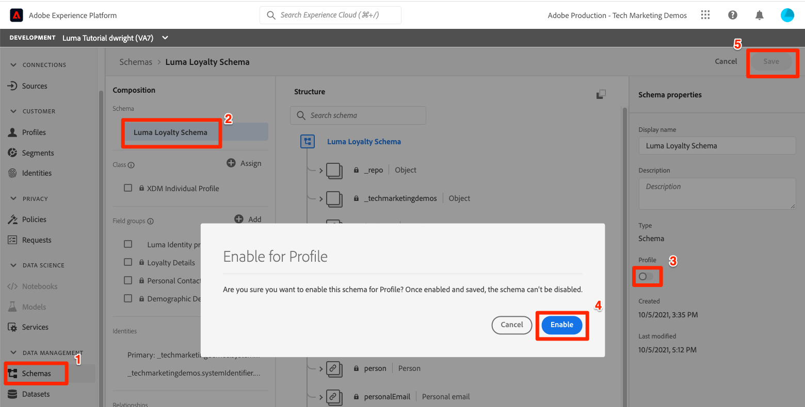
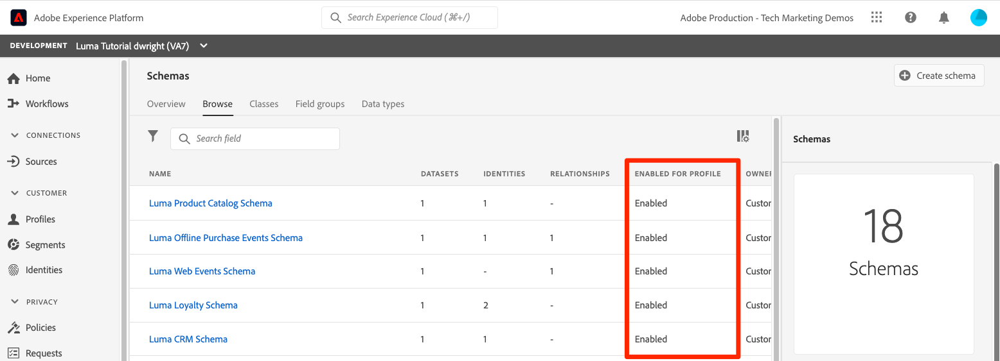

# 啟用即時客戶設定檔

<!-- 15min-->
在本課程中，您將啟用「即時客戶個人檔案」的結構描述和資料集。

好吧，我說資料集課程是本教學課程中最短的課程時，我撒了謊 — 這個課程需要的時間更少！ 實際上，你要做的就是翻開一堆切換。 但是當你翻開這些切換 _真的_ 所以我想把整頁獻給它。

透過即時客戶個人檔案，您可以全面了解各個客戶，其中結合來自多個管道的資料，包括線上、離線、CRM和協力廠商資料。 設定檔可讓您將不同的客戶資料併入統一檢視中，提供每個客戶互動的可操作、時間戳記帳戶。

雖然聽起來很神奇，但您不需要激活 *所有資料* 的URL。 事實上，您應該只啟用啟動使用案例所需的資料。 啟用您想要用於行銷使用案例、客服中心整合等的資料，讓您快速存取強大的客戶設定檔。 如果您上傳的資料僅供分析之用，則可能不應為設定檔啟用。

有很重要 [即時客戶設定檔資料的護欄](https://experienceleague.adobe.com/docs/experience-platform/profile/guardrails.html?lang=en) 在決定應為設定檔啟用哪些自有資料時，您應先檢閱。

<!--is this accurate. Are there other considerations to point out? -->

**資料架構師** 需要在本教學課程之外啟用「即時客戶設定檔」。

在開始練習之前，請觀看此短片，以深入了解「即時客戶個人檔案」：
>[!VIDEO](https://video.tv.adobe.com/v/27251?quality=12&learn=on)

## 需要權限

在 [設定權限](configure-permissions.md) 課程中，您設定了完成本課程所需的所有訪問控制。


<!--* Permission items **[!UICONTROL Data Modeling]** > **[!UICONTROL View Schemas]** and **[!UICONTROL Manage Schemas]**
* Permission items **[!UICONTROL Data Management]** > **[!UICONTROL View Datasets]** and **[!UICONTROL Manage Datasets]**
* Permission item **[!UICONTROL Sandboxes]** > `Luma Tutorial`
* User-role access to the `Luma Tutorial Platform` product profile
* Developer-role access to the `Luma Tutorial Platform` product profile (for API)
-->

## 使用Platform使用者介面啟用即時客戶個人檔案的結構描述

讓我們從啟用架構的簡單任務開始：

1. 在Platform使用者介面中，開啟 **Luma忠誠度結構**
1. 在 **[!UICONTROL 架構屬性]**，切換 **設定檔** 開關
1. 在確認強制回應視窗中，按 **[!UICONTROL 啟用]** 按鈕以確認
1. 選取 **[!UICONTROL 儲存]** 按鈕以保存更改

   >[!IMPORTANT]
   >
   >為設定檔啟用架構後，即無法停用或刪除該架構。 此外，在此時間點後，無法從架構中移除欄位。 在生產環境中處理您自己的資料時，請務必留意以下這些意涵。 您應在本教學課程中使用開發沙箱，可隨時刪除。
   >
   >在本教學課程的受控環境中，您將啟用設定檔的結構描述和資料集 _擷取任何資料之前_. 使用您自己的資料時，建議您依下列順序執行作業：
   >
   > 1. 首先，將一些資料內嵌至資料集。
   > 1. 解決資料擷取程式期間產生的任何問題（例如資料驗證或對應問題）。
   > 1. 啟用設定檔的資料集和結構
   > 1. 擷取資料


   

輕鬆對吧？ 對以下其他架構重複上述步驟：

1. Luma產品目錄結構
1. Luma離線購買事件結構
1. Luma Web事件結構（在確認強制回應視窗中，勾選「此結構的資料將在identityMap欄位中包含主要身分」方塊。）

## 使用Platform API啟用即時客戶個人檔案的結構描述

現在，是時候啟用 `Luma CRM Schema` 搭配API。 如果您想略過本練習，並在使用者介面中加以啟用，請直接進行。

### 取得結構的meta:altId

先把 `meta:altId` 的 `Luma CRM Schema`:

1. 開啟 [!DNL Postman]
1. 如果您在過去24小時內未提出請求，則您的授權Token可能已過期。 開啟請求 **[!DNL Adobe I/O Access Token Generation > Local Signing (Non-production use-only) > IMS: JWT Generate + Auth via User Token]** 選取 **傳送** 請求新的JWT和存取權杖，就像您在 [!DNL Postman] 教訓。
1. 開啟請求 **[!DNL Schema Registry API > Schemas > Retrieve a list of schemas within the specified container.]**
1. 選取 **傳送** 按鈕
1. 您應會收到200個回應
1. 查看 `Luma CRM Schema` 項目並複製 `meta:altId` value
   

### 啟用架構

現在，我們已擁有結構的meta:altId，可為設定檔啟用它：

1. 開啟請求 **[!DNL Schema Registry API > Schemas > Update one or more attributes of a custom schema specified by ID.]**
1. 在 **Params** 貼上 `meta:altId` 值作為 `SCHEMA_ID` 參數值
1. 在 **主體** 標籤，貼上下列程式碼

   ```json
   [{
       "op": "add",
       "path": "/meta:immutableTags",
       "value": ["union"]
   }]
   ```

1. 選取 **傳送** 按鈕
1. 您應會收到200個回應

   

您應該可以在使用者介面中看到，所有五個結構皆已啟用設定檔(您可能需要SHIFT-Reload才能看到 `Luma CRM Schema` 啟用):



## 使用Platform使用者介面啟用即時客戶個人檔案的資料集

資料集也必須啟用「設定檔」，程式更簡單：

1. 在Platform使用者介面中，開啟 `Luma Loyalty Dataset`
1. 切換 **[!UICONTROL 設定檔]** 開關
1. 在確認強制回應視窗中，按 **[!UICONTROL 啟用]** 按鈕以確認

   

對其他資料集重複上述步驟：

1. Luma產品目錄資料集
1. Luma離線購買事件資料集
1. Luma Web事件資料集

>[!NOTE]
>
>與結構不同，您可以從「設定檔」停用資料集，不過先前擷取的所有資料都會保留在「設定檔」中。

## 使用Platform API為即時客戶個人檔案啟用資料集

現在您將使用API啟用設定檔的資料集。 同樣地，如果您想使用上述方法透過使用者介面來啟用，也沒問題。

### 取得資料集的id

首先，我們要 `id` 的 `Luma CRM Dataset`:

1. 開啟 [!DNL Postman]
1. 如果您在過去24小時內未提出請求，則您的授權Token可能已過期。 開啟請求 **[!DNL Adobe I/O Access Token Generation > Local Signing (Non-production use-only) > IMS: JWT Generate + Auth via User Token]** 選取 **傳送** 請求新的JWT和存取權杖，就像您在 [!DNL Postman] 教訓。
1. 開啟請求 **[!DNL Catalog Service API > Datasets > Retrieve a list of datasets.]**
1. 選取 **傳送** 按鈕
1. 您應會收到200個回應
1. 查看 `Luma CRM Dataset` 項目並複製id:
   

### 啟用資料集

現在，我們已取得資料集的ID，可為設定檔啟用：

1. 開啟請求 **[!DNL Catalog Service API > Datasets > Update one or more attributes of a dataset specified by ID.]**
1. 在 **Params** 更新 `DATASET_ID` 值
1. 在 **主體** 標籤，貼上下列程式碼。 請注意，前兩個值是先前存在的標籤，會顯示在先前的回應中。 除了我們新增的兩個新標籤外，這些標籤還需要包含在內文中：

   ```json
   {
       "tags":{
           "adobe/pqs/table":["luma_crm_dataset"],
           "adobe/siphon/table/format":["parquet"],
           "unifiedProfile":["enabled:true"],
           "unifiedIdentity":["enabled:true"]
           }
   }
   ```

1. 選取 **傳送** 按鈕
1. 您應會收到200個回應

   

您也可以確認使用者介面是否已啟用資料集：


>[!IMPORTANT]
>
> 如果您在啟用設定檔的結構描述和資料集之前已內嵌資料，之後就需要重新內嵌該資料。

## 其他資源

* [即時客戶個人檔案文件](https://experienceleague.adobe.com/docs/experience-platform/profile/home.html?lang=zh-Hant)
* [即時客戶設定檔API參考](https://www.adobe.io/experience-platform-apis/references/profile/)


**資料工程師** 應繼續 [訂閱資料擷取事件](subscribe-to-data-ingestion-events.md) 教訓。
**資料架構師** _可以往前_ 然後前往 [批次擷取課程](ingest-batch-data.md).
