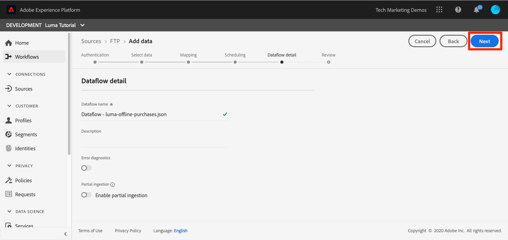

# 擷取批次資料

<!-- 1hr-->
在本課程中，您將使用各種方法將批次資料擷取到Experience Platform中。

批次資料擷取可讓您將大量資料一次擷取到Adobe Experience Platform。 您可以在Platform介面中或使用API，一次上傳內嵌批次資料。 您也可以使用Source聯結器設定從協力廠商服務（例如雲端儲存服務）定期排程的批次上傳。

**資料工程師**&#x200B;需要在此教學課程之外擷取批次資料。

在開始練習之前，請觀看此短片，以進一步瞭解資料擷取：

>[!VIDEO](https://video.tv.adobe.com/v/27106?learn=on)


## 需要的許可權

在[設定許可權](configure-permissions.md)課程中，您已設定完成本課程所需的所有存取控制。

<!--
* Permission item **[!UICONTROL Data Management]** > **[!UICONTROL View Datasets]**, **[!UICONTROL Manage Datasets]** and **[!UICONTROL Data Monitoring]**
* Permission items **[!UICONTROL Data Ingestion]** > **[!UICONTROL View Sources]** and **[!UICONTROL Manage Sources]**
* Permission item **[!UICONTROL Profile Management]** > **[!UICONTROL View Profiles]**
* Permission item **[!UICONTROL Sandboxes]** > `Luma Tutorial`
* User-role access to the `Luma Tutorial Platform` product profile
* Developer-role access to the `Luma Tutorial Platform` product profile (for API)
-->

在「來源」練習中，您將需要存取(S) FTP伺服器或雲端儲存空間解決方案。 如果您沒有解決方法。

## 使用Platform使用者介面批次擷取資料

資料可以採用JSON和Parquet格式，直接上傳到資料集畫面上的資料集中。 這是建立「 」後測試部分資料擷取的絕佳方式

### 下載並準備資料

首先，取得範例資料並為您的租使用者自訂：

>[!NOTE]
>
>[luma-data.zip](assets/luma-data.zip)檔案中包含的資料是虛構的，僅供示範之用。

1. 將[luma-data.zip](assets/luma-data.zip)下載至您的&#x200B;**Luma教學課程Assets**&#x200B;資料夾。
1. 解壓縮檔案，建立名為`luma-data`的資料夾，其中包含我們將在本課程中使用的四個資料檔案
1. 在文字編輯器中開啟`luma-loyalty.json`，並以您自己的底線租使用者ID取代`_techmarketingdemos`的所有執行個體，如您自己的結構描述中所示：
   

1. 儲存更新的檔案

### 擷取資料

1. 在Platform使用者介面中，選取左側導覽中的&#x200B;**[!UICONTROL 資料集]**
1. 開啟您的`Luma Loyalty Dataset`
1. 向下捲動，直到在右欄看到&#x200B;**[!UICONTROL 新增資料]**&#x200B;區段為止
1. 上傳`luma-loyalty.json`檔案。
1. 上傳檔案後，批次的列將出現
1. 如果您在幾分鐘後重新載入頁面，應該會看到批次已成功上傳1000筆記錄和1000個設定檔片段。

   
   <!--do i need to explain error diagnostics and partial ingestion-->

>[!NOTE]
>
>在本課程的各個熒幕中，您會看到一些選項，**[!UICONTROL 錯誤診斷]**&#x200B;和&#x200B;**[!UICONTROL 部分擷取]**。 本教學課程未涵蓋這些選項。 一些快速資訊：
>
>* 啟用錯誤診斷會產生有關資料擷取的資料，然後您可以使用資料存取API進行檢閱。 在[檔案](https://experienceleague.adobe.com/docs/experience-platform/data-access/home.html)中進一步瞭解。
>* 部分擷取可讓您擷取包含錯誤的資料，最多可擷取您所能指定的特定臨界值。 在[檔案](https://experienceleague.adobe.com/docs/experience-platform/ingestion/batch/partial.html)中進一步瞭解

### 驗證資料

有幾種方式可確認資料已成功內嵌。

#### 在Platform使用者介面中驗證

若要確認資料已擷取至資料集：

1. 在您擷取資料的相同頁面上，選取右上方的&#x200B;**[!UICONTROL 預覽資料集]**&#x200B;按鈕
1. 選取「**預覽**」按鈕，您應該能夠看到部分擷取的資料。

   


若要確認資料是否著陸至設定檔（可能需要幾分鐘的時間才能讓資料著陸）：

1. 前往左側導覽中的&#x200B;**[!UICONTROL 設定檔]**
1. 選取&#x200B;**[!UICONTROL 選取身分名稱空間]**&#x200B;欄位旁的圖示以開啟強制回應視窗
1. 選取您的`Luma Loyalty Id`名稱空間
1. 然後輸入資料集中的`loyaltyId`值之一，`5625458`
1. 選取&#x200B;**[!UICONTROL 檢視]**
   

#### 使用資料擷取事件進行驗證

如果您訂閱了上一課程中的資料擷取事件，請檢查您獨特的webhook.site URL。 您應該會看到三個請求以下列順序顯示，中間有一些時間，並具有以下`eventCode`個值：

1. `ing_load_success` — 已擷取的批次
1. `ig_load_success` — 批次已擷取到身分圖表中
1. `ps_load_success` — 批次已擷取到設定檔服務


如需有關通知的詳細資訊，請參閱[檔案](https://experienceleague.adobe.com/docs/experience-platform/ingestion/quality/subscribe-events.html#available-status-notification-events)。

## 使用Platform API批次擷取資料

現在來使用API上傳資料。

>[!NOTE]
>
>資料架構師可透過使用者介面方法來上傳CRM資料。

### 下載並準備資料

1. 您應該已經下載[luma-data.zip](assets/luma-data.zip)並將其解壓縮至您的`Luma Tutorial Assets`資料夾。
2. 在文字編輯器中開啟`luma-crm.json`，並以您自己的底線租使用者ID取代`_techmarketingdemos`的所有執行個體（如您的結構描述中所示）
3. 儲存更新的檔案

### 取得資料集ID

首先，我們取得要擷取資料的資料集ID的資料集ID：

1. 開啟[!DNL Postman]
1. 如果您沒有存取權杖，請開啟要求&#x200B;**[!DNL OAuth: Request Access Token]**，然後選取&#x200B;**傳送**&#x200B;來要求新的存取權杖，就像您在[!DNL Postman]課程中所做的一樣。
1. 開啟您的環境變數，並確定&#x200B;**CONTAINER_ID**&#x200B;的值仍為`tenant`
1. 開啟要求&#x200B;**[!DNL Catalog Service API > Datasets > Retrieve a list of datasets.]**&#x200B;並選取&#x200B;**傳送**
1. 您應該會收到`200 OK`回應
1. 從回應本文複製`Luma CRM Dataset`的ID
   

### 建立批次

現在，我們可以在資料集中建立批次：

1. 將[Data Ingestion API.postman_collection.json](https://raw.githubusercontent.com/adobe/experience-platform-postman-samples/master/apis/experience-platform/Data%20Ingestion%20API.postman_collection.json)下載至您的`Luma Tutorial Assets`資料夾
1. 將集合匯入[!DNL Postman]
1. 選取要求&#x200B;**[!DNL Data Ingestion API > Batch Ingestion > Create a new batch in Catalog Service.]**
1. 將下列內容貼上為請求的&#x200B;**Body**，***將datasetId值取代為您自己的***：

   ```json
   {
       "datasetId":"REPLACE_WITH_YOUR_OWN_DATASETID",
       "inputFormat": {
           "format": "json"
       }
   }
   ```

1. 選取&#x200B;**傳送**&#x200B;按鈕
1. 您應該會收到包含新批次ID的「201已建立」回應！
1. 複製新批次的`id`
   

### 擷取資料

現在可以將資料上傳到批次中：

1. 選取要求&#x200B;**[!DNL Data Ingestion API > Batch Ingestion > Upload a file to a dataset in a batch.]**
1. 在&#x200B;**Params**&#x200B;索引標籤中，在各自的欄位中輸入您的資料集ID和批次ID
1. 在&#x200B;**引數**&#x200B;索引標籤中，輸入`luma-crm.json`作為&#x200B;**filePath**
1. 在&#x200B;**內文**&#x200B;索引標籤中，選取&#x200B;**二進位**&#x200B;選項
1. 從您的本機`Luma Tutorial Assets`資料夾中選取下載的`luma-crm.json`
1. 選取&#x200B;**傳送**，您應該會在回應本文中取得包含「1」的200 OK回應

   

此時，如果您在Platform使用者介面中檢視您的批次，會看到它處於&quot;[!UICONTROL 正在載入]&quot;狀態：


由於批次API通常用於上傳多個檔案，因此您需要在批次完成時通知Platform，我們將在下一個步驟中執行此操作。

### 完成批次

若要完成批次，請執行下列動作：

1. 選取要求&#x200B;**[!DNL Data Ingestion API > Batch Ingestion > Finish uploading a file to a dataset in a batch.]**
1. 在&#x200B;**引數**&#x200B;索引標籤中，輸入`COMPLETE`作為&#x200B;**動作**
1. 在&#x200B;**引數**&#x200B;索引標籤中，輸入您的批次ID。 如果資料集ID或filePath存在，您不必擔心。
1. 確定POST的URL是`https://platform.adobe.io/data/foundation/import/batches/:batchId?action=COMPLETE`，並且沒有對`datasetId`或`filePath`的任何不必要的參考
1. 選取&#x200B;**傳送**，您應該會在回應本文中取得包含「1」的200 OK回應

   

### 驗證資料

#### 在Platform使用者介面中驗證

驗證資料已著陸至Platform使用者介面，就像您針對「忠誠度」資料集所做的一樣。

首先，確認批次顯示已擷取1000筆記錄：


接下來，使用預覽資料集確認批次：


最後，透過依照`Luma CRM Id`名稱空間查詢其中一個設定檔（例如`112ca06ed53d3db37e4cea49cc45b71e`），確認已建立您的其中一個設定檔


我想指出一件剛發生的有趣事情。 開啟該`Danny Wright`設定檔。 設定檔同時有`Lumacrmid`和`Lumaloyaltyid`。 記住`Luma Loyalty Schema`包含兩個身分欄位，即Luma忠誠度識別碼和CRM識別碼。 現在我們已上傳兩個資料集，將它們合併至單一設定檔。 熟客資料以`Daniel`為名字，以「New York City」為住家地址，而CRM資料以`Danny`為名字，以`Portland`為擁有相同熟客識別碼之客戶的住家地址。 我們將回到合併原則課程中名字顯示`Danny`的原因。

恭喜，您剛才已合併設定檔！


#### 使用資料擷取事件進行驗證

如果您訂閱了上一課程中的資料擷取事件，請檢查您獨特的webhook.site URL。 您應該會看到傳入三個請求，就像忠誠度資料一樣：


如需有關通知的詳細資訊，請參閱[檔案](https://experienceleague.adobe.com/docs/experience-platform/ingestion/quality/subscribe-events.html#available-status-notification-events)。

## 使用工作流程內嵌資料

讓我們來看看另一種上傳資料的方式。 工作流程功能可讓您擷取尚未在XDM中模型化的CSV資料。

### 下載並準備資料

1. 您應該已經下載[luma-data.zip](assets/luma-data.zip)並將其解壓縮至您的`Luma Tutorial Assets`資料夾。
1. 確認您擁有`luma-products.csv`

### 建立工作流程

現在來設定工作流程：

1. 前往左側導覽中的&#x200B;**[!UICONTROL 工作流程]**
1. 選取&#x200B;**[!UICONTROL 將CSV對應至XDM結構描述]**&#x200B;並選取&#x200B;**[!UICONTROL 啟動]**按鈕
   
1. 選取您的`Luma Product Catalog Dataset`並選取&#x200B;**[!UICONTROL 下一步]**按鈕
   
1. 新增您下載的`luma-products.csv`檔案，並選取&#x200B;**[!UICONTROL 下一步]**按鈕
   
1. 現在您位於對應程式介面，在其中可以將來源資料（`luma-products.csv`檔案中的其中一個欄名稱）的欄位對應到目標結構描述中的XDM欄位。 在我們的範例中，欄名稱與結構描述欄位名稱足夠接近，因此對應程式能夠自動偵測正確的對應！ 如果對應程式無法自動偵測正確的欄位，您可以選取目標欄位右側的圖示，以選取正確的XDM欄位。 此外，如果您不想從CSV擷取其中一欄，可以從對應工具中刪除該列。 您可以隨意玩耍和變更`luma-products.csv`中的欄標題，以熟悉對應程式的運作方式。
1. 選取&#x200B;**[!UICONTROL 完成]**按鈕
   

### 驗證資料

批次上傳後，請預覽資料集以驗證上傳。

由於`Luma Product SKU`是非人員名稱空間，因此我們將不會看到產品SKU的任何設定檔。

您應該會看到webhook的三個點選。

## 使用來源內嵌資料

好的，您做了艱苦的工作。 現在，讓我們進入&#x200B;_自動化_&#x200B;批次擷取的樂土！ 當我說：「SET IT！」 您會說：「算了！」 「設定它！」 「算了！」 「設定它！」 「算了！」 開玩笑吧，你絕不會做這種事！ 好的，繼續工作。 您即將完成。

前往左側導覽中的&#x200B;**[!UICONTROL 來源]**&#x200B;以開啟來源目錄。 在這裡，您會看到各種現成的整合功能，與領先業界的資料和儲存提供者整合。


好，讓我們使用來源聯結器來內嵌資料。

此練習將為您選擇自己的冒險風格。 我即將使用FTP來源聯結器顯示工作流程。 您可以使用貴公司使用的不同雲端儲存空間來源聯結器，或使用資料集使用者介面上傳json檔案，就像處理忠誠度資料一樣。

許多來源具有類似的設定工作流程，您可以在其中執行下列作業：

1. 輸入您的驗證詳細資料
1. 選取您要擷取的資料
1. 選取您要擷取的Platform資料集
1. 將欄位對應至您的XDM結構描述
1. 選擇您要從該位置擷取資料的頻率

>[!NOTE]
>
>我們在本練習中將使用的離線購買資料包含日期時間資料。 日期時間資料應該使用[ISO 8061格式字串](https://www.iso.org/iso-8601-date-and-time-format.html) (&quot;2018-07-10T15:05:59.000-08:00&quot;)或以毫秒(1531263959000)為單位格式化的Unix時間，並在擷取時轉換為目標XDM型別。 如需資料轉換和其他限制的詳細資訊，請參閱[批次擷取API檔案](https://experienceleague.adobe.com/docs/experience-platform/ingestion/batch/api-overview.html#types)。

### 下載、準備資料，並將其上傳到您偏好的雲端儲存空間供應商

1. 您應該已經下載[luma-data.zip](assets/luma-data.zip)並將其解壓縮至您的`Luma Tutorial Assets`資料夾。
1. 在文字編輯器中開啟`luma-offline-purchases.json`，並以您自己的底線租使用者ID取代`_techmarketingdemos`的所有執行個體（如您的結構描述中所示）
1. 更新所有時間戳記，以便事件發生在上個月（例如，搜尋`"timestamp":"2022-06`並取代年份和月份）
1. 選擇您偏好的雲端儲存空間提供者，並確定其可在[!UICONTROL 來源]目錄中取得
1. 將`luma-offline-purchases.json`上傳到您偏好的雲端儲存提供者中的位置

### 將資料內嵌至您偏好的雲端儲存位置

1. 在Platform使用者介面中，將[!UICONTROL 來源]目錄篩選為&#x200B;**[!UICONTROL 雲端儲存空間]**
1. 請注意，`...`底下有便利的說明檔案連結
1. 在您偏好的雲端儲存體廠商方塊中，選取&#x200B;**[!UICONTROL 設定]**按鈕
   
1. **[!UICONTROL 驗證]**&#x200B;是第一個步驟。 輸入您帳戶的名稱，例如`Luma's FTP Account`和您的驗證詳細資料。 雖然欄位可能會稍有不同，但對於所有雲端儲存空間來源，此步驟應該相當類似。 輸入帳戶的驗證詳細資料後，您可以將其重複用於其他來源連線，這些連線可能會以不同排程傳送來自相同帳戶中其他檔案的不同資料
1. 選取&#x200B;**[!UICONTROL 連線到來源按鈕]**
1. 當平台成功連線到Source時，請選取&#x200B;**[!UICONTROL 下一步]**按鈕
   

1. 在&#x200B;**[!UICONTROL 選取資料]**&#x200B;步驟中，使用者介面將使用您的認證開啟雲端儲存解決方案上的資料夾
1. 選取您要擷取的檔案，例如`luma-offline-purchases.json`
1. 以&#x200B;**[!UICONTROL 資料格式]**，請選取`XDM JSON`
1. 然後您可以預覽json結構和檔案中的範例資料
1. 選取&#x200B;**[!UICONTROL 下一步]**按鈕
   

1. 在&#x200B;**[!UICONTROL 對應]**&#x200B;步驟中，選取您的`Luma Offline Purchase Events Dataset`並選取&#x200B;**[!UICONTROL 下一步]**按鈕。 在訊息中請注意，由於我們要擷取的資料是JSON檔案，因此沒有我們將來源欄位對應到目標欄位的對應步驟。 JSON資料必須已位於XDM中。 如果您正在內嵌CSV，您會在這個步驟中看到完整對應使用者介面：
   
1. 在&#x200B;**[!UICONTROL 排程]**&#x200B;步驟中，您需選擇您要從Source中重新擷取資料的頻率。 請花點時間檢視選項。 我們即將執行一次性內嵌，因此請在&#x200B;**[!UICONTROL Once]**&#x200B;保留&#x200B;**[!UICONTROL Frequency]**，然後選取&#x200B;**[!UICONTROL Next]**按鈕：
   
1. 在&#x200B;**[!UICONTROL 資料流詳細資料]**&#x200B;步驟中，您可以選擇資料流的名稱、輸入選擇性說明、開啟錯誤診斷，以及部分擷取。 保持設定不變，並選取&#x200B;**[!UICONTROL 下一步]**按鈕：
   
1. 在&#x200B;**[!UICONTROL 檢閱]**&#x200B;步驟中，您可以同時檢閱所有設定並編輯它們，或選取&#x200B;**[!UICONTROL 完成]**&#x200B;按鈕
1. 儲存後，您會如下所示進入畫面：
   

### 驗證資料

批次上傳後，請預覽資料集以驗證上傳。

您應該會看到webhook的三個點選。

再次在`loyaltyId`名稱空間中查詢值為`5625458`的設定檔，檢視其設定檔中是否有任何購買事件。 您應該會看到一次購買。 您可以選取&#x200B;**[!UICONTROL 檢視JSON]**，深入瞭解購買的詳細資料：


## ETL工具

與多個ETL廠商Adobe合作夥伴，以支援將資料擷取到Experience Platform。 由於協力廠商眾多，本教學課程不涵蓋ETL，不過歡迎您檢閱以下部分資源：

* [開發Adobe Experience Platform的ETL整合](https://experienceleague.adobe.com/docs/experience-platform/etl/home.html)
* Adobe Exchange](https://exchange.adobe.com/experiencecloud.details.101570.informatica-adobe-experience-cloud-connector.html)上的[Informatica Adobe Experience Platform Connector頁面
* [Adobe Experience Platform Connector的Informatica檔案](https://docs.informatica.com/integration-cloud/cloud-data-integration-connectors/current-version/adobe-experience-platform-connector/preface.html)
* [[!DNL Snaplogic] Adobe Experience Platform Snap Pack](https://www.snaplogic.com/resources/videos/august-2020-aep)

## 其他資源

* [批次擷取檔案](https://experienceleague.adobe.com/docs/experience-platform/ingestion/batch/overview.html)
* [批次擷取API參考](https://developer.adobe.com/experience-platform-apis/references/batch-ingestion/)

現在讓我們使用Web SDK[串流資料](ingest-streaming-data.md)
