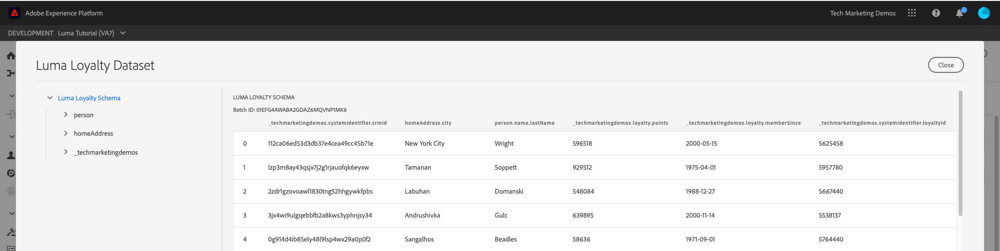

# 內嵌批次資料

<!-- 1hr-->
在本課程中，您將使用各種方法將批次資料內嵌至Experience Platform。

批次資料內嵌可讓您一次將大量資料內嵌至Adobe Experience Platform。 您可以在Platform介面或使用API一次性上傳內嵌批次資料。 您也可以使用來源連接器，從第三方服務（例如雲端儲存服務）定期設定排程的批次上傳。

**資料工程師** 需要在本教學課程之外內嵌批次資料。

開始練習之前，請觀看此短片，以深入了解資料內嵌：
>[!VIDEO](https://video.tv.adobe.com/v/27106?quality=12&learn=on)


## 需要權限

在 [設定權限](configure-permissions.md) 課程中，您設定了完成本課程所需的所有訪問控制。

<!--
* Permission item **[!UICONTROL Data Management]** > **[!UICONTROL View Datasets]**, **[!UICONTROL Manage Datasets]** and **[!UICONTROL Data Monitoring]**
* Permission items **[!UICONTROL Data Ingestion]** > **[!UICONTROL View Sources]** and **[!UICONTROL Manage Sources]**
* Permission item **[!UICONTROL Profile Management]** > **[!UICONTROL View Profiles]**
* Permission item **[!UICONTROL Sandboxes]** > `Luma Tutorial`
* User-role access to the `Luma Tutorial Platform` product profile
* Developer-role access to the `Luma Tutorial Platform` product profile (for API)
-->

在「來源」練習中，您需要存取(S)FTP伺服器或雲端儲存空間解決方案。 如果您沒有，可以解決。

## 使用Platform使用者介面批次內嵌資料

資料可以JSON和鑲木地板格式，直接上傳至資料集畫面上的資料集。 這是在建立

### 下載並準備資料

首先，取得範例資料，並針對您的租用戶加以自訂：

>[!NOTE]
>
>包含於 [luma-data.zip](assets/luma-data.zip) 檔案是虛構的，僅供展示之用。

1. 下載 [luma-data.zip](assets/luma-data.zip) 至 **Luma教學課程Assets** 檔案夾。
1. 將檔案解壓縮，建立名為 `luma-data` 其中包含我們在本課程中將使用的四個資料檔案
1. 開啟 `luma-loyalty.json` 在文字編輯器中，並取代 `_techmarketingdemos` 使用您自己的底線租用戶id，如您自己的結構所示：
   

1. 儲存更新的檔案

### 內嵌資料

1. 在Platform使用者介面中，選取 **[!UICONTROL 資料集]** 在左側導覽列中
1. 開啟 `Luma Loyalty Dataset`
1. 向下捲動，直到您看到 **[!UICONTROL 新增資料]** 區段
1. 上傳 `luma-loyalty.json` 檔案。
1. 上傳檔案後，就會顯示批次的列
1. 如果您在幾分鐘後重新載入頁面，應該會看到批次已成功上傳，有1000筆記錄和1000個設定檔片段。

   
<!--do i need to explain error diagnostics and partial ingestion-->

>[!NOTE]
>
>有幾種選擇， **[!UICONTROL 錯誤診斷]** 和 **[!UICONTROL 部分擷取]**，您將在本課程的各種畫面上看到。 本教學課程未涵蓋這些選項。 一些快速資訊：
>
>* 啟用錯誤診斷會產生資料擷取，接著您就可以使用資料存取API來檢閱。 深入了解 [檔案](https://experienceleague.adobe.com/docs/experience-platform/data-access/home.html).
>* 部分內嵌可讓您內嵌包含錯誤的資料，最多可以指定特定臨界值。 深入了解 [檔案](https://experienceleague.adobe.com/docs/experience-platform/ingestion/batch/partial.html)


### 驗證資料

有幾種方法可確認資料已成功擷取。

#### 在Platform使用者介面中進行驗證

若要確認資料已內嵌至資料集：

1. 在您擷取資料的相同頁面上，選取 **[!UICONTROL 預覽資料集]** 按鈕
1. 選取 **預覽** 按鈕，您應該就能看到部分擷取的資料。

   


若要確認資料進入設定檔（資料進入可能需要幾分鐘的時間）:

1. 前往 **[!UICONTROL 設定檔]** 在左側導覽列中
1. 選取 **[!UICONTROL 選取身分命名空間]** 欄位以開啟強制回應視窗
1. 選取 `Luma Loyalty Id` 命名空間
1. 然後輸入 `loyaltyId` 資料集中的值，  `5625458`
1. 選擇 **[!UICONTROL 檢視]**

   

#### 使用資料擷取事件進行驗證

如果您在上一堂課中訂閱資料擷取事件，請檢查您的唯一webhook.site URL。 您應該會看到三個請求依下列順序顯示，其中間會有一段時間，並包含下列內容 `eventCode` 值：

1. `ing_load_success` — 所擷取的批次
1. `ig_load_success` — 批次擷取至「身分圖」
1. `ps_load_success` — 批次已內嵌至設定檔服務


請參閱 [檔案](https://experienceleague.adobe.com/docs/experience-platform/ingestion/quality/subscribe-events.html#available-status-notification-events) 以取得通知的詳細資訊。

## 使用Platform API批次內嵌資料

現在來使用API上傳資料。

>[!NOTE]
>
>資料架構師可透過使用者介面方法上傳CRM資料。

### 下載並準備資料

1. 您應已下載並解壓縮 [luma-data.zip](assets/luma-data.zip) 進入 `Luma Tutorial Assets` 檔案夾。
2. 開啟 `luma-crm.json` 在文字編輯器中，並取代 `_techmarketingdemos` 使用您自己的底線租用戶id，如您的結構中所示
3. 儲存更新的檔案

### 取得資料集ID

先取得要擷取資料之資料集的資料集ID:

1. 開啟 [!DNL Postman]
1. 如果您在過去24小時內未提出請求，則您的授權Token可能已過期。 開啟請求 **[!DNL Adobe I/O Access Token Generation > Local Signing (Non-production use-only) > IMS: JWT Generate + Auth via User Token]** 選取 **傳送** 請求新的JWT和存取權杖，就像您在 [!DNL Postman] 教訓。
1. 開啟環境變數，並確認 **CONTAINER_ID** 仍為 `tenant`
1. 開啟請求 **[!DNL Catalog Service API > Datasets > Retrieve a list of datasets.]** 選取 **傳送**
1. 你應該得到 `200 OK` 回應
1. 複製 `Luma CRM Dataset` 來自回應內文
   

### 建立批

現在，我們可以在資料集中建立批次資料：

1. 下載 [資料擷取API.postman_collection.json](https://raw.githubusercontent.com/adobe/experience-platform-postman-samples/master/apis/experience-platform/Data%20Ingestion%20API.postman_collection.json) 至 `Luma Tutorial Assets` 資料夾
1. 將集合匯入 [!DNL Postman]
1. 選擇請求 **[!DNL Data Ingestion API > Batch Ingestion > Create a new batch in Catalog Service.]**
1. 將下列項目貼上為 **主體** 請求， ***將datasetId值取代為您自己的值***:

   ```json
   {
       "datasetId":"REPLACE_WITH_YOUR_OWN_DATASETID",
       "inputFormat": {
           "format": "json"
       }
   }
   ```

1. 選取 **傳送** 按鈕
1. 您應該會收到包含新批次ID的201 Created回應！
1. 複製 `id` 新批
   

### 內嵌資料

現在，我們可以將資料上傳至批次中：

1. 選擇請求 **[!DNL Data Ingestion API > Batch Ingestion > Upload a file to a dataset in a batch.]**
1. 在 **Params** 索引標籤，在各自的欄位中輸入資料集id和批次id
1. 在 **Params** ，輸入 `luma-crm.json` 作為 **filePath**
1. 在 **主體** 頁簽，選擇 **二進位** 選項
1. 選取已下載的 `luma-crm.json` 從本地 `Luma Tutorial Assets` 資料夾
1. 選擇 **傳送** 回應內文中應會顯示「1」，並顯示「200 OK」回應

   

此時，如果您在Platform使用者介面中查看批次資料，會發現其位於「[!UICONTROL 載入]&quot;狀態：


由於批次API通常用於上傳多個檔案，因此您需要告知Platform批次何時完成，我們將在下一步中完成。

### 完成批

要完成批，請執行以下操作：

1. 選擇請求 **[!DNL Data Ingestion API > Batch Ingestion > Finish uploading a file to a dataset in a batch.]**
1. 在 **Params** ，輸入 `COMPLETE` 作為 **動作**
1. 在 **Params** 標籤，輸入批ID。 若資料集id或filePath存在，請不要擔心。
1. 請確定POST的URL為 `https://platform.adobe.io/data/foundation/import/batches/:batchId?action=COMPLETE` 而且沒有任何不必要的 `datasetId` 或 `filePath`
1. 選擇 **傳送** 回應內文中應會顯示「1」，並顯示「200 OK」回應

   

### 驗證資料

#### 在Platform使用者介面中進行驗證

驗證資料是否已進入Platform使用者介面，就像您對忠誠度資料集所做的一樣。

首先，確認批次顯示已擷取1000筆記錄：


接下來，使用「預覽」資料集確認批次：


最後，確認已建立其中一個設定檔，方法是查詢 `Luma CRM Id` 命名空間，例如 `112ca06ed53d3db37e4cea49cc45b71e`


我想指出的是，剛剛發生的一件有趣的事。 開啟 `Danny Wright` 設定檔。 設定檔同時具有 `Lumacrmid` 和 `Lumaloyaltyid`. 記住 `Luma Loyalty Schema` 包含兩個身分欄位： Luma Loyaty Id和CRM ID。 我們已上傳兩個資料集，它們已合併至單一設定檔。 忠誠度資料 `Daniel` 作為名字，以及以「紐約市」作為住址，而CRM資料具有 `Danny` 名字和 `Portland` 作為具有相同忠誠度ID之客戶的首頁地址。 我們會回到名字顯示的原因 `Danny` 中的。

恭喜，您剛剛合併了用戶檔案！


#### 使用資料擷取事件進行驗證

如果您在上一堂課中訂閱資料擷取事件，請檢查您的唯一webhook.site URL。 您應會看到有三個請求傳入，就像忠誠度資料一樣：


請參閱 [檔案](https://experienceleague.adobe.com/docs/experience-platform/ingestion/quality/subscribe-events.html#available-status-notification-events) 以取得通知的詳細資訊。

## 使用工作流程內嵌資料

讓我們看看另一種上傳資料的方式。 工作流程功能可讓您內嵌尚未在XDM中模型化的CSV資料。

### 下載並準備資料

1. 您應已下載並解壓縮 [luma-data.zip](assets/luma-data.zip) 進入 `Luma Tutorial Assets` 檔案夾。
1. 確認您`luma-products.csv`

### 建立工作流程

現在來設定工作流程：

1. 前往 **[!UICONTROL 工作流程]** 在左側導覽列中
1. 選擇 **[!UICONTROL 將CSV對應至XDM結構]** ，然後選取 **[!UICONTROL Launch]** 按鈕
   
1. 選取 `Luma Product Catalog Dataset` ，然後選取 **[!UICONTROL 下一個]** 按鈕
   
1. 新增 `luma-products.csv` 下載的檔案，然後選取 **[!UICONTROL 下一個]** 按鈕
   
1. 現在您位於映射器介面中，您可以在其中映射源資料中的欄位( `luma-products.csv` 檔案)轉換為目標架構中的XDM欄位。 在我們的示例中，列名稱與架構欄位名稱足夠接近，映射器能夠自動檢測正確的映射！ 如果映射器無法自動檢測右欄位，您將選擇目標欄位右側的表徵圖，以選擇正確的XDM欄位。 此外，如果您不想從CSV擷取其中一欄，可以從映射器刪除該列。 歡迎在 `luma-products.csv` 來熟悉映射器的運作方式。
1. 選取 **[!UICONTROL 完成]** 按鈕
   

### 驗證資料

上傳批次後，請預覽資料集以驗證上傳。

由於 `Luma Product SKU` 是非人員命名空間，我們不會看到產品sku的任何設定檔。

您應該會看到您的網頁鈎點的三個點擊。

## 使用來源內嵌資料

好吧，你做事很艱難。 現在，讓我們進入 _自動化_ 批次內嵌！ 我說，「設定！」 你說，「算了！」 「設定！」 「算了！」 「設定！」 「算了！」 開玩笑的，你絕不會做這種事的！ 好，回去工作。 你快完了。

前往 **[!UICONTROL 來源]** ，開啟「來源」目錄。 此處您會看到各種現成可用的整合，與業界領先的資料和儲存提供商。


好，讓我們使用來源連接器擷取資料。

本練習將採用自選的冒險風格。 我將使用FTP來源連接器來顯示工作流程。 您可以使用公司中使用的其他雲端儲存空間來源連接器，或像處理忠誠度資料一樣，使用資料集使用者介面上傳JSON檔案。

許多來源的設定工作流程類似，您可以：

1. 輸入您的驗證詳細資訊
1. 選取您要擷取的資料
1. 選取您要內嵌的Platform資料集
1. 將欄位對應至您的XDM結構
1. 選擇您要從該位置擷取資料的頻率

>[!NOTE]
>
>我們將在本練習中使用的離線購買資料包含日期時間資料。 日期時間資料應位於 [ISO 8061格式化字串](https://www.iso.org/iso-8601-date-and-time-format.html) (&quot;2018-07-10T15&quot;:05:59.000-08:00英吋)或以毫秒(1531263959000)為單位的Unix時間格式，並會在擷取時轉換為目標XDM類型。 如需資料轉換和其他限制的詳細資訊，請參閱 [批次擷取API檔案](https://experienceleague.adobe.com/docs/experience-platform/ingestion/batch/api-overview.html#types).

### 下載、準備資料並上傳至您偏好的雲端儲存供應商

1. 您應已下載並解壓縮 [luma-data.zip](assets/luma-data.zip) 進入 `Luma Tutorial Assets` 檔案夾。
1. 開啟 `luma-offline-purchases.json` 在文字編輯器中，並取代 `_techmarketingdemos` 使用您自己的底線租用戶id，如您的結構中所示
1. 更新所有時間戳記，使事件在上個月發生(例如，搜尋 `"timestamp":"2022-06` 並取代年月)
1. 選擇您偏好的雲端儲存空間提供者，確認可在 [!UICONTROL 來源] 目錄
1. 上傳 `luma-offline-purchases.json` 到您首選的雲儲存提供商中的位置

### 將資料內嵌至您偏好的雲端儲存空間位置

1. 在Platform使用者介面中，篩選 [!UICONTROL 來源] 目錄 **[!UICONTROL 雲端儲存空間]**
1. 請注意， `...`
1. 在您偏好的雲端儲存供應商的方塊中，選取 **[!UICONTROL 設定]** 按鈕
   
1. **[!UICONTROL 驗證]** 是第一步。 輸入帳戶的名稱，例如 `Luma's FTP Account` 和您的驗證詳細資訊。 所有雲端儲存來源的此步驟都應相當類似，不過欄位可能稍有不同。 一旦輸入了帳戶的驗證詳細資訊，您就可以對其他源連接重複使用它們，這些連接可能會在不同的計畫上發送不同資料，而同一帳戶中的其他檔案則會發送不同的資料
1. 選取 **[!UICONTROL 「連接到源」按鈕]**
1. 當Platform成功連接到源時，請選擇 **[!UICONTROL 下一個]** 按鈕
   

1. 在 **[!UICONTROL 選擇資料]** 步驟中，使用者介面會使用您的憑證，開啟雲端儲存解決方案上的資料夾
1. 選取您要擷取的檔案，例如 `luma-offline-purchases.json`
1. 作為 **[!UICONTROL 資料格式]**，選取 `XDM JSON`
1. 接著，您就可以預覽檔案中的json結構和範例資料
1. 選取 **[!UICONTROL 下一個]** 按鈕
   

1. 在 **[!UICONTROL 對應]** 步驟，選取 `Luma Offline Purchase Events Dataset` ，然後選取 **[!UICONTROL 下一個]** 按鈕。 訊息中請注意，由於我們擷取的資料是JSON檔案，因此沒有將來源欄位對應至目標欄位的對應步驟。 JSON資料必須已位於XDM中。 如果您擷取CSV，則會在此步驟中看到完整的對應使用者介面：
   
1. 在 **[!UICONTROL 排程]** 步驟中，選擇要從源中重錄資料的頻率。 請花點時間看看選項。 我們只要進行一次性擷取，請離開 **[!UICONTROL 頻率]** on **[!UICONTROL 一次]** ，然後選取 **[!UICONTROL 下一個]** 按鈕：
   
1. 在 **[!UICONTROL 資料流詳細資訊]** 步驟，您可以為資料流選擇名稱、輸入可選說明、開啟錯誤診斷和部分內嵌。 保留設定原樣，並選取 **[!UICONTROL 下一個]** 按鈕：
   
1. 在 **[!UICONTROL 檢閱]** 步驟中，您可以一起檢閱所有設定，然後編輯或選取 **[!UICONTROL 完成]** 按鈕
1. 儲存後，您會以下列方式進入螢幕：
   

### 驗證資料

上傳批次後，請預覽資料集以驗證上傳。

您應該會看到您的網頁鈎點的三個點擊。

使用值查詢設定檔 `5625458` 在 `loyaltyId` 命名空間，查看其設定檔中是否有任何購買事件。 您應該會看到一次購買。 您可以透過選取 **[!UICONTROL 檢視JSON]**:


## ETL工具

Adobe與多家ETL廠商合作，支援資料內嵌至Experience Platform。 由於協力廠商多種多樣，本教學課程不涵蓋ETL，不過歡迎您檢閱其中一些資源：

* [開發適用於Adobe Experience Platform的ETL整合](https://experienceleague.adobe.com/docs/experience-platform/etl/home.html)
* [Informatica Adobe Experience Platform ConnectorAdobeExchange頁面](https://exchange.adobe.com/experiencecloud.details.101570.informatica-adobe-experience-cloud-connector.html)
* [Adobe Experience Platform Connector的資訊檔案 ](https://docs.informatica.com/integration-cloud/cloud-data-integration-connectors/current-version/adobe-experience-platform-connector/preface.html)
* [衍生自資料的不重複受眾體驗：Unifi與Adobe Experience Platform](https://unifisoftware.com/solutions/adobe-experience-platform/)
* [[!DNL Snaplogic] Adobe Experience Platform Snap Pack](https://www.snaplogic.com/resources/videos/august-2020-aep)

## 其他資源

* [批次內嵌檔案](https://experienceleague.adobe.com/docs/experience-platform/ingestion/batch/overview.html)
* [批次內嵌API參考](https://www.adobe.io/experience-platform-apis/references/data-ingestion/#tag/Batch-Ingestion)

現在，讓我們 [使用Web SDK流資料](ingest-streaming-data.md)
