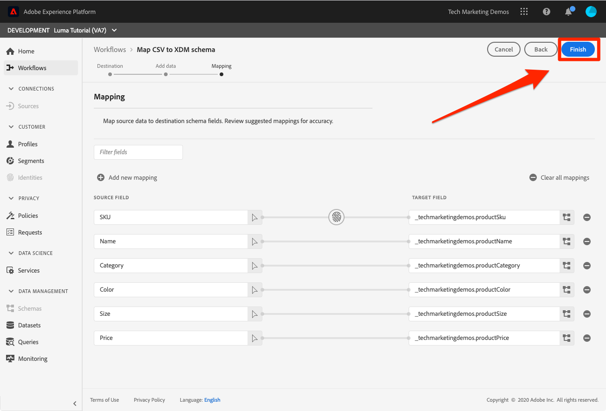

# 擷取批次資料

<!-- 1hr-->
在本課程中，您將使用各種方法將批次資料擷取到Experience Platform。

批次資料擷取可讓您將大量資料一次擷取到Adobe Experience Platform。 您可以在Platform介面中或使用API，一次上傳內嵌批次資料。 您也可以使用來源聯結器設定從協力廠商服務（例如雲端儲存服務）定期排程的批次上傳。

**資料工程師** 需要在本教學課程之外擷取批次資料。

在開始練習之前，請觀看這段短片，以進一步瞭解資料擷取：

>[!VIDEO](https://video.tv.adobe.com/v/27106?quality=12&learn=on)


## 需要的許可權

在 [設定許可權](configure-permissions.md) 課程，您可以設定完成本課程所需的所有存取控制項。

<!--
* Permission item **[!UICONTROL Data Management]** > **[!UICONTROL View Datasets]**, **[!UICONTROL Manage Datasets]** and **[!UICONTROL Data Monitoring]**
* Permission items **[!UICONTROL Data Ingestion]** > **[!UICONTROL View Sources]** and **[!UICONTROL Manage Sources]**
* Permission item **[!UICONTROL Profile Management]** > **[!UICONTROL View Profiles]**
* Permission item **[!UICONTROL Sandboxes]** > `Luma Tutorial`
* User-role access to the `Luma Tutorial Platform` product profile
* Developer-role access to the `Luma Tutorial Platform` product profile (for API)
-->

在「來源」練習中，您將需要存取(S) FTP伺服器或雲端儲存空間解決方案。 如果您沒有解決方法。

## 使用Platform使用者介面批次擷取資料

資料可以採用JSON和Parquet格式，直接上傳到資料集畫面上的資料集中。 這是建立「 」後測試部分資料擷取的絕佳方式

### 下載並準備資料

首先，取得範例資料並根據您的租使用者自訂：

>[!NOTE]
>
>包含在 [luma-data.zip](assets/luma-data.zip) 檔案是虛構的，僅供示範使用。

1. 下載 [luma-data.zip](assets/luma-data.zip) 至您的 **Luma教學課程資產** 資料夾。
1. 解壓縮檔案，建立名為的資料夾 `luma-data` 其中包含我們在本課程中會使用的四個資料檔案
1. 開啟 `luma-loyalty.json` 在文字編輯器中並取代所有例項 `_techmarketingdemos` 使用您自己的underscore-tenant id，如您自己的結構描述中所示：
   

1. 儲存更新的檔案

### 擷取資料

1. 在平台使用者介面中，選取「 」 **[!UICONTROL 資料集]** 在左側導覽列中
1. 開啟您的 `Luma Loyalty Dataset`
1. 向下捲動，直到您看到 **[!UICONTROL 新增資料]** 右側欄中的區段
1. 上傳 `luma-loyalty.json` 檔案。
1. 上傳檔案後，批次的列將會出現
1. 如果您在幾分鐘後重新載入頁面，應該會看到批次已成功上傳，包含1000筆記錄和1000個設定檔片段。

   
   <!--do i need to explain error diagnostics and partial ingestion-->

>[!NOTE]
>
>有一些選項， **[!UICONTROL 錯誤診斷]** 和 **[!UICONTROL 部分擷取]**，即在本課程的各個熒幕中看到的專案。 這些選項未在本教學課程中說明。 一些快速資訊：
>
>* 啟用錯誤診斷會產生有關資料擷取的資料，然後您可以使用資料存取API進行檢閱。 瞭解更多相關資訊，請參閱 [說明檔案](https://experienceleague.adobe.com/docs/experience-platform/data-access/home.html).
>* 部分擷取可讓您擷取包含錯誤的資料，最多可擷取到您可以指定的特定臨界值。 瞭解更多相關資訊，請參閱 [說明檔案](https://experienceleague.adobe.com/docs/experience-platform/ingestion/batch/partial.html)

### 驗證資料

有幾種方式可確認資料已成功內嵌。

#### 在Platform使用者介面中驗證

若要確認資料已內嵌至資料集：

1. 在您擷取資料的相同頁面上，選取 **[!UICONTROL 預覽資料集]** 右上角的按鈕
1. 選取 **預覽** 按鈕，您應該能夠檢視一些擷取的資料。

   


若要確認資料已著陸至設定檔（可能需要幾分鐘才能著陸資料）：

1. 前往 **[!UICONTROL 設定檔]** 在左側導覽列中
1. 選取「 」旁的圖示 **[!UICONTROL 選取身分名稱空間]** 開啟強制回應視窗的欄位
1. 選取您的 `Luma Loyalty Id` 名稱空間
1. 然後輸入其中一項 `loyaltyId` 資料集中的值，  `5625458`
1. 選取 **[!UICONTROL 檢視]**
   

#### 使用資料擷取事件進行驗證

如果您訂閱了上堂課中的資料擷取事件，請檢查您獨特的webhook.site URL。 您應該會看到三個請求以下列順序顯示，中間有一些時間，如下所示 `eventCode` 值：

1. `ing_load_success` — 擷取的批次
1. `ig_load_success` — 批次已擷取到身分圖表中
1. `ps_load_success` — 已將批次擷取到設定檔服務


請參閱 [檔案](https://experienceleague.adobe.com/docs/experience-platform/ingestion/quality/subscribe-events.html#available-status-notification-events) 以取得有關通知的詳細資訊。

## 使用Platform API批次擷取資料

現在，讓我們使用API上傳資料。

>[!NOTE]
>
>資料架構師可透過使用者介面方法來上傳CRM資料。

### 下載並準備資料

1. 您應該已經下載並解壓縮 [luma-data.zip](assets/luma-data.zip) 至您的 `Luma Tutorial Assets` 資料夾。
2. 開啟 `luma-crm.json` 在文字編輯器中並取代所有例項 `_techmarketingdemos` 使用您自己的underscore-tenant id，如您的結構描述所示
3. 儲存更新的檔案

### 取得資料集ID

首先，取得要擷取資料的資料集資料集ID的ID：

1. 開啟 [!DNL Postman]
1. 如果您沒有存取權杖，請開啟請求 **[!DNL OAuth: Request Access Token]** 並選取 **傳送** 以請求新的存取Token，就像在 [!DNL Postman] 課程。
1. 開啟您的環境變數，並確定 **CONTAINER_ID** 仍為 `tenant`
1. 開啟請求 **[!DNL Catalog Service API > Datasets > Retrieve a list of datasets.]** 並選取 **傳送**
1. 您應會收到 `200 OK` 回應
1. 複製的ID `Luma CRM Dataset` 來自回應內文
   

### 建立批次

現在，我們可以在資料集中建立批次：

1. 下載 [資料擷取API.postman_collection.json](https://raw.githubusercontent.com/adobe/experience-platform-postman-samples/master/apis/experience-platform/Data%20Ingestion%20API.postman_collection.json) 至您的 `Luma Tutorial Assets` 資料夾
1. 將集合匯入 [!DNL Postman]
1. 選取請求 **[!DNL Data Ingestion API > Batch Ingestion > Create a new batch in Catalog Service.]**
1. 將下列內容貼上為 **內文** 請求的， ***將datasetId值取代為您自己的值***：

   ```json
   {
       "datasetId":"REPLACE_WITH_YOUR_OWN_DATASETID",
       "inputFormat": {
           "format": "json"
       }
   }
   ```

1. 選取 **傳送** 按鈕
1. 您應會收到包含新批次ID的「201已建立」回應！
1. 複製 `id` 新批次的
   

### 擷取資料

現在可以將資料上傳到批次中：

1. 選取請求 **[!DNL Data Ingestion API > Batch Ingestion > Upload a file to a dataset in a batch.]**
1. 在 **引數** 索引標籤中，在各自的欄位中輸入您的資料集id和批次id
1. 在 **引數** tab，輸入 `luma-crm.json` 作為 **檔案路徑**
1. 在 **內文** 索引標籤中，選取 **二進位** option
1. 選取下載的 `luma-crm.json` 從您的本機 `Luma Tutorial Assets` 資料夾
1. 選取 **傳送** 而且您應該在回應內文中取得含有「1」的200 OK回應

   

此時，如果您在Platform使用者介面中檢視批次，您會看到它位於「[!UICONTROL 正在載入]「狀態：


由於Batch API通常用於上傳多個檔案，因此您需要在批次完成時告知Platform，我們將在下一個步驟中執行此操作。

### 完成批次

若要完成批次，請執行下列動作：

1. 選取請求 **[!DNL Data Ingestion API > Batch Ingestion > Finish uploading a file to a dataset in a batch.]**
1. 在 **引數** tab，輸入 `COMPLETE` 作為 **動作**
1. 在 **引數** 標籤，輸入您的批次id。 如果資料集ID或filePath存在，您不必擔心。
1. 確認POST的URL為 `https://platform.adobe.io/data/foundation/import/batches/:batchId?action=COMPLETE` 且沒有任何不必要的參考資料至 `datasetId` 或 `filePath`
1. 選取 **傳送** 而且您應該在回應內文中取得含有「1」的200 OK回應

   

### 驗證資料

#### 在Platform使用者介面中驗證

驗證資料已如您對忠誠度資料集所做的一樣，著陸至Platform使用者介面。

首先，確認批次顯示1000筆記錄已擷取：


接下來，使用預覽資料集確認批次：


最後，透過以下方式查詢其中一個設定檔，確認已建立您的其中一個設定檔： `Luma CRM Id` 名稱空間，例如 `112ca06ed53d3db37e4cea49cc45b71e`


我想指出一件有趣的事，剛發生過。 開啟該 `Danny Wright` 設定檔。 設定檔同時具有 `Lumacrmid` 和 `Lumaloyaltyid`. 記住 `Luma Loyalty Schema` 包含兩個身分欄位，Luma忠誠度Id和CRM Id。 現在我們已上傳兩個資料集，它們已合併至單一設定檔。 忠誠度資料具有 `Daniel` 以「New York City」為名字，以「New York City」為住家地址，而CRM資料則 `Danny` 作為名字和 `Portland` 作為具有相同忠誠度ID之客戶的住家地址。 我們將回到名字顯示的原因 `Danny` 合併原則課程中。

恭喜，您剛才已合併設定檔！


#### 使用資料擷取事件進行驗證

如果您訂閱了上堂課中的資料擷取事件，請檢查您獨特的webhook.site URL。 您應該會看到傳入三個請求，就像忠誠度資料一樣：


請參閱 [檔案](https://experienceleague.adobe.com/docs/experience-platform/ingestion/quality/subscribe-events.html#available-status-notification-events) 以取得有關通知的詳細資訊。

## 使用工作流程內嵌資料

讓我們來看看另一種上傳資料的方式。 工作流程功能可讓您擷取尚未在XDM中模型化的CSV資料。

### 下載並準備資料

1. 您應該已經下載並解壓縮 [luma-data.zip](assets/luma-data.zip) 至您的 `Luma Tutorial Assets` 資料夾。
1. 確認您擁有`luma-products.csv`

### 建立工作流程

現在來設定工作流程：

1. 前往 **[!UICONTROL 工作流程]** 在左側導覽列中
1. 選取 **[!UICONTROL 將CSV對應至XDM結構描述]** 並選取 **[!UICONTROL Launch]** 按鈕
   
1. 選取您的 `Luma Product Catalog Dataset` 並選取 **[!UICONTROL 下一個]** 按鈕
   
1. 新增 `luma-products.csv` 您下載的檔案並選取 **[!UICONTROL 下一個]** 按鈕
   
1. 現在您位於對應程式介面，您可以在其中對應來源資料（中的欄名稱之一）中的欄位。 `luma-products.csv` 檔案)的XDM欄位中重新命名。 在我們的範例中，欄名稱與結構描述欄位名稱足夠接近，因此對應程式能夠自動偵測到正確的對應！ 如果對應程式無法自動偵測正確的欄位，您可以選取目標欄位右側的圖示，以選取正確的XDM欄位。 此外，如果您不想從CSV擷取其中一欄，可以從對應程式中刪除該列。 歡迎您隨時嘗試並變更中的欄標題 `luma-products.csv` 以熟悉對應程式的運作方式。
1. 選取 **[!UICONTROL 完成]** 按鈕
   

### 驗證資料

批次上傳後，請預覽資料集以驗證上傳。

由於 `Luma Product SKU` 是非人員名稱空間，我們將不會看到產品sku的任何設定檔。

您應該會看到webhook的三個點選。

## 使用來源內嵌資料

好吧，你做事很辛苦。 現在，讓我們進入的樂土 _自動化_ 批次內嵌！ 當我說「SET IT！」 您會說：「算了！」 「設定它！」 「算了！」 「設定它！」 「算了！」 開玩笑的，你絕不會做這種事！ 好的，繼續工作。 您即將完成。

前往 **[!UICONTROL 來源]** 在左側導覽中開啟「來源」目錄。 在這裡，您將看到各種現成的整合，與領先業界的資料和儲存提供者整合。


好，讓我們使用來源聯結器來內嵌資料。

此練習將為您自行選擇冒險的風格。 我將使用FTP來源聯結器顯示工作流程。 您可以使用貴公司使用的不同雲端儲存空間來源聯結器，或使用資料集使用者介面上傳json檔案，就像處理忠誠度資料一樣。

許多來源都有類似的設定工作流程，您可以在其中執行下列作業：

1. 輸入您的驗證詳細資料
1. 選取您要擷取的資料
1. 選取您要擷取它的Platform資料集
1. 將欄位對應至您的XDM結構描述
1. 選擇您要從該位置擷取資料的頻率

>[!NOTE]
>
>我們在本練習中將使用的離線購買資料包含日期時間資料。 日期時間資料應位於以下任一位置： [ISO 8061格式字串](https://www.iso.org/iso-8601-date-and-time-format.html) (「2018-07-10T15」:05:59.000-08:00英吋)或Unix時間(以毫秒為單位，1531263959000會在擷取時轉換為目標XDM型別。 如需資料轉換和其他限制的詳細資訊，請參閱 [批次擷取API檔案](https://experienceleague.adobe.com/docs/experience-platform/ingestion/batch/api-overview.html#types).

### 下載、準備資料並將其上傳到您偏好的雲端儲存空間供應商

1. 您應該已經下載並解壓縮 [luma-data.zip](assets/luma-data.zip) 至您的 `Luma Tutorial Assets` 資料夾。
1. 開啟 `luma-offline-purchases.json` 在文字編輯器中並取代所有例項 `_techmarketingdemos` 使用您自己的underscore-tenant id，如您的結構描述所示
1. 更新所有時間戳記，讓事件在上個月發生(例如，搜尋 `"timestamp":"2022-06` 和取代年和月)
1. 選擇您偏好的雲端儲存空間提供者，確認可在 [!UICONTROL 來源] 目錄
1. 上傳 `luma-offline-purchases.json` 至您偏好的雲端儲存空間提供者中的位置

### 將資料內嵌至您偏好的雲端儲存位置

1. 在Platform使用者介面中篩選 [!UICONTROL 來源] 目錄至 **[!UICONTROL 雲端儲存空間]**
1. 請注意，底下的檔案連結很方便 `...`
1. 在您偏好的雲端儲存供應商方塊中，選取 **[!UICONTROL 設定]** 按鈕
   
1. **[!UICONTROL 驗證]** 是第一步。 輸入帳戶名稱，例如 `Luma's FTP Account` 以及您的驗證詳細資料。 雖然欄位可能會稍有不同，但此步驟對於所有雲端儲存空間來源來說應該都相當類似。 輸入帳戶的驗證詳細資料後，您可以將其重新用於其他來源連線，這些連線可能以不同排程傳送來自相同帳戶中其他檔案的不同資料
1. 選取 **[!UICONTROL 連線到來源按鈕]**
1. 當Platform成功連線到來源時，請選取 **[!UICONTROL 下一個]** 按鈕
   

1. 於 **[!UICONTROL 選取資料]** 步驟，使用者介面將使用您的憑證開啟雲端儲存解決方案上的資料夾
1. 選取您要擷取的檔案，例如 `luma-offline-purchases.json`
1. 作為 **[!UICONTROL 資料格式]**，選取 `XDM JSON`
1. 然後您可以預覽json結構和檔案中的範例資料
1. 選取 **[!UICONTROL 下一個]** 按鈕
   

1. 於 **[!UICONTROL 對應]** 步驟，選取您的 `Luma Offline Purchase Events Dataset` 並選取 **[!UICONTROL 下一個]** 按鈕。 在訊息中請注意，由於我們要擷取的資料是JSON檔案，因此沒有將來源欄位對應到目標欄位的對應步驟。 JSON資料必須已經位於XDM中。 如果您正在內嵌CSV，您會在此步驟中看到完整對應使用者介面：
   
1. 於 **[!UICONTROL 排程]** 步驟，您可以選擇從來源擷取資料的頻率。 請花點時間檢視選項。 我們即將執行一次性內嵌，因此請將 **[!UICONTROL 頻率]** 於 **[!UICONTROL 一次]** 並選取 **[!UICONTROL 下一個]** 按鈕：
   
1. 於 **[!UICONTROL 資料流詳細資料]** 步驟，您可以為資料流選擇名稱、輸入選擇性說明、開啟錯誤診斷以及部分擷取。 將設定維持原狀，並選取 **[!UICONTROL 下一個]** 按鈕：
   
1. 於 **[!UICONTROL 檢閱]** 步驟，您可以一起檢閱所有設定並加以編輯或選取 **[!UICONTROL 完成]** 按鈕
1. 儲存後，您會如下所示進入畫面：
   

### 驗證資料

批次上傳後，請預覽資料集以驗證上傳。

您應該會看到webhook的三個點選。

使用值查詢設定檔 `5625458` 在 `loyaltyId` 再次檢視名稱空間，檢視其設定檔中是否有任何購買事件。 您應該會看到一次購買。 您可以選取「 」，深入瞭解購買的詳細資料 **[!UICONTROL 檢視JSON]**：


## ETL工具

與多個ETL廠商Adobe合作夥伴，以支援將資料擷取到Experience Platform。 由於協力廠商的多樣性，本教學課程不涉及ETL，不過歡迎您檢閱以下部分資源：

* [為Adobe Experience Platform開發ETL整合](https://experienceleague.adobe.com/docs/experience-platform/etl/home.html)
* [Adobe Exchange上的Informatica Adobe Experience Platform Connector頁面](https://exchange.adobe.com/experiencecloud.details.101570.informatica-adobe-experience-cloud-connector.html)
* [Adobe Experience Platform Connector的資訊檔案](https://docs.informatica.com/integration-cloud/cloud-data-integration-connectors/current-version/adobe-experience-platform-connector/preface.html)
* [[!DNL Snaplogic] Adobe Experience Platform快照套件](https://www.snaplogic.com/resources/videos/august-2020-aep)

## 其他資源

* [批次擷取檔案](https://experienceleague.adobe.com/docs/experience-platform/ingestion/batch/overview.html)
* [批次擷取API參考](https://developer.adobe.com/experience-platform-apis/references/batch-ingestion/)

現在，讓我們 [使用Web SDK串流資料](ingest-streaming-data.md)
