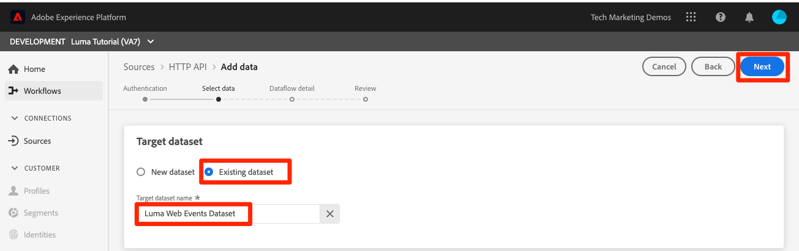
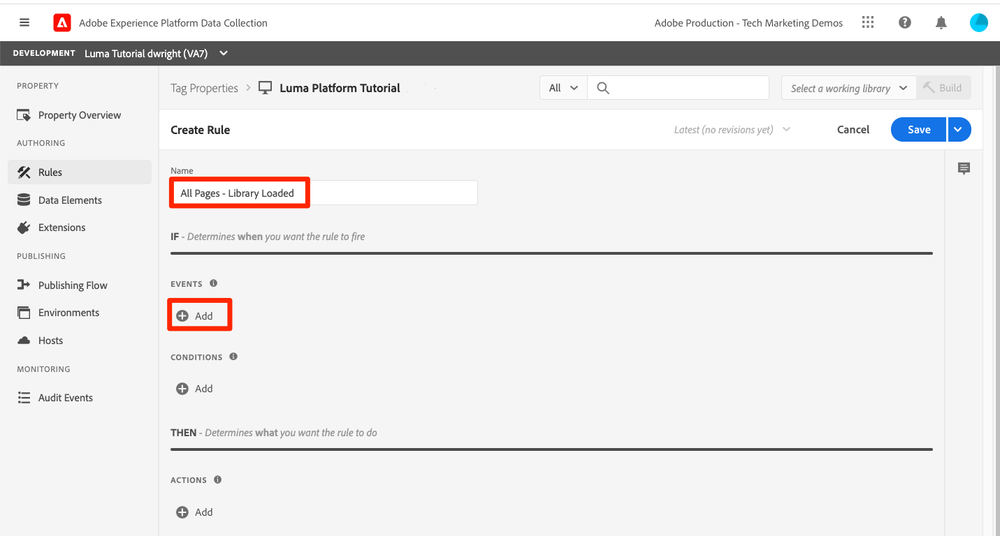
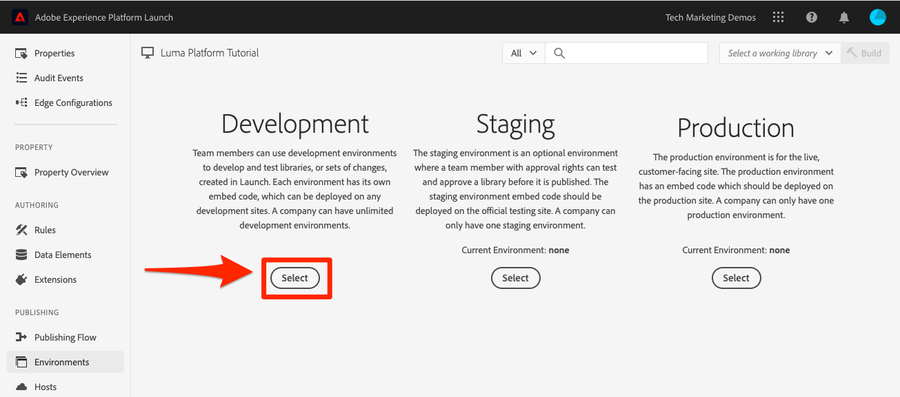
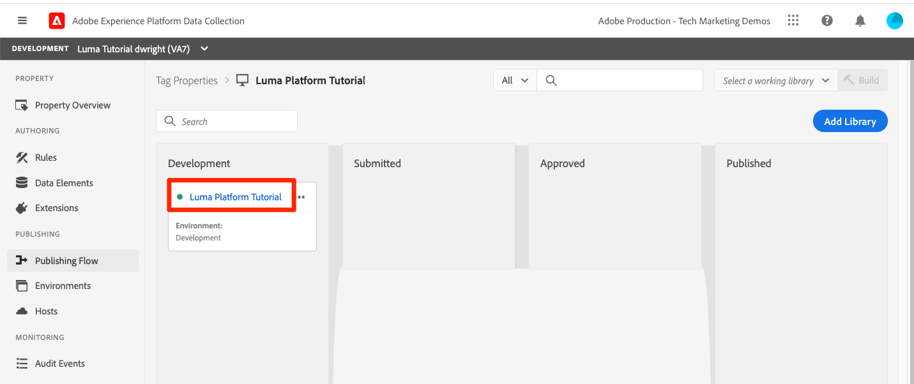
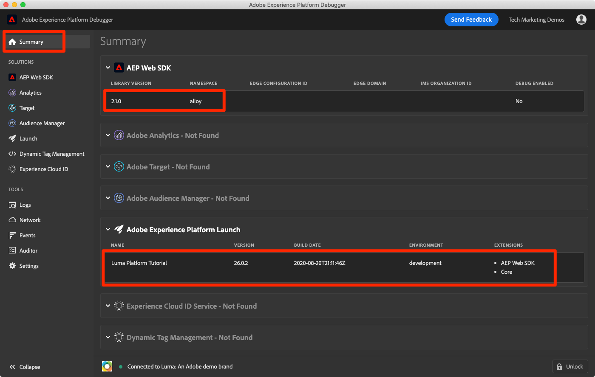

# 內嵌串流資料

<!--1hr-->

在本課程中，您將使用Adobe Experience Platform Web SDK來串流資料。

在資料收集介面中，我們必須完成兩項主要工作：

* 我們必須在Luma網站上實作Web SDK，將訪客活動相關資料從網站傳送至Adobe Edge網路。 我們將使用標籤（先前稱為Launch）進行簡單實作

* 我們必須設定資料流，該資料流會告訴Edge網路要將資料轉送到何處。 我們會設定它，將資料傳送至 `Luma Web Events` 資料集。

**資料工程師** 需要在本教學課程之外內嵌串流資料。 實作Adobe Experience Platform的Web或行動SDK時，一般會有Web或行動開發人員參與資料層建立和標籤屬性設定。

開始練習之前，請觀看以下兩個短片，以進一步了解串流資料擷取和Web SDK:
>[!VIDEO](https://video.tv.adobe.com/v/28425?quality=12&learn=on)

>[!VIDEO](https://video.tv.adobe.com/v/34141?quality=12&learn=on)

>[!NOTE]
>
>雖然本教學課程著重於使用Web SDK從網站串流內嵌，但您也可以使用 [Adobe行動SDK](https://aep-sdks.gitbook.io/), [Apache Kafka Connect](https://github.com/adobe/experience-platform-streaming-connect)和其他機制。

## 需要權限

在 [設定權限](configure-permissions.md) 課程中，您設定了完成本課程所需的所有訪問控制。

<!--
* Permission items **[!UICONTROL Launch]** > **[!UICONTROL Property Rights]** > **[!UICONTROL Approve]**, **[!UICONTROL Develop]**, **[!UICONTROL Manage Environments]**, **[!UICONTROL Manage Extensions]**, and **[!UICONTROL Publish]**
* Permission item **[!UICONTROL Launch]** > **[!UICONTROL Company Rights]** > **[!UICONTROL Manage Properties]**
* User-role access to the `Luma Tutorial Launch` product profile
* Admin-role access to the `Luma Tutorial Launch` product profile
* Permission items **[!UICONTROL Platform]** > **[!UICONTROL Data Ingestion]** > **[!UICONTROL View Sources]** and **[!UICONTROL Manage Sources]**
* Permission items **[!UICONTROL Platform]** > **[!UICONTROL Data Management]** > **[!UICONTROL View Datasets]** and **[!UICONTROL Manage Datasets]**
* Permission items **[!UICONTROL Platform]** > **[!UICONTROL Profiles]** > **[!UICONTROL View Profiles]**, **[!UICONTROL Manage Profiles]** and **[!UICONTROL Export Audience Segment]**
* Permission item **[!UICONTROL Platform]** > **[!UICONTROL Sandbox Administration]** > **[!UICONTROL View Sandboxes]**
* Permission item **[!UICONTROL Platform]** > **[!UICONTROL Sandboxes]** > `Luma Tutorial`
* User-role access to the `Luma Tutorial Platform` product profile
-->

<!--## Create a streaming source

1. Log into the [Experience Platform  user interface](https://experience.adobe.com/platform/)
1. Go to **[!UICONTROL Sources]** in the left navigation
1. Filter the list by selecting **[!UICONTROL Streaming]**
1. In the **[!UICONTROL HTTP API]** section, select the **[!UICONTROL Configure]** button
    
1. On the **[!UICONTROL Authentication]** step, enter `Luma Web Events Source` as the **[!UICONTROL Account name]** and select the **[!UICONTROL Connect to source]** button (we don't need to enable authentication since the data will be originating from website visitors)
    
1. Once connected, select the **[!UICONTROL Next]** button to proceed to the next step in the workflow
1. On the **[!UICONTROL Select data]** step, choose **[!UICONTROL Existing Dataset]**, select your `Luma Web Events Dataset`, and then select the **[!UICONTROL Next]** button
    
1. On the **[!UICONTROL Dataflow detail]** step, select the **[!UICONTROL Next]** button:
    
    <!--What is a good practice for naming the data flow vs the source-->
<!--
1. On the **[!UICONTROL Review]** step, review your source details and select the **[!UICONTROL Finish]** button:
    
-->

## 設定資料流

首先，我們將配置資料流。 資料流會告訴Adobe Edge網路，從Web SDK呼叫收到資料後，要將資料傳送至何處。 例如，您要將資料傳送至Experience Platform、Adobe Analytics或Adobe Target? 資料流在資料收集使用者介面（先前稱為Launch）中進行管理，且對於使用Web SDK進行資料收集至關重要。

若要建立 [!UICONTROL 資料流]:

1. 登入 [Experience Platform資料收集使用者介面](https://experience.adobe.com/launch/)

   <!--when will the edge config go live?-->

1. 選擇 **[!UICONTROL 資料流]** 在左側導覽列中
1. 選取 **[!UICONTROL 新資料流]** 按鈕

   

1. 若 **[!UICONTROL 易記名稱]**，輸入 `Luma Platform Tutorial` （如果貴公司有多人參加本教學課程，請將您的名稱新增至結尾）
1. 選取 **[!UICONTROL 儲存]** 按鈕

   

在下一個畫面中，您可以指定要將資料傳送至何處。 若要將資料傳送至Experience Platform:

1. 開啟 **[!UICONTROL Adobe Experience Platform]** 公開其他欄位
1. 針對 **[!UICONTROL 沙箱]**，選取 `Luma Tutorial`
1. 針對 **[!UICONTROL 事件資料集]**，選取 `Luma Web Events Dataset`
1. 如果您使用其他Adobe應用程式，歡迎探索其他章節，了解其他解決方案的「邊緣設定」中需要哪些資訊。 請記住，Web SDK的開發目的不僅是將資料串流至Experience Platform，也是取代其他Adobe應用程式使用的所有舊版JavaScript程式庫。 「邊緣設定」可用來指定您要傳送資料之每個應用程式的帳戶詳細資訊。
1. 選擇 **[!UICONTROL 儲存]**

   

儲存邊緣設定後，產生的畫面會顯示已為開發、測試和生產建立三個環境。 可新增其他開發環境：

這三個環境都包含您剛才輸入的平台詳細資訊。 不過，這些詳細資訊的設定方式可因環境而異。 例如，您可以讓每個環境將資料傳送至不同的Platform沙箱。 在本教學課程中，我們不會對資料流進行任何額外的自訂。

## 安裝Web SDK擴充功能

### 新增屬性

首先，我們必須建立標籤屬性（先前稱為標籤屬性）。 屬性是容器，可容納從網頁收集詳細資訊並將其傳送至不同位置所需的所有JavaScript、規則及其他功能。

若要建立屬性：

1. 前往 **[!UICONTROL 屬性]** 在左側導覽列中
1. 選取 **[!UICONTROL 新屬性]** 按鈕
   
1. 作為 **[!UICONTROL 名稱]**，輸入 `Luma Platform Tutorial` （如果貴公司有多人參加本教學課程，請將您的名稱新增至結尾）
1. 作為 **[!UICONTROL 網域]**，輸入 `enablementadobe.com` （稍後說明）
1. 選擇 **[!UICONTROL 儲存]**

   

<!--
After saving the property, you might see an error message like the one below. If so, this is because you don't actually have access to the property you just created. To fix this, we need to go to the Admin Console to give yourself access:
    

To give yourself access to the property:

1. In a separate browser tab, log into the [Admin Console](https://adminconsole.adobe.com/)
1. Go to **[!UICONTROL Products]** from the top navigation
1. Select **[!UICONTROL Adobe Experience Platform Launch]** on the left navigation
1. Go to your `Luma Tutorial Launch` product profile
1. Go to the **[!UICONTROL Permissions]** tab
1. On the **[!UICONTROL Properties]** row, select **[!UICONTROL Edit]**
    
1. Select the "+" icon to move your `Luma Platform Tutorial` property to the right-hand side and select the **[!UICONTROL Save]** button to update the permissions
   
    

Now switch back to your browser tab with the Data Collection interface still open. Reload the page and the `Luma Platform Tutorial` property should display in the list. Select to open the property:

-->

## 新增Web SDK擴充功能

現在您有屬性，可以使用擴充功能來新增Web SDK。 擴充功能是擴充資料收集介面和功能的程式碼套件。 新增擴充功能的方式:

1. 開啟您的標籤屬性
1. 前往 **[!UICONTROL 擴充功能]** 在左側導覽列中
1. 前往 **[!UICONTROL 目錄]** 標籤
1. 有許多擴充功能可供標籤使用。 使用詞語篩選目錄 `Web SDK`
1. 在 **[!UICONTROL Adobe Experience Platform Web SDK]** 擴充功能，請選取 **[!UICONTROL 安裝]** 按鈕
   
1. Web SDK擴充功能有數種可用的設定，但我們只打算為本教學課程進行兩項設定。 更新 **[!UICONTROL 邊緣網域]** to `data.enablementadobe.com`. 此設定可讓您透過Web SDK實作設定第一方Cookie，我們鼓勵您這麼做。 在本課程的稍後部分，您將對應 `enablementadobe.com` 網域至您的標籤屬性。 的CNAME `enablementadobe.com` 已配置域，因此 `data.enablementadobe.com` 會轉送至Adobe伺服器。 當您在自己的網站上實作Web SDK時，將需要建立CNAME以供您自己收集資料之用，例如 `data.YOUR_DOMAIN.com`
1. 從 **[!UICONTROL 資料流]** 下拉式清單，選取 `Luma Platform Tutorial` 資料流。
1. 查看其他設定選項（但請勿變更！） 然後選取 **[!UICONTROL 儲存]**
   <!--is edge domain required for first party? when will it break?-->
   <!--any other fields that should be highlighted-->
   

## 建立要傳送資料的規則

現在將建立規則以將資料傳送至Platform。 規則是事件、條件和動作的組合，可指示標籤執行某項操作。 建立規則的方式:

1. 前往 **[!UICONTROL 規則]** 在左側導覽列中
1. 選取 **[!UICONTROL 建立新規則]** 按鈕
   
1. 將規則命名為 `All Pages - Library Loaded`
1. 在 **[!UICONTROL 事件]**，請選取 **[!UICONTROL 新增]** 按鈕
   
1. 使用 **[!UICONTROL 核心]** **[!UICONTROL 擴充功能]** 選取 **[!UICONTROL 程式庫已載入（頁面頂端）]** 作為 **[!UICONTROL 事件類型]**. 此設定表示當Launch程式庫載入頁面時，就會觸發規則。
1. 選擇 **[!UICONTROL 保留變更]** 返回主規則畫面
   
1. 離開 **[!UICONTROL 條件]** 空白，因為我們希望此規則在所有頁面上觸發，如我們所提供的名稱所示
1. 在 **[!UICONTROL 動作]**，請選取 **[!UICONTROL 新增]** 按鈕
1. 使用 **[!UICONTROL Adobe Experience Platform Web SDK]** **[!UICONTROL 擴充功能]** 選取 **[!UICONTROL 傳送事件]** 作為 **[!UICONTROL 動作類型]**
1. 在右側，選取 **[!UICONTROL web.webpagedetails.pageViews]** 從 **[!UICONTROL 類型]** 下拉式清單。 這是我們 `Luma Web Events Schema`
1. 選擇 **[!UICONTROL 保留變更]** 返回主規則畫面
   
1. 選擇 **[!UICONTROL 儲存]** 儲存規則\
   

## 在程式庫中發佈規則

接下來，我們會將規則發佈至開發環境，以便驗證其是否有效。

<!--
There are a few quick steps we must take in the **[!UICONTROL Publishing]** section of Launch.

### Create a host

Launch libraries can be hosted on Adobe's Content Delivery Network (CDN) or on your own servers. In this tutorial, we will use Adobe's CDN since it is faster to set up:

1. Go to **[!UICONTROL Hosts]** in the left navigation
1. Select the **[!UICONTROL Create New Host]** button
       
1. For the **[!UICONTROL Name]**, enter `Adobe CDN`
1. For the **[!UICONTROL Type]**, select **[!UICONTROL Managed by Adobe]**
1. Select the **[!UICONTROL Save]** button to complete the setup of the host
       

### Create an environment

Environments allow you to have different versions of a library in different publishing environments to accommodate your publishing workflow. For example, the fully tested version of your library can be published to a Production environment, while new changes are being created in a Development environment. You can also use different hosts for each environment. To create an environment:

1. Go to **[!UICONTROL Environments]** in the left navigation
1. Select the **[!UICONTROL Create New Environment]** button
     
1. Under **[!UICONTROL Development]** select **[!UICONTROL Select]**   
     
1. For the **[!UICONTROL Name]**, enter `Development`
1. For the **[!UICONTROL Select Host]** dropdown, select `Adobe CDN`
1. Select the **[!UICONTROL Save]** button to complete the setup of the environment
    
1. You will see a modal with URL and other implementation details of this library. These are critical for a real Launch implementation, but we don't need to worry about them for this tutorial. Select the **[!UICONTROL Close]** button to exit the modal.

### Create and publish the library

Now let's bundle the contents of our property&mdash;currently an extension and a rule&mdash;into a library. 
-->

若要建立程式庫：

1. 前往 **[!UICONTROL 發佈流程]** 在左側導覽列中
1. 選擇 **[!UICONTROL 新增程式庫]**
   
1. 若 **[!UICONTROL 名稱]**，輸入 `Luma Platform Tutorial`
1. 若 **[!UICONTROL 環境]**，選取 `Development`
1. 選取 **[!UICONTROL 新增所有已變更的資源]** 按鈕。 (除 [!UICONTROL Adobe Experience Platform Web SDK] 擴充功能和 `All Pages - Library Loaded` 規則中，您也會看到 [!UICONTROL 核心] 新增擴充功能，其中包含所有Launch Web屬性所需的基本JavaScript。)
1. 選取 **[!UICONTROL 儲存並建置以供開發]** 按鈕
   

程式庫可能需要幾分鐘的時間才能建置，當它完成時，程式庫名稱左側會顯示一個綠色圓點：

如您在 [!UICONTROL 發佈流程] 螢幕上，發佈程式的功能會比較多，這不在本教學課程的討論範圍內。 我們將在開發環境中使用單一程式庫。

## 驗證請求中的資料

### 新增Adobe Experience Platform Debugger

Experience Platform偵錯工具是適用於Chrome和Firefox瀏覽器的擴充功能，可協助您查看網頁中實作的Adobe技術。 下載您偏好瀏覽器的版本：

* [Firefox擴充功能](https://addons.mozilla.org/zh-TW/firefox/addon/adobe-experience-platform-dbg/)
* [Chrome擴充功能](https://chrome.google.com/webstore/detail/adobe-experience-platform/bfnnokhpnncpkdmbokanobigaccjkpob)

如果您以前從未使用過Debugger(而且此版本與舊版Adobe Experience Cloud Debugger不同)，您可能會想要觀看此5分鐘的概述影片：

>[!VIDEO](https://video.tv.adobe.com/v/32156?quality=12&learn=on)

### 開啟Luma網站

在本教學課程中，我們會使用公開托管的Luma示範網站版本。 將其開啟並加上書籤：

1. 在新的瀏覽器標籤中，開啟 [Luma網站](https://luma.enablementadobe.com/content/luma/us/en.html).
1. 將頁面加入書籤，以便在教學課程的其餘部分中使用

我們之所以使用此托管網站 `enablementadobe.com` 在 [!UICONTROL 網域] 欄位中填入初始標籤屬性設定，以及我們使用的原因 `data.enablementadobe.com` 作為 [!UICONTROL Adobe Experience Platform Web SDK] 擴充功能。 看，我有計畫了！

### 使用Experience Platform偵錯工具來對應至您的標籤屬性

Experience Platform偵錯工具有一項酷炫功能，可讓您將現有的標籤屬性取代為其他屬性。 這對驗證很實用，可讓我們略過本教學課程中的許多實作步驟。

1. 請確定您已開啟Luma網站，並選取Experience Platform偵錯工具擴充功能圖示
1. Debugger將會開啟並顯示硬式編碼實作的部分詳細資料，這與本教學課程無關（開啟Debugger後，您可能需要重新載入Luma網站）
1. 確認Debugger為「**[!UICONTROL 已連線至Luma]**&quot; ，然後選取「**[!UICONTROL 鎖]**」圖示，將Debugger鎖定至Luma網站。
1. 選取 **[!UICONTROL 登入]** 按鈕進行驗證。
1. 現在，請前往 **[!UICONTROL Launch]** 在左側導覽列中
1. 選擇「配置」頁簽
1. 右邊顯示 **[!UICONTROL 頁面內嵌程式碼]**，開啟 **[!UICONTROL 動作]** 下拉式清單，然後選取 **[!UICONTROL 取代]**

   
1. 由於您已通過驗證，因此Debugger將提取您可用的Launch屬性和環境。 選取 `Luma Platform Tutorial` 屬性
1. 選取 `Development` 環境
1. 選取 **[!UICONTROL 套用]** 按鈕
   
1. Luma網站現在會重新載入 _搭配您的標籤屬性_. 救命，我被黑了！ 開玩笑吧。
   
1. 前往 **[!UICONTROL 摘要]** 在左側導覽中，查看 [!UICONTROL Launch] 屬性
   
1. 現在，請前往 **[!UICONTROL AEP Web SDK]** 在左側導覽中，查看 **[!UICONTROL 網路請求]**
1. 開啟 **[!UICONTROL 事件]** row

   
1. 請注意，我們如何看到 `web.webpagedetails.pageView` 我們在 [!UICONTROL 傳送事件] 動作，以及其他現成可用的變數。 `AEP Web SDK ExperienceEvent Mixin` 格式
   
1. 瀏覽器的網頁開發人員工具中也會顯示這些類型的請求詳細資料 **網路** 標籤。 開啟它並重新載入頁面。 篩選呼叫，並搭配 `interact` 若要找出呼叫，請選取該呼叫，然後查看 **標題** 標籤 **要求裝載** 的上界。
   
1. 前往 **回應** 標籤，並注意回應中ECID值的包含方式。 複製此值，如同您將在下一個練習中使用它來驗證設定檔資訊一樣。
   

## 驗證資料的Experience Platform

您可以查看到 `Luma Web Events Dataset`. (我知道，這叫「串流資料擷取」，但現在我說它分批送達！ 它會即時串流至設定檔，以便用於即時分段和啟動，但會每15分鐘批次傳送至資料湖。)

驗證資料的方式：

1. 在Platform使用者介面中，前往 **[!UICONTROL 資料集]** 在左側導覽列中
1. 開啟 `Luma Web Events Dataset` 並確認批次已到。 請記住，每15分鐘傳送一次，因此您可能需要等待批次顯示。
1. 選取 **[!UICONTROL 預覽資料集]** 按鈕
   
1. 在預覽模式中，請注意如何選取左側結構的不同欄位，以預覽這些特定資料點：
   

您也可以確認新設定檔正在顯示：

1. 在Platform使用者介面中，前往 **[!UICONTROL 設定檔]** 在左側導覽列中
1. 選取 **[!UICONTROL ECID]** 命名空間並搜尋您的ECID值（從回應複製）。 設定檔會有其專屬的id，與ECID不同。
1. 選取 **[!UICONTROL 設定檔ID]** 開啟配置檔案
   
1. 選取 **[!UICONTROL 事件]** 標籤，查看您檢視的頁面
   
   <!---->

## 新增自訂資料至事件

### 為頁面名稱建立資料元素

1. 在資料收集標籤介面中，位於 `Luma Platform Tutorial` 屬性，開啟 **[!UICONTROL 選取工作程式庫]** 下拉式清單，選取 `Luma Platform Tutorial` 程式庫。 此設定可讓您更輕鬆地將其他更新發佈至程式庫。
1. 現在，請前往 **[!UICONTROL 資料元素]** 在左側導覽列中
1. 選取 **[!UICONTROL 建立新資料元素]** 按鈕

   
1. 作為 **[!UICONTROL 名稱]**，輸入 `Page Name`
1. 作為 **[!UICONTROL 資料元素類型]**，選取 `JavaScript Variable`
1. 作為 **[!UICONTROL JavaScript變數名稱]**，輸入 `digitalData.page.pageInfo.pageName`
1. 若要協助標準化值的格式，請核取 **[!UICONTROL 強制小寫值]** 和 **[!UICONTROL 清除文字]**
1. 確保 `Luma Platform Tutorial` 已選取為工作程式庫
1. 選擇 **[!UICONTROL 儲存至程式庫]**
   

### 將頁面名稱對應至XDM物件資料元素

現在，我們會將我們的頁面名稱對應至Web SDK。

>[!IMPORTANT]
>
>為了完成此工作，我們需要確保您的使用者先擁有生產沙箱的存取權。 如果您尚無權從不同的產品設定檔存取Prod沙箱，請快速開啟 `Luma Tutorial Platform` 設定檔和新增權限項目 **[!UICONTROL 沙箱]** > **[!UICONTROL 生產]**. 執行此操作後，在「資料元素」頁面上執行SHIFT-Reload以清除快取
>

在 **[!UICONTROL 資料元素]** 頁面：

1. 建立新資料元素
1. 作為 **[!UICONTROL 名稱]**，輸入 `XDM Object`
1. 作為 **[!UICONTROL 擴充功能]**，選取 `Adobe Experience Platform Web SDK`
1. 作為 **[!UICONTROL 資料元素類型]**，選取 `XDM object`
1. 作為 **[!UICONTROL 沙箱]**，選取 `Luma Tutorial` 沙箱
1. 作為 **[!UICONTROL 結構]**，選取 `Luma Web Events Schema`
1. 選取 `web.webPageDetails.name` 欄位
1. 作為 **[!UICONTROL 值]**，請選取圖示以開啟資料元素選取強制回應視窗，然後選擇您的 `Page Name` 資料元素
1. 選擇 **[!UICONTROL 儲存至程式庫]**

   

這個相同程式可用來將網站上的其他自訂資料對應至XDM欄位。

### 新增XDM資料至您的「傳送事件」動作

現在已將資料對應至XDM欄位，您可以將其納入「傳送事件」動作中：

1. 前往 **[!UICONTROL 規則]** 螢幕
1. 開啟 `All Pages - Library Loaded` 規則
1. 開啟 `Adobe Experience Platform Web SDK - Send Event` 動作
1. 作為 **[!UICONTROL XDM資料]**，請選取圖示以開啟資料元素選取強制回應視窗，然後選擇您的 `XDM Object` 資料元素
1. 選取 **[!UICONTROL 保留變更]** 按鈕
   
1. 既然你 `Luma Platform Tutorial` 在前幾個練習中，您最近的變更已直接儲存至程式庫。 您不必透過「發佈流程」畫面發佈變更，只需開啟藍色按鈕的下拉式清單並選取 **[!UICONTROL 儲存至程式庫並建置]**
   

這會開始使用您剛才進行的三項變更來建立新的標籤程式庫。

### 驗證XDM資料

您現在應該可以重新載入Luma首頁，同時使用Debugger對應至您的標籤屬性（如您先前所學），並查看頁面名稱欄位填入請求中！

您也可以預覽資料集和設定檔，以驗證Platform中收到的頁面名稱資料。

## 傳送其他身分

您的Web SDK實作現在會傳送以Experience CloudID(ECID)為主要識別碼的事件。 ECID會由Web SDK自動產生，且每個裝置和瀏覽器都不重複。 根據客戶使用的裝置和瀏覽器，單一客戶可擁有多個ECID。 那麼，我們如何取得此客戶的統一檢視，並將其線上活動連結至我們的CRM、忠誠度和離線購買資料？ 我們會在工作階段期間收集其他身分資料，並透過身分匯整，決定性地連結其設定檔，借此達成此目標。

若您記得，我曾提到我們會使用ECID和CRM ID做為網站資料的身分識別，位於 [對應身分](map-identities.md) 教訓。 那麼，我們就使用Web SDK來收集CRM ID吧！

### 為CRM ID新增資料元素

首先，我們會將CRM ID儲存在資料元素中：

1. 在標籤介面中，新增資料元素，名為 `CRM Id`
1. 作為 **[!UICONTROL 資料元素類型]**，選取 **[!UICONTROL JavaScript變數]**
1. 作為 **[!UICONTROL JavaScript變數名稱]**，輸入 `digitalData.user.0.profile.0.attributes.username`
1. 選取 **[!UICONTROL 儲存至程式庫]** 按鈕(`Luma Platform Tutorial` 仍是您的工作程式庫)
   

### 將CRM ID新增至Identity Map資料元素

既然我們已擷取CRM ID值，就必須將其與稱為的特殊資料元素類型建立關聯 [!UICONTROL 身分對應] 資料元素：

1. 新增資料元素，命名為 `Identities`
1. 作為 **[!UICONTROL 擴充功能]**，選取 **[!UICONTROL Adobe Experience Platform Web SDK]**
1. 作為 **[!UICONTROL 資料元素類型]**，選取 **[!UICONTROL 身分對應]**
1. 作為 **[!UICONTROL 命名空間]**，輸入 `Luma CRM Id`，即 [!UICONTROL 命名空間] 我們先前的課

   >[!WARNING]
   >
   >Adobe Experience Platform Web SDK擴充功能2.2版可讓您使用Platform帳戶中的實際值，從預先填入的下拉式清單中選取「命名空間」。 很可惜，此功能尚未「了解沙箱」，因此 `Luma CRM Id` 值可能不會出現在下拉式清單中。 這可能會使您無法完成本練習。 確認後，我們會發佈因應措施。

1. 作為 **[!UICONTROL ID]**，請選取圖示以開啟資料元素選取強制回應視窗，然後選擇您的 `CRM Id` 資料元素
1. 作為 **[!UICONTROL 驗證狀態]**，選取 **[!UICONTROL 已驗證]**
1. 離開 **[!UICONTROL 主要]** _未勾選_. 由於CRM ID不存在於Luma網站的大部分訪客，因此您絕對 _不想將ECID覆寫為主要識別碼_. 以ECID以外的任何項目作為主要識別碼，這是很少見的使用案例。 我通常不會在這些指示中提及預設設定，但我會呼叫這個設定，以協助您日後在自己的實施中避免頭痛。
1. 選取 **[!UICONTROL 儲存至程式庫]** 按鈕(`Luma Platform Tutorial` 仍是您的工作程式庫)
   

>[!NOTE]
>
>您可以使用 [!UICONTROL 身分對應] 資料類型。

### 將Identity Map資料元素新增至XDM物件

我們還必須更新一個資料元素： XDM物件資料元素。 必須更新三個不同的資料元素才能傳遞此單一身分，這似乎有些奇怪，但此程式的設計目的是為了擴充多個身分。 別擔心，我們快學完了！

1. 開啟XDM物件資料元素
1. 開啟IdentityMap XDM欄位
1. 作為 **[!UICONTROL 資料元素]**，請選取圖示以開啟資料元素選取強制回應視窗，然後選擇您的 `Identities` 資料元素
1. 既然你 `Luma Platform Tutorial` 在前幾個練習中，您最近的變更已直接儲存至程式庫。 您可以開啟藍色按鈕上的下拉式清單，然後選取「 」，而不必透過「發佈流程」畫面發佈變更 **[!UICONTROL 儲存至程式庫並建置]**
   

### 驗證身分

若要驗證Web SDK是否正在傳送CRM ID:

1. 開啟 [Luma網站](https://luma.enablementadobe.com/content/luma/us/en.html)
1. 依照先前的指示，使用Debugger將其對應至您的標籤屬性
1. 選取 **登入** Luma網站右上角的連結
1. 使用憑證登入 `test@adobe.com`/`test`
1. 驗證後，在Debugger中檢查Experience PlatformWeb SDK呼叫(**[!UICONTROL Adobe Experience Platform Web SDK]** > **[!UICONTROL 網路請求]** > **[!UICONTROL 事件]** )，而您應該會看到 `lumaCrmId`:
   
1. 使用ECID命名空間並再次查詢值，查詢使用者設定檔。 在設定檔中，您會看到CRM ID、忠誠度ID和設定檔詳細資訊，例如名稱和電話號碼。 所有身分和資料已匯整為單一即時客戶設定檔！
   

## 其他資源

* [使用 Web SDK 實作 Adobe Experience Cloud](/help/tutorial-web-sdk/overview.md)
* [串流擷取檔案](https://experienceleague.adobe.com/docs/experience-platform/ingestion/streaming/overview.html?lang=zh-Hant)
* [串流獲取API參考](https://www.adobe.io/experience-platform-apis/references/data-ingestion/#tag/Streaming-Ingestion)

幹得好！ 這是許多有關Web SDK和Launch的資訊。 完整實作的參與度要高很多，但這些是可協助您開始使用及查看Platform結果的基本概念。

>[!NOTE]
>
>現在您已完成串流擷取課程，可以移除 [!UICONTROL 生產] 從您的 `Luma Tutorial Platform` 產品設定檔

資料工程師，如果您喜歡，請跳到 [運行查詢課程](run-queries.md).

資料架構師，您可以 [合併策略](create-merge-policies.md)!
