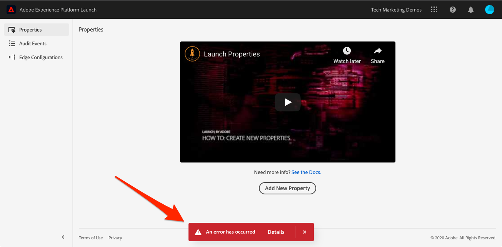
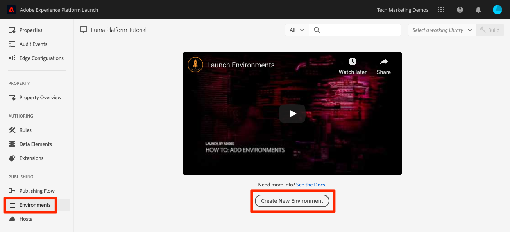

# 擷取串流資料

<!--1hr-->

在本課程中，您將使用Adobe Experience Platform Web SDK串流資料。

在資料收集介面中，我們必須完成兩項主要工作：

* 我們必須在Luma網站上實作Web SDK，以將有關網站訪客活動的資料傳送至Adobe Edge網路。 我們將使用標籤（先前稱為Launch）進行簡單的實作

* 我們必須設定資料串流，告訴Edge網路將資料轉送至何處。 我們會將其設定為將資料傳送至 `Luma Web Events` Platform沙箱中的資料集。

**資料工程師** 需要在本教學課程以外擷取串流資料。 實作Adobe Experience Platform的Web或行動SDK時，通常會有Web或行動開發人員參與資料層建立和標籤屬性設定。

在開始練習之前，請觀看這兩個短片，以進一步瞭解串流資料擷取和Web SDK：

>[!VIDEO](https://video.tv.adobe.com/v/28425?learn=on)

>[!VIDEO](https://video.tv.adobe.com/v/34141?learn=on)

>[!NOTE]
>
>雖然本教學課程的重點是使用Web SDK從網站串流擷取，但您也可以使用 [Adobe行動SDK](https://developer.adobe.com/client-sdks/documentation/)， [Apache Kafka Connect](https://github.com/adobe/experience-platform-streaming-connect)和其他機制。

## 需要的許可權

在 [設定許可權](configure-permissions.md) 課程，您已設定完成本課程所需的所有存取控制項。

<!--
* Permission items **[!UICONTROL Launch]** > **[!UICONTROL Property Rights]** > **[!UICONTROL Approve]**, **[!UICONTROL Develop]**, **[!UICONTROL Manage Environments]**, **[!UICONTROL Manage Extensions]**, and **[!UICONTROL Publish]**
* Permission item **[!UICONTROL Launch]** > **[!UICONTROL Company Rights]** > **[!UICONTROL Manage Properties]**
* User-role access to the `Luma Tutorial Launch` product profile
* Admin-role access to the `Luma Tutorial Launch` product profile
* Permission items **[!UICONTROL Platform]** > **[!UICONTROL Data Ingestion]** > **[!UICONTROL View Sources]** and **[!UICONTROL Manage Sources]**
* Permission items **[!UICONTROL Platform]** > **[!UICONTROL Data Management]** > **[!UICONTROL View Datasets]** and **[!UICONTROL Manage Datasets]**
* Permission items **[!UICONTROL Platform]** > **[!UICONTROL Profiles]** > **[!UICONTROL View Profiles]**, **[!UICONTROL Manage Profiles]** and **[!UICONTROL Export Audience Segment]**
* Permission item **[!UICONTROL Platform]** > **[!UICONTROL Sandbox Administration]** > **[!UICONTROL View Sandboxes]**
* Permission item **[!UICONTROL Platform]** > **[!UICONTROL Sandboxes]** > `Luma Tutorial`
* User-role access to the `Luma Tutorial Platform` product profile
-->

<!--## Create a streaming source

1. Log into the [Experience Platform  user interface](https://experience.adobe.com/platform/)
1. Go to **[!UICONTROL Sources]** in the left navigation
1. Filter the list by selecting **[!UICONTROL Streaming]**
1. In the **[!UICONTROL HTTP API]** section, select the **[!UICONTROL Configure]** button
    
1. On the **[!UICONTROL Authentication]** step, enter `Luma Web Events Source` as the **[!UICONTROL Account name]** and select the **[!UICONTROL Connect to source]** button (we don't need to enable authentication since the data will be originating from website visitors)
    
1. Once connected, select the **[!UICONTROL Next]** button to proceed to the next step in the workflow
1. On the **[!UICONTROL Select data]** step, choose **[!UICONTROL Existing Dataset]**, select your `Luma Web Events Dataset`, and then select the **[!UICONTROL Next]** button
    
1. On the **[!UICONTROL Dataflow detail]** step, select the **[!UICONTROL Next]** button:
    
    <!--What is a good practice for naming the data flow vs the source-->
<!--
1. On the **[!UICONTROL Review]** step, review your source details and select the **[!UICONTROL Finish]** button:
    
-->

## 設定資料串流

首先，我們將設定資料串流。 資料串流會告訴Adobe Edge網路，在從Web SDK呼叫收到資料後，應將資料傳送至何處。 例如，您要將資料傳送至Experience Platform、Adobe Analytics或Adobe Target嗎？ 資料串流在資料收集使用者介面（前身為Launch）中進行管理，對於透過Web SDK進行資料收集至關重要。

若要建立 [!UICONTROL 資料流]：

1. 登入 [Experience Platform資料收集使用者介面](https://experience.adobe.com/launch/)
   <!--when will the edge config go live?-->

1. 選取 **[!UICONTROL 資料串流]** 在左側導覽列中
1. 選取 **[!UICONTROL 新增資料串流]** 按鈕於右上角

   

1. 對於 **[!UICONTROL 易記名稱]**，輸入 `Luma Platform Tutorial` （如果貴公司的多人參加本教學課程，請在結尾加上您的姓名）
1. 選取 **[!UICONTROL 儲存]** 按鈕

   

在下一個畫面中，您指定要傳送資料的位置。 若要傳送資料給Experience Platform：

1. 開啟 **[!UICONTROL Adobe Experience Platform]** 以公開其他欄位
1. 的 **[!UICONTROL Sandbox]**，選取 `Luma Tutorial`
1. 的 **[!UICONTROL 事件資料集]**，選取 `Luma Web Events Dataset`
1. 如果您使用其他Adobe應用程式，歡迎探索其他區段，以瞭解在這些其他解決方案的「邊緣組態」中需要哪些資訊。 請記住，開發Web SDK不僅是為了將資料串流到Experience Platform中，也是為了取代其他Adobe應用程式使用的所有先前JavaScript程式庫。 「邊緣組態」可用來指定您要傳送資料之各應用程式的帳戶詳細資料。
1. 選取 **[!UICONTROL 儲存]**
   

邊緣設定儲存後，產生的畫面會顯示已建立用於開發、測試和生產的三個環境。 可以新增其他開發環境：

這三個環境都包含您剛才輸入的平台詳細資料。 不過，這些詳細資料可依環境以不同方式設定。 例如，您可以讓每個環境將資料傳送至不同的Platform沙箱。 在本教學課程中，我們將不會針對資料流執行任何其他自訂。

## 安裝Web SDK擴充功能

### 新增屬性

首先，我們必須建立標籤屬性（先前稱為標籤屬性）。 屬性是一個容器，內含從網頁收集詳細資訊並傳送至不同位置所需的所有JavaScript、規則和其他功能。

若要建立屬性：

1. 前往 **[!UICONTROL 屬性]** 在左側導覽列中
1. 選取 **[!UICONTROL 新增屬性]** 按鈕
   
1. 作為 **[!UICONTROL 名稱]**，輸入 `Luma Platform Tutorial` （如果貴公司的多人參加本教學課程，請在結尾加上您的姓名）
1. 作為 **[!UICONTROL 網域]**，輸入 `enablementadobe.com` （稍後說明）
1. 選取 **[!UICONTROL 儲存]**
   

<!--
After saving the property, you might see an error message like the one below. If so, this is because you don't actually have access to the property you just created. To fix this, we need to go to the Admin Console to give yourself access:
    

To give yourself access to the property:

1. In a separate browser tab, log into the [Admin Console](https://adminconsole.adobe.com/)
1. Go to **[!UICONTROL Products]** from the top navigation
1. Select **[!UICONTROL Adobe Experience Platform Launch]** on the left navigation
1. Go to your `Luma Tutorial Launch` product profile
1. Go to the **[!UICONTROL Permissions]** tab
1. On the **[!UICONTROL Properties]** row, select **[!UICONTROL Edit]**
    
1. Select the "+" icon to move your `Luma Platform Tutorial` property to the right-hand side and select the **[!UICONTROL Save]** button to update the permissions
   
    

Now switch back to your browser tab with the Data Collection interface still open. Reload the page and the `Luma Platform Tutorial` property should display in the list. Select to open the property:

-->

## 新增Web SDK擴充功能

現在您有了屬性，可以使用擴充功能新增Web SDK。 擴充功能是擴充資料收集介面和功能的程式碼套件。 新增擴充功能的方式:

1. 開啟您的標籤屬性
1. 前往 **[!UICONTROL 擴充功能]** 在左側導覽列中
1. 前往 **[!UICONTROL 目錄]** 標籤
1. 有許多擴充功能可供標籤使用。 使用辭彙篩選目錄 `Web SDK`
1. 在 **[!UICONTROL Adobe Experience Platform Web SDK]** 擴充功能中，選取 **[!UICONTROL 安裝]** 按鈕
   
1. Web SDK擴充功能有數種設定可供使用，但在本教學課程中，我們將只會設定兩種。 更新 **[!UICONTROL 邊緣網域]** 至 `data.enablementadobe.com`. 此設定可讓您在Web SDK實作中設定第一方Cookie （建議使用）。 在本課程稍後部分中，您會將網站對應 `enablementadobe.com` 網域至您的標籤屬性。 的CNAME `enablementadobe.com` 網域已設定為 `data.enablementadobe.com` 將轉送至Adobe伺服器。 在您自己的網站上實作Web SDK時，必須針對您自己的資料收集目的建立CNAME，例如 `data.YOUR_DOMAIN.com`
1. 從 **[!UICONTROL 資料流]** 下拉式清單，選取您的 `Luma Platform Tutorial` 資料流。
1. 歡迎檢視其他設定選項（但請勿變更！） 然後選取 **[!UICONTROL 儲存]**
   <!--is edge domain required for first party? when will it break?-->
   <!--any other fields that should be highlighted-->
   

## 建立規則以傳送資料

現在我們將建立規則以將資料傳送至Platform。 規則是事件、條件和動作的組合，可指示標籤執行某項動作。 建立規則的方式:

1. 前往 **[!UICONTROL 規則]** 在左側導覽列中
1. 選取 **[!UICONTROL 建立新規則]** 按鈕
   
1. 將規則命名為 `All Pages - Library Loaded`
1. 在 **[!UICONTROL 活動]**，選取 **[!UICONTROL 新增]** 按鈕
   
1. 使用 **[!UICONTROL 核心]** **[!UICONTROL 副檔名]** 並選取 **[!UICONTROL 程式庫已載入（頁面頂端）]** 作為 **[!UICONTROL 事件型別]**. 此設定表示每當頁面上載入Launch程式庫時，就會觸發規則。
1. 選取 **[!UICONTROL 保留變更]** 以返回主規則畫面
   
1. 離開 **[!UICONTROL 條件]** 空白，因為我們希望此規則在所有頁面上引發（根據我們提供的名稱）
1. 在 **[!UICONTROL 動作]**，選取 **[!UICONTROL 新增]** 按鈕
1. 使用 **[!UICONTROL Adobe Experience Platform Web SDK]** **[!UICONTROL 副檔名]** 並選取 **[!UICONTROL 傳送事件]** 作為 **[!UICONTROL 動作型別]**
1. 在右側，選取 **[!UICONTROL web.webpagedetails.pageViews]** 從 **[!UICONTROL 型別]** 下拉式清單。 這是我們的其中一個XDM欄位 `Luma Web Events Schema`
1. 選取 **[!UICONTROL 保留變更]** 以返回主規則畫面
   
1. 選取 **[!UICONTROL 儲存]** 儲存規則的方式\
   

## 在程式庫中發佈規則

接下來，我們將規則發佈至開發環境，以便驗證它是否有效。

<!--
There are a few quick steps we must take in the **[!UICONTROL Publishing]** section of Launch.

### Create a host

Launch libraries can be hosted on Adobe's Content Delivery Network (CDN) or on your own servers. In this tutorial, we will use Adobe's CDN since it is faster to set up:

1. Go to **[!UICONTROL Hosts]** in the left navigation
1. Select the **[!UICONTROL Create New Host]** button
       
1. For the **[!UICONTROL Name]**, enter `Adobe CDN`
1. For the **[!UICONTROL Type]**, select **[!UICONTROL Managed by Adobe]**
1. Select the **[!UICONTROL Save]** button to complete the setup of the host
       

### Create an environment

Environments allow you to have different versions of a library in different publishing environments to accommodate your publishing workflow. For example, the fully tested version of your library can be published to a Production environment, while new changes are being created in a Development environment. You can also use different hosts for each environment. To create an environment:

1. Go to **[!UICONTROL Environments]** in the left navigation
1. Select the **[!UICONTROL Create New Environment]** button
     
1. Under **[!UICONTROL Development]** select **[!UICONTROL Select]**   
     
1. For the **[!UICONTROL Name]**, enter `Development`
1. For the **[!UICONTROL Select Host]** dropdown, select `Adobe CDN`
1. Select the **[!UICONTROL Save]** button to complete the setup of the environment
    
1. You will see a modal with URL and other implementation details of this library. These are critical for a real Launch implementation, but we don't need to worry about them for this tutorial. Select the **[!UICONTROL Close]** button to exit the modal.

### Create and publish the library

Now let's bundle the contents of our property&mdash;currently an extension and a rule&mdash;into a library. 
-->

若要建立程式庫：

1. 前往 **[!UICONTROL 發佈流程]** 在左側導覽列中
1. 選取 **[!UICONTROL 新增程式庫]**
   
1. 對於 **[!UICONTROL 名稱]**，輸入 `Luma Platform Tutorial`
1. 對於 **[!UICONTROL 環境]**，選取 `Development`
1. 選取 **[!UICONTROL 新增所有變更的資源]** 按鈕。 (除了 [!UICONTROL Adobe Experience Platform Web SDK] 擴充功能與 `All Pages - Library Loaded` 規則，您也會看到 [!UICONTROL 核心] 新增的擴充功能包含所有Launch Web屬性所需的基本JavaScript。)
1. 選取 **[!UICONTROL 儲存並為開發環境建置]** 按鈕
   

程式庫可能需要幾分鐘的時間才能建置，建置完成後，程式庫名稱左側會顯示一個綠色點：

如您所見 [!UICONTROL 發佈流程] 畫面中，發佈程式還有許多不在本教學課程的討論範圍內。 我們即將在開發環境中使用單一程式庫。

## 驗證請求中的資料

### 新增Adobe Experience Platform Debugger

Experience Platform Debugger是適用於Chrome和Firefox瀏覽器的擴充功能，可協助您檢視在網頁中實作的Adobe技術。 下載您偏好瀏覽器的版本：

* [Firefox擴充功能](https://addons.mozilla.org/zh-TW/firefox/addon/adobe-experience-platform-dbg/)
* [Chrome擴充功能](https://chrome.google.com/webstore/detail/adobe-experience-platform/bfnnokhpnncpkdmbokanobigaccjkpob)

如果您從未使用過Debugger，而且此版本與舊版Adobe Experience Cloud Debugger不同，您可能會想觀看這段五分鐘的概述影片：

>[!VIDEO](https://video.tv.adobe.com/v/32156?learn=on)

### 開啟Luma網站

在本教學課程中，我們使用公開託管版本的Luma示範網站。 請開啟檔案並將其加入書籤：

1. 在新的瀏覽器標籤中，開啟 [Luma網站](https://luma.enablementadobe.com/content/luma/us/en.html).
1. 將頁面加入書籤，以便在教學課程的其餘部分使用

我們之所以使用這個託管網站 `enablementadobe.com` 在 [!UICONTROL 網域] 初始標籤屬性設定的欄位，以及我們使用的原因 `data.enablementadobe.com` 作為我們在 [!UICONTROL Adobe Experience Platform Web SDK] 副檔名。 我有一個計畫！

### 使用Experience Platform偵錯工具來對應至您的標籤屬性

Experience Platform Debugger有一種很酷的功能，可讓您使用其他標籤屬性來取代現有的標籤屬性。 這對於驗證非常有用，可讓我們略過本教學課程中的許多實作步驟。

1. 請確定您已開啟Luma網站，並選取Experience PlatformDebugger擴充功能圖示
1. Debugger將會開啟並顯示硬式編碼實作的部分詳細資料，這些詳細資料與本教學課程無關（您可能需要在開啟Debugger後重新載入Luma網站）
1. 確認Debugger為&quot;**[!UICONTROL 已連線至Luma]**&quot;，如下圖所示，然後選取&quot;**[!UICONTROL 鎖定]**」圖示可將Debugger鎖定至Luma網站。
1. 選取 **[!UICONTROL 登入]** 按鈕以進行驗證。
1. 現在移至 **[!UICONTROL Launch]** 在左側導覽列中
1. 選取設定索引標籤
1. 在它顯示的右側 **[!UICONTROL 頁面內嵌程式碼]**，開啟 **[!UICONTROL 動作]** 下拉式清單，然後選取 **[!UICONTROL 取代]**
   
1. 由於您已通過驗證，Debugger將會提取您可用的Launch屬性和環境。 選取您的 `Luma Platform Tutorial` 屬性
1. 選取您的 `Development` 環境
1. 選取 **[!UICONTROL 套用]** 按鈕
   
1. Luma網站現在將重新載入 _使用您的標籤屬性_. 救命，我已經被黑進去了！ 開玩笑的。
   
1. 前往 **[!UICONTROL 摘要]** 在左側導覽中，檢視您的詳細資訊 [!UICONTROL Launch] 屬性
   
1. 現在移至 **[!UICONTROL AEP Web SDK]** ，以檢視 **[!UICONTROL 網路要求]**
1. 開啟 **[!UICONTROL 事件]** 列

   
1. 請注意我們能看到的 `web.webpagedetails.pageView` 我們指定的事件型別 [!UICONTROL 傳送事件] 動作，以及其他附加在上的現成可用變數 `AEP Web SDK ExperienceEvent Mixin` 格式
   
1. 這些型別的請求詳細資訊也會顯示在瀏覽器的網頁開發人員工具中 **網路** 標籤。 開啟並重新載入頁面。 篩選呼叫，使用 `interact` 若要尋找呼叫，請選取該呼叫，然後檢視 **標頭** 標籤， **請求裝載** 區域。
   
1. 前往 **回應** 標籤，並記下ECID值如何包含在回應中。 複製此值，因為您將在下一個練習中使用它來驗證設定檔資訊。
   

## 驗證Experience Platform中的資料

您可以檢視到達Platform的資料批次，以驗證資料是否登陸 `Luma Web Events Dataset`. (我知道，這稱為串流資料擷取，但現在我的意思是，它會以批次方式到達！ 它會即時串流至設定檔，因此可用於即時細分和啟動，但每15分鐘會批次傳送至資料湖。)

驗證資料：

1. 在Platform使用者介面，前往 **[!UICONTROL 資料集]** 在左側導覽列中
1. 開啟 `Luma Web Events Dataset` 並確認批次已到。 請記住，每15分鐘傳送一次，因此您可能需要等待批次顯示。
1. 選取 **[!UICONTROL 預覽資料集]** 按鈕
   
1. 在預覽強制回應視窗中，請注意如何選取左側結構描述的不同欄位，以預覽這些特定資料點：
   

您也可以確認新設定檔是否顯示：

1. 在Platform使用者介面，前往 **[!UICONTROL 設定檔]** 在左側導覽列中
1. 選取 **[!UICONTROL ECID]** 名稱空間並搜尋您的ECID值（從回應中複製）。 設定檔會有專屬的ID，獨立於ECID。
1. 選取 **[!UICONTROL 設定檔ID]** 以開啟設定檔
   
1. 選取 **[!UICONTROL 活動]** 索引標籤以檢視您檢視的頁面
   \
   <!---->

## 新增自訂資料至事件

### 建立頁面名稱的資料元素

1. 在資料收集標籤介面中，於 `Luma Platform Tutorial` 屬性，開啟 **[!UICONTROL 選取工作程式庫]** 下拉式清單，然後選取 `Luma Platform Tutorial` 資料庫。 此設定可讓您更輕鬆地向程式庫發佈其他更新。
1. 現在移至 **[!UICONTROL 資料元素]** 在左側導覽列中
1. 選取 **[!UICONTROL 建立新資料元素]** 按鈕

   
1. 作為 **[!UICONTROL 名稱]**，輸入 `Page Name`
1. 作為 **[!UICONTROL 資料元素型別]**，選取 `JavaScript Variable`
1. 作為 **[!UICONTROL javascript變數名稱]**，輸入 `digitalData.page.pageInfo.pageName`
1. 若要協助標準化值的格式，請勾選 **[!UICONTROL 強制小寫值]** 和 **[!UICONTROL 清除文字]**
1. 請確定 `Luma Platform Tutorial` 已選取作為工作程式庫
1. 選取 **[!UICONTROL 儲存至程式庫]**
   

### 將頁面名稱對應至XDM物件資料元素

現在，我們將頁面名稱對應至Web SDK。

>[!IMPORTANT]
>
>為了完成此任務，我們需要確保您的使用者首先有權存取Prod沙箱。 如果您還無法從其他產品設定檔存取Prod沙箱，請快速開啟 `Luma Tutorial Platform` 設定檔並新增許可權專案 **[!UICONTROL 沙箱]** > **[!UICONTROL Prod]**. 之後，在資料元素頁面上按住SHIFT鍵重新載入，即可清除您的快取
>

在 **[!UICONTROL 資料元素]** 頁面：

1. 建立新的資料元素
1. 作為 **[!UICONTROL 名稱]**，輸入 `XDM Object`
1. 作為 **[!UICONTROL 副檔名]**，選取 `Adobe Experience Platform Web SDK`
1. 作為 **[!UICONTROL 資料元素型別]**，選取 `XDM object`
1. 作為 **[!UICONTROL Sandbox]**，選取您的 `Luma Tutorial` 沙箱
1. 作為 **[!UICONTROL 結構描述]**，選取您的 `Luma Web Events Schema`
1. 選取 `web.webPageDetails.name` 欄位
1. 作為 **[!UICONTROL 值]**，選取圖示以開啟資料元素選取強制回應視窗，然後選擇 `Page Name` 資料元素
1. 選取 **[!UICONTROL 儲存至程式庫]**
   

此相同程式用於將網站上的其他自訂資料對應至XDM欄位。

### 新增XDM資料至您的「傳送事件」動作

現在，您已將資料對應至XDM欄位，可以將它包含在您的「傳送事件」動作中：

1. 前往 **[!UICONTROL 規則]** 畫面
1. 開啟您的 `All Pages - Library Loaded` 規則
1. 開啟 `Adobe Experience Platform Web SDK - Send Event` 動作
1. 作為 **[!UICONTROL XDM資料]**，選取圖示以開啟資料元素選取強制回應視窗，然後選擇 `XDM Object` 資料元素
1. 選取 **[!UICONTROL 保留變更]** 按鈕
   
1. 現在，由於您已 `Luma Platform Tutorial` 您選取作為最近幾個練習的工作程式庫，您最近的變更已直接儲存至程式庫。 您不必透過發佈流程畫面發佈變更，只要開啟藍色按鈕上的下拉式清單，然後選取 **[!UICONTROL 儲存至程式庫並建置]**
   

這會開始建立新的標籤程式庫，其中包含您剛才進行的三項變更。

### 驗證XDM資料

如前所述，當您使用Debugger對應至您的標籤屬性時，現在應該能夠重新載入Luma首頁，並看到頁面名稱欄位會填入請求中！

您也可以透過預覽資料集和設定檔，驗證在Platform中收到的頁面名稱資料。

## 傳送其他身分

您的Web SDK實作現在正在傳送以Experience CloudID (ECID)作為主要識別碼的事件。 ECID會由Web SDK自動產生，且每個裝置和瀏覽器皆不重複。 根據他們使用的裝置和瀏覽器，單一客戶可以有多個ECID。 那麼，我們如何取得此客戶的統一檢視，並將其線上活動連結至CRM、忠誠度和離線購買資料？ 為此，我們會在工作階段期間收集其他身分，並透過身分拼接決定性地連結其設定檔。

如果您還記得，我曾說過我們會使用ECID和CRM ID作為在中網頁資料的身分 [對應身分](map-identities.md) 課程。 現在來使用Web SDK收集CRM ID！

### 新增CRM ID的資料元素

首先，我們將CRM ID儲存在資料元素中：

1. 在標籤介面中，新增資料元素 `CRM Id`
1. 作為 **[!UICONTROL 資料元素型別]**，選取 **[!UICONTROL javascript變數]**
1. 作為 **[!UICONTROL javascript變數名稱]**，輸入 `digitalData.user.0.profile.0.attributes.username`
1. 選取 **[!UICONTROL 儲存至程式庫]** 按鈕(`Luma Platform Tutorial` 仍應為您的工作程式庫)
   

### 將CRM ID新增至「身分對應」資料元素

現在我們已擷取CRM ID值，我們必須將其與名為的特殊資料元素型別建立關聯。 [!UICONTROL 身分對應] 資料元素：

1. 新增資料元素 `Identities`
1. 作為 **[!UICONTROL 副檔名]**，選取 **[!UICONTROL Adobe Experience Platform Web SDK]**
1. 作為 **[!UICONTROL 資料元素型別]**，選取 **[!UICONTROL 身分對應]**
1. 作為 **[!UICONTROL 名稱空間]**，輸入 `Luma CRM Id`，也就是 [!UICONTROL 名稱空間] 我們在先前的課程中建立

   >[!WARNING]
   >
   >Adobe Experience Platform Web SDK擴充功能2.2版可讓您使用Platform帳戶中的實際值，從預先填入的下拉式清單中選取名稱空間。 很遺憾，此功能尚未「沙箱感知」，因此 `Luma CRM Id` 值可能不會出現在下拉式清單中。 這可能會妨礙您完成此練習。 確認後，我們會張貼因應措施。

1. 作為 **[!UICONTROL ID]**，選取圖示以開啟資料元素選取強制回應視窗，然後選擇 `CRM Id` 資料元素
1. 作為 **[!UICONTROL 已驗證狀態]**，選取 **[!UICONTROL 已驗證]**
1. 離開 **[!UICONTROL 主要]** _未勾選_. 由於CRM ID未提供給Luma網站的大部分訪客，因此您絕對 _不想將ECID覆寫為主要識別碼_. 極少數使用案例會使用ECID以外的任何專案作為主要識別碼。 我通常不會在這些指示中提及預設設定，但我在此呼籲您稍後在自己的實施中避免感到頭痛。
1. 選取 **[!UICONTROL 儲存至程式庫]** 按鈕(`Luma Platform Tutorial` 仍應為您的工作程式庫)
   

>[!NOTE]
>
>您可以使用以傳遞多個識別碼 [!UICONTROL 身分對應] 資料型別。

### 將身分對應資料元素新增至XDM物件

還有一個資料元素我們必須更新，那就是XDM物件資料元素。 更新三個個別的資料元素來傳遞這個身分看起來可能有點奇怪，但此程式旨在針對多個身分進行縮放。 不用擔心，本課程快要結束了！

1. 開啟您的XDM物件資料元素
1. 開啟IdentityMap XDM欄位
1. 作為 **[!UICONTROL 資料元素]**，選取圖示以開啟資料元素選取強制回應視窗，然後選擇 `Identities` 資料元素
1. 現在，由於您已 `Luma Platform Tutorial` 您選取作為最近幾個練習的工作程式庫，您最近的變更已直接儲存至程式庫。 您不必透過發佈流程畫面發佈變更，您可以開啟藍色按鈕上的下拉式清單，然後選取 **[!UICONTROL 儲存至程式庫並建置]**
   

### 驗證身分

若要驗證Web SDK現在是否正在傳送CRM ID：

1. 開啟 [Luma網站](https://luma.enablementadobe.com/content/luma/us/en.html)
1. 根據先前的指示，使用Debugger將其對應至您的標籤屬性
1. 選取 **登入** Luma網站右上角的連結
1. 使用憑證登入 `test@adobe.com`/`test`
1. 驗證後，請在Debugger中檢查Experience PlatformWeb SDK呼叫(**[!UICONTROL Adobe Experience Platform Web SDK]** > **[!UICONTROL 網路要求]** > **[!UICONTROL 事件]** )，您應該會看到 `lumaCrmId`：
   
1. 使用ECID名稱空間和值再次查詢使用者設定檔。 在設定檔中，您會看到CRM ID，也會看到「忠誠度ID」和設定檔詳細資料，例如姓名和電話號碼。 所有身分和資料都已拼接到一個即時客戶個人檔案中！
   

## 其他資源

* [使用 Web SDK 實作 Adobe Experience Cloud](/help/tutorial-web-sdk/overview.md)
* [串流擷取檔案](https://experienceleague.adobe.com/docs/experience-platform/ingestion/streaming/overview.html?lang=zh-Hant)
* [串流擷取API參考](https://developer.adobe.com/experience-platform-apis/references/streaming-ingestion/)

做得好！這是Web SDK和Launch的大量相關資訊。 完整式實作涉及的範圍更廣，但這些是協助您開始使用，並在Platform中檢視成果的基礎。

>[!NOTE]
>
>現在您已完成串流擷取課程，您可以移除 [!UICONTROL Prod] 來自您的的sandbox `Luma Tutorial Platform` 產品設定檔

資料工程師，如果您願意的話，可跳至 [執行查詢課程](run-queries.md).

資料架構師，您可以 [合併原則](create-merge-policies.md)！
