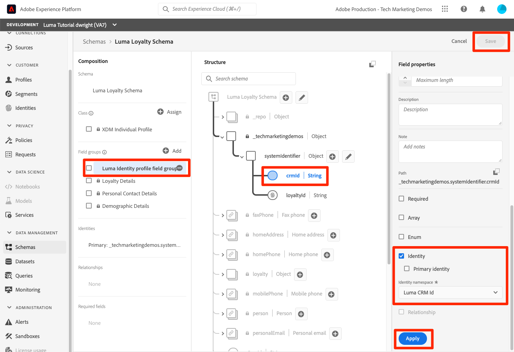

# 對應身分識別

<!-- 30 min-->

在本課程中，我們將建立身分識別名稱空間，並將身分識別欄位新增至結構描述。 完成此操作後，我們還將能夠完成上一個課程的結構描述關係。

Adobe Experience Platform Identity Service可跨裝置和系統橋接身分，讓您即時提供具影響力的個人數位體驗，協助您更清楚瞭解客戶及其行為。 身分欄位和名稱空間是將不同資料來源連線在一起，以建立360度即時客戶個人檔案的膠水。

**數據架構師** 需要在此教學課程之外映射身份。

在開始練習之前，請觀看此短片，進一步瞭解Adobe Experience Platform中的身分識別：
>[!VIDEO](https://video.tv.adobe.com/v/3422770?learn=on&enablevpops&captions=chi_hant)

>[!NOTE]
>
>只有在您建立即時客戶設定檔時，才需要身分欄位。 如果您只將資料擷取到Data Lake，則不需要使用這兩項功能。

<!--explain identity maps-->
<!--explain the strategy behind the identity selection, how these identities will join all the data together-->

## 需要的許可權

在[設定許可權](configure-permissions.md)課程中，您已設定完成本課程所需的所有存取控制。

<!--
* Permission items **[!UICONTROL Identity Management]** > **[!UICONTROL View Identity Namespaces]** and **[!UICONTROL Manage Identity Namespaces]**
* Permission item **[!UICONTROL Data Modeling]** > **[!UICONTROL View Schemas]** and **[!UICONTROL Manage Schemas]**
* Permission item **[!UICONTROL Sandboxes]** > `Luma Tutorial`
* User-role access to the `Luma Tutorial Platform` product profile
* Developer-role access to the `Luma Tutorial Platform` product profile (for API)
-->

## 建立身分識別命名空間

在本練習中，我們將為 Luma 的自訂身份欄位`loyaltyId` `crmId`、、 和 `productSku`.身分識別命名空間在建立即時客戶輪廓方面扮演關鍵角色，因為相同命名空間中的兩個相符值可讓兩個資料來源形成身分識別圖表。


### 建立 UI中的命名空間

讓我們開始一下，為 Luma 忠誠度結構建立命名空間：

1. 在 Platform 用戶 界面中，轉到&#x200B;**[!UICONTROL 左側導覽中的標識]**
1. 您會注意到，有幾個現成的標識命名空間可用。 選取建立 **[!UICONTROL 身分命名空間]** 按鈕
1. 提供如下詳細數據

   | 欄位 | 值 |
   |---------------|-----------|
   | 顯示名稱 | Luma忠誠度Id |
   | 身分識別符號 | lumaLoyaltyId |
   | 類型 | 跨裝置 |

1. 選取&#x200B;**[!UICONTROL 建立]**

   

現在為Luma產品目錄結構描述設定另一個名稱空間，其詳細資訊如下：

| 欄位 | 值 |
|---------------|-----------|
| 顯示名稱 | Luma 產品SKU |
| 身分識別符號 | lumaProductSKU |
| 類型 | 非人員識別碼 |


## 使用 API 建立身分命名空間

我們將通過 API 建立我們的 CRM 命名空間。

>[!NOTE]
>
>如果您希望跳過 API 練習，免費通過您使用的用戶介面方法創建 CRM 命名空間，並具有以下詳細信息：
>
> 1. 由於顯示 **[!UICONTROL 名稱]**，請使用 `Luma CRM Id`
> 1. **[!UICONTROL 作為標識碼，]**&#x200B;請使用`lumaCrmId`
> 1. **[!UICONTROL 作為「類型]**」，請使用「跨裝置」

讓我們建立身分識別名稱空間`Luma CRM Id`：

1. 將[Identity Service.postman_collection.json](https://raw.githubusercontent.com/adobe/experience-platform-postman-samples/master/apis/experience-platform/Identity%20Service.postman_collection.json)下載至您的`Luma Tutorial Assets`資料夾
1. 將集合匯入[!DNL Postman]
1. 如果您沒有存取權杖，請開啟要求&#x200B;**[!DNL OAuth: Request Access Token]**&#x200B;並選取&#x200B;**傳送**&#x200B;以要求新的存取權杖。
1. 選取要求&#x200B;**[!UICONTROL 身分識別服務] > [!UICONTROL 身分識別名稱空間] > [!UICONTROL 建立新的身分識別名稱空間]。**
1. 將下列內容貼上為請求的[!DNL Body]：

   ```json
   {
       "name": "Luma CRM Id",
       "code": "lumaCrmId",
       "idType": "Cross_device"
   }
   ```

1. 按「 **發送」** 按鈕，您應該得到 **200 確定** 回應：

   

如果您返回到 用戶 介面，現在應該會看到三個新的自定義命名空間：


## 加標籤架構中的身分欄位

現在我們有了命名空間，下一步是更新我們的架構以標記我們的身份欄位。


### 加標籤 主要身分的 XDM 字段

與即時客戶配置檔一起使用的每個綱要都必須指定一個主要身份。 引入的每條記錄都必須具有該欄位的值。

讓我們向 ：`Luma Loyalty Schema`

1. 開啟 `Luma Loyalty Schema`
1. 選擇 `Luma Identity profile field group`
1. 選取`loyaltyId`欄位
1. 檢查&#x200B;**[!UICONTROL 身分]**&#x200B;方塊
1. 也請勾選&#x200B;**[!UICONTROL 主要身分]**&#x200B;方塊
1. 從&#x200B;**[!UICONTROL 身分識別名稱空間]**&#x200B;下拉式清單中選取`Luma Loyalty Id`名稱空間
1. 選取&#x200B;**[!UICONTROL 套用]**
1. 選取&#x200B;**[!UICONTROL 儲存]**

   

對部分其他結構描述重複此程式：

1. 在`Luma CRM Schema`中，使用`Luma CRM Id`名稱空間將`crmId`欄位標示為主要身分
1. 在`Luma Offline Purchase Events Schema`中，使用`Luma Loyalty Id`名稱空間將`loyaltyId`欄位標示為主要身分
1. 在`Luma Product Catalog Schema`中，使用`Luma Product SKU`名稱空間將`productSku`欄位標示為主要身分

>[!NOTE]
>
>使用 Web SDK 收集的數據是標記綱要中標識字段的典型做法的例外情況。 Web SDK 使用標識映射在實施端&#x200B;*標記標識*，因此，當我們在 Luma 網站上實施 Web SDK 時，我們將確定的`Luma Web Events Schema`標識。在後面的課程中，我們會收集Experience Cloud訪客 ID （ECID） 作為主要 ID，收集 crmId 作為次要 ID。

通過我們選擇的主要身份，可以清楚地看到如何 `Luma Loyalty Schema` 連接到 因為它們 `Luma Offline Purchase Events Schema` 都使用loyaltyId作為標識碼。 但是，CRM 如何連接到線下購買事件？ 我們如何將離線購買與線上行為聯繫起來？ 我們如何通過我們的產品目錄對購買的產品進行分類？ 我們將使用其他身分欄位和綱要關係。

<!--use a visual-->

### 加標籤輔助身份的 XDM 字段

您可將多個身分欄位新增至綱要。 非主要標識通常稱為輔助標識。 為了將離線購買行為與線上行為聯繫起來，我們會將 crmId 作為輔助標識碼添加到我們的 `Luma Loyalty Schema` Web 事件數據中，稍後在我們的 Web 事件數據中。 讓我們更新 `Luma Loyalty Schema`：

1. 開啟 `Luma Loyalty Schema`
1. 選擇 `Luma Identity Profile Field group`
1. 選取 `crmId` 欄位
1. 檢查&#x200B;**[!UICONTROL 身分]**&#x200B;方塊
1. 從&#x200B;**[!UICONTROL 身分識別名稱空間]**&#x200B;下拉式清單中選取`Luma CRM Id`名稱空間
1. 選取&#x200B;**[!UICONTROL 套用]**，然後選取&#x200B;**[!UICONTROL 儲存]**&#x200B;按鈕以儲存您的變更

   

## 完成結構描述關係

現在我們的身分欄位已加上標籤，我們可以完成Luma產品目錄與事件結構描述之間的結構描述關係設定：

1. 開啟`Luma Offline Purchase Events Schema`
1. 選取&#x200B;**[!UICONTROL Commerce詳細資料]**&#x200B;欄位群組
1. 選取&#x200B;**[!UICONTROL productListItems]** > **[!UICONTROL SKU]**&#x200B;欄位
1. 檢查&#x200B;**[!UICONTROL Relationship]**&#x200B;方塊
1. 選取`Luma Product Catalog Schema`做為&#x200B;**[!UICONTROL 參考結構描述]**
1. `Luma Product SKU` 應自動填入 **[!UICONTROL 為引用標識命名空間]**
1. 選擇 **[!UICONTROL 套用]**
1. 選取 **[!UICONTROL 儲存]**

   

重複此過程以在和 `Luma Product Catalog Schema`之間`Luma Web Events Schema`建立關係。

請注意，定義關係後，在綱要編輯者的“ **[!UICONTROL 組合]** ”和 **[!UICONTROL “結構]** ”部分中都會指示它。

結構描述編輯器中的

<!--need to verify that the relationship schema works-->

## 其他資源

* [Identity Service檔案](https://experienceleague.adobe.com/docs/experience-platform/identity/home.html?lang=zh-Hant)
* [身分識別服務API](https://www.adobe.io/experience-platform-apis/references/identity-service/)

現在我們的身分已準備就緒，我們可以[建立資料集](create-datasets.md)！
