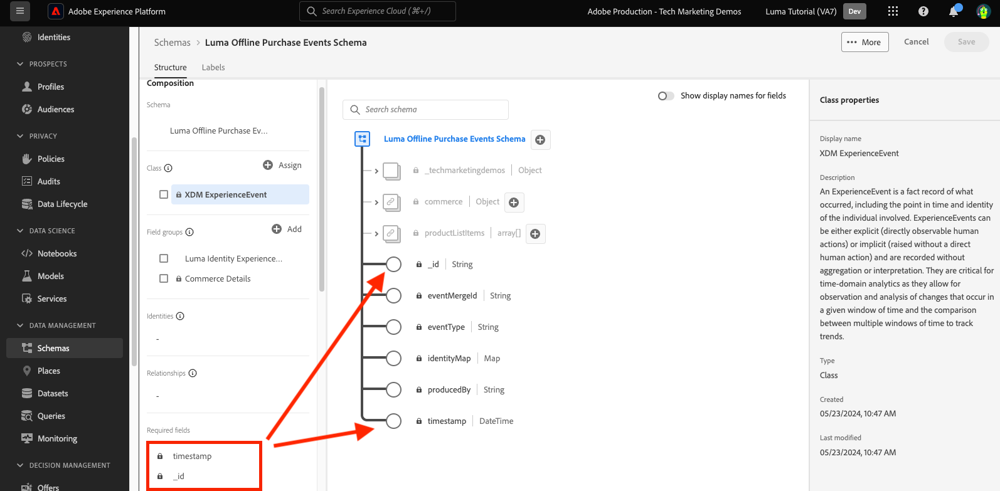

# 在結構描述中模型資料

<!-- 60min -->
在本課程中，您將將Luma的資料模型化為結構描述。 這是教學課程中最長的課程之一，所以請喝杯水並扣上！

標準化和互通性是Adobe Experience Platform背後的重要概念。 Experience Data Model (XDM)致力於標準化客戶體驗資料並定義客戶體驗管理的結構。

XDM是公開記錄的規格，旨在改善數位體驗的效能。 它提供通用結構和定義，供任何應用程式用來與Platform服務通訊。 只要遵循XDM標準，所有客戶體驗資料都可整合到共同表現中，以更快、更整合的方式提供深入分析。 您可以從客戶動作中獲得有價值的深入分析、透過區段定義客戶對象，以及表達客戶屬性以進行個人化。

XDM是基礎架構，可讓Adobe Experience Cloud在Experience Platform的支援下，於正確的時間在正確的頻道將正確的訊息傳遞給正確的人。 建置Experience Platform的方法、 **XDM系統**，可讓Platform服務使用的體驗資料模型結構描述開始運轉。

<!--
This seems too lengthy. The video should suffice

Key terms:

* **Schema**: a representation of your data. A schema is comprised of a class and optional field groups and is used to create datasets. A schema includes behavioral attributes, timestamp, identity, attribute definitions, and relationships.
* **XDM Profile Class**: a common schema class used to represent record data
* **XDM ExperienceEvent Class**: a common schema class used to represent time-series data
* **Field group**: allows users to extend reusable fields that contain variables defining one or more attribute intended to be included in a schema or added to a class.
* **Standard Field group**: an open-source Field group built to conform to common industry standards, used to accelerate implementation and support repeatable services operating on the data
* **Data type**: a reusable object with properties in a hierarchical representation. These can be standard types or custom-defined defined types to describe your own data in your own way (for example, a collection of fields that you use to describe your products). Unlike Field groups, data types can be used in schemas regardless of the class.
* **Field**: a field is the lowest level element of a schema. Each field has a name for referencing and a type to identify the type of data that it contains. Field types can include, integer, number, string, Boolean and schema.
-->

**資料架構師** 將需要在本教學課程之外建立結構描述，但 **資料工程師** 將與資料架構師建立的結構描述緊密合作。

在開始練習之前，請觀看此短片，進一步瞭解結構描述和Experience Data Model (XDM)：
>[!VIDEO](https://video.tv.adobe.com/v/27105?learn=on)

>[!TIP]
>
> 如需Experience Platform資料模型方面的更深入探討，建議您參加此課程 [使用XDM為您的客戶體驗資料建立模型](https://experienceleague.adobe.com/?recommended=ExperiencePlatform-D-1-2021.1.xdm)，免費Experience League！

## 需要的許可權

在 [設定許可權](configure-permissions.md) 課程，您已設定完成本課程所需的所有存取控制項。

<!--, specifically:

* Permission items **[!UICONTROL Data Modeling]** > **[!UICONTROL View Schemas]** and **[!UICONTROL Manage Schemas]**
* Permission item **[!UICONTROL Sandboxes]** > `Luma Tutorial`
* User-role access to the `Luma Tutorial Platform` product profile
* Developer-role access to the `Luma Tutorial Platform` product profile (for API)-->


<!--
## Luma's goals
-->

## 透過UI建立熟客方案

在本練習中，我們將建立Luma忠誠度資料的結構描述。

1. 前往Platform使用者介面，並確保已選取您的沙箱。
1. 前往 **[!UICONTROL 方案]** ，位於左側導覽器中。
1. 選取 **[!UICONTROL 建立結構描述]** 按鈕。
   

1. 在「建立方案」工作流程中，選取 **[!UICONTROL 個別設定檔]** 作為您結構描述的基底類別，因為我們將為個別客戶的屬性（點、狀態等）建立模型。
1. 選取 **[!UICONTROL 下一個]**.
   

1. 輸入 `Luma Loyalty Schema` 在 **[!UICONTROL 結構描述顯示名稱]** 文字欄位。 在以下畫布中，您也可以檢閱及驗證您所選擇類別所提供的基本結構描述結構。
1. 選取 **[!UICONTROL 完成]** 以建立架構。
   

### 新增標準欄位群組

建立結構描述後，您將會被重新導向到結構描述編輯器，您可以在其中新增欄位到結構描述。 您可以直接將個別欄位新增到結構描述或使用欄位群組。 請務必注意，所有個別欄位仍與類別或欄位群組相關聯。 您可以從Adobe提供的大量產業標準欄位群組中選取，或是建立您自己的欄位群組。 當您開始在Experience Platform中建立自己的資料模型時，最好熟悉Adobe提供的業界標準欄位群組。 最佳實務是儘可能使用這些功能，因為它們有時會支援下游服務，例如Customer AI、Attribution AI和Adobe Analytics。

使用您自己的資料時，決定應在Platform中擷取哪些您自己的資料，以及應如何模型化這些資料，將是重要的步驟。 本課程會更深入地討論這個大型主題 [使用XDM為您的客戶體驗資料建立模型](https://experienceleague.adobe.com/?recommended=ExperiencePlatform-D-1-2021.1.xdm). 在本教學課程中，我將引導您實作一些預先決定的結構描述。

若要新增欄位群組：

1. 選取 **[!UICONTROL 新增]** 在 **[!UICONTROL 欄位群組]** 標題。
   
1. 在 **[!UICONTROL 新增欄位群組]** 強制回應視窗，選取下列欄位群組：
   1. **[!UICONTROL 人口統計細節]** 基礎客戶資料，例如名稱和出生日期
   1. **[!UICONTROL 個人聯絡詳細資訊]** 取得基本連絡人詳細資料，例如電子郵件地址和電話號碼
1. 您可以選取列右側的圖示，預覽欄位群組中貢獻的欄位。
   

1. 檢查 **[!UICONTROL 產業]** > **[!UICONTROL 零售]** 方塊以公開特定產業欄位群組。
1. 選取 **[!UICONTROL 熟客方案細節]** 以新增熟客方案欄位。
1. 選取 **[!UICONTROL 新增欄位群組]** 以將全部三個欄位群組新增至結構描述。
   


現在，請花一些時間探索結構的目前狀態。 欄位群組已新增與人員、其聯絡詳細資料和忠誠計畫狀態相關的標準欄位。 在為自己公司的資料建立結構描述時，您可能會發現這兩個欄位群組很有用。 選取特定欄位群組列，或勾選欄位群組名稱旁的方塊，以檢視視覺效果如何變更。

若要儲存結構，請選取 **[!UICONTROL 儲存]**.


>[!NOTE]
>
>如果欄位群組為您未收集的資料點新增欄位，這是可以的。 例如，「faxPhone」可能是Luma未收集資料的欄位。 沒關係。 僅僅因為欄位已在結構描述中定義，並不意味著它的資料 *必須* 稍後將會內嵌。 您也可以從結構描述中移除欄位。

### 新增自訂欄位群組

現在，讓我們建立一個自訂欄位群組。

而熟客欄位群組包含 `loyaltyID` 欄位， Luma想要在單一群組中管理其所有系統識別碼，以協助確保其結構描述的一致性。

欄位群組必須在結構描述工作流程中建立。 您可以：

* 先將新的自訂欄位新增到您的結構描述，然後建立自訂欄位群組，或
* 先建立自訂欄位群組，然後新增欄位至該群組。

在本教學課程中，我們會從建立自訂欄位群組開始。

若要建立欄位群組：

1. 選取 **[!UICONTROL 新增]** 在 **[!UICONTROL 結構描述欄位群組]** 標題
   
1. 選取 **[!UICONTROL 建立新欄位群組]**
1. 使用 `Luma Identity profile field group` 作為 **[!UICONTROL 顯示名稱]**
1. 使用 `system identifiers for XDM Individual Profile class` 作為 **[!UICONTROL 說明]**
1. 選取 **[!UICONTROL 新增欄位群組]**
   

新的空白欄位群組會新增至您的架構。 此 **[!UICONTROL +]** 按鈕可用來將新欄位新增至階層中的任何位置。 在我們的案例中，我們想要在根層級新增欄位：

1. 選取 **[!UICONTROL +]** 在結構描述名稱旁。 這會在您的租使用者ID名稱空間下新增欄位，以管理您的自訂欄位和任何標準欄位之間的衝突。
1. 在 **[!UICONTROL 欄位屬性]** 側欄新增新欄位的詳細資訊：
   1. **[!UICONTROL 欄位名稱]**： `systemIdentifier`
   1. **[!UICONTROL 顯示名稱]**： `System Identifier`
   1. **[!UICONTROL 型別]**： **[!UICONTROL 物件]**
   1. 在 **[!UICONTROL 欄位群組]** 下拉式清單中選取 **Luma身分設定檔欄位群組** 已建立的。
      
   1. 選取 **[!UICONTROL 套用]**
      

現在，在「 」下方新增兩個欄位 `systemIdentifier` 物件：

1. 第一個欄位
   1. **[!UICONTROL 欄位名稱]**： `loyaltyId`
   1. **[!UICONTROL 顯示名稱：]** `Loyalty Id`
   1. **[!UICONTROL 型別]**： **[!UICONTROL 字串]**
1. 第二個欄位
   1. **[!UICONTROL 欄位名稱]**： `crmId`
   1. **[!UICONTROL 顯示名稱]**： `CRM Id`
   1. **[!UICONTROL 型別]**： **[!UICONTROL 字串]**

您的新欄位群組應如下所示。 選取 **[!UICONTROL 儲存]** 按鈕以儲存您的結構描述，但讓結構描述保持開啟以供下一個練習。


## 建立資料型別

欄位群組，例如您的新欄位 `Luma Identity profile field group`，也可在其他方案中重複使用，讓您跨多個系統強制執行標準資料定義。 但它們只能重複使用 _在共用類別的結構描述中_，在此案例中為「XDM個別設定檔」類別。

資料型別是另一個可在結構描述中重複使用的多欄位結構 _跨多個類別_. 現在來轉換新的 `systemIdentifier` 物件轉換成資料型別：

使用 `Luma Loyalty Schema` 如果仍然開啟，請選取 `systemIdentifier` 物件並選取  **[!UICONTROL 轉換為新資料型別]**


如果您 **[!UICONTROL 取消]** 離開結構描述，並導覽至 **[!UICONTROL 資料型別]** 索引標籤上，您會看到新建立的資料型別。 我們將在稍後的課程中使用此資料型別。


## 透過API建立CRM結構描述

現在我們將使用API建立結構描述。

>[!TIP]
>
> 如果您偏好略過API練習，則可以使用使用者介面方法建立以下結構描述：
>
> 1. 使用 [!UICONTROL 個別設定檔] 類別
> 1. 將其命名 `Luma CRM Schema`
> 1. 使用下列欄位群組：「人口統計細節」、「個人聯絡人細節」和「Luma身分設定檔」欄位群組

首先，我們建立空的結構描述：

1. 開啟 [!DNL Postman]
1. 如果您沒有存取權杖，請開啟請求 **[!DNL OAuth: Request Access Token]** 並選取 **傳送** 以請求新的存取Token。
1. 開啟您的環境變數並變更的值 **CONTAINER_ID** 從 `global` 至 `tenant`. 請記住，您必須使用 `tenant` 當您想要與Platform中的自訂元素互動時，例如建立結構。
1. 選取 **儲存**
   
1. 開啟請求 **[!DNL Schema Registry API > Schemas > Create a new custom schema.]**
1. 開啟 **內文** 定位並貼上下列程式碼，然後選取 **傳送** 以進行API呼叫。 此呼叫使用相同專案建立新的結構描述 `XDM Individual Profile` 基底類別：

   ```json
   {
     "type": "object",
     "title": "Luma CRM Schema",
     "description": "Schema for CRM data of Luma Retail ",
     "allOf": [{
       "$ref": "https://ns.adobe.com/xdm/context/profile"
     }]
   }
   ```

   >[!NOTE]
   >
   >此和後續程式碼範例中的名稱空間會參照(例如 `https://ns.adobe.com/xdm/context/profile`)，可透過使用清單API呼叫取得 **[!DNL CONTAINER_ID]** 並接受標題設為正確值。 部分也可在使用者介面中輕鬆存取。

1. 您應該會收到 `201 Created` 回應
1. 複製 `meta:altId` 來自回應內文。 我們稍後會在另一個練習中使用它。
   

1. 新的結構描述應該會顯示在使用者介面中，但不包含任何欄位群組
   

>[!NOTE]
>
> 此 `meta:altId` 或綱要ID也可透過提出API要求來取得 **[!DNL Schema Registry API > Schemas > Retrieve a list of schemas within the specified container.]** 使用 **[!UICONTROL CONTAINER_ID]** 設為 `tenant` 和accept標題 `application/vnd.adobe.xdm+json`.

>[!TIP]
>
> 此呼叫的常見問題及可能的修正：
>
> * 無驗證權杖：執行 **OAuth：要求存取權杖** 產生新權杖的請求
> * `401: Not Authorized to PUT/POST/PATCH/DELETE for this path : /global/schemas/`：更新 **CONTAINER_ID** 環境變數來源 `global` 至 `tenant`
> * `403: PALM Access Denied. POST access is denied for this resource from access control`：在Admin Console中驗證您的使用者許可權

### 新增標準欄位群組

現在可以將欄位群組新增到結構描述中：

1. 在 [!DNL Postman]，開啟請求 **[!DNL Schema Registry API > Schemas > Update one or more attributes of a custom schema specified by ID.]**
1. 在 **引數** 標籤，貼上 `meta:altId` 先前回應的值，做為 `SCHEMA_ID`
1. 開啟「內文」標籤，貼上下列程式碼並選取 **傳送** 以進行API呼叫。 此呼叫會將標準欄位群組新增至 `Luma CRM Schema`：

   ```json
   [{
       "op": "add",
       "path": "/allOf/-",
       "value": {
         "$ref": "https://ns.adobe.com/xdm/context/profile-personal-details"
       }
     },
     {
       "op": "add",
       "path": "/allOf/-",
       "value": {
         "$ref": "https://ns.adobe.com/xdm/context/profile-person-details"
       }
     }
   ]
   ```

1. 您應該會收到回應的「200 OK」狀態，而且欄位群組應該會顯示在您的UI結構描述中

   


### 新增自訂欄位群組

現在來新增我們的 `Luma Identity profile field group` 至結構描述。 首先，我們需要使用清單API尋找新欄位群組的ID：

1. 開啟請求 **[!DNL Schema Registry API > Field groups > Retrieve a list of field groups within the specified container.]**
1. 選取 **傳送** 按鈕以擷取您帳戶中所有自訂欄位群組的清單
1. 抓取 `$id` 的值 `Luma Identity profile field group` （您的值與此熒幕擷圖中的值不同）
   
1. 開啟請求 **[!DNL Schema Registry API > Schemas > Update one or more attributes of a custom schema specified by ID.]** 再次
1. 此 **引數** 標籤仍應具有 `$id` 架構的
1. 開啟 **內文** 定位並貼上下列程式碼，取代 `$ref` 含有的值 `$id` 您自己的 `Luma Identity profile field group`：

   ```json
   [{
     "op": "add",
     "path": "/allOf/-",
     "value": {
       "$ref": "REPLACE_WITH_YOUR_OWN_FIELD_GROUP_ID"
     }
   }]
   ```

1. 選取 **傳送**
   

透過檢查介面中的API回應和來確認欄位群組已新增到結構描述。

## 建立離線購買事件結構描述

現在，讓我們根據以下內容建立結構描述： **[!UICONTROL 體驗事件]** Luma離線購買資料的類別。 由於您現在已熟悉結構編輯器使用者介面，我將減少指示中的熒幕擷取畫面數量：

1. 使用建立結構描述 **[!UICONTROL 體驗事件]** 類別。
1. 為您的結構描述命名 `Luma Offline Purchase Events Schema`.
1. 新增標準欄位群組 **[!UICONTROL Commerce詳細資料]** 以擷取一般訂單詳細資訊。 請花幾分鐘時間探索內部的物件。
1. 搜尋 `Luma Identity profile field group`. 無法使用！ 請記住，欄位群組繫結至類別，由於我們對此結構描述使用不同的類別，因此我們無法使用它。 我們需要為包含身分欄位的XDM ExperienceEvent類別新增欄位群組。 我們的資料型別能讓您輕鬆辦到！
1. 選取 **[!UICONTROL 建立新欄位群組]** 選項按鈕
1. 輸入 **[!UICONTROL 顯示名稱]** 作為 `Luma Identity ExperienceEvent field group` 並選取 **[!UICONTROL 新增欄位群組]** 按鈕
1. 選取架構名稱旁邊的 **[!UICONTROL +]**。
1. 作為 **[!UICONTROL 欄位名稱]**，輸入 `systemIdentifier`.
1. 作為 **[!UICONTROL 顯示名稱]**，輸入 `System Identifier`.
1. 作為 **[!UICONTROL 型別]**，選取 **系統識別碼** 這是您先前建立的自訂資料型別。
1. 作為 **[!UICONTROL 欄位群組]** 選取 **Luma Identity ExperienceEvent欄位群組**.
1. 選取 **[!UICONTROL 套用]** 按鈕。
1. 選取 **[!UICONTROL 儲存]** 按鈕。

請注意資料型別新增所有欄位的方式！


另外，選取 **[!UICONTROL XDM ExperienceEvent]** 在 **[!UICONTROL 類別]** 標題並檢查此類別貢獻的某些欄位。 請注意，使用XDM ExperienceEvent類別時需要_id和時間戳記欄位，使用此結構描述時，必須為擷取的每個記錄填入這些欄位：



## 建立Web事件結構描述

現在，我們將針對Luma的網站資料再建立一個結構描述。 此時，您應該已是建立結構描述的專家！ 使用這些屬性建置以下結構描述

| 屬性 | 值 |
|---------------|-----------------|
| 類別 | 體驗事件 |
| 結構描述名稱 | Luma Web事件結構描述 |
| 欄位群組 | AEP Web SDK ExperienceEvent |
| 欄位群組 | 消費者體驗事件 |

選取 **[!UICONTROL 消費者體驗事件]** 欄位群組。 此欄位群組包含商務和productListItems物件，這些物件也位於 [!UICONTROL Commerce詳細資料]. 的確 [!UICONTROL 消費者體驗事件] 是另外幾個標準欄位群組的組合，這些群組也可單獨使用。 [!UICONTROL AEP Web SDK ExperienceEvent] 欄位群組也包含其他欄位群組，包括中的部分相同欄位群組 [!UICONTROL 消費者體驗事件]. 幸運的是，兩者完美結合。

請注意，我們並未新增 `Luma Identity ExperienceEvent field group` 至此結構描述。 這是因為Web SDK收集身分的方式不同。 如果您選取 **[!UICONTROL XDM ExperienceEvent]** 中的類別 **[!UICONTROL 組合]** 結構編輯器區段，您會注意到它預設新增的其中一個欄位稱為 **[!UICONTROL 身分對應]**. [!DNL IdentityMap] 供各種Adobe應用程式用來連結至平台。 您將在串流擷取課程中看到如何透過identityMap將身分傳送至Platform。


## 建立產品目錄結構描述

藉由使用  [!UICONTROL Commerce詳細資料] 和 [!UICONTROL 消費者體驗事件] 欄位群組，Luma會透過標準productListItems資料型別來報告產品相關事件的部分詳細資料。 但他們也有其他產品詳細資料欄位，要傳送至Platform。 與其在銷售點和電子商務系統中擷取這些欄位，Luma寧願直接從產品目錄系統中擷取這些欄位。 「結構描述關係」可讓您為分類或查詢目的定義兩個結構描述之間的關係。 Luma會使用關係將產品詳細資料分類。 我們現在會開始此程式，並在下一個課程結束時完成。

>[!NOTE]
>
>如果您是現有Analytics或Target客戶，分類具有結構描述關係的實體類似於SAINT分類或上傳Recommendations的產品目錄

首先，我們必須使用自訂類別為Luma的產品目錄建立結構描述：

1. 選取 **[!UICONTROL 建立結構描述]** 按鈕。
1. 在「建立方案」工作流程中，選取 **[!UICONTROL 其他]** 選項。
   
1. 選取 **[!UICONTROL 建立類別]** 按鈕
1. 將其命名 `Luma Product Catalog Class`
1. 離開 **[!UICONTROL 行為]** 作為 **[!UICONTROL 記錄]**
1. 選取 **[!UICONTROL 建立]** 按鈕。
   
1. 此 **Luma產品目錄類別** 您建立的類別會顯示在下面的「類別」表格中。 確定已選取類別，然後選取 **[!UICONTROL 下一個]**.
   
1. 為結構命名 `Luma Product Catalog Schema`.
1. 建立新的 [!UICONTROL 欄位群組] 已呼叫 `Luma Product Catalog field group` 欄位：
   1. productName：產品名稱：字串
   1. productCategory：產品類別：字串
   1. productColor：產品色彩：字串
   1. productSku： Product SKU： String | 必填
   1. productSize：產品大小：字串
   1. productPrice：產品價格：雙倍
1. **[!UICONTROL 儲存]** 結構描述

您的新結構描述應如下所示。 請注意 `productSku` 欄位會列在 [!UICONTROL 必填欄位] 區段：


下一步是定義兩個ExperienceEvent結構描述與 `Luma Product Catalog Schema`但是，在我們可以執行之前，我們必須在下一個課程中執行一些額外的步驟。


## 其他資源

* [Experience Data Model (XDM)系統檔案](https://experienceleague.adobe.com/docs/experience-platform/xdm/home.html?lang=zh-Hant)
* [結構描述登入API](https://www.adobe.io/experience-platform-apis/references/schema-registry/)


現在您已擁有結構描述，您可以 [對應身分](map-identities.md)！
