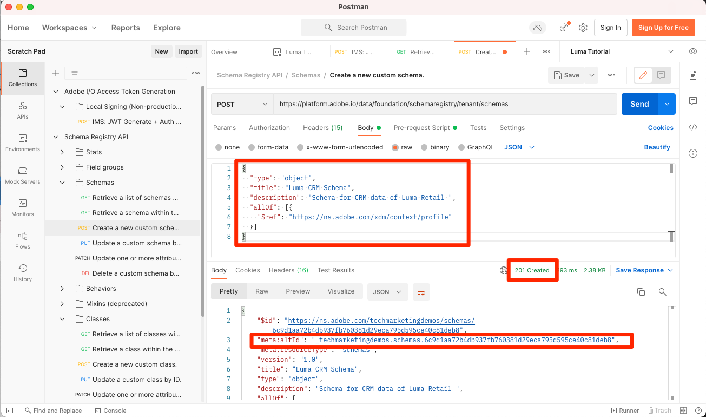

# 模式中的資料模型

<!-- 60min -->
在本課程中，您會將Luma的資料模型化為結構。 這是教學課程中最長的課程之一，所以請喝杯水，然後系好牢！

標準化和互操作性是Adobe Experience Platform背後的重要概念。 Experience Data Model(XDM)是一項努力，目的是標準化客戶體驗資料，並定義客戶體驗管理的結構。

XDM是公開記錄的規格，旨在改善數位體驗的強大功能。 它為用於與Platform服務通信的任何應用程式提供通用結構和定義。 遵循XDM標準，所有客戶體驗資料皆可整合至通用表示法中，以更快速、更整合的方式提供深入分析。 您可以從客戶動作中獲得寶貴的深入分析、透過區段定義客戶受眾，以及為個人化目的表達客戶屬性。

XDM是基本架構，可讓Adobe Experience Cloud(由Experience Platform提供技術支援)在適當的時間，透過適當的管道向適當的人員傳遞適當的訊息。 建立Experience Platform的方法， **XDM系統**，可操作Experience Data Model結構以供Platform服務使用。

<!--
This seems too lengthy. The video should suffice

Key terms:

* **Schema**: a representation of your data. A schema is comprised of a class and optional field groups and is used to create datasets. A schema includes behavioral attributes, timestamp, identity, attribute definitions, and relationships.
* **XDM Profile Class**: a common schema class used to represent record data
* **XDM ExperienceEvent Class**: a common schema class used to represent time-series data
* **Field group**: allows users to extend reusable fields that contain variables defining one or more attribute intended to be included in a schema or added to a class.
* **Standard Field group**: an open-source Field group built to conform to common industry standards, used to accelerate implementation and support repeatable services operating on the data
* **Data type**: a reusable object with properties in a hierarchical representation. These can be standard types or custom-defined defined types to describe your own data in your own way (for example, a collection of fields that you use to describe your products). Unlike Field groups, data types can be used in schemas regardless of the class.
* **Field**: a field is the lowest level element of a schema. Each field has a name for referencing and a type to identify the type of data that it contains. Field types can include, integer, number, string, Boolean and schema.
-->

**資料架構師** 需要在本教學課程之外建立結構，但 **資料工程師** 將與Data Architect建立的結構密切合作。

開始練習之前，請觀看此短片，以深入了解結構和Experience Data Model(XDM):
>[!VIDEO](https://video.tv.adobe.com/v/27105?quality=12&learn=on)

>[!TIP]
>
> 若要深入探討Experience Platform中的資料模型，建議您參加本課程 [使用XDM建立客戶體驗資料模型](https://experienceleague.adobe.com/?recommended=ExperiencePlatform-D-1-2021.1.xdm)，免費提供Experience League!

## 需要權限

在 [設定權限](configure-permissions.md) 課程中，您設定了完成本課程所需的所有訪問控制。

<!--, specifically:

* Permission items **[!UICONTROL Data Modeling]** > **[!UICONTROL View Schemas]** and **[!UICONTROL Manage Schemas]**
* Permission item **[!UICONTROL Sandboxes]** > `Luma Tutorial`
* User-role access to the `Luma Tutorial Platform` product profile
* Developer-role access to the `Luma Tutorial Platform` product profile (for API)-->


<!--
## Luma's goals
-->

## 透過UI建立忠誠度結構

在此練習中，我們將建立Luma忠誠度資料的結構。

1. 前往Platform使用者介面，並確定已選取您的沙箱。
1. 前往 **[!UICONTROL 結構]** 在左側導覽列中
1. 選取 **[!UICONTROL 建立結構]** 按鈕
1. 從下拉式功能表中，選取 **[!UICONTROL XDM個別設定檔]**，因為我們將建立個別客戶的屬性模型（點、狀態等）。
   

### 新增標準欄位群組

接下來，系統會提示您將欄位群組新增至架構。 必須使用群組將所有欄位新增至結構。 您可以從Adobe提供的大量業界標準欄位群組中進行選擇，或建立您自己的欄位群組。 當您開始在Experience Platform中建立自己的資料模型時，最好熟悉Adobe提供的業界標準欄位群組。 盡可能使用這些變數是最佳作法，因為有時它們可支援下游服務，例如Customer AI、Attribution AI和Adobe Analytics。

使用您自己的資料時，重要的步驟是決定應在Platform中擷取您的哪些資料，以及如何建立模型。 本課程將更深入地討論這一大主題 [使用XDM建立客戶體驗資料模型](https://experienceleague.adobe.com/?recommended=ExperiencePlatform-D-1-2021.1.xdm). 在本教學課程中，我將引導您完成一些預先決定的結構描述的實作。

要添加欄位組：

1. 在 **[!UICONTROL 新增欄位群組]** 強制回應，選取下列欄位群組：
   1. **[!UICONTROL 人口統計詳細資料]** 基本客戶資料，例如名稱和生日
   1. **[!UICONTROL 個人聯繫人詳細資訊]** 基本聯繫詳情，如電子郵件地址和電話號碼
1. 您可以選取列右側的圖示，以預覽欄位群組中貢獻的欄位。
   

1. 檢查 **[!UICONTROL 產業]** > **[!UICONTROL 零售]** 方塊以公開特定於產業的欄位群組。
1. 選擇 **[!UICONTROL 忠誠度]** 以新增忠誠計畫欄位。
1. 選擇 **[!UICONTROL 新增欄位群組]** 將所有三個欄位群組新增至架構。
   


現在，請花些時間來探索架構的目前狀態。 欄位群組已新增與人員、其聯絡詳細資訊和忠誠計畫狀態相關的標準欄位。 當您建立公司資料的結構時，可能會發現這兩個欄位群組很實用。 選取特定欄位群組列，或勾選欄位群組名稱旁的方塊，以查看視覺效果的變更方式。

若要儲存結構：

1. 選取架構的頂端節點。
1. 輸入 `Luma Loyalty Schema` 作為 **[!UICONTROL 顯示名稱]**.
1. 選取「**[!UICONTROL 儲存]**」。
   

>[!NOTE]
>
>如果欄位群組新增您未收集之資料點的欄位，則可行。 例如，&quot;faxPhone&quot;可能是Luma未收集資料的欄位。 沒關係。 僅因為結構中已定義欄位，並不代表其資料 *必須* 稍後被攝入。

### 新增自訂欄位群組

現在來建立自訂欄位群組。

忠誠度欄位群組包含 `loyaltyID` 欄位中，Luma想要在單一群組中管理其所有系統識別碼，以確保結構間的一致性。

欄位群組必須在架構工作流程中建立。 要建立欄位組：

1. 選擇 **[!UICONTROL 新增]** 在 **[!UICONTROL 架構欄位組]** 標題
   
1. 選擇 **[!UICONTROL 建立新欄位組]**
1. 使用 `Luma Identity profile field group` 作為 **[!UICONTROL 顯示名稱]**
1. 使用 `system identifiers for XDM Individual Profile class` 作為 **[!UICONTROL 說明]**
1. 選擇 **[!UICONTROL 新增欄位群組]**

   

新的空白欄位群組會新增至您的架構。 此 **[!UICONTROL +]** 按鈕可用來將新欄位新增至階層中的任何位置。 在本例中，我們要新增根層級的欄位：

1. 選擇 **[!UICONTROL +]** 方案名稱旁邊。 這會在您的租用戶id命名空間下新增欄位，以管理自訂欄位與任何標準欄位之間的衝突。
1. 在 **[!UICONTROL 欄位屬性]** 邊欄新增新欄位的詳細資訊：
   1. **[!UICONTROL 欄位名稱]**: `systemIdentifier`
   1. **[!UICONTROL 顯示名稱]**: `System Identifier`
   1. **[!UICONTROL 類型]**: **[!UICONTROL 物件]**
   1. 選擇 **[!UICONTROL 套用]**

   

現在，在 `systemIdentifier` 物件：

1. 第一個欄位
   1. **[!UICONTROL 欄位名稱]**: `loyaltyId`
   1. **[!UICONTROL 顯示名稱：]** `Loyalty Id`
   1. **[!UICONTROL 類型]**: **[!UICONTROL 字串]**
1. 第二欄位
   1. **[!UICONTROL 欄位名稱]**: `crmId`
   1. **[!UICONTROL 顯示名稱]**: `CRM Id`
   1. **[!UICONTROL 類型]**: **[!UICONTROL 字串]**

您的新欄位群組應如下所示。 選取 **[!UICONTROL 儲存]** 按鈕來保存您的架構，但在下一個練習中將架構保持開啟。


## 建立資料類型

欄位群組，例如新 `Luma Identity profile field group`，可在其他結構中重複使用，讓您跨多個系統強制執行標準資料定義。 但它們只能被重複使用 _在共用類的結構中_，此例中為XDM個別設定檔類別。

資料類型是另一種多欄位結構，可在結構中重複使用 _跨多個類_. 讓我們換個新的 `systemIdentifier` 對象轉換為資料類型：

使用 `Luma Loyalty Schema` 仍開啟，請選取 `systemIdentifier` 對象和選取  **[!UICONTROL 轉換為新資料類型]**


若您 **[!UICONTROL 取消]** 結構外，並導覽至 **[!UICONTROL 資料類型]** 頁簽，您就會看到新建立的資料類型。 我們將在稍後的課程中使用此資料類型。


## 透過API建立CRM結構

現在，我們將使用API建立結構。

>[!TIP]
>
> 如果您偏好略過API練習，可使用使用者介面方法建立下列結構：
>
> 1. 使用 [!UICONTROL XDM個別設定檔] 類
> 1. 為其命名 `Luma CRM Schema`
> 1. 使用下列欄位群組：人口統計詳細資訊、個人聯繫人詳細資訊和Luma身份配置檔案欄位組


首先，我們建立空架構：

1. 開啟 [!DNL Postman]
1. 如果您在過去24小時內未提出請求，則您的授權Token可能已過期。 開啟請求 **[!DNL Adobe I/O Access Token Generation > Local Signing (Non-production use-only) > IMS: JWT Generate + Auth via User Token]** 選取 **傳送** 請求新的JWT和存取權杖。
1. 開啟環境變數並變更 **CONTAINER_ID** 從 `global` to `tenant`. 記住，你必須用 `tenant` 每當您想在Platform中與自己的自訂元素互動時，例如建立結構。
1. 選擇 **儲存**
   
1. 開啟請求 **[!DNL Schema Registry API > Schemas > Create a new custom schema.]**
1. 開啟 **主體** 標籤，然後貼上下列程式碼並選取 **傳送** 來進行API呼叫。 此呼叫會使用 `XDM Individual Profile` 基類：

   ```json
   {
     "type": "object",
     "title": "Luma CRM Schema",
     "description": "Schema for CRM data of Luma Retail ",
     "allOf": [{
       "$ref": "https://ns.adobe.com/xdm/context/profile"
     }]
   }
   ```

   >[!NOTE]
   >
   >命名空間會參照這個和後續的程式碼範例(例如 `https://ns.adobe.com/xdm/context/profile`)，可透過將清單API呼叫與 **[!DNL CONTAINER_ID]** 並接受標題集為正確值。 部分也可在使用者介面中輕鬆存取。

1. 你應該得到 `201 Created` 回應
1. 複製 `meta:altId` 從響應正文。 我們稍後將在另一個練習中使用它。
   

1. 新架構應顯示在使用者介面中，但不包含任何欄位群組
   

>[!NOTE]
>
> 此 `meta:altId` 或結構ID也可透過提出API要求來取得 **[!DNL Schema Registry API > Schemas > Retrieve a list of schemas within the specified container.]** 和 **[!UICONTROL CONTAINER_ID]** 設為 `tenant` 和接受標題 `application/vnd.adobe.xdm+json`.

>[!TIP]
>
> 此呼叫的常見問題和可能的修正：
>
> * 無驗證令牌：執行 **IMS:JWT透過使用者代號產生+驗證** 產生新代號的呼叫
> * `401: Not Authorized to PUT/POST/PATCH/DELETE for this path : /global/schemas/`:更新 **CONTAINER_ID** 環境變數來源 `global` to `tenant`
> * `403: PALM Access Denied. POST access is denied for this resource from access control`:驗證Admin Console中的使用者權限


### 新增標準欄位群組

現在可以將欄位群組新增至結構：

1. 在 [!DNL Postman]，開啟請求 **[!DNL Schema Registry API > Schemas > Update one or more attributes of a custom schema specified by ID.]**
1. 在 **Params** 標籤，貼上 `meta:altId` 值，作為 `SCHEMA_ID`
1. 開啟「內文」標籤並貼上下列程式碼，然後選取 **傳送** 來進行API呼叫。 此呼叫會將標準欄位群組新增至 `Luma CRM Schema`:

   ```json
   [{
       "op": "add",
       "path": "/allOf/-",
       "value": {
         "$ref": "https://ns.adobe.com/xdm/context/profile-personal-details"
       }
     },
     {
       "op": "add",
       "path": "/allOf/-",
       "value": {
         "$ref": "https://ns.adobe.com/xdm/context/profile-person-details"
       }
     }
   ]
   ```

1. 回應的狀態應為200 OK，且欄位群組應會在UI中顯示為架構的一部分

   


### 新增自訂欄位群組

現在來加上 `Luma Identity profile field group` 至結構。 首先，我們需要使用清單API來尋找新欄位群組的ID:

1. 開啟請求 **[!DNL Schema Registry API > Field groups > Retrieve a list of field groups within the specified container.]**
1. 選取 **傳送** 按鈕，擷取帳戶中所有自訂欄位群組的清單
1. 抓住 `$id` 值 `Luma Identity profile field group` （您的版本會與此螢幕擷取中的值不同）
   
1. 開啟請求 **[!DNL Schema Registry API > Schemas > Update one or more attributes of a custom schema specified by ID.]** an
1. 此 **Params** 標籤仍應 `$id` 您的架構
1. 開啟 **主體** 標籤並貼上下列程式碼，取代 `$ref` 值 `$id` 你自己 `Luma Identity profile field group`:

   ```json
   [{
     "op": "add",
     "path": "/allOf/-",
     "value": {
       "$ref": "REPLACE_WITH_YOUR_OWN_FIELD_GROUP_ID"
     }
   }]
   ```

1. 選擇 **傳送**

   

檢查API回應和介面，確認欄位群組已新增至架構。

## 建立離線購買事件結構

現在，讓我們根據 **[!UICONTROL XDM ExperienceEvent]** 類別，以取得Luma的離線購買資料。 由於您現在已熟悉結構編輯器使用者介面，因此我將減少說明中的螢幕擷取畫面數：

1. 使用 **[!UICONTROL XDM ExperienceEvent]** 類
1. 新增標準欄位群組 **[!UICONTROL 商務詳細資訊]** 來獲取常見訂單詳細資訊。 花幾分鐘時間探索內的物件。
1. 搜尋 `Luma Identity profile field group`. 不可用！ 請記住，欄位組已綁定到某個類，由於我們為此架構使用了不同的類，因此無法使用它。 我們需要為包含身分欄位的XDM ExperienceEvent類別新增欄位群組。 我們的資料類型會讓這變得非常簡單！
1. 選取 **[!UICONTROL 建立新欄位組]** 單選按鈕
1. 輸入 **[!UICONTROL 顯示名稱]** as `Luma Identity ExperienceEvent field group` ，然後選取 **[!UICONTROL 新增欄位群組]** 按鈕
1. 請確定 **[!UICONTROL +]** 按鈕會顯示在 **[!UICONTROL 結構]** 區段，以便新增欄位
1. 在 **[!UICONTROL 結構]** 部分，選擇 **[!UICONTROL +]** 在結構的頂層
1. 作為 **[!UICONTROL 欄位名稱]**，輸入 `systemIdentifier`
1. 作為 **[!UICONTROL 顯示名稱]**，輸入 `System Identifier`
1. 作為 **[!UICONTROL 類型]**，選取 **系統標識符** 即您先前建立的自訂資料類型
1. 選取 **[!UICONTROL 套用]** 按鈕
1. 為架構命名 `Luma Offline Purchase Events Schema`
1. 選取 **[!UICONTROL 儲存]** 按鈕

請注意資料類型如何新增所有欄位！


此外，請選取 **[!UICONTROL XDM ExperienceEvent]** 在 **[!UICONTROL 類別]** 標題並檢查此類提供的一些欄位。 請注意，使用XDM ExperienceEvent類別時需要_id和時間戳記欄位，使用此架構時，必須為您擷取的每筆記錄填入這些欄位：


## 建立Web事件結構

現在，我們將為Luma的網站資料建立一個額外的架構。 此時，您應成為建立結構的專家！ 使用這些屬性建立下列架構

| 屬性 | 值 |
|---------------|-----------------|
| 類別 | XDM ExperienceEvent |
| 欄位群組 | AEP Web SDK ExperienceEvent Mixin |
| 欄位群組 | 消費者體驗事件 |
| 架構名稱 | Luma Web事件結構 |

選取 **[!UICONTROL 消費者體驗事件]** 欄位群組。 此欄位群組包含商務和productListItems物件，亦位於 [!UICONTROL 商務詳細資訊]. 事實上 [!UICONTROL 消費者體驗事件] 是數個其他標準欄位群組的組合，也可個別取得。 [!UICONTROL AEP Web SDK ExperienceEvent Mixin] 欄位群組也包含其他欄位群組，包括 [!UICONTROL 消費者體驗事件]. 幸運的是，它們完美地融為一體。

請注意，我們並未新增 `Luma Identity ExperienceEvent field group` 到此架構。 這是因為Web SDK有不同的身分收集方式。 如果您選取 **[!UICONTROL XDM ExperienceEvent]** 類別 **[!UICONTROL 組合物]** 區段時，您會發現其預設新增的其中一個欄位稱為 **[!UICONTROL IdentityMap]**. [!DNL IdentityMap] 供各種Adobe應用程式用來連結至Platform。 您會在串流獲取課程中了解如何透過identityMap將身分傳送至Platform。


## 建立產品目錄結構

使用  [!UICONTROL 商務詳細資訊] 和 [!UICONTROL 消費者體驗事件] 欄位群組，Luma會透過標準productListItems資料類型，報告產品相關事件的部分詳細資訊。 但他們也有其他產品詳細資料欄位，想要傳送至Platform。 Luma不會擷取其銷售點和電子商務系統中的所有欄位，而是偏好直接從其產品目錄系統擷取這些欄位。 「結構關係」可讓您為分類或查詢目的定義兩個結構之間的關係。 Luma將使用關係來分類其產品詳細資訊。 我們將立即開始該過程，並在下一課結束時完成該過程。

>[!NOTE]
>
>如果您是現有的Analytics或Target客戶，具有結構關係的分類實體類似於SAINT分類或上傳Recommendations的產品目錄

首先，我們必須使用自訂類別，為Luma的產品目錄建立結構：

1. 選取 **[!UICONTROL 建立結構]** 按鈕並選取 **[!UICONTROL 瀏覽]** 選項
   
1. 選取 **[!UICONTROL 建立新類]** 單選按鈕
1. 為其命名 `Luma Product Catalog Class`
1. 保留 **[!UICONTROL 行為]** as **[!UICONTROL 記錄]**
1. 選取 **[!UICONTROL 分配類]** 按鈕
   
1. 建立新 [!UICONTROL 欄位群組] 呼叫 `Luma Product Catalog field group` 填入下列欄位：
   1. productName:產品名稱：字串
   1. productCategory:產品類別：字串
   1. productColor:產品顏色：字串
   1. productSku:產品SKU:字串 |必要
   1. productSize:產品大小：字串
   1. productPrice:產品價格：雙倍
1. 為架構命名 `Luma Product Catalog Schema` （請務必更新正確的欄位，而不要更新類名）
1. **[!UICONTROL 儲存]** 架構

您的新結構應如下所示。 請注意 `productSku` 欄位會列於 [!UICONTROL 必填欄位] 小節：


下一步是定義兩個ExperienceEvent結構與 `Luma Product Catalog Schema`但是，在下一課中，我們必須另外執行一些步驟，才能執行此操作。


## 其他資源

* [Experience Data Model(XDM)系統檔案](https://experienceleague.adobe.com/docs/experience-platform/xdm/home.html?lang=zh-Hant)
* [結構註冊表API](https://www.adobe.io/experience-platform-apis/references/schema-registry/)


現在，您的架構已可 [地標](map-identities.md)!
