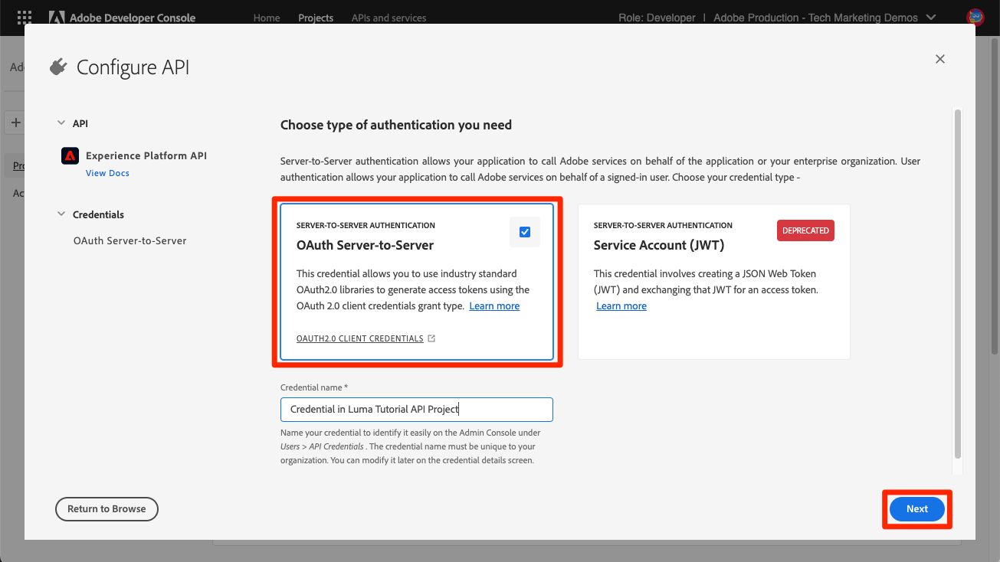
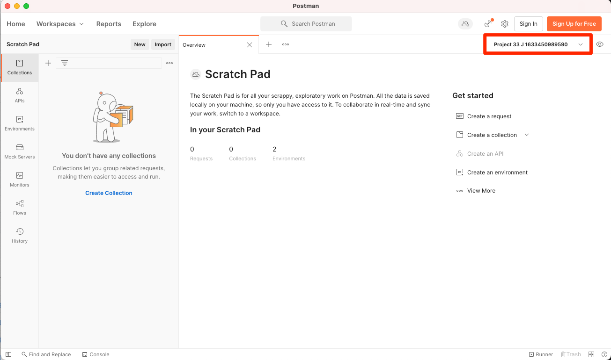
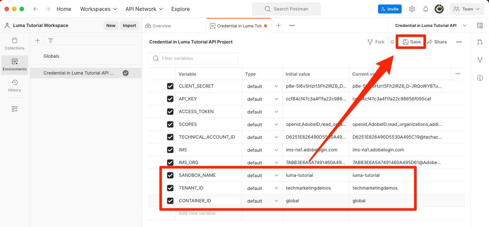
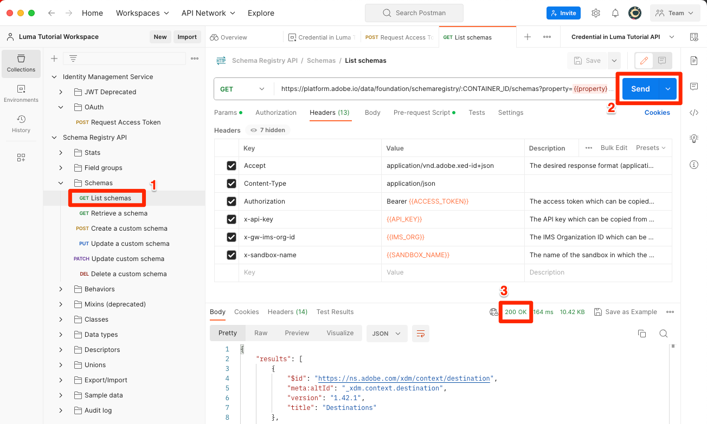

# 設定Developer Console和[!DNL Postman]

<!--30min-->

在本課程中，您將會在Adobe Developer Console中設定專案並下載[!DNL Postman]集合，以便開始使用Platform API。

為了完成本教學課程中的API練習，[下載適用於您作業系統的Postman應用程式。](https://www.postman.com/downloads/)雖然使用Experience Platform API並非必要，但Postman可簡化API工作流程，而Adobe Experience Platform可提供數十個Postman集合來協助您執行API呼叫並瞭解其運作方式。 本教學課程的其餘部分假設您具備Postman的一些實用知識。 如需協助，請參考[Postman檔案](https://learning.postman.com/)。

平台是API優先建置。 雖然所有主要工作都有介面選項，但您在某些時候可能想要使用平台API。 例如，若要內嵌資料、在沙箱之間移動專案、自動化例行工作或在建置使用者介面之前使用新Platform功能。

**資料架構師**&#x200B;和&#x200B;**資料工程師**&#x200B;可能需要在本教學課程之外使用Platform API。

## 需要的許可權

在[設定許可權](configure-permissions.md)課程中，您已設定完成本課程所需的所有存取控制。

<!--
* Permission item Sandboxes > `Luma Tutorial`
* Developer-role access to the `Luma Tutorial Platform` product profile
-->

## 設定Adobe Developer Console

Adobe Developer Console是開發人員目的地，可存取AdobeAPI和SDK、接聽近乎即時的事件、在執行階段上執行函式，或建置外掛程式或App Builder應用程式。 您將用它來存取Experience Platform API。 如需詳細資訊，請參閱[Adobe Developer Console檔案](https://www.adobe.io/apis/experienceplatform/console/docs.html)

1. 在本機電腦上建立名為`Luma Tutorial Assets`的資料夾，以用於教學課程中使用的檔案。

1. 開啟[Adobe Developer Console](https://console.adobe.io){target="_blank"}

1. 登入並確認您隸屬於正確的組織

1. 在[!UICONTROL 快速入門]功能表中選取&#x200B;**[!UICONTROL 建立新專案]**。

   

1. 在新建立的專案中，選取&#x200B;**[!UICONTROL 編輯專案]**&#x200B;按鈕
1. 將「**[!UICONTROL 專案標題]**」變更為「`Luma Tutorial API Project`」（如果貴公司的多人參加此教學課程，請在結尾加上您的姓名）
1. 選取&#x200B;**[!UICONTROL 儲存]**

   

1. 選取&#x200B;**[!UICONTROL 新增API]**

   

1. 選取&#x200B;**[!UICONTROL Adobe Experience Platform]**&#x200B;以篩選清單

1. 在可用API清單中，選取&#x200B;**[!UICONTROL Experience PlatformAPI]**，然後選取&#x200B;**[!UICONTROL 下一步]**。

   

1. 選取&#x200B;**[!UICONTROL OAuth伺服器對伺服器]**&#x200B;作為認證，並選取&#x200B;**[!UICONTROL 下一步]**。
   

1. 選取`AEP-Default-All-Users`產品設定檔，然後選取&#x200B;**[!UICONTROL 儲存已設定的API]**

   

1. 現在您的Developer Console專案已建立！

1. 在頁面的&#x200B;**[!UICONTROL 試用它]**&#x200B;區段中，選取&#x200B;**[!UICONTROL 下載適用於Postman]**&#x200B;的，然後選取&#x200B;**[!UICONTROL OAuth伺服器對伺服器]**&#x200B;以下載[!DNL Postman]環境json檔案。 將`oauth_server_to_server.postman_environment.json`儲存在您的`Luma Tutorial Assets`資料夾中。

   

## 請系統管理員將API認證新增至角色

若要使用API認證與Experience Platform互動，您必須讓系統管理員將API認證指派給上堂課中建立的角色。  如果您不是系統管理員，請傳送給他們：

1. 您的API認證(`Credential in Luma Tutorial API Project`)的[!UICONTROL 名稱]
1. 您認證的[!UICONTROL 技術帳戶電子郵件] （這將有助於系統管理員找到認證）

   ![[!UICONTROL 名稱]和您認證的[!UICONTROL 技術帳戶電子郵件]](assets/postman-credentialDetails.png)

以下是系統管理員的指示：

1. 登入[Adobe Experience Platform](https://platform.adobe.com)
1. 在左側導覽中選取「**[!UICONTROL 許可權]**」，系統會將您帶至「[!UICONTROL 角色]」畫面
1. 開啟`Luma Tutorial Platform`角色
   
1. 選取&#x200B;**[!UICONTROL API認證]**&#x200B;標籤
1. 選取&#x200B;**[!UICONTROL 新增API認證]**
   
1. 如果清單很長，請尋找由教學課程參與者提供的`Credential in Luma Tutorial API Project`認證，並以[!UICONTROL 技術帳戶電子郵件]進行篩選
1. 選取認證
1. 選取&#x200B;**[!UICONTROL 儲存]**

   

## 設定Postman

>[!CAUTION]
>
>Postman介面會定期更新。 本教學課程中的熒幕擷取畫面是使用適用於Mac的Postman v10.15.1擷取，但介面選項可能已變更。

1. 下載並安裝[[!DNL Postman]](https://www.postman.com/downloads/)
1. 開啟[!DNL Postman]並建立工作區
   

1. 匯入下載的json環境檔案，`oauth_server_to_server.postman_environment.json`
   
1. 在[!DNL Postman]中，在下拉式清單中選取您的環境

1. 選取圖示以檢視環境變數：

   

### 新增沙箱名稱和租使用者ID

`SANDBOX_NAME`和`TENANT_ID`以及`CONTAINER_ID`變數未包含在Adobe Developer Console匯出中，因此我們會手動新增它們：

1. 在[!DNL Postman]中，開啟&#x200B;**環境變數**
1. 選取環境名稱右側的&#x200B;**編輯**&#x200B;連結
1. 在&#x200B;**新增變數欄位**&#x200B;中，輸入`SANDBOX_NAME`
1. 在這兩個值欄位中，輸入`luma-tutorial`，也就是我們在上一堂課中為沙箱提供的名稱。 如果您對沙箱使用不同的名稱，例如luma-tutorial-ignatiusjreilly，請務必使用該值。
1. 在&#x200B;**新增變數欄位**&#x200B;中，輸入`TENANT_ID`
1. 切換至您的網頁瀏覽器，並前往Experience Platform的介面擷取@符號&#x200B;*之後的URL*&#x200B;部分，以查詢您公司的租使用者ID。 例如，我的租使用者ID是`techmarketingdemos`，但您的不同：

   

1. 複製此值並返回[!DNL Postman]管理環境畫面
1. 將您的租使用者id貼到兩個值欄位
1. 在&#x200B;**新增變數欄位**&#x200B;中，輸入`CONTAINER_ID`
1. 在兩個值欄位中輸入`global`

   >[!NOTE]
   >
   >`CONTAINER_ID`是一個欄位，其值在教學課程中會變更多次。 使用`global`時，API會與您Platform帳戶中Adobe提供的元素互動。 使用`tenant`時，API會與您自己的自訂元素互動。

1. 選取&#x200B;**儲存**

   

## 進行API呼叫

### 擷取存取權杖

Adobe提供了一組豐富的[!DNL Postman]集合，可幫助您探索Experience Platform的API。 這些集合位於[Adobe Experience Platform Postman Samples GitHub存放庫](https://github.com/adobe/experience-platform-postman-samples)中。 您應該將此存放庫加入書籤，因為在本教學課程中會多次使用此存放庫，之後當您為自己的公司實作Experience Platform時，也會使用此存放庫。

第一個集合適用於Adobe Identity Management Service (IMS) API。 這是從Postman中擷取存取權杖的便利方式。

若要產生存取權杖：

1. 將[Identity Management Service API集合](https://github.com/adobe/experience-platform-postman-samples/blob/master/apis/ims/Identity%20Management%20Service.postman_collection.json)下載至您的`Luma Tutorial Assets`資料夾
1. 將集合匯入[!DNL Postman]
1. 選取要求&#x200B;**oAuth：要求存取權杖**&#x200B;要求，並選取&#x200B;**傳送**
1. 您應該在回應中取得具有存取權杖的`200 OK`回應

   

1. 存取權杖應自動儲存為[!DNL Postman]環境的&#x200B;**ACCESS_TOKEN**&#x200B;環境變數。

   

### 與平台API互動

現在，讓我們進行Platform API呼叫，以確認我們已正確設定所有專案。

在GitHub[&#128279;](https://github.com/adobe/experience-platform-postman-samples/tree/master/apis/experience-platform)中開啟Experience Platform [!DNL Postman] 集合。 此頁面上有許多適用於各種Platform API的集合。 我強烈建議將它加入書籤。

現在，讓我們進行第一個API呼叫：

1. 將[結構描述登入API集合](https://raw.githubusercontent.com/adobe/experience-platform-postman-samples/master/apis/experience-platform/Schema%20Registry%20API.postman_collection.json)下載至您的`Luma Tutorial Assets`資料夾
1. 將其匯入[!DNL Postman]
1. 開啟&#x200B;**結構描述登入API >結構描述>清單結構描述**
1. 檢視&#x200B;**Params**&#x200B;和&#x200B;**Headers**&#x200B;標籤，並注意它們如何包含我們先前輸入的一些環境變數。
1. 請注意，**Headers > Accept值欄位**&#x200B;已設定為`application/vnd.adobe.xed-id+json`。 結構描述登入API需要這些[指定的Accept標頭值](https://experienceleague.adobe.com/docs/experience-platform/xdm/api/getting-started.html?lang=en#accept)之一，這些值在回應中提供不同的格式。
1. 選取&#x200B;**傳送**&#x200B;以進行您的第一個Platform API呼叫！

希望您得到成功的`200 OK`回應，其中包含沙箱中可用Adobe提供的XDM結構描述清單，如下圖所示。

Postman中的

如果您的呼叫失敗，請花點時間使用API呼叫的錯誤回應詳細資料進行偵錯，並檢閱上述步驟。 如果您卡住了，請在[社群論壇](https://experienceleaguecommunities.adobe.com/t5/adobe-experience-platform/ct-p/adobe-experience-platform-community)尋求協助，或使用本頁右側的連結「登入問題」。

設定好Platform許可權、沙箱和[!DNL Postman]後，您就可以[在結構描述中建立資料模型](model-data-in-schemas.md)！
