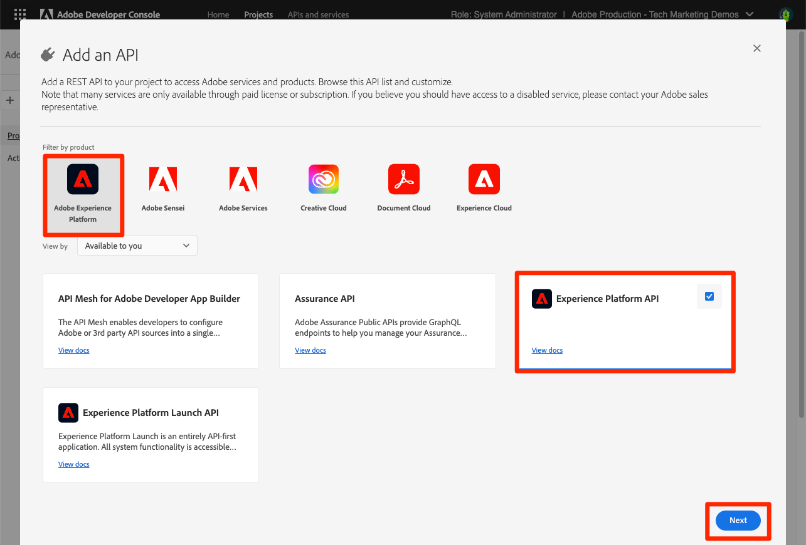

# 設定開發人員控制檯和 [!DNL Postman]

<!--30min-->

在本課程中，您將會在Adobe Developer主控台中設定專案並下載 [!DNL Postman] 集合，讓您開始使用Platform API。

為了完成本教學課程中的API練習， [下載適用於您作業系統的Postman應用程式。](https://www.postman.com/downloads/) 雖然使用Experience Platform API並非必要操作，但Postman可簡化API工作流程，而Adobe Experience Platform提供數十個Postman集合來協助您執行API呼叫並瞭解其運作方式。 本教學課程的其餘部分假設您具備Postman的一些實用知識。 如需協助，請參考 [Postman檔案](https://learning.postman.com/).

平台是以API優先建置。 雖然介面選項也可用於所有主要工作，但您在某些時候可能想要使用Platform API。 例如，若要內嵌資料、在沙箱之間移動專案、自動化例行工作或在建置使用者介面之前使用新Platform功能。

**資料架構師** 和 **資料工程師** 您可能需要在本教學課程之外使用Platform API。

## 需要的許可權

在 [設定許可權](configure-permissions.md) 課程，您可以設定完成本課程所需的所有存取控制項。

<!--
* Permission item Sandboxes > `Luma Tutorial`
* Developer-role access to the `Luma Tutorial Platform` product profile
-->

## 設定Adobe Developer主控台

Adobe Developer Console是開發人員目的地，可存取AdobeAPI和SDK、接聽近乎即時的事件、在執行階段上執行函式，或建置外掛程式或App Builder應用程式。 您將使用它來存取Experience PlatformAPI。 如需詳細資訊，請參閱 [Adobe Developer Console檔案](https://www.adobe.io/apis/experienceplatform/console/docs.html)

1. 在本機電腦上建立資料夾，並命名為 `Luma Tutorial Assets` 適用於教學課程中使用的檔案。

1. 開啟 [Adobe Developer主控台](https://console.adobe.io){target="_blank"}

1. 登入並確認您隸屬於正確的組織

1. 選取 **[!UICONTROL 建立新專案]** 在 [!UICONTROL 快速入門] 功能表。

   

1. 在新建立的專案中，選取 **[!UICONTROL 編輯專案]** 按鈕
1. 變更 **[!UICONTROL 專案標題]** 至 `Luma Tutorial API Project` （如果貴公司有多位人員參加本教學課程，請在結尾加上您的姓名）
1. 選取 **[!UICONTROL 儲存]**

   

1. 選取 **[!UICONTROL 新增API]**

   

1. 透過選取以下專案篩選清單 **[!UICONTROL Adobe Experience Platform]**

1. 在可用API清單中，選取 **[!UICONTROL EXPERIENCE PLATFORMAPI]** 並選取 **[!UICONTROL 下一個]**.

   

1. 選取 **[!UICONTROL OAuth伺服器對伺服器]** 作為認證，然後選取 **[!UICONTROL 下一個]**.
   

1. 選取 `AEP-Default-All-Users` 產品設定檔並選取 **[!UICONTROL 儲存已設定的API]**

   

1. 現在您的開發人員控制檯專案已建立！

1. 在 **[!UICONTROL 試試看]** 區段，選取 **[!UICONTROL Postman專用下載]** 然後選取 **[!UICONTROL OAuth伺服器對伺服器]** 若要下載 [!DNL Postman] 環境json檔案。 儲存 `oauth_server_to_server.postman_environment.json` 在您的 `Luma Tutorial Assets` 資料夾。

   

## 請系統管理員將API認證新增至角色

若要使用API認證與Experience Platform互動，您需要請系統管理員將API認證指派給在上一堂課中建立的角色。  如果您不是系統管理員，請傳送他們：

1. 此 [!UICONTROL 名稱] 您的API認證(`Credential in Luma Tutorial API Project`)
1. 此 [!UICONTROL 技術帳戶電子郵件] 您的認證（這將有助於系統管理員找到認證）

   ![[!UICONTROL 名稱] 和 [!UICONTROL 技術帳戶電子郵件] 您的認證](assets/postman-credentialDetails.png)

以下是系統管理員的指示：

1. 登入 [Adobe Experience Platform](https://platform.adobe.com)
1. 選取 **[!UICONTROL 許可權]** 在左側導覽列中，將帶您前往 [!UICONTROL 角色] 畫面
1. 開啟 `Luma Tutorial Platform` 角色
   
1. 選取 **[!UICONTROL API認證]** 標籤
1. 選取 **[!UICONTROL 新增API認證]**
   
1. 尋找 `Credential in Luma Tutorial API Project` 認證，使用 [!UICONTROL 技術帳戶電子郵件] 如果清單很長，則由教學課程參與者提供
1. 選取認證
1. 選取 **[!UICONTROL 儲存]**

   

## 設定Postman

>[!CAUTION]
>
>Postman介面會定期更新。 本教學課程中的熒幕擷取畫面是使用適用於Mac的Postman v10.15.1擷取，但介面選項可能已變更。

1. 下載並安裝 [[!DNL Postman]](https://www.postman.com/downloads/)
1. 開啟 [!DNL Postman] 和建立工作區
   

1. 匯入下載的json環境檔案， `oauth_server_to_server.postman_environment.json`
   
1. 在 [!DNL Postman]，在下拉式選單中選取您的環境

1. 選取圖示以檢視環境變數：

   

### 新增沙箱名稱和租使用者ID

此 `SANDBOX_NAME` 和 `TENANT_ID` 和 `CONTAINER_ID` 變數不會包含在Adobe Developer Console匯出中，因此我們會手動新增：

1. 在 [!DNL Postman]，開啟 **環境變數**
1. 選取 **編輯** 環境名稱右側的連結
1. 在 **新增變數欄位**，輸入 `SANDBOX_NAME`
1. 在兩個值欄位中輸入 `luma-tutorial`，也就是我們在上一堂課中為sandbox提供的名稱。 如果您對沙箱使用不同的名稱（例如luma-tutorial-ignatiusjreilly），請務必使用該值。
1. 在 **新增變數欄位**，輸入 `TENANT_ID`
1. 切換至您的網頁瀏覽器，前往Experience Platform的介面並擷取URL的部分以查詢您公司的租使用者ID *在@符號之後*. 例如，我的租使用者ID是 `techmarketingdemos` 但您的有所不同：

   

1. 複製此值並返回 [!DNL Postman] 管理環境畫面
1. 將您的租使用者id貼到兩個值欄位中
1. 在 **新增變數欄位**，輸入 `CONTAINER_ID`
1. 輸入 `global` 放入這兩個值欄位

   >[!NOTE]
   >
   >`CONTAINER_ID` 是我們在教學課程中多次變更值的欄位。 時間 `global` ，則API會與您Platform帳戶中Adobe提供的元素互動。 時間 `tenant` ，則API會與您自己的自訂元素互動。

1. 選取 **儲存**

   

## 進行API呼叫

### 擷取存取權杖

Adobe提供了一組豐富的 [!DNL Postman] 可協助您探索Experience Platform API的集合。 這些集合位於 [Adobe Experience Platform Postman範例GitHub存放庫](https://github.com/adobe/experience-platform-postman-samples). 您應該將此存放庫加入書籤，因為在本教學課程中會多次使用此存放庫，之後當您為自己的公司實作Experience Platform時，也會使用此存放庫。

第一個集合適用於AdobeIdentity Management服務(IMS) API。 這是從Postman中擷取存取權杖的便利方式。

若要產生存取權杖：

1. 下載 [Identity Management服務API集合](https://github.com/adobe/experience-platform-postman-samples/blob/master/apis/ims/Identity%20Management%20Service.postman_collection.json) 至您的 `Luma Tutorial Assets` 資料夾
1. 將集合匯入 [!DNL Postman]
1. 選取請求 **oAuth：要求存取權杖** 要求並選取 **傳送**
1. 您應會收到 `200 OK` 回應中具有存取權杖的回應

   

1. 存取Token應自動儲存為 **ACCESS_TOKEN** 的環境變數 [!DNL Postman] 環境。

   

### 與平台API互動

現在，讓我們進行Platform API呼叫，確認我們已正確設定所有專案。

開啟 [Experience Platform [!DNL Postman] GitHub中的集合](https://github.com/adobe/experience-platform-postman-samples/tree/master/apis/experience-platform). 此頁面上有許多適用於各種Platform API的集合。 我強烈建議您將它加入書籤。

現在，讓我們進行第一個API呼叫：

1. 下載 [結構描述登入API集合](https://raw.githubusercontent.com/adobe/experience-platform-postman-samples/master/apis/experience-platform/Schema%20Registry%20API.postman_collection.json) 至您的 `Luma Tutorial Assets` 資料夾
1. 將其匯入 [!DNL Postman]
1. 開啟 **結構描述登入API >結構描述>清單結構描述**
1. 檢視 **引數** 和 **標頭** 標籤並記下它們如何包含我們先前輸入的一些環境變數。
1. 請注意 **標頭>接受值欄位** 設為 `application/vnd.adobe.xed-id+json`. Schema Registry API需要下列其中一項 [指定的接受標頭值](https://experienceleague.adobe.com/docs/experience-platform/xdm/api/getting-started.html?lang=en#accept) 會在回應中提供不同格式。
1. 選取 **傳送** 進行您的第一個Platform API呼叫！

希望您成功 `200 OK` 回應中包含Sandbox中可用Adobe提供的XDM結構描述清單，如下圖所示。

如果您的呼叫未成功，請花點時間使用API呼叫的錯誤回應詳細資料進行偵錯，並檢閱上述步驟。 如果您卡住了，請向以下人員尋求協助： [社群論壇](https://experienceleaguecommunities.adobe.com/t5/adobe-experience-platform/ct-p/adobe-experience-platform-community) 或使用此頁面右側的連結來「記錄問題」。

使用您的Platform許可權、沙箱和 [!DNL Postman] 設定，您已準備就緒 [結構描述中的模型資料](model-data-in-schemas.md)！
