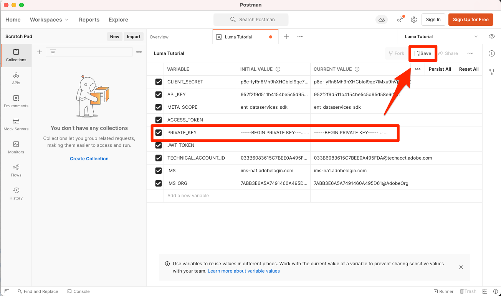

# 設定開發人員控制台和 [!DNL Postman]

<!--30min-->

在本課程中，您將在Adobe Developer Console中設定專案並下載 [!DNL Postman] 集合，讓您開始使用Platform API。

為了完成本教學課程中的API練習， [下載您作業系統的Postman應用程式。](https://www.postman.com/downloads/) Postman雖然並非使用Experience PlatformAPI的必要項目，但可讓API工作流程更輕鬆，而Adobe Experience Platform提供數十種Postman集合，協助您執行API呼叫，並了解其運作方式。 本教學課程的其餘部分假設您具備一些Postman的實用知識。 如需協助，請參考 [Postman檔案](https://learning.postman.com/).

平台是先建置API的。 雖然所有主要工作也有介面選項，但您有時可能會想使用Platform API。 例如，若要內嵌資料，請在沙箱之間移動項目、自動執行例行工作，或在建立使用者介面之前使用新的Platform功能。

**資料架構師** 和 **資料工程師** 在本教學課程之外，您可能需要使用Platform API。

## 需要權限

在 [設定權限](configure-permissions.md) 課程中，您設定了完成本課程所需的所有訪問控制。

<!--
* Permission item Sandboxes > `Luma Tutorial`
* Developer-role access to the `Luma Tutorial Platform` product profile
-->

## 設定Adobe Developer Console

Adobe Developer Console是開發人員用來存取AdobeAPI和SDK、監聽近乎即時的事件、在執行階段上執行函式，或建立外掛程式或應用程式產生器應用程式的目的地。 您將使用它來存取Experience PlatformAPI。 如需詳細資訊，請參閱 [Adobe Developer Console檔案](https://www.adobe.io/apis/experienceplatform/console/docs.html)

1. 在您名為的本機電腦上建立資料夾 `Luma Tutorial Assets` 適用於教學課程中使用的檔案。

1. 開啟 [Adobe Developer Console](https://console.adobe.io)

1. 登入並確認您位於正確的組織

1. 選擇 **[!UICONTROL 建立新專案]** in [!UICONTROL 快速入門] 功能表。

   

1. 在新建立的專案中，選取 **[!UICONTROL 新增至專案]** 按鈕，然後選取 **[!UICONTROL API]**

   

1. 選取 **[!UICONTROL Adobe Experience Platform]**

1. 在可用API清單中，選取 **[!UICONTROL Experience PlatformAPI]** 選取 **[!UICONTROL 下一個]**.

   

1. 用於來自外部系統(如 [!DNL Postman]，我們需要公開/私密金鑰組。 要生成新密鑰對，請選擇 **[!UICONTROL 選項1]**  然後按 **[!UICONTROL 產生鍵對]** 按鈕

   

1. 當金鑰準備就緒後，系統可能會提示您將金鑰下載至本機電腦。 儲存封裝在中的金鑰 `config.zip` 到資料夾 `Luma Tutorial Assets`. 在下次練習中，我們需要他們。

1. 產生金鑰後，公開金鑰會自動新增至您的專案，如螢幕擷取所示。 選取 **[!UICONTROL 下一個]** 按鈕。

   

1. 選取 `Luma Tutorial Platform` 產品設定檔，然後選取 **[!UICONTROL 儲存已設定的API]** 按鈕

   

1. 現在您的開發人員控制台專案已建立！

1. 在 **[!UICONTROL 試試看]** ，請選擇 **[!UICONTROL 下載Postman]** 然後選取 **[!UICONTROL 服務帳戶(JWT)]** 下載 [!DNL Postman] 環境json檔案。 儲存 `service.postman_environment.json` 在 `Luma Tutorial Assets` 檔案夾。

   

   >[!NOTE]
   >
   >組織的系統管理員可以在Admin Console的產品設定檔中將專案視為「API憑證」
   >
   >

您可能已注意到專案已獲派數字，例如「專案12」：

1. 在階層連結中選取專案編號
1. 選取 **[!UICONTROL 編輯專案]** 按鈕
1. 變更 **[!UICONTROL 專案標題]** to `Luma Tutorial API Project` （如果貴公司有多人參加本教學課程，請將您的名稱新增至結尾）
1. 選取 **[!UICONTROL 儲存]** 按鈕

   

## 設定Postman

>[!CAUTION]
>
>Postman介面會定期更新。 本教學課程中的螢幕擷取畫面是使用Postman v9.0.5 for Mac所拍攝，但介面選項可能已變更。

1. 下載並安裝 [[!DNL Postman]](https://www.postman.com/downloads/)
1. 開啟 [!DNL Postman] 和匯入下載的json環境檔案， `service.postman_environment.json`
   
1. 在 [!DNL Postman]，請在下拉式清單中選取您的環境

   
1. 選取 **眼** 圖示來檢視環境變數：

   

### 更新環境名稱

由於從開發人員控制台匯出的環境名稱是隨機產生的，請為其指定較具描述性的名稱，這樣您以後開始處理真正的Platform實作時，就不會混淆環境：

1. 在環境變數畫面仍開啟的情況下，選取 **編輯** 在右上角
1. 更新 **環境名稱** to `Luma Tutorial`
1. 離開 **管理環境** 在編輯模式中開啟強制回應視窗，因為我們將在下一個步驟中進一步編輯

   

### 新增私密金鑰

現在可以將PRIVATE_KEY值新增至Postman環境

1. 提取下載的 `config.zip` 檔案，此檔案是在建立開發人員控制台專案時於先前練習中產生的。 此zip包含兩個檔案：
   * `private.key`
   * `certificate_pub.crt`
1. 開啟 `private.key` 檔案，並複製內容。
1. 在Postman **管理環境** > **編輯** 仍從上次練習開啟的強制回應視窗中，將複製的值貼到 **PRIVATE_KEY** 在 **初始值** 和 **目前值** 欄。
1. 選擇 **儲存**

   

### 新增JWT和存取Token

Adobe提供一組豐富的 [!DNL Postman] 集合，協助您探索Experience Platform的API。 這些集合位於 [Adobe Experience Platform Postman範例GitHub存放庫](https://github.com/adobe/experience-platform-postman-samples). 您應將此存放庫加入書籤，因為在本教學課程中和稍後您為自己的公司實作Experience Platform時，您將會多次使用此存放庫。

第一個集合可與AdobeIdentity Management服務(IMS)API搭配使用。 這是從Postman內填入JWT_TOKEN和ACCESS_TOKEN的便利方式 *用於非生產用途* 例如在沙箱中完成本教學課程。 或者，JWT代號可在Adobe Developer主控台中產生。 不過，由於定期過期，使用此集合即可重新整理它，不必在完成本教學課程時再次造訪Adobe Developer Console。

>[!WARNING]
>
>如 [AdobeIdentity Management服務API自述檔案](https://github.com/adobe/experience-platform-postman-samples/tree/master/apis/ims)，表示的生成方法適合非生產用途。 本機簽署會從第三方主機載入JavaScript程式庫，而遠端簽署會將私密金鑰傳送至Adobe擁有且運作的Web服務。 雖然Adobe不會儲存此私密金鑰，但生產金鑰絕不應與任何人共用。

若要產生代號：

1. 下載 [開發人員控制台存取權杖產生集合](https://raw.githubusercontent.com/adobe/experience-platform-postman-samples/master/apis/ims/Identity%20Management%20Service.postman_collection.json) 至 `Luma Tutorial Assets` 資料夾
1. 將集合匯入 [!DNL Postman]
1. 選擇請求 **IMS:JWT透過使用者代號產生+驗證** 選取 **傳送**

   
1. 此 **JWT_TOKEN** 和 **ACCESS_TOKEN** 在 [!DNL Postman].

   

### 新增沙箱名稱和租用戶ID

此 `SANDBOX_NAME` 和 `TENANT_ID` 和 `CONTAINER_ID` 變數不會包含在Adobe Developer控制台匯出中，因此我們會手動新增變數：

1. 在 [!DNL Postman]，開啟 **環境變數**
1. 選取 **編輯** 環境名稱右側的連結
1. 在 **新增變數欄位**，輸入 `SANDBOX_NAME`
1. 在兩個值欄位中，輸入 `luma-tutorial`，我們在上一堂課中提供給沙箱的名稱。 如果您為沙箱使用不同名稱，例如luma-tutorial-ignatiusjreilly，請務必使用該值。
1. 在 **新增變數欄位**，輸入 `TENANT_ID`
1. 切換至網頁瀏覽器，前往Experience Platform的介面並擷取URL的部分，以查詢公司的租用戶ID *在@符號後*. 例如，我的租用戶id為 `techmarketingdemos` 但你的不同：

   

1. 複製此值並返回 [!DNL Postman] 「管理環境」畫面
1. 將您的租用戶ID貼入兩個值欄位中
1. 在 **新增變數欄位**，輸入 `CONTAINER_ID`
1. 輸入 `global` 同時輸入兩個值欄位

   >[!NOTE]
   >
   >`CONTAINER_ID` 是一個欄位，在教學課程中，我們會變更其值多次。 當 `global` 使用時，API會與Platform帳戶中Adobe提供的元素互動。 當 `tenant` 使用時，API會與您自己的自訂元素互動。

1. 選擇 **儲存**

   

## 發出平台API呼叫

現在來發出Platform API呼叫，確認我們已正確設定所有項目。

開啟 [Experience Platform [!DNL Postman] GitHub中的集合](https://github.com/adobe/experience-platform-postman-samples/tree/master/apis/experience-platform). 本頁面上有許多適用於各種Platform API的集合。 我強烈建議您加入書籤。

現在，讓我們進行第一個API呼叫：

1. 下載 [結構註冊表API集合](https://raw.githubusercontent.com/adobe/experience-platform-postman-samples/master/apis/experience-platform/Schema%20Registry%20API.postman_collection.json) 至 `Luma Tutorial Assets` 資料夾
1. 將其匯入 [!DNL Postman]
1. 開啟 **Schema Registry API >類>清單類**
1. 查看 **Params** 和 **標題** 標籤，並注意這些標籤如何包含我們先前輸入的某些環境變數。
1. 請注意， **標題>接受值欄位** 設為 `application/vnd.adobe.xed-id+json`. 結構註冊表API需要下列其中一項 [指定的接受標題值](https://experienceleague.adobe.com/docs/experience-platform/xdm/api/getting-started.html?lang=en#accept) 在回應中提供不同格式。
1. 選擇 **傳送** 進行第一個Platform API呼叫！

希望你成功了 `200 OK` 回應包含沙箱中可用標準XDM類別的清單，如下圖所示。

如果您的呼叫未成功，請花點時間，使用API呼叫的錯誤回應詳細資料進行除錯，並檢閱上述步驟。 如果卡住了，請在 [社群論壇](https://experienceleaguecommunities.adobe.com/t5/adobe-experience-platform/ct-p/adobe-experience-platform-community) 或使用此頁面右側的連結來「登錄問題」。

擁有您的Platform權限、沙箱和 [!DNL Postman] 設定，您準備 [結構中的模型資料](model-data-in-schemas.md)!
