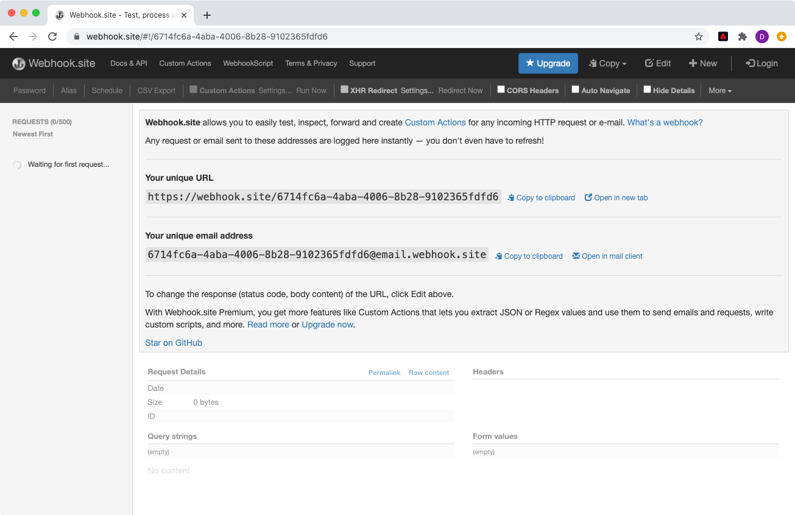
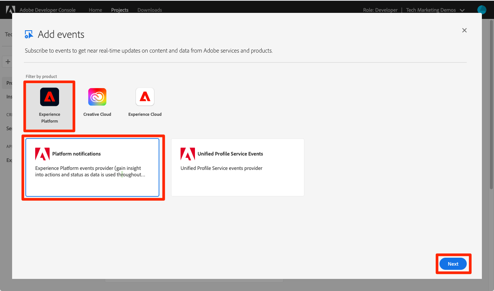
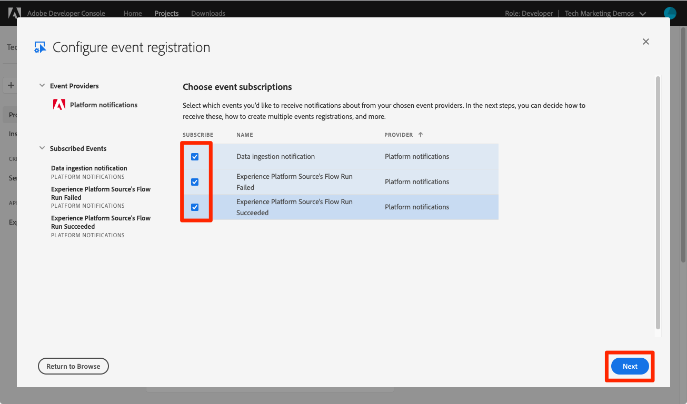

# 訂閱資料擷取事件

<!--25min-->

在本課程中，您將使用Adobe Developer Console和線上webhook開發工具設定webhook，以訂閱資料擷取事件。 在後續的課程中，您將使用這些事件來監控資料擷取工作的狀態。

**資料工程師**將想要在本教學課程之外訂閱資料擷取事件。
**資料架構師** _可以略過此課程_，並移至[批次擷取課程](ingest-batch-data.md)。

## 需要的許可權

在[設定許可權](configure-permissions.md)課程中，您已設定完成本課程所需的所有存取控制，特別是：

<!--* Developer-role access to the `Luma Tutorial Platform` product profile (for API)
-->

>[!IMPORTANT]
>
> 這些由資料擷取事件觸發的通知將套用至&#x200B;_您的所有沙箱_，而不僅僅是您的`Luma Tutorial`。 您也可能會在帳戶中看到源自其他資料擷取事件的通知。

## 設定webhook

在本練習中，我們將使用名為webhook.site的線上工具來建立webhook （您可以隨意取代任何您偏好使用的其他webhook開發工具）：

1. 在另一個瀏覽器分頁中開啟網站[https://webhook.site/](https://webhook.site/)
1. 系統已為您指派一個唯一的URL，您稍後在資料擷取課程中回過頭時，應該將該URL加入書籤：

   
1. 選取頂端導覽列中的&#x200B;**編輯**&#x200B;按鈕
1. 作為回應內文，請輸入`$request.query.challenge$`。 我們在本課程稍後設定的Adobe I/O事件通知會向webhook傳送挑戰，並要求將其包含在回應本文中。
1. 選取&#x200B;**儲存**&#x200B;按鈕

   

## 設定

1. 在另一個瀏覽器標籤中，開啟[Adobe Developer Console](https://console.adobe.io/)
1. 開啟您的`Luma Tutorial API Project`
1. 選取&#x200B;**[!UICONTROL 新增至專案]**&#x200B;按鈕，然後選取&#x200B;**[!UICONTROL 事件]**

   
1. 選取&#x200B;**[!UICONTROL Experience Platform]**&#x200B;以篩選清單
1. 選取&#x200B;**[!UICONTROL 平台通知]**
1. 選取&#x200B;**[!UICONTROL 下一步]**按鈕
   
1. 選取所有事件
1. 選取&#x200B;**[!UICONTROL 下一步]**按鈕
   
1. 在設定認證的下一個畫面上，再次選取&#x200B;**[!UICONTROL 下一步]**按鈕
   
1. 作為&#x200B;**[!UICONTROL 事件註冊名稱]**，請輸入`Platform notifications`
1. 向下捲動並選取以開啟&#x200B;**[!UICONTROL Webhook]**&#x200B;區段
1. 以&#x200B;**[!UICONTROL Webhook URL]**&#x200B;身分，從webhook.site的&#x200B;**您的唯一URL**&#x200B;欄位貼上值
1. 選取&#x200B;**[!UICONTROL 儲存已設定的事件]**按鈕
   
1. 等待您的設定儲存，您應該會看到您的`Platform notifications`事件為作用中，且您的webhook詳細資料沒有錯誤訊息
   
1. 切換回您的webhook.site標籤，您應該會看到對webhook的第一個請求，該請求是因驗證Developer Console設定而產生：
   

目前為止，您將在下堂課中擷取資料時，進一步瞭解這些通知。

## 其他資源

* [Webhook.site](https://webhook.site/)
* [資料擷取通知檔案](https://experienceleague.adobe.com/docs/experience-platform/ingestion/quality/subscribe-events.html)
* [開始使用Adobe I/O事件檔案](https://www.adobe.io/apis/experienceplatform/events/docs.html)

好，讓我們終於開始[擷取資料](ingest-batch-data.md)！
