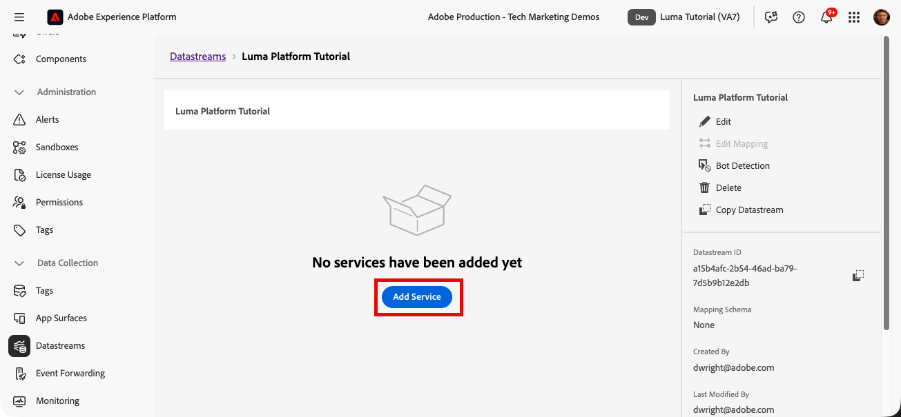
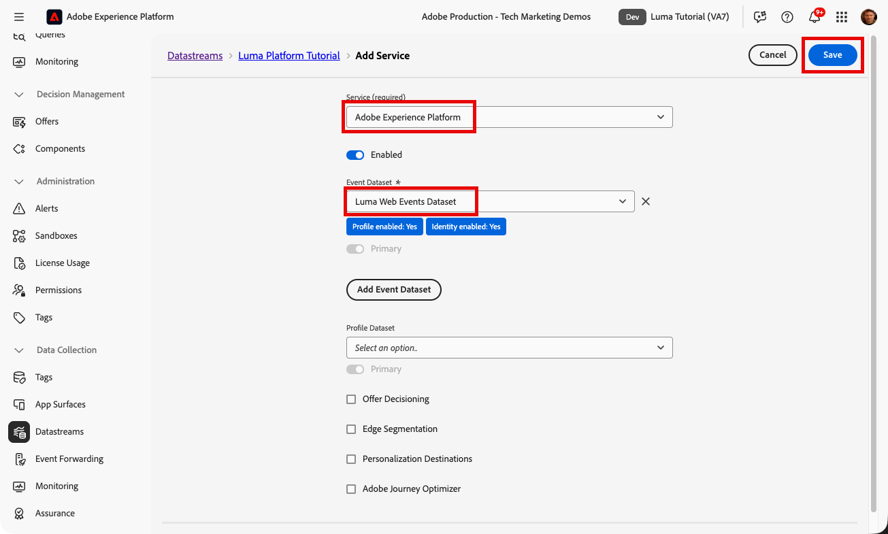
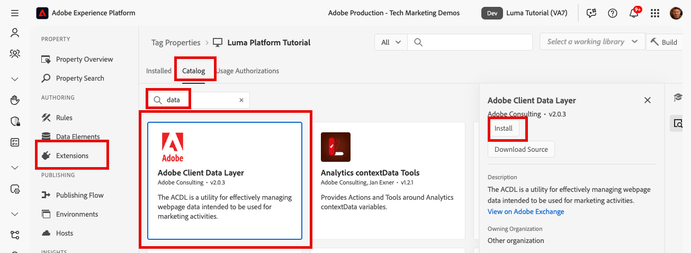
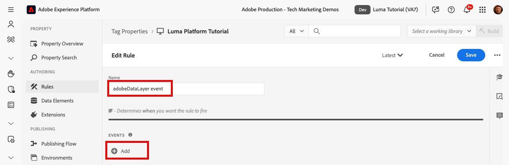
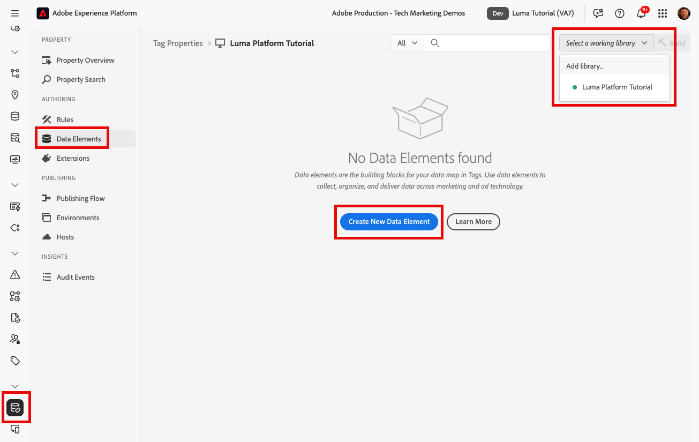
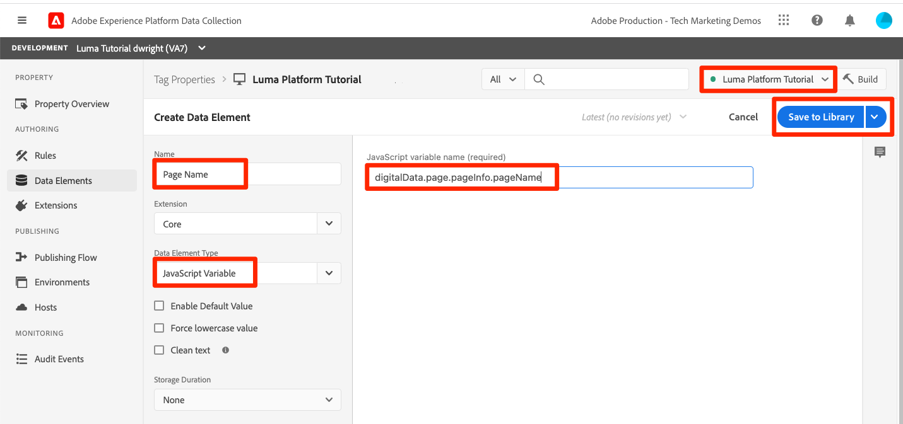
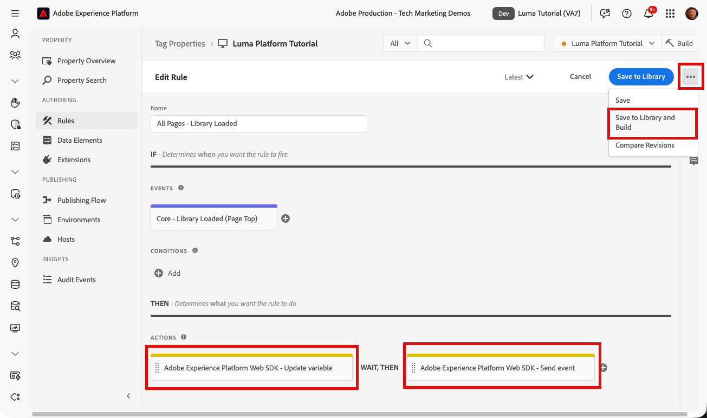
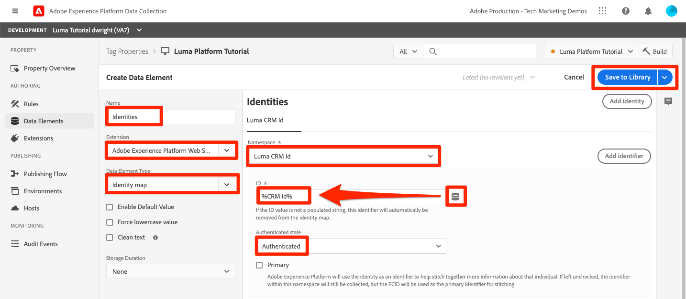
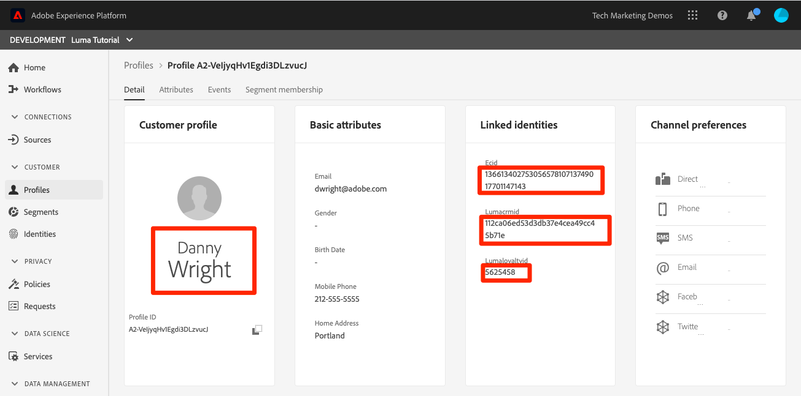

# 擷取串流資料

<!--1hr-->

在本課程中，您將使用Adobe Experience Platform Web SDK串流資料。

>[!WARNING]
>
> 本教學課程中使用的Luma網站預計於2026年2月16日當週汰換。 此教學課程中完成的工作可能不適用於新網站。

有兩個主要工作資料收集工作：

* 在Luma網站上實作Web SDK，將客戶事件串流至Experience Platform Edge Network。

* 設定資料串流，以告知Edge Network將資料轉送到Experience Platform中的`Luma Web Events Dataset`。

**資料工程師**&#x200B;需要在本教學課程之外擷取串流資料。 雖然Web開發人員通常會在網站中實作Web SDK，但瞭解此程式的運作方式非常重要。 即使您不是網頁開發人員，應該也能夠完成這項基本實作。

在開始練習之前，請觀看這兩個短片，以進一步瞭解串流資料擷取和網頁SDK：

>[!VIDEO](https://video.tv.adobe.com/v/28425?learn=on&enablevpops)

>[!VIDEO](https://video.tv.adobe.com/v/34141?learn=on&enablevpops)

>[!NOTE]
>
>雖然本教學課程著重於從使用Web SDK的網站串流擷取，但您也可以使用[Mobile SDK](https://experienceleague.adobe.com/en/docs/platform-learn/implement-mobile-sdk/overview)、[Edge Network Server API](https://experienceleague.adobe.com/en/docs/platform-learn/data-collection/server-api/overview)和[HTTP API](https://experienceleague.adobe.com/en/docs/experience-platform/sources/connectors/streaming/http)串流資料。

## 需要權限

在[設定許可權](configure-permissions.md)課程中，您已設定完成本課程所需的所有存取控制。

## 設定資料串流

首先，我們將設定資料串流。 資料串流會告訴Experience Platform Edge Network在從Web SDK呼叫收到資料後要將資料傳送到何處。 例如，您要將資料傳送至Experience Platform、Adobe Analytics或Adobe Target嗎？

若要建立您的[!UICONTROL 資料流]：

1. 確定您仍然在` Luma Tutorial`沙箱中
1. 在左側導覽中選取&#x200B;**[!UICONTROL 資料串流]**
1. 選取右上角的&#x200B;**[!UICONTROL 新資料流]**&#x200B;按鈕

   

1. 在&#x200B;**[!UICONTROL Name]**&#x200B;中輸入`Luma Platform Tutorial` （如果貴公司的多人正在參加此教學課程，請在結尾加上您的姓名）
1. 選取&#x200B;**[!UICONTROL 儲存]**&#x200B;按鈕

   

資料到達Edge後，[!UICONTROL 資料串流]會將其轉送至設定的[!UICONTROL 服務]。 若要將資料傳送至Experience Platform：

1. 選取&#x200B;**[!UICONTROL 新增服務]**
   

1. 選取`Adobe Experience Platform`
1. 選取您的`Luma Web Events Dataset`
1. 選取&#x200B;**[!UICONTROL 儲存]**

   

雖然資料流設定中有設定檔資料集選項，但不應使用此選項將一般XDM個別設定檔資料傳送至Platform。 此設定只應用於傳送同意、推播權杖和使用者活動區域詳細資料。

[!UICONTROL Offer Decisioning]、[!UICONTROL Edge Segmentation]、[!UICONTROL Personalization Destinations]和[!UICONTROL Adobe Journey Optimizer]的核取方塊可讓您在Edge上啟用資料，但此教學課程中不使用此核取方塊。

## 實作Web SDK

### 新增屬性

首先，我們必須建立標籤屬性（先前稱為標籤屬性）。 屬性是一個容器，內含所有JavaScript、規則，以及從網頁收集詳細資訊並傳送至不同位置所需的其他功能。

若要建立屬性：

1. 前往左側導覽中的&#x200B;**[!UICONTROL 標籤]**
1. 選取&#x200B;**[!UICONTROL 新屬性]**
   
1. 以&#x200B;**[!UICONTROL Name]**&#x200B;的身分，輸入`Luma Platform Tutorial` （如果貴公司的多人參加此教學課程，請在結尾加上您的姓名）
1. 作為&#x200B;**[!UICONTROL 網域]**，請輸入`enablementadobe.com` （稍後說明）
1. 選取&#x200B;**[!UICONTROL 儲存]**
   

### 將擴充功能新增至屬性

現在您已擁有屬性，可以使用擴充功能新增Web SDK。 擴充功能是程式碼套件，可將功能新增至您的標籤屬性與實施。 若要新增擴充功能：

1. 開啟您的標籤屬性
1. 前往左側導覽中的&#x200B;**[!UICONTROL 擴充功能]**
1. 前往&#x200B;**[!UICONTROL 目錄]**&#x200B;標籤
1. 有許多擴充功能可供標籤使用。 篩選含有字詞`Web SDK`的目錄
1. 選取&#x200B;**[!UICONTROL Adobe Experience Platform Web SDK]**&#x200B;擴充功能以開啟側面板
1. 選取&#x200B;**[!UICONTROL 安裝]**按鈕
   
1. Web SDK擴充功能有數種設定可供使用，但在本教學課程中，我們只會設定兩種。 將&#x200B;**[!UICONTROL Edge網域]**&#x200B;更新為`data.enablementadobe.com`。 此設定可讓您透過網頁SDK實作設定第一方Cookie （建議使用）。 在您自己的網站上實作Web SDK時，建議您建立CNAME以用於您自己的資料收集用途，例如`data.YOUR_DOMAIN.com`
1. 在&#x200B;**[!UICONTROL 資料串流]**&#x200B;區段中，針對生產環境，選取您的`Luma Tutorial`沙箱和`Luma Platform Tutorial`資料串流。
1. 您可以檢視其他組態選項（但不要變更它們！），然後選取&#x200B;**[!UICONTROL 儲存]**
   

從擴充功能目錄畫面，安裝Adobe Client Data Layer擴充功能。 此擴充功能將協助我們從Luma網站讀取資料層：

擴充功能不需要任何設定，因此只需將其儲存至程式庫即可。

## 建立規則以傳送資料

現在我們將建立規則以將資料傳送至Platform。 規則是事件、條件和動作的組合，可指示標籤執行某項動作。 若要建立規則：

1. 瀏覽至&#x200B;**[!UICONTROL 規則]**
1. 選取&#x200B;**[!UICONTROL 建立新規則]**按鈕
   
1. 將規則命名為 `adobeDataLayer event`
1. 在&#x200B;**[!UICONTROL 事件]**&#x200B;下，選取&#x200B;**[!UICONTROL 新增]**按鈕
   
1. 使用&#x200B;**[!UICONTROL Adobe Client Data Layer]** **[!UICONTROL 擴充功能]**，並選取&#x200B;**[!UICONTROL 推送的資料]**&#x200B;作為&#x200B;**[!UICONTROL 事件型別]**。
1. 選取&#x200B;**[!UICONTROL 接聽]**。 **[!UICONTROL 所有活動]**。
1. 選取&#x200B;**[!UICONTROL 保留變更]**以返回主規則畫面
   
1. 在&#x200B;**[!UICONTROL 動作]**&#x200B;底下，選取&#x200B;**[!UICONTROL 新增]**&#x200B;按鈕
1. 使用&#x200B;**[!UICONTROL Adobe Experience Platform Web SDK]** **[!UICONTROL 擴充功能]**&#x200B;並選取&#x200B;**[!UICONTROL 傳送事件]**&#x200B;作為&#x200B;**[!UICONTROL 動作型別]**
1. 在右側，從&#x200B;**[!UICONTROL 型別]**&#x200B;下拉式清單中選取&#x200B;**[!UICONTROL 網頁網頁詳細資料頁面檢視]**。 這會填入`Luma Web Events Schema`的eventType欄位
1. 選取&#x200B;**[!UICONTROL 保留變更]**以返回主規則畫面
   
1. 選取&#x200B;**[!UICONTROL 儲存]**&#x200B;以儲存規則\
   

## 在程式庫中發佈規則

接下來，我們將規則發佈至開發環境，以便驗證它是否有效。

若要建立程式庫：

1. 前往左側導覽中的&#x200B;**[!UICONTROL 發佈流程]**
1. 選取&#x200B;**[!UICONTROL 新增資料庫]**
   
1. 為&#x200B;**[!UICONTROL 名稱]**&#x200B;輸入`Luma Platform Tutorial`
1. 針對&#x200B;**[!UICONTROL 環境]**，選取`Development`
1. 選取&#x200B;**[!UICONTROL 新增所有變更的資源]**&#x200B;按鈕。 (除了[!UICONTROL Adobe Experience Platform Web SDK]擴充功能和`adobeDataLayer event`規則外，您也會看到新增[!UICONTROL 核心]擴充功能，其中包含所有標籤Web屬性所需的基礎JavaScript。)
1. 選取&#x200B;**[!UICONTROL 儲存並建置以供開發]**按鈕
   

程式庫可能需要幾分鐘的時間才能建置，建置完成後，程式庫名稱左側會顯示一個綠色點：

如您在[!UICONTROL 發佈流程]畫面上所見，本教學課程範圍之外的發佈程式還有更多內容。 我們即將在開發環境中使用單一程式庫。

## 驗證請求中的資料

### 新增Adobe Experience Platform Debugger

Experience Platform Debugger是適用於Chrome的擴充功能，可協助您檢視在網頁中實作的Adobe技術。 下載您偏好瀏覽器的版本：

* [Chrome擴充功能](https://chrome.google.com/webstore/detail/adobe-experience-platform/bfnnokhpnncpkdmbokanobigaccjkpob)

如果您以前從未使用過Debugger，您可以觀看這段5分鐘的概述影片：

>[!VIDEO](https://video.tv.adobe.com/v/32156?learn=on&enablevpops)

### 開啟Luma網站

在本教學課程中，我們使用公開託管版本的Luma示範網站。 請開啟檔案並將其加入書籤：

1. 在新的瀏覽器標籤中，開啟[Luma網站](https://newluma.enablementadobe.com)。
1. 將頁面加入書籤，以便在教學課程的其餘部分使用

這個託管網站是我們在初始標籤屬性設定的`enablementadobe.com`網域[!UICONTROL 欄位中使用]的原因，也是我們在`data.enablementadobe.com`Adobe Experience Platform Web SDK[!UICONTROL 擴充功能中使用]作為第一方網域的原因。 我有一個計畫！

### 使用Experience Platform Debugger對應至您的標籤屬性

Experience Platform Debugger有一種很酷的功能，可讓您使用其他標籤屬性來取代現有的標籤屬性。 這對於驗證非常有用，可讓我們略過本教學課程中的許多實作步驟。

1. 請確定您已開啟Luma網站，並選取Experience Platform Debugger擴充功能圖示
1. Debugger將會開啟並顯示硬式編碼實作的部分詳細資料，這些詳細資料與本教學課程無關（您可能需要在開啟Debugger後重新載入Luma網站）
1. 確認Debugger為&quot;**[!UICONTROL 已連線至Luma]**&quot; （如下圖所示），然後選取&quot;**[!UICONTROL 鎖定]**&quot;圖示以將Debugger鎖定至Luma網站。
1. 選取右上方的&#x200B;**[!UICONTROL 登入]**&#x200B;按鈕以進行驗證。
1. 現在前往左側導覽中的&#x200B;**[!UICONTROL Experience Platform標籤]**
1. 選取設定索引標籤
1. 在顯示&#x200B;**[!UICONTROL 頁面內嵌程式碼]**&#x200B;的右側，開啟&#x200B;**[!UICONTROL 動作]**&#x200B;下拉式清單，然後選取&#x200B;**[!UICONTROL 取代]**
   
1. 由於您已通過驗證，Debugger將會提取您可用的標籤屬性和環境。 選取您的`Luma Platform Tutorial`屬性
1. 選取您的`Development`環境
1. 選取&#x200B;**[!UICONTROL 套用]**按鈕
   
1. Luma網站現在將使用您的標籤屬性&#x200B;_重新載入_。
   已取代
1. 前往左側導覽中的&#x200B;**[!UICONTROL 摘要]**，檢視[!UICONTROL 標籤]屬性的詳細資料
   
1. 現在前往左側導覽中的&#x200B;**[!UICONTROL Experience Platform Web SDK]**，檢視&#x200B;**[!UICONTROL 網路要求]**
1. 選取&#x200B;**[!UICONTROL 事件]**&#x200B;列

   

1. 請注意，我們如何看到在`web.webpagedetails.pageView`傳送事件[!UICONTROL 動作中指定的]事件型別
   

1. 要求詳細資訊也會顯示在瀏覽器的網頁開發人員工具&#x200B;**網路**&#x200B;標籤中。 開啟並重新載入頁面。 篩選具有`interact`的呼叫，以找出該呼叫，選取它，然後檢視&#x200B;**標題**&#x200B;索引標籤，**請求承載**區域。
   
1. 前往&#x200B;**回應**標籤，並記下ECID值包含在回應中的方式。 複製此值，因為您將在下一個練習中使用它來驗證設定檔資訊。
   

## 驗證Experience Platform中的資料

您可以檢視到`Luma Web Events Dataset`的資料批次，以驗證資料是否登陸Platform。 (我知道，這稱為串流資料擷取，但現在我的意思是，它會以批次方式到達！ 它會即時串流至設定檔，因此可用於即時細分和啟動，但每15分鐘會批次傳送至資料湖。)

驗證資料：

1. 在Platform使用者介面中，前往左側導覽中的&#x200B;**[!UICONTROL 資料集]**
1. 開啟`Luma Web Events Dataset`並確認批次已到。 請記住，每15分鐘傳送一次，因此您可能需要等待批次顯示。
1. 選取&#x200B;**[!UICONTROL 預覽資料集]**按鈕
   
1. 在預覽強制回應視窗中，請注意如何選取左側結構描述的不同欄位，以預覽這些特定資料點：
   

您也可以確認新設定檔是否顯示：

1. 在Platform使用者介面中，前往左側導覽中的&#x200B;**[!UICONTROL 設定檔]**
1. 選取&#x200B;**[!UICONTROL ECID]**&#x200B;名稱空間並搜尋您的ECID值（從回應中複製）。 設定檔會有專屬的ID，獨立於ECID。
1. 選取&#x200B;**[!UICONTROL 設定檔識別碼]**以開啟設定檔
   
1. 選取&#x200B;**[!UICONTROL 事件]**索引標籤以檢視您檢視的頁面
   \
   <!---->

## 新增自訂資料至事件

Web SDK會自動填入許多XDM欄位，但您將不可避免地需要自訂實施以從您的網站收集其他欄位。 我們會非常介入這項工作，以下是幾個簡單的範例。

### 建立資料元素以儲存XDM資料

1. 導覽回您的`Luma Platform Tutorial`標籤屬性
1. 開啟&#x200B;**[!UICONTROL 選取工作程式庫]**&#x200B;下拉式清單，然後選取您的`Luma Platform Tutorial`程式庫。 此設定可讓您更輕鬆地向程式庫發佈其他更新。
1. 現在前往左側導覽中的&#x200B;**[!UICONTROL 資料元素]**
1. 選取&#x200B;**[!UICONTROL 建立新資料元素]**&#x200B;按鈕

   

在&#x200B;**[!UICONTROL 資料元素]**&#x200B;頁面上：

1. 以&#x200B;**[!UICONTROL Name]**&#x200B;的身分，輸入`XDM data`
1. 以&#x200B;**[!UICONTROL 延伸模組]**&#x200B;的形式，選取`Adobe Experience Platform Web SDK`
1. 作為&#x200B;**[!UICONTROL 資料元素型別]**，請選取`Variable`
1. 以&#x200B;**[!UICONTROL 沙箱]**&#x200B;的身分，選取您的`Luma Tutorial`沙箱
1. 作為&#x200B;**[!UICONTROL 結構描述]**，請選取您的`Luma Web Events Schema`
1. 確定已選取`Luma Platform Tutorial`作為工作程式庫
1. 選取&#x200B;**[!UICONTROL 儲存至資料庫]**
   

### 建立頁面名稱的資料元素

1. 建立新的資料元素
1. 以&#x200B;**[!UICONTROL Name]**&#x200B;的身分，輸入`Page Name`
1. 作為&#x200B;**[!UICONTROL 資料元素型別]**，請選取`JavaScript Variable`
1. 作為&#x200B;**[!UICONTROL JavaScript變數名稱]**，請輸入`adobeDataLayer.0.page.name`
1. 若要協助標準化值的格式，請勾選&#x200B;**[!UICONTROL 強制小寫值]**&#x200B;和&#x200B;**[!UICONTROL 清除文字]**&#x200B;的方塊
1. 選取&#x200B;**[!UICONTROL 儲存至資料庫]**
   

### 新增XDM資料至您的「傳送事件」動作

現在，您已將資料對應至XDM欄位，可以將它包含在您的「傳送事件」動作中：

1. 移至&#x200B;**[!UICONTROL 規則]**&#x200B;畫面
1. 開啟您的`adobeDataLayer event`規則
1. 開啟`Adobe Experience Platform Web SDK - Send Event`動作
1. 做為&#x200B;**[!UICONTROL XDM]**，請選取圖示以開啟資料元素選取強制回應視窗，然後選擇您的`XDM data`資料元素
1. 選取&#x200B;**[!UICONTROL 保留變更]**
   

1. 將動作新增至規則
1. 選取`Adobe Experience Platform Web SDK` **[!UICONTROL 延伸模組]**
1. 選取`Update Variable` **[!UICONTROL 動作型別]**
1. 將您的`Page Name`資料元素填入為`web.webPageDetails.name`
1. 選取&#x200B;**[!UICONTROL 保留變更]**
   

1. 重新排列[!UICONTROL 動作]，使[!UICONTROL 更新變數]在[!UICONTROL 傳送事件]之前引發
1. 現在，由於您已在最近幾個練習中選取`Luma Platform Tutorial`作為工作程式庫，因此您最近的變更已直接儲存至程式庫。 您可以開啟下拉式清單，選取&#x200B;**[!UICONTROL 儲存至程式庫並建置]**，而不需透過發佈流程畫面發佈我們的變更
   

這會開始建立新的標籤程式庫，其中包含您剛才進行的三項變更。

### 驗證XDM資料

如前所述，當您使用Debugger對應至您的標籤屬性時，現在應該能夠重新載入Luma首頁，並看到頁面名稱欄位會填入請求中！

您也可以透過預覽資料集和設定檔，驗證在Platform中收到的頁面名稱資料。

## 傳送其他身分

您的Web SDK實作現在會傳送以Experience Cloud ID (ECID)作為主要識別碼的事件。 ECID會由Web SDK自動產生，且在每個裝置和瀏覽器中都是唯一的。 根據他們使用的裝置和瀏覽器，單一客戶可以有多個ECID。 那麼，我們如何取得此客戶的統一檢視，並將其線上活動連結至CRM、忠誠度和離線購買資料？ 我們透過在其工作階段期間收集其他身分識別，並允許Identity Service決定性地連結他們來執行此操作。

如果您還記得，我在[對應身分](map-identities.md)課程中曾提到我們會使用ECID和CRM ID做為網頁資料的身分。 現在來使用Web SDK收集CRM ID！

### 新增CRM ID的資料元素

首先，我們將CRM ID儲存在資料元素中：

1. 在標籤介面中，新增名稱為`CRM Id`的資料元素
1. 選取&#x200B;**[!UICONTROL JavaScript變數]**，作為&#x200B;**[!UICONTROL 資料元素型別]**
1. 作為&#x200B;**[!UICONTROL JavaScript變數名稱]**，請輸入`adobeDataLayer.0.user.id`
1. 選取&#x200B;**[!UICONTROL 儲存至程式庫]**&#x200B;按鈕（`Luma Platform Tutorial`仍應該是您的工作程式庫）
   

### 將CRM ID新增至「身分對應」資料元素

現在我們已擷取CRM ID值，我們必須將其與名為[!UICONTROL 身分對應]資料元素的特殊資料元素型別建立關聯：

1. 新增名稱為`Identity Map`的資料元素
1. 以&#x200B;**[!UICONTROL 延伸模組]**&#x200B;身分，選取&#x200B;**[!UICONTROL Adobe Experience Platform Web SDK]**
1. 以&#x200B;**[!UICONTROL 資料元素型別]**，請選取&#x200B;**[!UICONTROL 身分對應]**
1. 以&#x200B;**[!UICONTROL 名稱空間]**&#x200B;的身分，請選取或輸入`Luma CRM Id`，這是我們在先前的課程中建立的[!UICONTROL 名稱空間]。

1. 以&#x200B;**[!UICONTROL ID]**&#x200B;身分，選取圖示以開啟資料元素選取強制回應視窗，然後選擇您的`CRM Id`資料元素
1. 以&#x200B;**[!UICONTROL 已驗證狀態]**，請選取&#x200B;**[!UICONTROL 已驗證]**
1. 檢查&#x200B;**[!UICONTROL 主要]**

   >[!TIP]
   >
   > Adobe建議將代表個人的身分（例如`Luma CRM Id`）傳送為[!UICONTROL 主要]身分。
   >
   > 如果身分對應包含人員識別碼（例如，`Luma CRM Id`），則人員識別碼會變成[!UICONTROL 主要]身分。 否則，`ECID`會成為[!UICONTROL 主要]身分。

1. 選取&#x200B;**[!UICONTROL 儲存至程式庫]**&#x200B;按鈕（`Luma Platform Tutorial`仍應該是您的工作程式庫）
   

>[!NOTE]
>
>您可以使用[!UICONTROL 身分對應]資料型別傳遞多個識別碼。

### 將身分對應資料元素新增至XDM變數

現在我們必須更新規則中的XDM變數動作，以包含身分對應。 不用擔心，本課程快要結束了！

1. 開啟您的`adobeDataLayer event`規則
1. 開啟`Update variable`動作
1. 將您的`Identity Map`資料元素選取至`identityMap` XDM欄位。
1. 選取&#x200B;**[!UICONTROL 保留變更]**
   
1. 由於您已在最後幾個練習中選取`Luma Platform Tutorial`作為工作程式庫，請選取&#x200B;**[!UICONTROL 儲存至程式庫並建置]**

   

<!--U1770721295408-->

### 驗證身分

若要驗證CRM ID現在是否由網頁SDK傳送：

1. 開啟[Luma網站](https://luma.enablementadobe.com/content/luma/us/en.html)
1. 根據先前的指示，使用Debugger將其對應至您的標籤屬性
1. 選取Luma網站右上角的&#x200B;**登入**&#x200B;連結
1. 使用認證`test@test.com`/`test`登入
1. 在驗證之後，請在Debugger中檢查Experience Platform Web SDK呼叫(**[!UICONTROL Adobe Experience Platform Web SDK]** > **[!UICONTROL 網路要求]** > **[!UICONTROL 事件]**&#x200B;的最近要求)，您應該會看到`lumaCrmId`：
   
1. 使用ECID名稱空間和值再次查詢使用者設定檔。 在設定檔中，您會看到CRM ID，也會看到「忠誠度ID」和設定檔詳細資料，例如姓名和電話號碼。 所有身分和資料都已拼接到一個即時客戶個人檔案中！
   

## 其他資源

* [使用 Web SDK 實作 Adobe Experience Cloud](/help/tutorial-web-sdk/overview.md)
* [串流擷取檔案](https://experienceleague.adobe.com/docs/experience-platform/ingestion/streaming/overview.html?lang=zh-Hant)
* [串流擷取API參考](https://developer.adobe.com/experience-platform-apis/references/streaming-ingestion/)

做得好！這是關於網頁SDK和標籤的很多資訊。 完整式實作涉及的範圍更廣，但這些是協助您開始使用，並在Platform中檢視成果的基礎。

>[!NOTE]
>
>現在您已完成串流擷取課程，您可以從[!UICONTROL 產品設定檔中移除]Prod`Luma Tutorial Platform`沙箱

資料工程師，如果您願意的話，可以跳到[執行查詢課程](run-queries.md)。

資料架構師，您可以改用[合併原則](create-merge-policies.md)！
