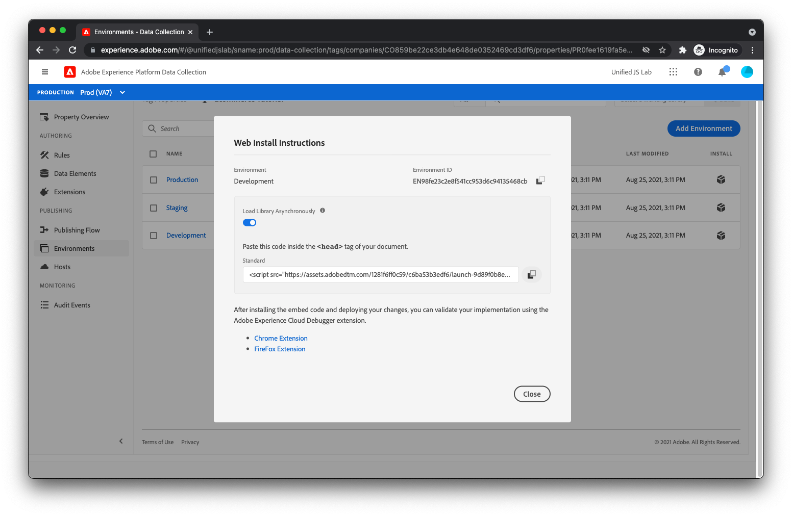

# 發佈程式庫

現在，您可以將標籤程式庫部署至您的網站。

## 建立程式庫

首先，您必須建立程式庫，其中包含您已建立的擴充功能、規則和資料元素。

1. 若要建立程式庫，請選取 **[!UICONTROL 發佈流程]** 的上界。
1. 選擇 **[!UICONTROL 新增程式庫]**. 您應該會看到程式庫建立檢視。
   

1. 為程式庫命名，例如 **_示範_**.
1. 選擇 **[!UICONTROL 開發]** 在 [!UICONTROL 環境] 下拉式清單。
1. 下一步，按一下 **[!UICONTROL 新增所有已變更的資源]**.
您現在應該會在下方列出所有擴充功能、規則和資料元素 [!UICONTROL 資源變更].
1. 按一下 **[!UICONTROL 儲存並建置至開發]**.

## 新增內嵌程式碼至您的HTML

現在，您必須新增指令碼標籤至載入新建標籤庫的產品頁面HTML。

1. 按一下 **[!UICONTROL 環境]** 的下一頁。 您應該會看到列出三個不同的環境。
   
1. 按一下 **[!UICONTROL 開發]** 環境列 _安裝_ 欄。 您應該會看到將Launch程式庫指令碼安裝至頁面的指示。
   
1. 複製指令碼標籤（有複製到剪貼簿按鈕以方便您）。
1. 開啟產品頁面HTML，並將指令碼標籤插入 `</head>` 標籤。 您的最終HTML應如下所示：

```html
<!DOCTYPE html>
<html lang="en">
  <head>
    <title>Product Page</title>
    <script>
      window.adobeDataLayer = window.adobeDataLayer || [];
      window.adobeDataLayer.push({
        "event": "pageViewed",
        "web": {
          "webPageDetails": {
            "name": "Foam Roller",
            "siteSection": "Equipment"
          },
        },
        "productListItems": [
          {
            "SKU": "eqfr08",
            "currencyCode": "USD",
            "name": "Foam Roller",
            "priceTotal": 18.95
          }
        ]
      });
      window.adobeDataLayer.push({
        "event": "productViewed"
      });
      window.onAddToCartClick = function() {
        // In a real implementation, you would change this condition to 
        // only pass if a cart doesn't already exist. You would typically 
        // do this by checking a cookie or variable value.
        if (true) {
          window.adobeDataLayer.push({
            "event": "cartOpened",
          });
        }
        window.adobeDataLayer.push({
          "event": "productAddedToCart"
        });
      };
      window.onDownloadAppClick = function() {
        window.adobeDataLayer.push({
          "event": "downloadAppClicked",
          "eventInfo": {
            "web": {
              "webInteraction": {
                "URL": "https://example.com/download",
                "name": "App Download",
                "type": "download"
              }
            }
          }
        });
      };
    </script>
    <!--Swap this script tag with your own-->
    <script src="https://assets.adobedtm.com/xxxxxxxxxxxx/xxxxxxxxxxxx/launch-xxxxxxxxxxxx-development.min.js" async></script>
  </head>
  <body>
    <h1>Foam Roller</h1>
    <p>This foam roller is composed of durable material that holds its shape and delivers deep tissue therapy. Purchase now for only $18.95!</p>
    <button type="button" onclick="onAddToCartClick()">Add to cart</button>
    <a href="https://example.com/download" onclick="onDownloadAppClick()">Download the app</a>
  </body>
</html>
```

查看 [標籤的發佈檔案](https://experienceleague.adobe.com/docs/experience-platform/tags/publish/overview.html?lang=zh-Hant) 如果您想要進一步了解發佈程式，請前往。

接下來，您將測試您的新實作！

[下一個： ](../test-the-implementation.md)

>[!NOTE]
>
>感謝您花時間學習資料收集。 如果您有任何疑問、想要分享一般意見，或對未來內容有任何建議，請就此分享 [Experience League社群討論貼文](https://experienceleaguecommunities.adobe.com/t5/adobe-experience-platform-launch/tutorial-discussion-use-adobe-experience-platform-data/m-p/543877)
