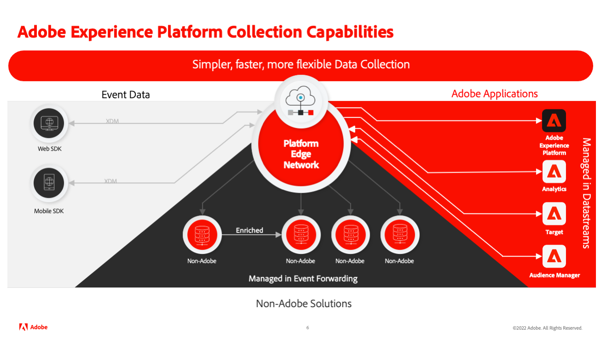
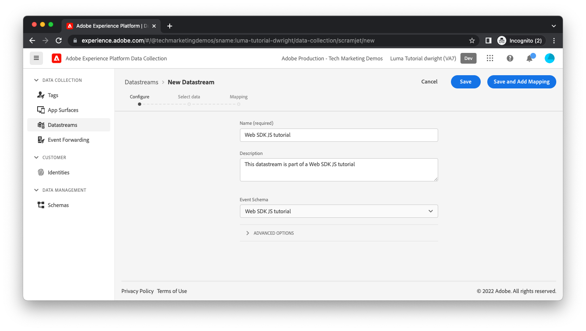

# 建立資料流

您透過Platform Web SDK從網站傳送的資料會送達一組名為 [Adobe Experience Platform Edge Network](https://business.adobe.com/products/experience-platform/experience-platform-edge-network.html). 此網路可將您的資料傳送至 [Adobe Experience Platform資料集](create-a-schema.md) 以及Adobe Experience Cloud內的其他產品。 這些Adobe產品也可能會對您的網頁回應資料。 例如，邊緣網路可能會從Adobe Target傳回個人化內容。

若要設定Edge Network會將資料傳輸至和傳送至哪些Adobe產品，您必須建立資料流。 當邊緣網路從您的網頁收到資料時，會諮詢您建立的資料流、讀取其設定，然後將資料轉送至適當的Adobe產品。

1. 若要建立資料流，您必須先導覽至資料收集使用者介面。 在Platform的右上角，按一下 **[!UICONTROL 應用程式選擇器]** 選取 **[!UICONTROL 資料收集]** 從下拉式功能表。
   
1. 顯示資料收集介面後，請選取 **[!UICONTROL 資料流]** 在左側導覽中，然後是 **[!UICONTROL 新資料流]** 按鈕。
1. 提供資料流的名稱，請選取 [您先前建立的架構](create-a-schema.md) 作為 **[!UICONTROL 事件資料集]**，然後選取 **[!UICONTROL 儲存]** （稍後會說明對應）。
   

## 將服務新增至資料流

下一個畫面可讓您新增哪些Adobe產品和服務應接收您從網站傳送的資料。

1. 選取 **[!UICONTROL 添加服務]** 命令。 在本教學課程中，僅啟用Adobe Experience Platform，請選取 [您先前建立的資料集](create-a-dataset.md) 選取 **[!UICONTROL 儲存]** 在右上角。 您的資料流已建立。
   

## 資料流環境

公司通常會有任何網站更新的促銷路徑。 公司中的某個人（行銷人員或工程師，視變更而定）通常會在只有該人使用的開發環境中測試其變更。 一旦他們熟悉變更，變更就會升級至預備環境，接受進一步的測試。 最後，變更會發佈至使用者看到的生產網站。 資料流支援此促銷模式。

如果您支援基於平台的應用程式，例如即時CDP、Journey Optimizer或Customer Journey Analytics，則必須在與這些環境對應的個別Platform沙箱中建立其他資料流。

如果您不是Platform客戶，可以在單一沙箱中建立多個資料流，並可使用資料流複製功能來複製設定。

伺服器現在已完全設定，可從您的網頁接收資料。

[下一個： ](../configure-the-client/whats-a-data-layer.md)

>[!NOTE]
>
>感謝您花時間學習資料收集。 如果您有任何疑問、想要分享一般意見，或對未來內容有任何建議，請就此分享 [Experience League社群討論貼文](https://experienceleaguecommunities.adobe.com/t5/adobe-experience-platform-launch/tutorial-discussion-use-adobe-experience-platform-data/m-p/543877)
