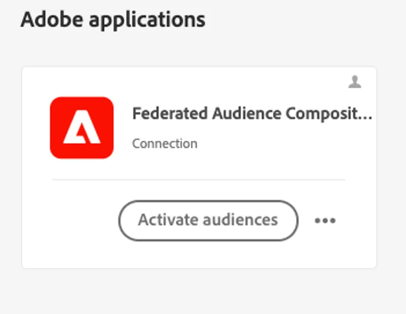
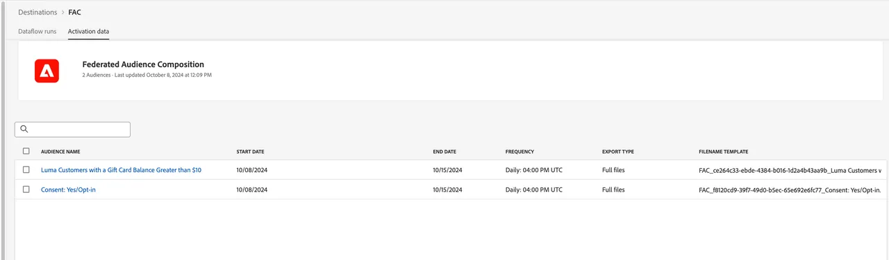

# 利用倉儲資料豐富受眾

同盟對象構成可讓您運用從企業資料倉儲已同盟的構成對象資料，使Adobe Experience Platform (AEP)中現有的對象更為豐富。 此資料將不會長期保存在 Adobe Experience Platform 客戶輪廓中。

## 讀取同盟構成中的對象

在本練習中，我們使用儲存在Experience Platform設定檔服務中的&#x200B;**SecurFinancial貸款申請頁面訪客**&#x200B;對象，來啟動我們的同盟構成。 它會使用Snowflake中的同盟資料，根據信用評分和貸款活動來決定預先核准。

### 步驟

1. **將AEP對象**&#x200B;對應到同盟對象組合目的地。
2. **使用對應的對象來建置您的組合**&#x200B;做為讀取對象。
3. **調解讀取對象中的身分**，以加入同盟資料。

我們將檢視另一個使用同盟資料來[支援「即時」個人化的範例](deliver-in-the-moment-personalization.md)！
