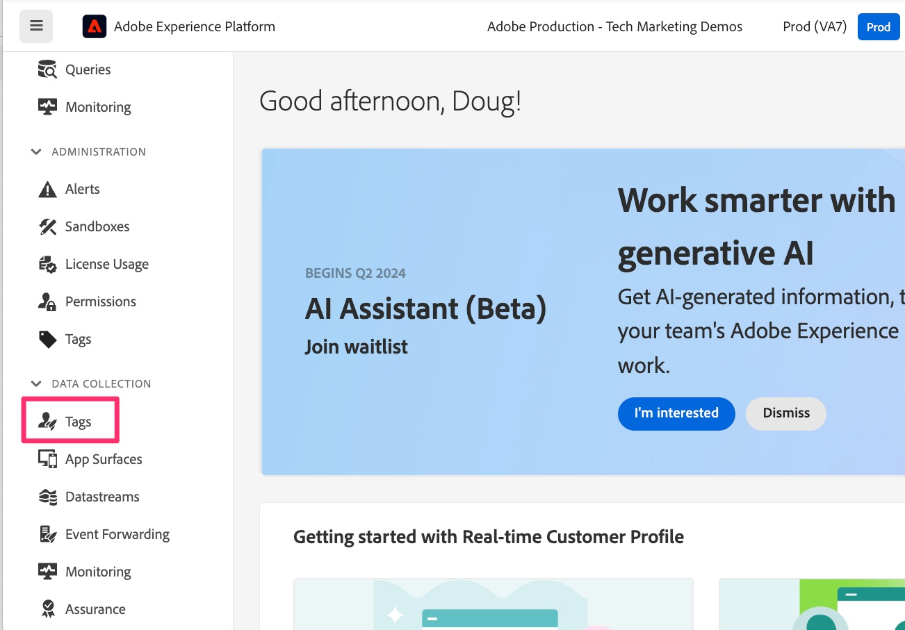

# 新增及設定網頁SDK擴充功能

瞭解如何在您的Tags屬性中新增及設定網頁SDK擴充功能，為您提供完成移轉的進一步課程所需的功能。
請依照下列步驟新增並設定擴充功能：

1. 導覽至Experience Platform資料收集。 您可以透過下列兩種方式之一完成這項作業：
   1. 移至[Adobe Experience Platform介面](https://platform.adobe.com/)，然後選取左側導覽底部附近的&#x200B;**[!UICONTROL 標籤]**。

      
   1. 如果您無法存取Platform，可以使用視窗右上角的應用程式切換器（9個點），並選取「資料收集」(登入Experience.Adobe.com後)。

      
1. 尋找並選取您要移轉至Web SDK的標籤屬性。
1. 在標籤屬性的左側導覽中，選取&#x200B;**[!UICONTROL 擴充功能]**。
1. 選取頂端附近的&#x200B;**[!UICONTROL 目錄]**，檢視所有可用擴充功能的清單。
1. 搜尋並選取&#x200B;**[!UICONTROL Adobe Experience Platform Web SDK]**&#x200B;擴充功能，然後按一下右側的&#x200B;**[!UICONTROL 安裝]**。

   {style="border:1px solid lightslategray"}

1. 擴充功能組態設定隨即顯示。 找出「資料串流」區段，並設定您要用於此移轉的Experience Platform沙箱（這三個環境的「環境」下拉式清單）。 如果您只移轉Adobe Analytics而不會傳送資料至Adobe Experience Platform，請選擇&#x200B;**生產**&#x200B;沙箱。 如果您要將此行為分析資料傳送到Experience Platform以用於那裡的應用程式，請選擇您要用於該用途的沙箱。 您可能一開始會想要選取開發沙箱，直到完成移轉及新增/測試您的Platform服務為止。
1. 非常重要的是，請選取您在上一步中為生產、測試和開發環境建立的資料串流，將這裡的Tags中的程式碼和設定連線到Edge。

   {style="border:1px solid lightslategray"}

1. 向下捲動，並注意預設已選取&#x200B;**身分**&#x200B;設定。 請保留選取這些核取方塊，因為當您移轉至Web SDK時，它們可協助您正確識別網站訪客。 如需詳細資訊，請參閱以下連結。

1. 選取「**[!UICONTROL 儲存]**」。

>[!NOTE]
>
>您的Tags屬性現在已具備網頁SDK擴充功能的基本安裝和設定。 在本移轉教學課程中，我們建立或修改資料元素和規則時，將會使用部分Web SDK擴充功能，但不會變更教學課程中的其他擴充功能設定專案。 其他設定專案可以也應該用於其他使用案例。 如需有關這些設定的詳細檔案，請參閱[設定Web SDK標籤擴充功能](https://experienceleague.adobe.com/zh-hant/docs/experience-platform/tags/extensions/client/web-sdk/web-sdk-extension-configuration)。
