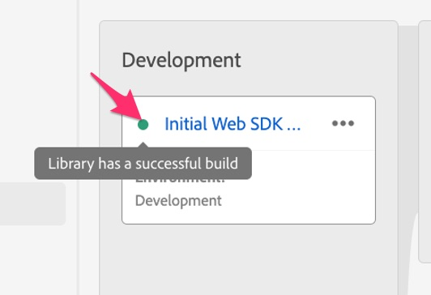

# 建置開發程式庫的實作變更

瞭解如何建置您在標籤屬性中對開發程式庫所做的任何變更，以便在開發網站上測試結果。

當您在本教學課程中進行，或真正在您對實作進行變更時，將必須建置/發佈這些變更，才能在您的開發、測試或生產網站上看到它們。 我確定您之前已執行此動作，因為這是移轉檔案，而非首次實作檔案。 實際上，您經常會想要執行此動作，因為您執行每個功能並想要測試它，確保它正常運作，將正確的資料傳送至Analytics。

因此，在本教學課程中，將有一些提醒來建置或發佈您的變更。 如果您有需要，請在此頁面上加上書籤，並且不要羞於建立至開發程式庫。 您可以隨時這樣做。

那麼，讓我們來建置我們目前所做的一切。 順便一提，我們有時可能會在本教學課程中交換「建置」和「發佈」。 最重要的是瞭解您是否要「建置」至開發或測試程式庫，或您要「發佈」至生產程式庫和環境，無論我們使用哪個字詞。

## 在Experience Platform標籤中建立開發的移轉變更

1. 當您在Experience Platform標籤的內容中時，請從左側導覽選取&#x200B;**發佈流程**，然後新增程式庫。

   

1. 為資料庫命名您想要的名稱，例如&#x200B;**初始Web SDK移轉**。
1. 選取&#x200B;**開發**&#x200B;環境。
1. 選取&#x200B;**新增所有變更的資源**&#x200B;以新增您正在處理的所有專案。

   

1. 儲存並建置到開發環境

   

1. 建置完成後，您將能夠檢視建置是否成功。 將滑鼠移至發佈流程中新資料庫左側的綠色圓點上，實際上如果綠色，則會成功完成，並告訴您如此。

   

### 選取工作程式庫

當您在標籤中編輯內容時，以下是一個不錯的捷徑。 您可以選擇工作程式庫，只要按一下按鈕即可儲存和建置，而不必在每次進行變更時都進行整個發佈流程。 動手吧。 您稍後會感謝我的。

1. 在標籤UI的幾乎任何位置，按一下UI右上角的「選取工作程式庫」 ，然後選擇您想要的工作程式庫。 在本教學課程中，請選擇「初始Web SDK移轉」。

   

