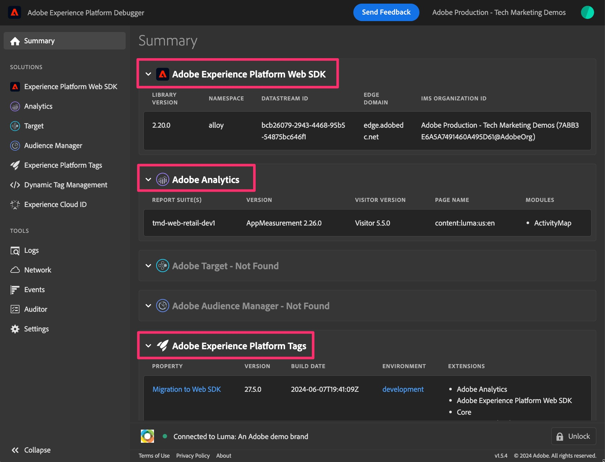

# 偵錯和驗證Web SDK移轉

在本練習中，您將瞭解在移轉至Web SDK時，如何除錯及驗證資料。 我們建議您進行兩種不同的驗證活動，協助您確保一切正常進行：

1. **驗證活動#1**&#x200B;正在執行Adobe Experience Platform Debugger，這是瀏覽器擴充功能，可讓您在正確將資料傳送至Analytics的過程中進行檢查。 建議您經常執行此活動，因為您需變更標籤屬性並將變更發佈至開發程式庫。
1. **驗證活動#2**&#x200B;即將進入Adobe Analytics，設定一或多個專案以從Web SDK接收資料（透過您新建立的移轉報表套裝），以及驗證在您點選網站前後資料是否確實進入報表，等等。

## Adobe Experience Platform Debugger

此偵錯工具是瀏覽器擴充功能，可在Chrome商店取得。 有[影片教學課程](https://experienceleague.adobe.com/en/docs/platform-learn/data-collection/debugger/overview)會說明如何下載及使用偵錯工具，建議您先詳閱以瞭解基本用法。

一旦偵錯工具啟動並執行，您就可以用它來確保資料從您的網站流出，並正確流經Edge Network。 本教學課程將保留基本用途，但請盡其所能使用除錯工具來檢查您的資料。

**假設（一律危險，但在此情況下希望不會有問題）：**&#x200B;由於我們在此範例中將標籤屬性移轉到Web SDK，因此不需要在網站上放置新的內嵌程式碼。 它就會在那裡了。 不過，如果您決定要在全新的標籤屬性上執行更多「提升和轉移」方法，您將會有新的內嵌程式碼可放置到開發、測試和生產環境中。 因此，在本教學課程中，只要我們已安裝Web SDK擴充功能，並設定有傳送資料的規則，資料就會顯示在Debugger中。

### 在Debugger中檢視Web SDK資料

現在您已移轉預設頁面規則（或如果您已移轉任何規則）並將它發佈至開發環境中的程式庫，您應該能夠執行您的網站並檢視流入偵錯工具的資料。

檢視資料的步驟：

1. 在瀏覽器中開啟您網站的開發環境
1. 從瀏覽器視窗頂端的擴充功能匣按一下瀏覽器擴充功能，以開啟除錯程式

   

   >[!TIP]
   >
   >除錯工具右下角是「鎖定」圖示和標籤，而在左側，您可以看見正在除錯的頁面。 在您的網站上時，按一下鎖定圖示，就會將除錯工具鎖定至您網站的視窗。 否則，如果您按一下進入不同的瀏覽器索引標籤/視窗，除錯程式將會回應該網站。 在網站除錯期間，可以更輕鬆確保除錯工具一律會提供您網站的資訊。

1. 確定您位於Debugger的&#x200B;**摘要**&#x200B;頁面（左上方的「首頁」圖示）。 **在瀏覽器視窗中重新整理您的網站**。 如果Debugger擷取您網站上的內嵌程式碼，而您未刪除Analytics程式碼（根據本教學課程），您會看到指出Adobe Experience Platform Web SDK和Adobe Analytics以及Adobe Experience Platform標籤均有程式碼。 其他則會呈現灰色。

   

1. 若要檢視透過網頁SDK新增的資料，請按一下左側邊欄中的&#x200B;**Experience Platform網頁SDK**&#x200B;連結
1. 按一下&#x200B;**清除事件**&#x200B;以移除任何已發生的點選
1. 再次重新整理您的網站，然後返回除錯工具
1. 然後按一下表格中&#x200B;**事件**&#x200B;旁的資料欄位

   偵錯工具中的

1. 在「值」欄位中，從0、資料、__adobe和Analytics向下展開
1. 您應該會看到在該頁面上引發的規則中設定的變數，包括預設頁面載入規則及任何特殊規則。

   偵錯工具中的

1. 在標籤屬性中變更某些專案並將變更發佈到開發環境時，請執行這些步驟，以便檢視對Analytics實作所做變更的影響。

## 在Analysis Workspace中驗證資料

此建議的主要主旨是使用Adobe Analytics擴充功能從標籤實施取得您目前的分析資料，並將其與網路SDK現在將填入的相同報表進行比較。
設定這些比較的方式有很多種，但我會提供兩個範例，說明如何執行此操作。

### 選項1：在單一專案中使用兩個面板來比較資料

1. 在Analysis Workspace中建立新專案並新增兩個面板
1. 將面板1中的報表套裝設定為目前的Adobe Analytics生產報表套裝
1. 在面板2中將報表套裝設定為新的Web SDK開發報表套裝
1. 使用行事曆中的時段，將相同的報表放入兩個面板中；此時資料會使用兩個擴充功能流入Analytics
1. 比較資料

這可能看起來像這樣（請瞭解這些空白示範報表套裝中沒有資料）：

如您所見，兩個面板中的報表相同，日曆也相同。 差異在於報表套裝，如上述步驟所述。
**此選項的優點：**&#x200B;您可以在實作中進行變更時，逐一使用報表/維度並測試您要測試的確切專案。

### 選項2：使用兩個專案比較資料

1. 開啟使用您目前Adobe Analytics擴充功能資料的現有專案
1. 執行「另存新檔」以製作該專案的副本，將其命名為類似「Web SDK移轉驗證專案」的名稱
1. 變更所複製專案的報表套裝，使其指向您的Web SDK開發報表套裝
1. 在不同視窗中開啟每個專案，並調整其大小，以便在熒幕上彼此相鄰地看到
1. 比較資料

這看起來與上方影像非常類似，只是每個面板都在自己的專案中且在不同的視窗中。
**此選項的優點：**&#x200B;在此情況下，您不必再次新增和設定所有報表，但您可以透過最小化的設定，使用新的Web SDK擴充功能檢視目前報表的外觀。

您有可能同時想要執行這兩項操作，這也是另一個絕佳選項。

>[!IMPORTANT]
>
>現在您已完成驗證預設頁面載入規則，可以在教學課程中繼續進行。 不過，我們建議您時常進行測試/驗證，至少每次您變更規則或進行其他重大變更時皆需進行。 請記住，如果您在過程中發現問題，如果只需要檢查一件事，而不是測試自上次驗證以來您所做的數項變更，您會更開心。

驗證成功！
