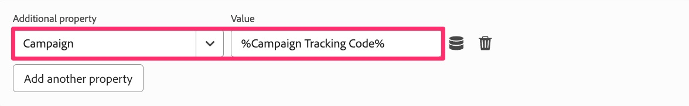

# 移轉其他頁面規則

在本練習中，您將瞭解如何將其他頁面型規則移轉至Web SDK擴充功能。 這類似於將預設頁面載入規則移轉至Web SDK時所執行的練習。 這些方法仍適用。 最大的差異在於，使用這些規則，您不會新增「傳送事件」動作，因為在大部分情況下，您的規則不會包含Analytics擴充功能的「傳送信標」動作。

## 概觀

現在讓我們稍微備份一下，討論Analytics實作與Adobe Analytics標籤擴充功能的搭配情況(也稱為「AppMeasurement」實作，因為這是JavaScript檔案的名稱)。

我不認為您會確切瞭解自己的實施方式，但在許多使用Experience Platform標籤（先前稱為「Launch」）的實施中，有許多規則只會根據頁面或URL中的內容有條件地引發。 此範例可能包括：

* 搜尋結果規則，僅在執行內部搜尋且搜尋結果頁面出現時引發
* 促銷活動登陸頁面規則，僅在URL中有追蹤代碼時引發
* 頁面型別規則，僅針對特定型別的頁面（例如產品詳細資料頁面、購物車頁面等）觸發。
* 有條件引發的任何其他頁面

這裡的關鍵點是，所有這些使用案例都只在頁面上引發&#x200B;**有時**，我們&#x200B;**也**&#x200B;會預期預設頁面規則會引發。 因此，我們不想將「傳送信標」 （AA擴充功能）或「傳送事件」 (Web SDK擴充功能)納入任一規則，否則會造成相同頁面載入傳入兩個點選。

因此，這些規則會建置物件，但不會傳送資料。 我們只是確定這些規則在&#x200B;**預設頁面載入規則**&#x200B;之前引發，以便在他們建立物件後，預設頁面載入規則上的「傳送信標/傳送事件」動作會傳送所有內容。 現在，您可能已經知道所有這一切，這就是您網站的設定方式。 但如果您是初次接觸自己的實作，或您需要「修正」實作以類似於此方法，此練習對您特別實用。

## 條件規則的移轉範例

以下是移轉有條件引發的規則的範例。 我會使用上述行銷活動登陸頁面的範例。 如上面所述，此模式與我們已在預設頁面規則中搭配使用的模式相同，唯一例外是這更容易，因為我們僅設定變數，不會引發任何點選。

1. 找出條件規則。 在此範例中，我們會找到行銷活動追蹤程式碼規則並加以選取。

   

1. 規則開啟時，我們會發現此規則有根據查詢字串引數引發的條件。 我們不需要變更關於條件的任何內容，因為我們只想更新/移轉動作，而不想變更事件或條件。
1. 按一下&#x200B;**Adobe Analytics — 設定變數**&#x200B;動作
1. 記下動作中設定的任何專案。 在此範例中，我們注意到已設定&#x200B;**event101**，以及&#x200B;**Campaign**&#x200B;變數。

   
   

1. 我們只按一下這裡來製作備註，不需要變更任何專案，所以現在只要按一下&#x200B;**取消**&#x200B;即可。
1. 按一下動作區段中的&#x200B;**加號圖示**&#x200B;以建立新動作

   

1. 設定新規則
   1. 從「擴充功能」下拉式清單中選取&#x200B;**Adobe Experience Platform Web SDK**。
   1. 從「動作型別」下拉式清單中選取&#x200B;**更新變數**。
   1. 在右側面板中，選取資料物件內的&#x200B;**Analytics**&#x200B;物件

      

1. 現在將event101和促銷活動變數設定為與現有動作中設定的值相同。

   
   

1. 現在您可以&#x200B;**保留變更**&#x200B;和&#x200B;**儲存至資料庫**，而且您的規則已移轉至Web SDK。

>[!IMPORTANT]
>
>就像預設頁面載入規則一樣，我們在規則中保留了Analytics擴充功能的&#x200B;**設定變數**&#x200B;動作，以便在驗證移轉時可以比較資料。 別忘了稍後再來，當您進行最終清理時，請移除Analytics擴充功能的動作。

