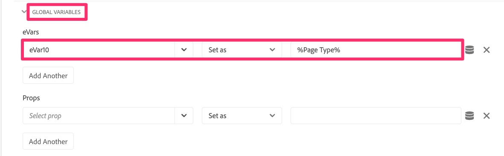

# 移轉全域變數

在本練習中，您將瞭解如何將全域變數從Analytics擴充功能設定移轉至Web SDK。

## 概觀

在Adobe Analytics擴充功能中，有一個稱為「全域變數」的設定區段。

全域變數是在頁面上初始化該物件時，在 Analytics 追蹤物件上設定的變數。在每個頁面上建立追蹤物件時，您在此處設定的任何變數都會設定。

如果您在這裡設定變數，我們也需要將其移轉至Web SDK。

## 在網頁SDK中新增全域變數的位置

這裡的&#x200B;**底線**是Web SDK擴充功能的設定中沒有對等區域，因此不像複製變數那樣容易，就像在「預設頁面載入規則」練習中一樣。
簡短的答案是： **建立在所有頁面上其他規則之前執行的新規則，並在其中設定變數。**

如果您不需要定義步驟，請完成定義步驟，並完成本課程。 如果您需要協助，請繼續……

### 將全域變數移轉至Web SDK的步驟

1. 開啟Adobe Analytics擴充功能設定

   

1. 向下捲動至「全域變數」區段（上方影像），開啟該區段，並記下任何/所有正在設定的變數。 在後續步驟中，您將需要知道這些變數和值。
1. 取消退出Analytics擴充功能。
1. 在左側導覽中選取&#x200B;**規則**，然後按一下&#x200B;**新增規則**。
1. 將新規則命名為「全域變數」。
1. 按一下Events底下的Add按鈕。

   

1. 設定您的事件以在其他規則之前觸發。 您必須知道事件型別，以及您在其他規則中使用的順序。 範例值：
   1. 將&#x200B;**擴充功能**&#x200B;設定為核心
   1. 根據您的實作，**事件型別**&#x200B;可能是DOM已就緒
   1. 展開&#x200B;**進階選項**
   1. 將&#x200B;**順序**設定為低於其他規則的數字，以便先執行。
      
      >[!NOTE]
      >
      >這裡的主要內容是，此規則會在預設頁面載入規則之前引發，因此此規則中設定的任何變數都可以透過sendEvent規則傳送至Analytics。 不過，我們建議此規則整體執行&#x200B;**first**，因為在Analytics擴充功能的「全域變數」區段中設定的變數可以在其他規則中變更。 我們正在模擬該功能。 在上述範例中，我們假設「10」的順序數低於任何其他規則。 如果不正確，請將數字變更為低於其他規則的數字。
1. 選取&#x200B;**保留變更**&#x200B;以儲存您的工作。
1. 您不需要在此規則中新增條件，因此您可以保留建立規則的該區段。
1. 按一下&#x200B;**動作**&#x200B;區段下的加號圖示
1. 設定新動作
   1. 選擇Adobe Experience Platform Web SDK **擴充功能**
   1. 對於&#x200B;**動作型別**，請選擇[更新變數]
   1. 在右側，選擇您的變數&#x200B;**資料元素** （在本教學課程中，它稱為「頁面檢視資料元素」，但您的變數可能有所不同）
   1. 選取資料物件下的&#x200B;**Analytics**
   1. 填入您從Analytics擴充功能設定的「全域變數」區段儲存的變數(在本教學課程的範例中，將eVar10設定為page type資料元素)

   

1. 保留變更
1. 將規則儲存至工作程式庫並建置

您的全域變數現在已移轉至Web SDK，並會在任何頁面載入時引發。
