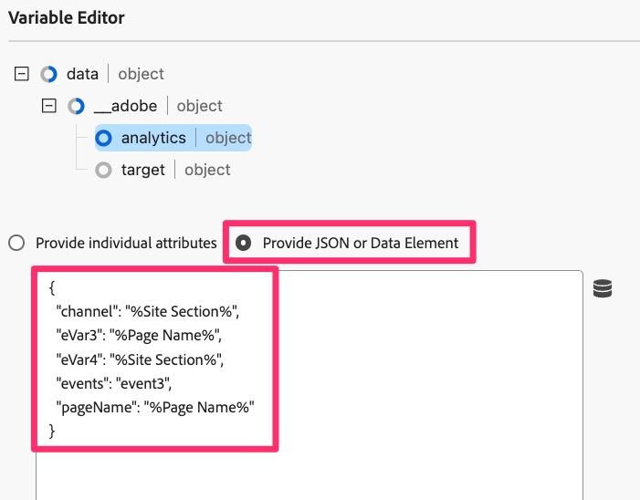

# 移轉預設頁面載入規則

在本練習中，您將瞭解如何將Adobe Experience Cloud Tags中的預設頁面載入規則從Analytics擴充功能移轉至Web SDK擴充功能。

## 概觀

讓我們先回顧一下。 標籤中可能有一個規則（舊稱為「Launch」），會在每個頁面上引發，也就是設定一或多個預設變數，然後向Adobe Analytics觸發信標或點選的規則。 此規則目前正在使用Adobe Analytics擴充功能中的「動作」來執行這些動作。 當我們將實作移轉至Web SDK時，需要能夠移除Analytics擴充功能的任何參考（如動作），並以屬於Web SDK的動作加以取代。 在下列步驟中，我們會假設上述情況；也就是說，您有預設頁面載入規則，此規則會設定變數，並在追蹤信標中傳送至Analytics。

## 移轉「設定變數」動作

在此活動中，我們將建立等同於Adobe Analytics擴充功能中&#x200B;**設定變數**&#x200B;動作的網頁SDK動作。

1. 在資料收集UI和屬性中，在左側導覽中選取&#x200B;**[!UICONTROL 規則]**&#x200B;畫面以進入該畫面。
1. 選取您的&#x200B;**Analytics預設載入規則**&#x200B;規則。 如果您不知道哪個規則是預設載入規則，請與瞭解規則及其內容的人聯絡。 再次強調，我們正在尋找在每個頁面上執行的規則，並設定一些預設變數（例如頁面名稱），然後將信標傳送至Analytics。 我們將變更此規則。 我的稱之為「所有頁面 — DOM Ready 50」，但您的頁面可命名任何名稱。

   

1. 為了將目前的動作從Analytics擴充功能移轉到Web SDK擴充功能，我們需要知道正在設定的變數。 因此，請按一下&#x200B;**Adobe Analytics — 設定變數**&#x200B;動作，以檢視正在設定的變數（例如PageName、prop、eVars、事件等）。

   
   1. 請注意該規則正在設定哪些變數
      

1. 在頁面頂端，將選項按鈕變更為&#x200B;**提供JSON**，您將會看到已設定變數的程式碼檢視。 此程式碼檢視和UI檢視可互換，而且當您在一個UI中設定任何專案時，另一個UI也會更新它。

   

1. 將此資料複製到剪貼簿，或儲存至檔案以立即使用，因為在接下來的步驟中，您會將該程式碼貼到新的Web SDK動作中。
1. 取消Analytics的「設定變數」動作，以便返回規則。

   >[!IMPORTANT]
   >
   >在此步驟中，您可以選擇下列選項：
   >1. 與其新增動作，您可以直接變更現有動作，一旦儲存，就會立即將資料剪下至新的網頁SDK報表套裝，不再顯示在目前的Analytics報表套裝中。
   >1. 您可以建立新動作，透過Web SDK將資料傳送至Analytics，暫時保留Analytics動作。 這樣您就有機會比較新網站SDK報表套裝與目前Analytics報表套裝中的資料。 **這是我們將在本教學課程中執行的動作。**&#x200B;請記住，在您移除舊的Analytics擴充功能的動作之前，此方法會在您比較資料時產生兩次點選，也會產生額外的伺服器呼叫成本。 顯然您不想讓Analytics擴充功能的動作永遠保留在那裡，而是要夠久以驗證資料是否正確流入新的Web SDK擴充功能的報表套裝。

1. 按一下&#x200B;**加號按鈕**&#x200B;以新增網頁SDK動作。

   

1. 從「擴充功能」下拉式清單中選取&#x200B;**Adobe Experience Platform Web SDK**。
1. 從「動作型別」下拉式清單中選取&#x200B;**更新變數**。
1. 在右側面板中，選取資料物件內的&#x200B;**Analytics**&#x200B;物件
1. 另請確認右側面板頂端所列的資料元素確實是新的變數型別資料元素。

   

1. 現在將選項按鈕變更為&#x200B;**提供JSON或資料元素**，並將您在上一步從「設定變數」複製的程式碼貼到這個程式碼視窗中。 請記住，我們在本教學課程中顯示的只是範例。 您正在複製和貼上自己的變數。

   
這個JSON複製工具是專為讓移轉更輕鬆所設計，我相信您可以看到這是多麼容易，而不需要從舊動作建立廣泛的附註，然後套用至新動作。

1. 您可以隨時來回切換選項按鈕，以檢視程式碼版本（如上所示）或用於檢視屬性的UI版本中的值。 選取&#x200B;**提供個別屬性**&#x200B;選項按鈕以檢視已填入的屬性。

   
   

1. 當您看到變數設定正確時，請按一下&#x200B;**保留變更/儲存。**

## 移轉「傳送信標」動作

在此活動中，我們將建立與Analytics「傳送信標」動作相當的Web SDK，稱為&#x200B;**傳送事件**。

1. 返回您剛加入的預設頁面規則。
1. 在動作區段中，按一下&#x200B;**加號按鈕**&#x200B;以新增其他動作。 這將是我們的&#x200B;**傳送事件**&#x200B;動作。

   

1. 若要設定動作，請從「擴充功能」下拉式清單中選取&#x200B;**Adobe Experience Platform Web SDK**。
1. 從動作型別中選取&#x200B;**傳送事件**。
1. 在右側面板中，選取&#x200B;**資料**&#x200B;物件旁的資料元素圖示。

   

1. 選取頁面檢視資料變數（或您稱為新「資料」型別資料元素的任何專案），然後按一下&#x200B;**選取**&#x200B;按鈕。

   

1. 按一下&#x200B;**保留變更/儲存**。
1. 您現在應該會在規則中看到所有四個動作（兩個舊動作和兩個新動作）

   

## 我應該刪除Analytics擴充功能的動作嗎？

好問題。 答案取決於您是否要在移除舊動作之前驗證新動作。 如上所述，如果您保留傳送資料的Analytics和Web SDK動作（傳送信標和傳送事件），就像我們在本教學課程中選擇做的那樣，那麼您將有相同的資料進入兩個報表套裝(亦即Analytics擴充功能的生產報表套裝和Web SDK擴充功能的新驗證報表套裝)。 這會使您對Analytics的伺服器呼叫數加倍，而且會產生相關成本。 不過，這是有多少客戶選擇這麼做，以便在關閉舊資料之前，可以驗證新資料。 我們將在本教學課程結束時有一個練習，示範當您對驗證感到滿意時如何清理舊的專案，但如果您現在要這麼做以儲存伺服器呼叫，而不用擔心驗證問題，您可以隨意跳至教學課程結尾，或直接將Analytics擴充功能的動作從規則中刪除。
