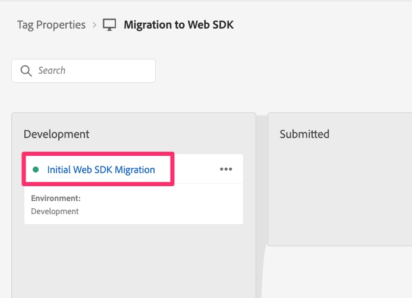

# Publish移轉至中繼和生產環境

當移轉的所有開發完成並驗證時，請建置到測試環境，然後在準備就緒時發佈到生產環境。

## 概觀

這其實是移轉的最後一個主要步驟，也是將您用來開發和測試移轉的程式庫移至您的中繼環境，以進行最終測試，然後再移至生產環境。

如果您回到[建立並設定資料流](create-and-configure-the-analytics-datastream.md)課程，您會在課程結束時看到我們指向測試資料流，以將分析資料傳送至相同的開發報表套裝（或選擇傳送到新的測試報表套裝）。 系統也會提醒您，我們已指向生產資料流，以將資料傳送至您一直在使用的現有生產報表套裝。
這是我們沿著發佈路徑推送已移轉程式庫至測試及生產環境時所應具備的良好資訊。

## 推送至中繼和生產環境

以下是將我們的程式庫推向測試和生產環境的步驟：

1. 在「標籤」介面中，選取左側導覽的「發佈流程」
1. 您應該會在開發中看到移轉程式庫（名稱會是您在此移轉程式開始時選擇的名稱）

   

1. 如果您確定您已新增程式庫的每個單一變更，您可以將程式庫往前移至三個圓點下，並略過後續幾個步驟。 如果您不確定，請依照下列五個步驟進行。
1. 按一下程式庫名稱，即可進入程式庫詳細資訊
1. 透過名稱確認您位於正確的程式庫中
1. 選取頁面底部的「新增所有變更的資源」
1. 然後按一下「儲存並建置至開發」 ，將所有佇列變更新增至程式庫

   

1. 接著，系統會帶您回到發佈流程介面，如果建置成功完成，程式庫旁邊就會出現綠色圓點。
1. 接著，您就可以根據自己的需求，在發佈程式中推進程式庫。 您可以將其設定為核准，直接將其移至測試環境以進行測試和核准，或甚至直接將其移至生產環境以進行核准或發佈。 同樣地，這取決於組織的發佈需求。

   

恭喜！此時，您的Analytics實作完全可在網頁SDK上進行！

我將在此新增在本教學課程開頭的重要備註：

>[!IMPORTANT]
>
>請務必注意，您進行此實作移轉的主要原因之一，是準備使用Adobe Experience Platform應用程式，例如Customer Journey Analytics、Real-Time CDP或Journey Optimizer (如上#3所述)。 若為此目的使用您的網站資料，將會包含本教學課程中未包含的其他步驟，但本教學課程無疑是您進一步實施作業的先決條件。 因此，請完成本教學課程，然後您可以繼續執行必要步驟，將此相同的網站資料傳送至Experience Platform。

祝您使用分析和其他內容與行銷活動繼續前行！
